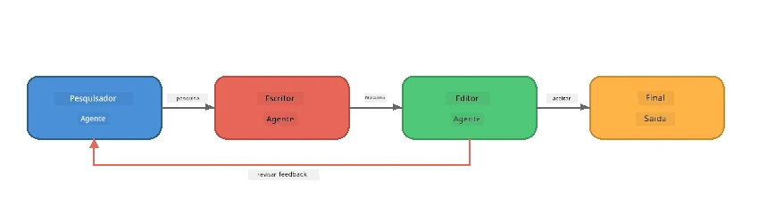
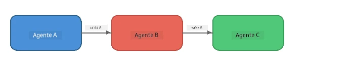
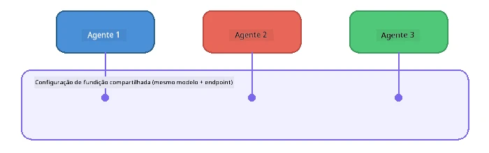

# Parte 6: Fluxos de Trabalho Multiagente

> **Objetivo:** Combinar múltiplos agentes especializados em pipelines coordenados que dividem tarefas complexas entre agentes colaborativos - todos rodando localmente com Foundry Local.

## Por que Multiagente?

Um único agente pode lidar com muitas tarefas, mas fluxos de trabalho complexos se beneficiam da **Especialização**. Em vez de um agente tentar pesquisar, escrever e editar simultaneamente, você divide o trabalho em funções focadas:



| Padrão | Descrição |
|---------|-------------|
| **Sequencial** | A saída do Agente A alimenta o Agente B → Agente C |
| **Loop de feedback** | Um agente avaliador pode enviar o trabalho de volta para revisão |
| **Contexto compartilhado** | Todos os agentes usam o mesmo modelo/endpoint, mas instruções diferentes |
| **Saída tipada** | Agentes produzem resultados estruturados (JSON) para transferências confiáveis |

---

## Exercícios

### Exercício 1 - Execute o Pipeline Multiagente

O workshop inclui um workflow completo Pesquisador → Escritor → Editor.

<details>
<summary><strong>🐍 Python</strong></summary>

**Configuração:**
```bash
cd python
python -m venv venv

# Windows (PowerShell):
venv\Scripts\Activate.ps1
# macOS:
source venv/bin/activate

pip install -r requirements.txt
```

**Execução:**
```bash
python foundry-local-multi-agent.py
```

**O que acontece:**
1. **Pesquisador** recebe um tópico e retorna fatos em formato de tópicos
2. **Escritor** usa a pesquisa para rascunhar um post de blog (3-4 parágrafos)
3. **Editor** revisa o artigo quanto à qualidade e retorna ACEITAR ou REVISAR

</details>

<details>
<summary><strong>📦 JavaScript</strong></summary>

**Configuração:**
```bash
cd javascript
npm install
```

**Execução:**
```bash
node foundry-local-multi-agent.mjs
```

**O mesmo pipeline em três etapas** - Pesquisador → Escritor → Editor.

</details>

<details>
<summary><strong>💜 C#</strong></summary>

**Configuração:**
```bash
cd csharp
dotnet restore
```

**Execução:**
```bash
dotnet run multi
```

**O mesmo pipeline em três etapas** - Pesquisador → Escritor → Editor.

</details>

---

### Exercício 2 - Anatomia do Pipeline

Estude como os agentes são definidos e conectados:

**1. Cliente de modelo compartilhado**

Todos os agentes compartilham o mesmo modelo Foundry Local:

```python
# Python - FoundryLocalClient lida com tudo
from agent_framework_foundry_local import FoundryLocalClient

client = FoundryLocalClient(model_id="phi-3.5-mini")
```

```javascript
// JavaScript - SDK OpenAI apontado para Foundry Local
const client = new OpenAI({
  baseURL: manager.urls[0] + "/v1",
  apiKey: "foundry-local",
});
```

```csharp
// C# - OpenAIClient pointed at Foundry Local
var key = new ApiKeyCredential("foundry-local");
var client = new OpenAIClient(key, new OpenAIClientOptions
{
    Endpoint = new Uri(manager.Urls[0] + "/v1")
});
var chatClient = client.GetChatClient(model.Id);
```

**2. instruções especializadas**

Cada agente tem uma persona distinta:

| Agente | Instruções (resumo) |
|-------|----------------------|
| Pesquisador | "Forneça fatos-chave, estatísticas e contexto. Organize em tópicos." |
| Escritor | "Escreva um post de blog envolvente (3-4 parágrafos) a partir das notas de pesquisa. Não invente fatos." |
| Editor | "Revise clareza, gramática e consistência factual. Veredito: ACEITAR ou REVISAR." |

**3. Fluxo de dados entre agentes**

```python
# Passo 1 - saída do pesquisador se torna entrada para o escritor
research_result = await researcher.run(f"Research: {topic}")

# Passo 2 - saída do escritor se torna entrada para o editor
writer_result = await writer.run(f"Write using:\n{research_result}")

# Passo 3 - editor revisa tanto a pesquisa quanto o artigo
editor_result = await editor.run(
    f"Research:\n{research_result}\n\nArticle:\n{writer_result}"
)
```

```csharp
// C# - same pattern, async calls with AIAgent
var researchNotes = await researcher.RunAsync(
    $"Research the following topic and provide key facts:\n{topic}");

var draft = await writer.RunAsync(
    $"Write a blog post based on these research notes:\n\n{researchNotes}");

var verdict = await editor.RunAsync(
    $"Review this article for quality and accuracy.\n\n" +
    $"Research notes:\n{researchNotes}\n\n" +
    $"Article:\n{draft}");
```

> **Insight chave:** Cada agente recebe o contexto acumulado dos agentes anteriores. O editor vê tanto a pesquisa original quanto o rascunho - isso permite verificar a consistência factual.

---

### Exercício 3 - Adicione um Quarto Agente

Estenda o pipeline adicionando um novo agente. Escolha um:

| Agente | Propósito | Instruções |
|-------|---------|-------------|
| **Verificador de Fatos** | Verificar as afirmações no artigo | `"Você verifica afirmações factuais. Para cada afirmação, declare se é suportada pelas notas de pesquisa. Retorne JSON com itens verificados/não verificados."` |
| **Escritor de Manchetes** | Criar títulos atraentes | `"Gere 5 opções de manchetes para o artigo. Varie o estilo: informativo, clickbait, pergunta, lista, emocional."` |
| **Mídias Sociais** | Criar posts promocionais | `"Crie 3 posts para redes sociais promovendo este artigo: um para Twitter (280 caracteres), um para LinkedIn (tom profissional), um para Instagram (casual com sugestões de emojis)."` |

<details>
<summary><strong>🐍 Python - adicionando um Escritor de Manchetes</strong></summary>

```python
headline_agent = client.as_agent(
    name="HeadlineWriter",
    instructions=(
        "You are a headline specialist. Given an article, generate exactly "
        "5 headline options. Vary the style: informative, question-based, "
        "listicle, emotional, and provocative. Return them as a numbered list."
    ),
)

# Após o editor aceitar, gerar manchetes
headline_result = await headline_agent.run(
    f"Generate headlines for this article:\n\n{writer_result}"
)
print(f"\n--- Headlines ---\n{headline_result}")
```

</details>

<details>
<summary><strong>📦 JavaScript - adicionando um Escritor de Manchetes</strong></summary>

```javascript
const headlineAgent = new ChatAgent({
  client,
  modelId: modelInfo.id,
  instructions:
    "You are a headline specialist. Given an article, generate exactly " +
    "5 headline options. Vary the style: informative, question-based, " +
    "listicle, emotional, and provocative. Return them as a numbered list.",
  name: "HeadlineWriter",
});

const headlineResult = await headlineAgent.run(
  `Generate headlines for this article:\n\n${writerResult.text}`
);
console.log(`\n--- Headlines ---\n${headlineResult.text}`);
```

</details>

<details>
<summary><strong>💜 C# - adicionando um Escritor de Manchetes</strong></summary>

```csharp
AIAgent headlineAgent = chatClient.AsAIAgent(
    name: "HeadlineWriter",
    instructions:
        "You are a headline specialist. Given an article, generate exactly " +
        "5 headline options. Vary the style: informative, question-based, " +
        "listicle, emotional, and provocative. Return them as a numbered list."
);

// After the editor accepts, generate headlines
var headlines = await headlineAgent.RunAsync(
    $"Generate headlines for this article:\n\n{draft}");
Console.WriteLine($"\n--- Headlines ---\n{headlines}");
```

</details>

---

### Exercício 4 - Desenhe Seu Próprio Workflow

Desenhe um pipeline multiagente para um domínio diferente. Aqui estão algumas ideias:

| Domínio | Agentes | Fluxo |
|--------|--------|------|
| **Revisão de Código** | Analisador → Revisor → Resumidor | Analise a estrutura do código → revise para problemas → produza relatório resumido |
| **Suporte ao Cliente** | Classificador → Respondedor → QA | Classifique o ticket → rascunhe resposta → verifique qualidade |
| **Educação** | Criador de Questionário → Simulador de Estudante → Avaliador | Gere questionário → simule respostas → avalie e explique |
| **Análise de Dados** | Interpretador → Analista → Repórter | Interprete a solicitação de dados → analise padrões → escreva relatório |

**Passos:**
1. Defina 3+ agentes com `instruções` distintas
2. Decida o fluxo de dados - o que cada agente recebe e produz?
3. Implemente o pipeline usando os padrões dos Exercícios 1-3
4. Adicione um loop de feedback se um agente deve avaliar o trabalho de outro

---

## Padrões de Orquestração

Aqui estão padrões de orquestração aplicáveis a qualquer sistema multiagente (explorado em profundidade em [Parte 7](part7-zava-creative-writer.md)):

### Pipeline Sequencial



Cada agente processa a saída do anterior. Simples e previsível.

### Loop de Feedback


Um agente avaliador pode desencadear reexecução de etapas anteriores. O Zava Writer usa isso: o editor pode enviar feedback de volta para o pesquisador e o escritor.

### Contexto Compartilhado



Todos os agentes compartilham um único `foundry_config` para usar o mesmo modelo e endpoint.

---

## Principais Conclusões

| Conceito | O que Você Aprendeu |
|---------|-----------------|
| Especialização de Agentes | Cada agente faz bem uma coisa com instruções focadas |
| Transferências de dados | A saída de um agente se torna entrada para o próximo |
| Loops de feedback | Um avaliador pode acionar novas tentativas para maior qualidade |
| Saída estruturada | Respostas formatadas em JSON permitem comunicação confiável entre agentes |
| Orquestração | Um coordenador gerencia a sequência do pipeline e o tratamento de erros |
| Padrões de produção | Aplicados em [Parte 7: Zava Creative Writer](part7-zava-creative-writer.md) |

---

## Próximos Passos

Continue para [Parte 7: Zava Creative Writer - Aplicação Final](part7-zava-creative-writer.md) para explorar um app multiagente estilo produção com 4 agentes especializados, saída em streaming, busca de produtos e loops de feedback - disponível em Python, JavaScript e C#.

---

<!-- CO-OP TRANSLATOR DISCLAIMER START -->
**Aviso Legal**:  
Este documento foi traduzido utilizando o serviço de tradução automática [Co-op Translator](https://github.com/Azure/co-op-translator). Embora nos esforcemos para garantir a precisão, esteja ciente de que traduções automatizadas podem conter erros ou imprecisões. O documento original em seu idioma nativo deve ser considerado a fonte autorizada. Para informações críticas, recomenda-se tradução humana profissional. Não nos responsabilizamos por quaisquer mal-entendidos ou interpretações equivocadas decorrentes do uso desta tradução.
<!-- CO-OP TRANSLATOR DISCLAIMER END -->