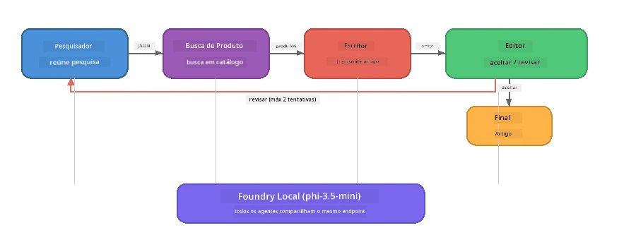

# Parte 7: Zava Creative Writer - Aplicação Capstone

> **Objetivo:** Explore uma aplicação multi-agente em estilo de produção onde quatro agentes especializados colaboram para produzir artigos de qualidade para revista para Zava Retail DIY - rodando inteiramente no seu dispositivo com Foundry Local.

Este é o **laboratório capstone** do workshop. Ele reúne tudo que você aprendeu - integração SDK (Parte 3), recuperação de dados locais (Parte 4), personas de agentes (Parte 5), e orquestração multi-agente (Parte 6) - em uma aplicação completa disponível em **Python**, **JavaScript**, e **C#**.

---

## O Que Você Vai Explorar

| Conceito | Onde no Zava Writer |
|---------|----------------------|
| Carregamento do modelo em 4 etapas | Módulo de configuração compartilhada inicia Foundry Local |
| Recuperação estilo RAG | Agente de produto busca em catálogo local |
| Especialização de agentes | 4 agentes com prompts de sistema distintos |
| Saída em streaming | Writer entrega tokens em tempo real |
| Transferências estruturadas | Pesquisador → JSON, Editor → decisão em JSON |
| Ciclos de feedback | Editor pode acionar reexecução (máximo 2 tentativas) |

---

## Arquitetura

O Zava Creative Writer usa um **pipeline sequencial com feedback conduzido pelo avaliador**. As três implementações de linguagem seguem a mesma arquitetura:



### Os Quatro Agentes

| Agente | Entrada | Saída | Propósito |
|-------|---------|-------|-----------|
| **Pesquisador** | Tópico + feedback opcional | `{"web": [{url, name, description}, ...]}` | Coleta pesquisa de fundo via LLM |
| **Busca de Produto** | String de contexto do produto | Lista de produtos correspondentes | Consultas geradas por LLM + busca por palavra-chave no catálogo local |
| **Writer** | Pesquisa + produtos + tarefa + feedback | Texto do artigo em streaming (dividido em `---`) | Elabora um artigo estilo revista em tempo real |
| **Editor** | Artigo + auto-feedback do escritor | `{"decision": "accept/revise", "editorFeedback": "...", "researchFeedback": "..."}` | Revisa qualidade, aciona nova tentativa se necessário |

### Fluxo do Pipeline

1. **Pesquisador** recebe o tópico e produz notas de pesquisa estruturadas (JSON)
2. **Busca de Produto** consulta o catálogo local usando termos de busca gerados por LLM
3. **Writer** combina pesquisa + produtos + tarefa em um artigo streaming, adicionando auto-feedback após um separador `---`
4. **Editor** revisa o artigo e retorna um veredito JSON:
   - `"accept"` → pipeline finaliza
   - `"revise"` → feedback é enviado de volta ao Pesquisador e Writer (máximo 2 tentativas)

---

## Pré-requisitos

- Completar [Parte 6: Fluxos de Trabalho Multi-Agente](part6-multi-agent-workflows.md)
- Foundry Local CLI instalado e modelo `phi-3.5-mini` baixado

---

## Exercícios

### Exercício 1 - Execute o Zava Creative Writer

Escolha sua linguagem e execute a aplicação:

<details>
<summary><strong>🐍 Python - Serviço Web FastAPI</strong></summary>

A versão Python roda como um **serviço web** com API REST, demonstrando como construir um backend de produção.

**Configuração:**
```bash
cd zava-creative-writer-local/src/api
python -m venv venv

# Windows (PowerShell):
venv\Scripts\Activate.ps1
# macOS:
source venv/bin/activate

pip install -r requirements.txt
```

**Executar:**
```bash
uvicorn main:app --reload
```

**Testar:**
```bash
curl -X POST http://localhost:8000/api/article \
  -H "Content-Type: application/json" \
  -d '{
    "research": "DIY home improvement trends",
    "products": "power tools and paints",
    "assignment": "Write an article about weekend renovation projects for DIY enthusiasts"
  }'
```

A resposta é transmitida como mensagens JSON separadas por nova linha, mostrando o progresso de cada agente.

</details>

<details>
<summary><strong>📦 JavaScript - CLI Node.js</strong></summary>

A versão JavaScript roda como uma **aplicação CLI**, imprimindo o progresso dos agentes e o artigo diretamente no console.

**Configuração:**
```bash
cd zava-creative-writer-local/src/javascript
npm install
```

**Executar:**
```bash
node main.mjs
```

Você verá:
1. Carregamento do modelo Foundry Local (com barra de progresso se estiver baixando)
2. Cada agente executando em sequência com mensagens de status
3. O artigo transmitido para o console em tempo real
4. Decisão do editor sobre aceitar ou revisar

</details>

<details>
<summary><strong>💜 C# - Aplicação Console .NET</strong></summary>

A versão C# roda como uma **aplicação console .NET** com o mesmo pipeline e saída em streaming.

**Configuração:**
```bash
cd zava-creative-writer-local/src/csharp
dotnet restore
```

**Executar:**
```bash
dotnet run
```

Mesmo padrão de saída da versão JavaScript - mensagens de status dos agentes, artigo em streaming, e veredito do editor.

</details>

---

### Exercício 2 - Estude a Estrutura do Código

Cada implementação de linguagem tem os mesmos componentes lógicos. Compare as estruturas:

**Python** (`src/api/`):
| Arquivo | Propósito |
|---------|-----------|
| `foundry_config.py` | Gerenciador Foundry Local, modelo e cliente compartilhados (inicialização em 4 etapas) |
| `orchestrator.py` | Coordenação do pipeline com loop de feedback |
| `main.py` | Endpoints FastAPI (`POST /api/article`) |
| `agents/researcher/researcher.py` | Pesquisa via LLM com saída JSON |
| `agents/product/product.py` | Geração de consultas LLM + busca por palavra-chave |
| `agents/writer/writer.py` | Geração de artigo em streaming |
| `agents/editor/editor.py` | Decisão accept/revise baseada em JSON |

**JavaScript** (`src/javascript/`):
| Arquivo | Propósito |
|---------|-----------|
| `foundryConfig.mjs` | Configuração Foundry Local compartilhada (inicialização em 4 etapas com barra de progresso) |
| `main.mjs` | Orquestrador + ponto de entrada CLI |
| `researcher.mjs` | Agente de pesquisa via LLM |
| `product.mjs` | Geração de consultas LLM + busca por palavra-chave |
| `writer.mjs` | Geração de artigo em streaming (gerador assíncrono) |
| `editor.mjs` | Decisão accept/revise JSON |
| `products.mjs` | Dados do catálogo de produtos |

**C#** (`src/csharp/`):
| Arquivo | Propósito |
|---------|-----------|
| `Program.cs` | Pipeline completo: carregamento de modelo, agentes, orquestrador, loop de feedback |
| `ZavaCreativeWriter.csproj` | Projeto .NET 9 com Foundry Local + pacotes OpenAI |

> **Nota de design:** Python separa cada agente em seu próprio arquivo/diretório (bom para equipes grandes). JavaScript usa um módulo por agente (bom para projetos médios). C# mantém tudo em um único arquivo com funções locais (bom para exemplos auto-contidos). Em produção, escolha o padrão que combina com as convenções da sua equipe.

---

### Exercício 3 - Acompanhe a Configuração Compartilhada

Cada agente no pipeline compartilha um único cliente Foundry Local para o modelo. Estude como isso está configurado em cada linguagem:

<details>
<summary><strong>🐍 Python - foundry_config.py</strong></summary>

```python
from foundry_local import FoundryLocalManager

MODEL_ALIAS = "phi-3.5-mini"

# Passo 1: Crie o gerenciador e inicie o serviço Foundry Local
manager = FoundryLocalManager()
manager.start_service()

# Passo 2: Verifique se o modelo já está baixado
cached = manager.list_cached_models()
catalog_info = manager.get_model_info(MODEL_ALIAS)
is_cached = any(m.id == catalog_info.id for m in cached) if catalog_info else False

if not is_cached:
    manager.download_model(MODEL_ALIAS)

# Passo 3: Carregue o modelo na memória
manager.load_model(MODEL_ALIAS)
model_id = manager.get_model_info(MODEL_ALIAS).id

# Cliente OpenAI compartilhado
client = openai.OpenAI(base_url=manager.endpoint, api_key=manager.api_key)
```

Todos os agentes importam `from foundry_config import client, model_id`.

</details>

<details>
<summary><strong>📦 JavaScript - foundryConfig.mjs</strong></summary>

```javascript
import { FoundryLocalManager } from "foundry-local-sdk";
import { OpenAI } from "openai";

FoundryLocalManager.create({ appName: "ZavaCreativeWriter" });
const manager = FoundryLocalManager.instance;
await manager.startWebService();

// Verificar cache → baixar → carregar (novo padrão SDK)
const catalog = manager.catalog;
const model = await catalog.getModel(MODEL_ALIAS);
if (!model.isCached) {
  console.log(`Downloading model: ${MODEL_ALIAS}...`);
  await model.download();
}
await model.load();

const client = new OpenAI({ baseURL: manager.urls[0] + "/v1", apiKey: "foundry-local" });
const modelId = model.id;
export { client, modelId };
```

Todos os agentes importam `{ client, modelId } from "./foundryConfig.mjs"`.

</details>

<details>
<summary><strong>💜 C# - topo do Program.cs</strong></summary>

```csharp
await FoundryLocalManager.CreateAsync(
    new Configuration
    {
        AppName = "ZavaCreativeWriter",
        Web = new Configuration.WebService { Urls = "http://127.0.0.1:0" }
    }, NullLogger.Instance, default);
var manager = FoundryLocalManager.Instance;
await manager.StartWebServiceAsync(default);

var catalog = await manager.GetCatalogAsync(default);
var catalogModel = await catalog.GetModelAsync(alias, default);
var isCached = await catalogModel.IsCachedAsync(default);
if (!isCached)
    await catalogModel.DownloadAsync(null, default);

await catalogModel.LoadAsync(default);
var key = new ApiKeyCredential("foundry-local");
var chatClient = new OpenAIClient(key, new OpenAIClientOptions
{
    Endpoint = new Uri(manager.Urls[0] + "/v1")
}).GetChatClient(catalogModel.Id);
```

O `chatClient` é então passado para todas as funções dos agentes no mesmo arquivo.

</details>

> **Padrão chave:** O padrão de carregamento do modelo (iniciar serviço → checar cache → baixar → carregar) garante que o usuário veja progresso claro e o modelo seja baixado apenas uma vez. Esta é uma boa prática para qualquer aplicação Foundry Local.

---

### Exercício 4 - Entenda o Loop de Feedback

O ciclo de feedback é o que torna este pipeline "inteligente" - o Editor pode enviar o trabalho de volta para revisão. Acompanhe a lógica:

```
Orchestrator:
  1. researcher.research(topic, "No Feedback")    ← first pass
  2. product.findProducts(productContext)
  3. writer.write(research, products, assignment)  ← streams article
  4. Split article at "---" → article + writerFeedback
  5. editor.edit(article, writerFeedback)

  WHILE editor says "revise" AND retryCount < 2:
    6. researcher.research(topic, editor.researchFeedback)  ← refined
    7. writer.write(research, products, editor.editorFeedback)
    8. editor.edit(newArticle, newWriterFeedback)
    9. retryCount++
```

**Perguntas para refletir:**
- Por que o limite de tentativas é 2? O que acontece se aumentar?
- Por que o pesquisador recebe `researchFeedback` e o writer recebe `editorFeedback`?
- O que ocorreria se o editor sempre solicitasse "revise"?

---

### Exercício 5 - Modifique um Agente

Tente alterar o comportamento de um agente e observe como isso afeta o pipeline:

| Modificação | O que mudar |
|-------------|-------------|
| **Editor mais rigoroso** | Altere o prompt de sistema do editor para sempre solicitar pelo menos uma revisão |
| **Artigos mais longos** | Altere o prompt do writer de "800-1000 palavras" para "1500-2000 palavras" |
| **Produtos diferentes** | Adicione ou modifique produtos no catálogo de produtos |
| **Novo tema de pesquisa** | Altere o `researchContext` padrão para um assunto diferente |
| **Pesquisador só JSON** | Faça o pesquisador retornar 10 itens em vez de 3-5 |

> **Dica:** Como as três linguagens implementam a mesma arquitetura, você pode fazer a mesma modificação na linguagem que se sentir mais confortável.

---

### Exercício 6 - Adicione um Quinto Agente

Estenda o pipeline com um novo agente. Algumas ideias:

| Agente | Onde no pipeline | Propósito |
|--------|------------------|-----------|
| **Verificador de Fatos** | Após o Writer, antes do Editor | Verificar afirmações contra os dados de pesquisa |
| **Otimização SEO** | Após aceitação do Editor | Adicionar meta descrição, palavras-chave, slug |
| **Ilustrador** | Após aceitação do Editor | Gerar prompts de imagem para o artigo |
| **Tradutor** | Após aceitação do Editor | Traduzir o artigo para outro idioma |

**Passos:**
1. Escreva o prompt de sistema do agente
2. Crie a função do agente (seguindo o padrão existente na sua linguagem)
3. Insira-o no orquestrador no ponto correto
4. Atualize a saída/log para mostrar a contribuição do novo agente

---

## Como o Foundry Local e o Agent Framework Trabalham Juntos

Esta aplicação demonstra o padrão recomendado para construir sistemas multi-agente com Foundry Local:

| Camada | Componente | Papel |
|--------|------------|-------|
| **Runtime** | Foundry Local | Baixa, gerencia e serve o modelo localmente |
| **Cliente** | SDK OpenAI | Envia completions de chat ao endpoint local |
| **Agente** | Prompt de sistema + chamada de chat | comportamento especializado por instruções focadas |
| **Orquestrador** | Coordenador do pipeline | Gerencia fluxo de dados, sequência e ciclos de feedback |
| **Framework** | Microsoft Agent Framework | Fornece a abstração `ChatAgent` e padrões |

O insight chave: **Foundry Local substitui o backend na nuvem, não a arquitetura da aplicação.** Os mesmos padrões de agente, estratégias de orquestração e transferências estruturadas que funcionam com modelos hospedados na nuvem funcionam exatamente iguais com modelos locais — você só aponta o cliente para o endpoint local em vez de um endpoint Azure.

---

## Principais Lições

| Conceito | O Que Você Aprendeu |
|----------|---------------------|
| Arquitetura de produção | Como estruturar uma aplicação multi-agente com configuração compartilhada e agentes separados |
| Carregamento do modelo em 4 etapas | Melhor prática para inicializar Foundry Local com progresso visível ao usuário |
| Especialização de agentes | Cada um dos 4 agentes tem instruções focadas e um formato específico de saída |
| Geração em streaming | Writer produz tokens em tempo real, habilitando UIs responsivas |
| Ciclos de feedback | Reexecução guiada pelo editor melhora qualidade sem intervenção humana |
| Padrões multi-linguagem | Mesma arquitetura funciona em Python, JavaScript e C# |
| Local = pronto para produção | Foundry Local serve a mesma API compatível com OpenAI usada em implantações na nuvem |

---

## Próximo Passo

Continue para [Parte 8: Desenvolvimento Guiado por Avaliação](part8-evaluation-led-development.md) para construir uma estrutura sistemática de avaliação para seus agentes, usando conjuntos de dados de referência, verificações baseadas em regras e pontuação com LLM como juiz.

---

<!-- CO-OP TRANSLATOR DISCLAIMER START -->
**Aviso Legal**:  
Este documento foi traduzido usando o serviço de tradução automática [Co-op Translator](https://github.com/Azure/co-op-translator). Embora nos esforcemos pela precisão, esteja ciente de que traduções automatizadas podem conter erros ou imprecisões. O documento original em sua língua nativa deve ser considerado a fonte autorizada. Para informações críticas, recomenda-se tradução profissional feita por humanos. Não nos responsabilizamos por quaisquer mal-entendidos ou interpretações incorretas decorrentes do uso desta tradução.
<!-- CO-OP TRANSLATOR DISCLAIMER END -->