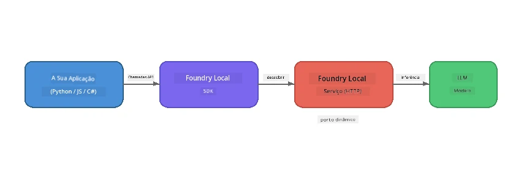

# Parte 1: Introdução ao Foundry Local


## O que é o Foundry Local?

[Foundry Local](https://foundrylocal.ai) permite-lhe executar modelos de linguagem IA open-source **diretamente no seu computador** - sem necessidade de internet, sem custos na cloud e com total privacidade dos dados. Ele:

- **Descarrega e executa modelos localmente** com optimização automática de hardware (GPU, CPU ou NPU)
- **Fornece uma API compatível com OpenAI** para que possa usar SDKs e ferramentas familiares
- **Não requer subscrição Azure** ou registo - basta instalar e começar a construir

Pense nele como ter o seu próprio IA privado que corre inteiramente na sua máquina.

## Objetivos de Aprendizagem

No final deste laboratório será capaz de:

- Instalar o Foundry Local CLI no seu sistema operativo
- Compreender o que são aliases de modelo e como funcionam
- Descarregar e executar o seu primeiro modelo IA local
- Enviar uma mensagem de chat para um modelo local a partir da linha de comandos
- Entender a diferença entre modelos IA locais e hospedados na cloud

---

## Pré-requisitos

### Requisitos do Sistema

| Requisito | Mínimo | Recomendado |
|-----------|---------|-------------|
| **RAM** | 8 GB | 16 GB |
| **Espaço em Disco** | 5 GB (para modelos) | 10 GB |
| **CPU** | 4 núcleos | 8+ núcleos |
| **GPU** | Opcional | NVIDIA com CUDA 11.8+ |
| **SO** | Windows 10/11 (x64/ARM), Windows Server 2025, macOS 13+ | - |

> **Nota:** O Foundry Local selecciona automaticamente a melhor variante de modelo para o seu hardware. Se tiver uma GPU NVIDIA, usa aceleração CUDA. Se tiver uma NPU Qualcomm, usa essa. Caso contrário, recorre a uma variante optimizada para CPU.

### Instalar Foundry Local CLI

**Windows** (PowerShell):
```powershell
winget install Microsoft.FoundryLocal
```

**macOS** (Homebrew):
```bash
brew tap microsoft/foundrylocal
brew install foundrylocal
```

> **Nota:** Atualmente, o Foundry Local suporta apenas Windows e macOS. Linux não é suportado por enquanto.

Verifique a instalação:
```bash
foundry --version
```

---

## Exercícios do Laboratório

### Exercício 1: Explorar Modelos Disponíveis

O Foundry Local inclui um catálogo de modelos open-source pré-optimizado. Liste-os:

```bash
foundry model list
```

Verá modelos como:
- `phi-3.5-mini` - Modelo Microsoft com 3,8B parâmetros (rápido, boa qualidade)
- `phi-4-mini` - Modelo Phi mais recente e mais capaz
- `phi-4-mini-reasoning` - Modelo Phi com raciocínio em cadeia de pensamento (tags `<think>`)
- `phi-4` - Maior modelo Phi da Microsoft (10,4 GB)
- `qwen2.5-0.5b` - Muito pequeno e rápido (bom para dispositivos de poucos recursos)
- `qwen2.5-7b` - Modelo geral forte com suporte para chamadas de ferramentas
- `qwen2.5-coder-7b` - Optimizado para geração de código
- `deepseek-r1-7b` - Modelo forte em raciocínio
- `gpt-oss-20b` - Modelo open-source grande (licença MIT, 12,5 GB)
- `whisper-base` - Transcrição de fala para texto (383 MB)
- `whisper-large-v3-turbo` - Transcrição de alta precisão (9 GB)

> **O que é um alias de modelo?** Aliases como `phi-3.5-mini` são atalhos. Quando usa um alias, o Foundry Local descarrega automaticamente a melhor variante para o seu hardware específico (CUDA para GPUs NVIDIA, optimizado para CPU noutros casos). Nunca precisa de se preocupar em escolher a variante certa.

### Exercício 2: Executar o Seu Primeiro Modelo

Descarregue e comece a conversar com um modelo de forma interativa:

```bash
foundry model run phi-3.5-mini
```

Na primeira vez que executar isto, o Foundry Local irá:
1. Detetar o seu hardware
2. Descarregar a variante de modelo óptima (isto pode levar alguns minutos)
3. Carregar o modelo na memória
4. Iniciar uma sessão de chat interativa

Experimente fazer algumas perguntas:
```
You: What is the golden ratio?
You: Can you explain it as if I were 10 years old?
You: Write a haiku about mathematics
```

Digite `exit` ou pressione `Ctrl+C` para sair.

### Exercício 3: Pré-descarregar um Modelo

Se deseja descarregar um modelo sem iniciar uma conversa:

```bash
foundry model download phi-3.5-mini
```

Verifique quais os modelos já descarregados na sua máquina:

```bash
foundry cache list
```

### Exercício 4: Compreender a Arquitetura

O Foundry Local corre como um **serviço HTTP local** que expõe uma API REST compatível com OpenAI. Isto significa que:

1. O serviço inicia numa **porta dinâmica** (uma porta diferente a cada vez)
2. Usa o SDK para descobrir a URL do endpoint real
3. Pode usar **qualquer** biblioteca cliente compatível com OpenAI para comunicar com ele



> **Importante:** O Foundry Local atribui uma **porta dinâmica** cada vez que inicia. Nunca codifique um número de porta fixo como `localhost:5272`. Use sempre o SDK para descobrir a URL atual (por exemplo, `manager.endpoint` em Python ou `manager.urls[0]` em JavaScript).

---

## Principais Conclusões

| Conceito | O que Aprendeu |
|----------|----------------|
| IA no dispositivo | O Foundry Local executa modelos inteiramente no seu dispositivo sem cloud, sem chaves de API e sem custos |
| Aliases de modelo | Aliases como `phi-3.5-mini` seleccionam automaticamente a melhor variante para o seu hardware |
| Portas dinâmicas | O serviço corre numa porta dinâmica; use sempre o SDK para descobrir o endpoint |
| CLI e SDK | Pode interagir com modelos via CLI (`foundry model run`) ou programaticamente via SDK |

---

## Próximos Passos

Continue para [Parte 2: Exploração Profunda do Foundry Local SDK](part2-foundry-local-sdk.md) para dominar a API do SDK para gerir modelos, serviços e cache programaticamente.

---

<!-- CO-OP TRANSLATOR DISCLAIMER START -->
**Aviso Legal**:  
Este documento foi traduzido utilizando o serviço de tradução automática [Co-op Translator](https://github.com/Azure/co-op-translator). Embora nos esforcemos por garantir a precisão, tenha em atenção que traduções automáticas podem conter erros ou imprecisões. O documento original no seu idioma nativo deve ser considerado a fonte autorizada. Para informações críticas, recomenda-se a tradução profissional humana. Não nos responsabilizamos por quaisquer mal-entendidos ou interpretações erradas decorrentes da utilização desta tradução.
<!-- CO-OP TRANSLATOR DISCLAIMER END -->