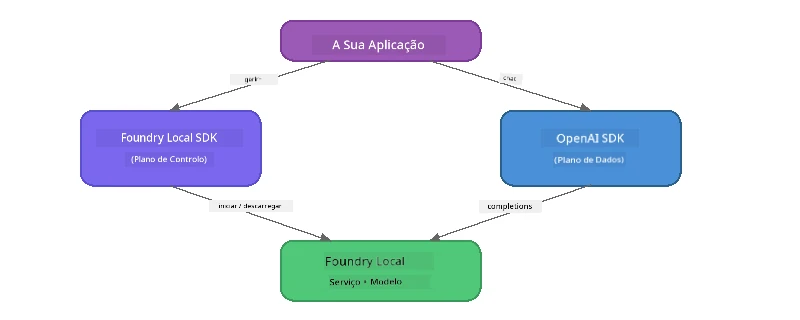

# Parte 3: Usar o Foundry Local SDK com OpenAI

## Visão Geral

Na Parte 1 usou a Foundry Local CLI para correr modelos de forma interativa. Na Parte 2 explorou toda a superfície da API do SDK. Agora vai aprender a **integrar o Foundry Local nas suas aplicações** usando o SDK e a API compatível com OpenAI.

O Foundry Local fornece SDKs para três linguagens. Escolha aquela com que se sente mais confortável - os conceitos são idênticos em todas as três.

## Objetivos de Aprendizagem

No final deste laboratório será capaz de:

- Instalar o Foundry Local SDK para a sua linguagem (Python, JavaScript ou C#)
- Inicializar `FoundryLocalManager` para iniciar o serviço, verificar o cache, descarregar e carregar um modelo
- Ligar-se ao modelo local usando o SDK OpenAI
- Enviar completamentos de chat e gerir respostas em streaming
- Compreender a arquitetura de ports dinâmicos

---

## Pré-requisitos

Complete primeiro [Parte 1: Começar com Foundry Local](part1-getting-started.md) e [Parte 2: Exploração Profunda do Foundry Local SDK](part2-foundry-local-sdk.md).

Instale **um** dos seguintes ambientes de execução de linguagem:
- **Python 3.9+** - [python.org/downloads](https://www.python.org/downloads/)
- **Node.js 18+** - [nodejs.org](https://nodejs.org/)
- **.NET 9.0+** - [dot.net/download](https://dotnet.microsoft.com/download)

---

## Conceito: Como o SDK Funciona

O Foundry Local SDK gere o **plano de controlo** (iniciar o serviço, descarregar modelos), enquanto o SDK OpenAI gere o **plano de dados** (enviar prompts, receber completamentos).



---

## Exercícios do Laboratório

### Exercício 1: Configurar o Seu Ambiente

<details>
<summary><b>🐍 Python</b></summary>

```bash
cd python
python -m venv venv

# Ative o ambiente virtual:
# Windows (PowerShell):
venv\Scripts\Activate.ps1
# Windows (Prompt de Comando):
venv\Scripts\activate.bat
# macOS:
source venv/bin/activate

pip install -r requirements.txt
```

O `requirements.txt` instala:
- `foundry-local-sdk` - O Foundry Local SDK (importado como `foundry_local`)
- `openai` - O SDK OpenAI para Python
- `agent-framework` - Microsoft Agent Framework (usado em partes posteriores)

</details>

<details>
<summary><b>📘 JavaScript</b></summary>

```bash
cd javascript
npm install
```

O `package.json` instala:
- `foundry-local-sdk` - O Foundry Local SDK
- `openai` - O SDK OpenAI para Node.js

</details>

<details>
<summary><b>💜 C#</b></summary>

```bash
cd csharp
dotnet restore
dotnet build
```

O `csharp.csproj` usa:
- `Microsoft.AI.Foundry.Local` - O Foundry Local SDK (NuGet)
- `OpenAI` - O SDK OpenAI para C# (NuGet)

> **Estrutura do projeto:** O projeto C# usa um router de linha de comandos em `Program.cs` que despacha para ficheiros de exemplo separados. Execute `dotnet run chat` (ou apenas `dotnet run`) para esta parte. As outras partes usam `dotnet run rag`, `dotnet run agent`, e `dotnet run multi`.

</details>

---

### Exercício 2: Completamento de Chat Básico

Abra o exemplo básico de chat para a sua linguagem e examine o código. Cada script segue o mesmo padrão em três passos:

1. **Iniciar o serviço** - `FoundryLocalManager` inicia o runtime Foundry Local
2. **Descarregar e carregar o modelo** - verifica o cache, descarrega se necessário e depois carrega na memória
3. **Criar um cliente OpenAI** - liga-se ao endpoint local e envia um completamento de chat em streaming

<details>
<summary><b>🐍 Python - <code>python/foundry-local.py</code></b></summary>

```python
import sys
import openai
from foundry_local import FoundryLocalManager

alias = "phi-3.5-mini"

# Passo 1: Criar um FoundryLocalManager e iniciar o serviço
print("Starting Foundry Local service...")
manager = FoundryLocalManager()
manager.start_service()

# Passo 2: Verificar se o modelo já está descarregado
cached = manager.list_cached_models()
catalog_info = manager.get_model_info(alias)
is_cached = any(m.id == catalog_info.id for m in cached) if catalog_info else False

if is_cached:
    print(f"Model already downloaded: {alias}")
else:
    print(f"Downloading model: {alias} (this may take several minutes)...")
    manager.download_model(alias)
    print(f"Download complete: {alias}")

# Passo 3: Carregar o modelo na memória
print(f"Loading model: {alias}...")
manager.load_model(alias)

# Criar um cliente OpenAI apontando para o serviço LOCAL Foundry
client = openai.OpenAI(
    base_url=manager.endpoint,   # Porta dinâmica - nunca codificar diretamente!
    api_key=manager.api_key
)

# Gerar uma conclusão de chat em streaming
stream = client.chat.completions.create(
    model=manager.get_model_info(alias).id,
    messages=[{"role": "user", "content": "What is the golden ratio?"}],
    stream=True,
)

for chunk in stream:
    if chunk.choices[0].delta.content is not None:
        print(chunk.choices[0].delta.content, end="", flush=True)
print()
```

**Execute-o:**
```bash
python foundry-local.py
```

</details>

<details>
<summary><b>📘 JavaScript - <code>javascript/foundry-local.mjs</code></b></summary>

```javascript
import { OpenAI } from "openai";
import { FoundryLocalManager } from "foundry-local-sdk";

const alias = "phi-3.5-mini";

// Passo 1: Inicie o serviço Foundry Local
console.log("Starting Foundry Local service...");
FoundryLocalManager.create({ appName: "FoundryLocalWorkshop" });
const manager = FoundryLocalManager.instance;
await manager.startWebService();

// Passo 2: Verifique se o modelo já está descarregado
const catalog = manager.catalog;
const model = await catalog.getModel(alias);

if (model.isCached) {
  console.log(`Model already downloaded: ${alias}`);
} else {
  console.log(`Downloading model: ${alias} (this may take several minutes)...`);
  await model.download();
  console.log(`Download complete: ${alias}`);
}

// Passo 3: Carregue o modelo na memória
console.log(`Loading model: ${alias}...`);
await model.load();
console.log(`Model loaded: ${model.id}`);

// Crie um cliente OpenAI apontando para o serviço Foundry LOCAL
const client = new OpenAI({
  baseURL: manager.urls[0] + "/v1",   // Porta dinâmica - nunca codifique fixamente!
  apiKey: "foundry-local",
});

// Gere uma conclusão de chat em streaming
const stream = await client.chat.completions.create({
  model: model.id,
  messages: [{ role: "user", content: "What is the golden ratio?" }],
  stream: true,
});

for await (const chunk of stream) {
  if (chunk.choices[0]?.delta?.content) {
    process.stdout.write(chunk.choices[0].delta.content);
  }
}
console.log();
```

**Execute-o:**
```bash
node foundry-local.mjs
```

</details>

<details>
<summary><b>💜 C# - <code>csharp/BasicChat.cs</code></b></summary>

```csharp
using Microsoft.AI.Foundry.Local;
using Microsoft.Extensions.Logging.Abstractions;
using OpenAI;
using OpenAI.Chat;
using System.ClientModel;

var alias = "phi-3.5-mini";

// Step 1: Start the Foundry Local service
Console.WriteLine("Starting Foundry Local service...");
await FoundryLocalManager.CreateAsync(
    new Configuration
    {
        AppName = "FoundryLocalSamples",
        Web = new Configuration.WebService { Urls = "http://127.0.0.1:0" }
    }, NullLogger.Instance, default);
var manager = FoundryLocalManager.Instance;
await manager.StartWebServiceAsync(default);

// Step 2: Get the model from the catalog
var catalog = await manager.GetCatalogAsync(default);
var model = await catalog.GetModelAsync(alias, default);

// Step 3: Check if the model is already downloaded
var isCached = await model.IsCachedAsync(default);

if (isCached)
{
    Console.WriteLine($"Model already downloaded: {alias}");
}
else
{
    Console.WriteLine($"Downloading model: {alias} (this may take several minutes)...");
    await model.DownloadAsync(null, default);
    Console.WriteLine($"Download complete: {alias}");
}

// Step 4: Load the model into memory
Console.WriteLine($"Loading model: {alias}...");
await model.LoadAsync(default);
Console.WriteLine($"Loaded model: {model.Id}");
Console.WriteLine($"Endpoint: {manager.Urls[0]}");

// Create OpenAI client pointing to the LOCAL Foundry service
var key = new ApiKeyCredential("foundry-local");
var client = new OpenAIClient(key, new OpenAIClientOptions
{
    Endpoint = new Uri(manager.Urls[0] + "/v1")  // Dynamic port - never hardcode!
});

var chatClient = client.GetChatClient(model.Id);

// Stream a chat completion
var completionUpdates = chatClient.CompleteChatStreaming("What is the golden ratio?");

foreach (var update in completionUpdates)
{
    if (update.ContentUpdate.Count > 0)
    {
        Console.Write(update.ContentUpdate[0].Text);
    }
}
Console.WriteLine();
```

**Execute-o:**
```bash
dotnet run chat
```

</details>

---

### Exercício 3: Experimente com Prompts

Depois de o seu exemplo básico correr, experimente alterar o código:

1. **Mude a mensagem do utilizador** - tente perguntas diferentes
2. **Adicione um prompt do sistema** - dê uma persona ao modelo
3. **Desative o streaming** - defina `stream=False` e imprima a resposta completa de uma vez
4. **Experimente outro modelo** - altere o alias de `phi-3.5-mini` para outro modelo retirado de `foundry model list`

<details>
<summary><b>🐍 Python</b></summary>

```python
# Adicione um prompt do sistema - dê ao modelo uma persona:
stream = client.chat.completions.create(
    model=manager.get_model_info(alias).id,
    messages=[
        {"role": "system", "content": "You are a pirate. Answer everything in pirate speak."},
        {"role": "user", "content": "What is the golden ratio?"}
    ],
    stream=True,
)

# Ou desligue o streaming:
response = client.chat.completions.create(
    model=manager.get_model_info(alias).id,
    messages=[{"role": "user", "content": "What is the golden ratio?"}],
    stream=False,
)
print(response.choices[0].message.content)
```

</details>

<details>
<summary><b>📘 JavaScript</b></summary>

```javascript
// Adicione um prompt do sistema - dê ao modelo uma persona:
const stream = await client.chat.completions.create({
  model: modelInfo.id,
  messages: [
    { role: "system", content: "You are a pirate. Answer everything in pirate speak." },
    { role: "user", content: "What is the golden ratio?" },
  ],
  stream: true,
});

// Ou desligue a transmissão:
const response = await client.chat.completions.create({
  model: modelInfo.id,
  messages: [{ role: "user", content: "What is the golden ratio?" }],
  stream: false,
});
console.log(response.choices[0].message.content);
```

</details>

<details>
<summary><b>💜 C#</b></summary>

```csharp
// Add a system prompt - give the model a persona:
var completionUpdates = chatClient.CompleteChatStreaming(
    new ChatMessage[]
    {
        new SystemChatMessage("You are a pirate. Answer everything in pirate speak."),
        new UserChatMessage("What is the golden ratio?")
    }
);

// Or turn off streaming:
var response = chatClient.CompleteChat("What is the golden ratio?");
Console.WriteLine(response.Value.Content[0].Text);
```

</details>

---

### Referência de Métodos do SDK

<details>
<summary><b>🐍 Métodos do SDK Python</b></summary>

| Método | Propósito |
|--------|-----------|
| `FoundryLocalManager()` | Criar instância do gestor |
| `manager.start_service()` | Iniciar o serviço Foundry Local |
| `manager.list_cached_models()` | Listar modelos descarregados no seu dispositivo |
| `manager.get_model_info(alias)` | Obter ID e metadados do modelo |
| `manager.download_model(alias, progress_callback=fn)` | Descarregar um modelo com callback de progresso opcional |
| `manager.load_model(alias)` | Carregar um modelo para memória |
| `manager.endpoint` | Obter a URL do endpoint dinâmico |
| `manager.api_key` | Obter a chave API (placeholder para local) |

</details>

<details>
<summary><b>📘 Métodos do SDK JavaScript</b></summary>

| Método | Propósito |
|--------|-----------|
| `FoundryLocalManager.create({ appName })` | Criar instância do gestor |
| `FoundryLocalManager.instance` | Aceder ao gestor singleton |
| `await manager.startWebService()` | Iniciar o serviço Foundry Local |
| `await manager.catalog.getModel(alias)` | Obter um modelo do catálogo |
| `model.isCached` | Verificar se o modelo está já descarregado |
| `await model.download()` | Descarregar um modelo |
| `await model.load()` | Carregar um modelo para memória |
| `model.id` | Obter o ID do modelo para chamadas à API OpenAI |
| `manager.urls[0] + "/v1"` | Obter a URL do endpoint dinâmico |
| `"foundry-local"` | Chave API (placeholder para local) |

</details>

<details>
<summary><b>💜 Métodos do SDK C#</b></summary>

| Método | Propósito |
|--------|-----------|
| `FoundryLocalManager.CreateAsync(config)` | Criar e inicializar o gestor |
| `manager.StartWebServiceAsync()` | Iniciar o serviço web Foundry Local |
| `manager.GetCatalogAsync()` | Obter o catálogo de modelos |
| `catalog.ListModelsAsync()` | Listar todos os modelos disponíveis |
| `catalog.GetModelAsync(alias)` | Obter um modelo específico pelo alias |
| `model.IsCachedAsync()` | Verificar se um modelo está descarregado |
| `model.DownloadAsync()` | Descarregar um modelo |
| `model.LoadAsync()` | Carregar um modelo para memória |
| `manager.Urls[0]` | Obter a URL do endpoint dinâmico |
| `new ApiKeyCredential("foundry-local")` | Credencial de chave API para local |

</details>

---

### Exercício 4: Usar o ChatClient Nativo (Alternativa ao SDK OpenAI)

Nos Exercícios 2 e 3 usou o SDK OpenAI para completamentos de chat. Os SDKs JavaScript e C# fornecem também um **ChatClient nativo** que elimina a necessidade do SDK OpenAI por completo.

<details>
<summary><b>📘 JavaScript - <code>model.createChatClient()</code></b></summary>

```javascript
import { FoundryLocalManager } from "foundry-local-sdk";

const alias = "phi-3.5-mini";

FoundryLocalManager.create({ appName: "ChatClientDemo" });
const manager = FoundryLocalManager.instance;
await manager.startWebService();

const model = await manager.catalog.getModel(alias);
if (!model.isCached) await model.download();
await model.load();

// Não é necessário importar o OpenAI — obtenha um cliente diretamente do modelo
const chatClient = model.createChatClient();

// Conclusão sem streaming
const response = await chatClient.completeChat([
  { role: "system", content: "You are a pirate. Answer everything in pirate speak." },
  { role: "user", content: "What is the golden ratio?" }
]);
console.log(response.choices[0].message.content);

// Conclusão com streaming (utiliza um padrão de callback)
await chatClient.completeStreamingChat(
  [{ role: "user", content: "What is the golden ratio?" }],
  (chunk) => {
    if (chunk.choices?.[0]?.delta?.content) {
      process.stdout.write(chunk.choices[0].delta.content);
    }
  }
);
console.log();
```

> **Nota:** O método `completeStreamingChat()` do ChatClient utiliza um padrão de **callback**, não um iterador assíncrono. Passe uma função como segundo argumento.

</details>

<details>
<summary><b>💜 C# - <code>model.GetChatClientAsync()</code></b></summary>

```csharp
var catalog = await manager.GetCatalogAsync(default);
var model = await catalog.GetModelAsync("phi-3.5-mini", default);
if (!await model.IsCachedAsync(default))
    await model.DownloadAsync(null, default);
await model.LoadAsync(default);

// No OpenAI NuGet needed — get a client directly from the model
var chatClient = await model.GetChatClientAsync(default);

// Use it like a standard OpenAI ChatClient
var response = chatClient.CompleteChat("What is the golden ratio?");
Console.WriteLine(response.Value.Content[0].Text);
```

</details>

> **Quando usar cada um:**
> | Abordagem | Melhor para |
> |-----------|-------------|
> | SDK OpenAI | Controlo total dos parâmetros, aplicações em produção, código OpenAI existente |
> | ChatClient Nativo | Prototipagem rápida, menos dependências, configuração mais simples |

---

## Principais Conclusões

| Conceito | O Que Aprendeu |
|----------|-----------------|
| Plano de controlo | O Foundry Local SDK gere a inicialização do serviço e o carregamento de modelos |
| Plano de dados | O SDK OpenAI gere os completamentos de chat e streaming |
| Ports dinâmicos | Use sempre o SDK para descobrir o endpoint; nunca codifique URLs diretamente |
| Linguagens cruzadas | O mesmo padrão de código funciona em Python, JavaScript e C# |
| Compatibilidade OpenAI | Compatibilidade total com API OpenAI significa que o código OpenAI existente funciona com alterações mínimas |
| ChatClient nativo | `createChatClient()` (JS) / `GetChatClientAsync()` (C#) fornece uma alternativa ao SDK OpenAI |

---

## Próximos Passos

Continue para [Parte 4: Construir uma Aplicação RAG](part4-rag-fundamentals.md) para aprender a construir uma pipeline de Geração Aumentada por Recuperação a correr inteiramente no seu dispositivo.

---

<!-- CO-OP TRANSLATOR DISCLAIMER START -->
**Aviso**:  
Este documento foi traduzido utilizando o serviço de tradução automática [Co-op Translator](https://github.com/Azure/co-op-translator). Embora nos esforcemos por garantir a precisão, por favor, esteja ciente de que traduções automáticas podem conter erros ou imprecisões. O documento original, na sua língua nativa, deve ser considerado a fonte autorizada. Para informações críticas, recomenda-se tradução profissional humana. Não nos responsabilizamos por quaisquer mal-entendidos ou interpretações erradas decorrentes da utilização desta tradução.
<!-- CO-OP TRANSLATOR DISCLAIMER END -->