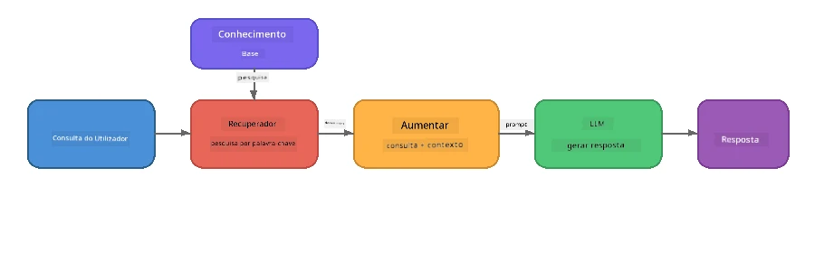

# Parte 4: Construir uma Aplicação RAG com Foundry Local

## Visão Geral

Os Grandes Modelos de Linguagem são poderosos, mas só sabem o que estava nos seus dados de treino. **Retrieval-Augmented Generation (RAG)** resolve isto ao fornecer ao modelo contexto relevante no momento da consulta - extraído dos seus próprios documentos, bases de dados ou bases de conhecimento.

Neste laboratório irá construir um pipeline RAG completo que corre **inteiramente no seu dispositivo** usando Foundry Local. Sem serviços na nuvem, sem bases de dados vetoriais, sem API de embeddings - apenas recuperação local e um modelo local.

## Objetivos de Aprendizagem

No final deste laboratório será capaz de:

- Explicar o que é RAG e por que é importante para aplicações de IA
- Construir uma base de conhecimento local a partir de documentos de texto
- Implementar uma função simples de recuperação para encontrar contexto relevante
- Compor um prompt do sistema que ancore o modelo em factos recuperados
- Executar o pipeline completo Retrieve → Augment → Generate no dispositivo
- Compreender os trade-offs entre recuperação simples por palavras-chave e pesquisa vetorial

---

## Pré-requisitos

- Ter completado [Parte 3: Utilização do Foundry Local SDK com OpenAI](part3-sdk-and-apis.md)
- Foundry Local CLI instalado e modelo `phi-3.5-mini` descarregado

---

## Conceito: O que é RAG?

Sem RAG, um LLM só pode responder com base nos seus dados de treino - que podem estar desatualizados, incompletos ou não conter a sua informação privada:

```
User: "What is Zava's return policy?"
LLM:  "I do not have information about Zava's return policy."  ← No context!
```

Com RAG, primeiro se **recuperam** documentos relevantes, depois se **aumenta** o prompt com esse contexto antes de **gerar** uma resposta:



O insight chave: **o modelo não precisa de "saber" a resposta; só precisa de ler os documentos certos.**

---

## Exercícios do Laboratório

### Exercício 1: Compreender a Base de Conhecimento

Abra o exemplo RAG para a sua linguagem e examine a base de conhecimento:

<details>
<summary><b>🐍 Python: <code>python/foundry-local-rag.py</code></b></summary>

A base de conhecimento é uma lista simples de dicionários com campos `title` e `content`:

```python
KNOWLEDGE_BASE = [
    {
        "title": "Foundry Local Overview",
        "content": (
            "Foundry Local brings the power of Azure AI Foundry to your local "
            "device without requiring an Azure subscription..."
        ),
    },
    {
        "title": "Supported Hardware",
        "content": (
            "Foundry Local automatically selects the best model variant for "
            "your hardware. If you have an Nvidia CUDA GPU it downloads the "
            "CUDA-optimized model..."
        ),
    },
    # ... mais entradas
]
```

Cada entrada representa um "pedaço" de conhecimento - uma peça focada de informação sobre um tópico.

</details>

<details>
<summary><b>📘 JavaScript: <code>javascript/foundry-local-rag.mjs</code></b></summary>

A base de conhecimento usa a mesma estrutura como um array de objetos:

```javascript
const KNOWLEDGE_BASE = [
  {
    title: "Foundry Local Overview",
    content:
      "Foundry Local brings the power of Azure AI Foundry to your local " +
      "device without requiring an Azure subscription...",
  },
  {
    title: "Supported Hardware",
    content:
      "Foundry Local automatically selects the best model variant for " +
      "your hardware...",
  },
  // ... mais entradas
];
```

</details>

<details>
<summary><b>💜 C#: <code>csharp/RagPipeline.cs</code></b></summary>

A base de conhecimento utiliza uma lista de tuples nomeados:

```csharp
private static readonly List<(string Title, string Content)> KnowledgeBase =
[
    ("Foundry Local Overview",
     "Foundry Local brings the power of Azure AI Foundry to your local " +
     "device without requiring an Azure subscription..."),

    ("Supported Hardware",
     "Foundry Local automatically selects the best model variant for " +
     "your hardware..."),

    // ... more entries
];
```

</details>

> **Numa aplicação real**, a base de conhecimento viria de ficheiros no disco, uma base de dados, um índice de pesquisa, ou uma API. Para este laboratório, usamos uma lista em memória para simplificar.

---

### Exercício 2: Compreender a Função de Recuperação

A etapa de recuperação encontra os pedaços mais relevantes para a pergunta do utilizador. Este exemplo utiliza **sobreposição de palavras-chave** - contando quantas palavras na consulta aparecem em cada pedaço:

<details>
<summary><b>🐍 Python</b></summary>

```python
def retrieve(query: str, top_k: int = 2) -> list[dict]:
    """Return the top-k knowledge chunks most relevant to the query."""
    query_words = set(query.lower().split())
    scored = []
    for chunk in KNOWLEDGE_BASE:
        chunk_words = set(chunk["content"].lower().split())
        overlap = len(query_words & chunk_words)
        scored.append((overlap, chunk))
    scored.sort(key=lambda x: x[0], reverse=True)
    return [item[1] for item in scored[:top_k]]
```

</details>

<details>
<summary><b>📘 JavaScript</b></summary>

```javascript
function retrieve(query, topK = 2) {
  const queryWords = new Set(query.toLowerCase().split(/\s+/));
  const scored = KNOWLEDGE_BASE.map((chunk) => {
    const chunkWords = new Set(chunk.content.toLowerCase().split(/\s+/));
    let overlap = 0;
    for (const w of queryWords) {
      if (chunkWords.has(w)) overlap++;
    }
    return { overlap, chunk };
  });
  scored.sort((a, b) => b.overlap - a.overlap);
  return scored.slice(0, topK).map((s) => s.chunk);
}
```

</details>

<details>
<summary><b>💜 C#</b></summary>

```csharp
private static List<(string Title, string Content)> Retrieve(string query, int topK = 2)
{
    var queryWords = new HashSet<string>(
        query.ToLowerInvariant().Split(' ', StringSplitOptions.RemoveEmptyEntries));

    return KnowledgeBase
        .Select(chunk =>
        {
            var chunkWords = new HashSet<string>(
                chunk.Content.ToLowerInvariant().Split(' ', StringSplitOptions.RemoveEmptyEntries));
            var overlap = queryWords.Intersect(chunkWords).Count();
            return (Overlap: overlap, Chunk: chunk);
        })
        .OrderByDescending(x => x.Overlap)
        .Take(topK)
        .Select(x => x.Chunk)
        .ToList();
}
```

</details>

**Como funciona:**
1. Divide a consulta em palavras individuais
2. Para cada pedaço de conhecimento, conta quantas palavras da consulta aparecem nesse pedaço
3. Ordena por pontuação de sobreposição (maior primeiro)
4. Retorna os top-k pedaços mais relevantes

> **Compromisso:** A sobreposição por palavras-chave é simples mas limitada; não percebe sinónimos ou significado. Sistemas RAG de produção geralmente usam **vetores de embedding** e uma **base de dados vetorial** para pesquisa semântica. No entanto, a sobreposição por palavras-chave é um bom ponto de partida e não requer dependências extra.

---

### Exercício 3: Compreender o Prompt Aumentado

O contexto recuperado é injetado no **prompt do sistema** antes de o enviar ao modelo:

```python
system_prompt = (
    "You are a helpful assistant. Answer the user's question using ONLY "
    "the information provided in the context below. If the context does "
    "not contain enough information, say so.\n\n"
    f"Context:\n{context_text}"
)
```

Decisões chave de design:
- **"APENAS a informação fornecida"** - impede que o modelo invente factos que não estão no contexto
- **"Se o contexto não contiver informação suficiente, diga assim"** - incentiva respostas honestas de "Não sei"
- O contexto é colocado na mensagem do sistema para moldar todas as respostas

---

### Exercício 4: Executar o Pipeline RAG

Execute o exemplo completo:

**Python:**
```bash
cd python
python foundry-local-rag.py
```

**JavaScript:**
```bash
cd javascript
node foundry-local-rag.mjs
```

**C#:**
```bash
cd csharp
dotnet run rag
```

Deve ver impressas três coisas:
1. **A pergunta** feita
2. **O contexto recuperado** - os pedaços selecionados da base de conhecimento
3. **A resposta** - gerada pelo modelo usando apenas esse contexto

Exemplo de saída:
```
Question: How do I install Foundry Local and what hardware does it support?

--- Retrieved Context ---
### Installation
On Windows install Foundry Local with: winget install Microsoft.FoundryLocal...

### Supported Hardware
Foundry Local automatically selects the best model variant for your hardware...
-------------------------

Answer: To install Foundry Local, you can use the following methods depending
on your operating system: On Windows, run `winget install Microsoft.FoundryLocal`.
On macOS, use `brew install microsoft/foundrylocal/foundrylocal`...
```

Repare como a resposta do modelo está **anclada** no contexto recuperado - só menciona factos dos documentos da base de conhecimento.

---

### Exercício 5: Experimente e Expanda

Teste estas modificações para aprofundar o seu entendimento:

1. **Mude a pergunta** - pergunte algo que ESTÁ na base de conhecimento versus algo que NÃO ESTÁ:
   ```python
   question = "What programming languages does Foundry Local support?"  # ← No contexto
   question = "How much does Foundry Local cost?"                       # ← Fora do contexto
   ```
   O modelo diz corretamente "Não sei" quando a resposta não está no contexto?

2. **Adicione um novo pedaço de conhecimento** - acrescente uma nova entrada a `KNOWLEDGE_BASE`:
   ```python
   {
       "title": "Pricing",
       "content": "Foundry Local is completely free and open source under the MIT license.",
   }
   ```
   Agora volte a perguntar sobre preços.

3. **Altere `top_k`** - recupere mais ou menos pedaços:
   ```python
   context_chunks = retrieve(question, top_k=3)  # Mais contexto
   context_chunks = retrieve(question, top_k=1)  # Menos contexto
   ```
   Como a quantidade de contexto afeta a qualidade da resposta?

4. **Remova a instrução de grounding** - mude o prompt do sistema para apenas "És um assistente prestável." e veja se o modelo começa a inventar factos.

---

## Análise Profunda: Optimização de RAG para Desempenho On-Device

Executar RAG no dispositivo introduz restrições que não se encontram na nuvem: RAM limitada, ausência de GPU dedicado (execução em CPU/NPU) e uma janela de contexto pequena no modelo. As decisões de design abaixo tratam diretamente estas restrições, baseando-se em padrões de aplicações RAG locais em produção construídas com Foundry Local.

### Estratégia de Divisão em Pedaços: Janela Deslizante de Tamanho Fixo

A divisão em pedaços - como se divide documentos em partes - é uma das decisões mais impactantes em qualquer sistema RAG. Para cenários on-device, uma **janela deslizante de tamanho fixo com sobreposição** é o ponto de partida recomendado:

| Parâmetro | Valor Recomendado | Porquê |
|-----------|-------------------|--------|
| **Tamanho do pedaço** | ~200 tokens | Mantém o contexto recuperado compacto, deixando espaço na janela de contexto do Phi-3.5 Mini para o prompt do sistema, histórico de conversa e saída gerada |
| **Sobreposição** | ~25 tokens (12,5%) | Evita perda de informação nas fronteiras dos pedaços - importante para procedimentos e instruções passo-a-passo |
| **Tokenização** | Divisão por espaços em branco | Zero dependências, não é necessária biblioteca de tokenização. Todo o orçamento computacional fica com o LLM |

A sobreposição funciona como uma janela deslizante: cada novo pedaço começa 25 tokens antes do fim do anterior, assim frases que atravessam fronteiras aparecem em ambos os pedaços.

> **Porquê não outras estratégias?**
> - **Divisão por frases** produz tamanhos imprevisíveis; alguns procedimentos de segurança são frases longas únicas que não dividem bem
> - **Divisão por secções** (em títulos `##`) cria pedaços de tamanho muito variável - alguns pequenos demais, outros grandes demais para a janela de contexto do modelo
> - **Divisão semântica** (detecção de tópicos baseada em embeddings) dá a melhor qualidade de recuperação, mas requer um segundo modelo na memória ao lado do Phi-3.5 Mini - arriscado em hardware com 8-16 GB de memória partilhada

### Melhorando a Recuperação: Vetores TF-IDF

A abordagem de sobreposição por palavras-chave neste laboratório funciona, mas se quiser uma recuperação melhor sem adicionar um modelo de embedding, **TF-IDF (Term Frequency-Inverse Document Frequency)** é um excelente meio-termo:

```
Keyword Overlap  →  TF-IDF Vectors  →  Embedding Models
    (this lab)     (lightweight upgrade)   (production)
  Simple & fast    Better ranking,         Best quality,
  No dependencies  still no ML model       requires embedding model
  ~Basic matching  ~1ms retrieval          ~100-500ms per query
```

TF-IDF converte cada pedaço num vetor numérico baseado na importância de cada palavra dentro desse pedaço *relativa a todos os pedaços*. No momento da consulta, a pergunta é vetorizada da mesma forma e comparada usando similaridade do cosseno. Pode implementar isto com SQLite e JavaScript/Python puro - sem base de dados vetorial, sem API de embedding.

> **Desempenho:** A similaridade do cosseno TF-IDF sobre pedaços de tamanho fixo normalmente alcança **~1ms de recuperação**, comparado com ~100-500ms quando um modelo de embedding codifica cada consulta. Todos os 20+ documentos podem ser divididos e indexados em menos de um segundo.

### Modo Edge/Compacto para Dispositivos Limitados

Quando executa em hardware muito limitado (portáteis antigos, tablets, dispositivos de campo), pode reduzir o uso de recursos reduzindo três controlos:

| Definição | Modo Standard | Modo Edge/Compacto |
|-----------|--------------|--------------------|
| **Prompt do sistema** | ~300 tokens | ~80 tokens |
| **Máximo de tokens de saída** | 1024 | 512 |
| **Pedaços recuperados (top-k)** | 5 | 3 |

Menos pedaços recuperados significa menos contexto para o modelo processar, reduzindo latência e pressão de memória. Um prompt do sistema mais curto liberta mais janela de contexto para a resposta real. Este compromisso vale a pena em dispositivos onde cada token de janela conta.

### Modelo Único na Memória

Um dos princípios mais importantes para RAG on-device: **manter apenas um modelo carregado**. Se usar um modelo de embedding para recuperação *e* um modelo de linguagem para geração, estará a dividir recursos limitados de NPU/RAM entre dois modelos. Recuperação leve (sobreposição por palavras-chave, TF-IDF) evita isto por completo:

- Sem modelo de embedding a competir com o LLM pela memória
- Arranque a frio mais rápido - só um modelo para carregar
- Uso de memória previsível - o LLM obtém todos os recursos disponíveis
- Funciona em máquinas com apenas 8 GB RAM

### SQLite como Armazenamento Vetorial Local

Para coleções de documentos pequenas a médias (centenas a poucos milhares de pedaços), **SQLite é rápido o suficiente** para busca por similaridade do cosseno por força bruta e adiciona zero infraestruturas:

- Ficheiro único `.db` no disco - sem processo servidor, sem configuração
- Incluído em todas as principais runtimes (Python `sqlite3`, Node.js `better-sqlite3`, .NET `Microsoft.Data.Sqlite`)
- Armazena pedaços de documentos junto com seus vetores TF-IDF numa tabela
- Sem necessidade de Pinecone, Qdrant, Chroma, ou FAISS nesta escala

### Resumo de Desempenho

Estas escolhas de design combinam para oferecer RAG responsivo em hardware de consumidor:

| Métrica | Desempenho On-Device |
|---------|----------------------|
| **Latência de recuperação** | ~1ms (TF-IDF) a ~5ms (sobreposição por palavras-chave) |
| **Velocidade de ingestão** | 20 documentos divididos e indexados em < 1 segundo |
| **Modelos na memória** | 1 (só LLM - sem modelo de embedding) |
| **Sobrecarga de armazenamento** | < 1 MB para pedaços + vetores em SQLite |
| **Arranque a frio** | Único carregamento de modelo, sem runtime de embedding |
| **Requisitos mínimos de hardware** | 8 GB RAM, só CPU (sem GPU necessária) |

> **Quando atualizar:** Se escalar para centenas de documentos longos, com tipos de conteúdo mistos (tabelas, código, prosa), ou precisar de compreensão semântica das consultas, considere adicionar um modelo de embedding e mudar para pesquisa por similaridade vetorial. Para a maioria dos casos on-device com conjuntos de documentos focados, TF-IDF + SQLite entrega excelentes resultados com uso mínimo de recursos.

---

## Conceitos-Chave

| Conceito | Descrição |
|----------|-----------|
| **Recuperação** | Encontrar documentos relevantes na base de conhecimento com base na consulta do utilizador |
| **Aumento** | Inserir documentos recuperados no prompt como contexto |
| **Geração** | O LLM produz uma resposta ancorada no contexto fornecido |
| **Divisão em pedaços** | Partir documentos grandes em peças mais pequenas e focadas |
| **Grounding** | Restringir o modelo a usar apenas o contexto fornecido (reduz alucinações) |
| **Top-k** | Número dos pedaços mais relevantes a recuperar |

---

## RAG em Produção vs. Este Laboratório

| Aspeto | Este Laboratório | On-Device optimizado | Produção na Nuvem |
|--------|-----------------|---------------------|-------------------|
| **Base de conhecimento** | Lista em memória | Ficheiros no disco, SQLite | Base de dados, índice de pesquisa |
| **Recuperação** | Sobreposição por palavras-chave | TF-IDF + similaridade do cosseno | Embeddings vetoriais + pesquisa por similaridade |
| **Embeddings** | Não necessário | Nenhum - vetores TF-IDF | Modelo de embedding (local ou na nuvem) |
| **Armazenamento vetorial** | Não necessário | SQLite (ficheiro `.db` único) | FAISS, Chroma, Azure AI Search, etc. |
| **Divisão em pedaços** | Manual | Janela deslizante de tamanho fixo (~200 tokens, 25 de sobreposição) | Divisão semântica ou recursiva |
| **Modelos na memória** | 1 (LLM) | 1 (LLM) | 2+ (embedding + LLM) |
| **Latência de recuperação** | ~5ms | ~1ms | ~100-500ms |
| **Escala** | 5 documentos | Centenas de documentos | Milhões de documentos |

Os padrões que aprende aqui (recuperar, aumentar, gerar) são os mesmos em qualquer escala. O método de recuperação melhora, mas a arquitetura geral permanece idêntica. A coluna do meio mostra o que é possível no dispositivo com técnicas leves, muitas vezes o ponto ideal para aplicações locais, onde se troca a escala da cloud por privacidade, capacidade offline e latência zero para serviços externos.

---

## Principais Conclusões

| Conceito | O Que Aprendeu |
|---------|------------------|
| Padrão RAG | Recuperar + Aumentar + Gerar: dar ao modelo o contexto correto e ele pode responder a perguntas sobre os seus dados |
| No dispositivo | Tudo corre localmente sem APIs cloud ou subscrições a bases de dados vetoriais |
| Instruções de fundamentação | Restrições no prompt do sistema são críticas para evitar alucinações |
| Sobreposição de palavras-chave | Um ponto de partida simples mas eficaz para recuperação |
| TF-IDF + SQLite | Um caminho leve de atualização que mantém a recuperação abaixo de 1ms sem modelo de embeddings |
| Um modelo na memória | Evite carregar um modelo de embeddings juntamente com o LLM em hardware restrito |
| Tamanho do fragmento | Cerca de 200 tokens com sobreposição equilibra a precisão da recuperação e a eficiência da janela de contexto |
| Modo edge/compacto | Use menos fragmentos e prompts mais curtos para dispositivos muito limitados |
| Padrão universal | A mesma arquitetura RAG funciona para qualquer fonte de dados: documentos, bases de dados, APIs ou wikis |

> **Quer ver uma aplicação RAG completa no dispositivo?** Experimente [Gas Field Local RAG](https://github.com/leestott/local-rag), um agente RAG offline de estilo produção construído com Foundry Local e Phi-3.5 Mini que demonstra estes padrões de otimização com um conjunto de documentos do mundo real.

---

## Próximos Passos

Continue para [Parte 5: Construindo Agentes de IA](part5-single-agents.md) para aprender como construir agentes inteligentes com personas, instruções e conversas multi-turno usando o Microsoft Agent Framework.

---

<!-- CO-OP TRANSLATOR DISCLAIMER START -->
**Aviso Legal**:
Este documento foi traduzido utilizando o serviço de tradução por IA [Co-op Translator](https://github.com/Azure/co-op-translator). Embora nos esforcemos pela precisão, deve estar ciente de que traduções automáticas podem conter erros ou imprecisões. O documento original na sua língua nativa deve ser considerado a fonte autoritativa. Para informações críticas, recomenda-se tradução profissional feita por humanos. Não nos responsabilizamos por quaisquer mal-entendidos ou interpretações incorretas decorrentes da utilização desta tradução.
<!-- CO-OP TRANSLATOR DISCLAIMER END -->