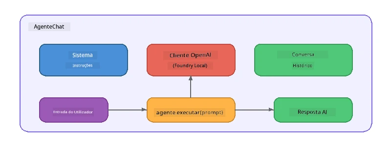

# Parte 5: Construir Agentes de IA com o Agent Framework

> **Objetivo:** Construir o seu primeiro agente de IA com instruções persistentes e uma persona definida, alimentado por um modelo local através do Foundry Local.

## O Que é um Agente de IA?

Um agente de IA envolve um modelo de linguagem com **instruções de sistema** que definem o seu comportamento, personalidade e restrições. Ao contrário de uma única chamada de conclusão de chat, um agente fornece:

- **Persona** - uma identidade consistente ("És um revisor de código útil")
- **Memória** - histórico de conversa ao longo das interações
- **Especialização** - comportamento focado, orientado por instruções bem elaboradas



---

## O Microsoft Agent Framework

O **Microsoft Agent Framework** (AGF) fornece uma abstração de agente padrão que funciona através de diferentes backends de modelo. Neste workshop combinamo-lo com o Foundry Local para que tudo corra na sua máquina - sem necessidade de nuvem.

| Conceito | Descrição |
|---------|-------------|
| `FoundryLocalClient` | Python: gere o arranque do serviço, download/carregamento de modelo, e cria agentes |
| `client.as_agent()` | Python: cria um agente a partir do cliente Foundry Local |
| `AsAIAgent()` | C#: método de extensão em `ChatClient` - cria um `AIAgent` |
| `instructions` | Prompt do sistema que define o comportamento do agente |
| `name` | Etiqueta legível, útil em cenários com múltiplos agentes |
| `agent.run(prompt)` / `RunAsync()` | Envia uma mensagem de utilizador e devolve a resposta do agente |

> **Nota:** O Agent Framework tem SDKs para Python e .NET. Para JavaScript, implementamos uma classe leve `ChatAgent` que replica o mesmo padrão usando diretamente o OpenAI SDK.

---

## Exercícios

### Exercício 1 - Compreender o Padrão de Agente

Antes de escrever código, estude os componentes-chave de um agente:

1. **Cliente de modelo** - liga-se à API compatível com OpenAI do Foundry Local
2. **Instruções de sistema** - o prompt da "personalidade"
3. **Loop de execução** - enviar entrada do utilizador, receber saída

> **Pense nisto:** Como diferem as instruções de sistema de uma mensagem normal do utilizador? O que acontece se as alterar?

---

### Exercício 2 - Execute o Exemplo de Agente Único

<details>
<summary><strong>🐍 Python</strong></summary>

**Pré-requisitos:**
```bash
cd python
python -m venv venv

# Windows (PowerShell):
venv\Scripts\Activate.ps1
# macOS:
source venv/bin/activate

pip install -r requirements.txt
```

**Executar:**
```bash
python foundry-local-with-agf.py
```

**Explicação do código** (`python/foundry-local-with-agf.py`):

```python
import asyncio
from agent_framework_foundry_local import FoundryLocalClient

async def main():
    alias = "phi-4-mini"

    # O FoundryLocalClient gere o arranque do serviço, descarregamento do modelo e carregamento
    client = FoundryLocalClient(model_id=alias)
    print(f"Client Model ID: {client.model_id}")

    # Criar um agente com instruções do sistema
    agent = client.as_agent(
        name="Joker",
        instructions="You are good at telling jokes.",
    )

    # Não streaming: obter a resposta completa de uma só vez
    result = await agent.run("Tell me a joke about a pirate.")
    print(f"Agent: {result}")

    # Streaming: obter resultados à medida que são gerados
    async for chunk in agent.run("Tell me another joke.", stream=True):
        if chunk.text:
            print(chunk.text, end="", flush=True)

asyncio.run(main())
```

**Pontos-chave:**
- `FoundryLocalClient(model_id=alias)` trata do arranque do serviço, download e carregamento do modelo numa só etapa
- `client.as_agent()` cria um agente com instruções do sistema e um nome
- `agent.run()` suporta os modos sem streaming e com streaming
- Instale com `pip install agent-framework-foundry-local --pre`

</details>

<details>
<summary><strong>📦 JavaScript</strong></summary>

**Pré-requisitos:**
```bash
cd javascript
npm install
```

**Executar:**
```bash
node foundry-local-with-agent.mjs
```

**Explicação do código** (`javascript/foundry-local-with-agent.mjs`):

```javascript
import { OpenAI } from "openai";
import { FoundryLocalManager } from "foundry-local-sdk";

class ChatAgent {
  constructor({ client, modelId, instructions, name }) {
    this.client = client;
    this.modelId = modelId;
    this.instructions = instructions;
    this.name = name;
    this.history = [];
  }

  async run(userMessage) {
    const messages = [
      { role: "system", content: this.instructions },
      ...this.history,
      { role: "user", content: userMessage },
    ];
    const response = await this.client.chat.completions.create({
      model: this.modelId,
      messages,
    });
    const assistantMessage = response.choices[0].message.content;

    // Manter o histórico da conversa para interações de múltiplas rondas
    this.history.push({ role: "user", content: userMessage });
    this.history.push({ role: "assistant", content: assistantMessage });
    return { text: assistantMessage };
  }
}

async function main() {
  FoundryLocalManager.create({ appName: "FoundryLocalWorkshop" });
  const manager = FoundryLocalManager.instance;
  await manager.startWebService();

  const catalog = manager.catalog;
  const model = await catalog.getModel("phi-3.5-mini");
  if (!model.isCached) {
    console.log("Downloading model: phi-3.5-mini...");
    await model.download();
  }
  await model.load();

  const client = new OpenAI({
    baseURL: manager.urls[0] + "/v1",
    apiKey: "foundry-local",
  });

  const agent = new ChatAgent({
    client,
    modelId: model.id,
    instructions: "You are good at telling jokes.",
    name: "Joker",
  });

  const result = await agent.run("Tell me a joke about a pirate.");
  console.log(result.text);
}

main();
```

**Pontos-chave:**
- JavaScript constrói a sua própria classe `ChatAgent` que espelha o padrão AGF do Python
- `this.history` armazena as interações da conversa para suporte a múltiplos turnos
- Método explícito `startWebService()` → verificação do cache → `model.download()` → `model.load()` dá visibilidade total

</details>

<details>
<summary><strong>💜 C#</strong></summary>

**Pré-requisitos:**
```bash
cd csharp
dotnet restore
```

**Executar:**
```bash
dotnet run agent
```

**Explicação do código** (`csharp/SingleAgent.cs`):

```csharp
using Microsoft.AI.Foundry.Local;
using Microsoft.Extensions.Logging.Abstractions;
using Microsoft.Agents.AI;
using OpenAI;
using System.ClientModel;

// 1. Start Foundry Local and load a model
var alias = "phi-3.5-mini";
await FoundryLocalManager.CreateAsync(
    new Configuration
    {
        AppName = "FoundryLocalSamples",
        Web = new Configuration.WebService { Urls = "http://127.0.0.1:0" }
    }, NullLogger.Instance, default);
var manager = FoundryLocalManager.Instance;
await manager.StartWebServiceAsync(default);

var catalog = await manager.GetCatalogAsync(default);
var model = await catalog.GetModelAsync(alias, default);

var isCached = await model.IsCachedAsync(default);
if (!isCached)
{
    Console.WriteLine($"Downloading model: {alias}...");
    await model.DownloadAsync(null, default);
}
await model.LoadAsync(default);

var key = new ApiKeyCredential("foundry-local");
var client = new OpenAIClient(key, new OpenAIClientOptions
{
    Endpoint = new Uri(manager.Urls[0] + "/v1")
});

// 2. Create an AIAgent using the Agent Framework extension method
AIAgent joker = client
    .GetChatClient(model.Id)
    .AsAIAgent(
        instructions: "You are good at telling jokes. Keep your jokes short and family-friendly.",
        name: "Joker"
    );

// 3. Run the agent (non-streaming)
var response = await joker.RunAsync("Tell me a joke about a pirate.");
Console.WriteLine($"Joker: {response}");

// 4. Run with streaming
await foreach (var update in joker.RunStreamingAsync("Tell me another joke."))
{
    Console.Write(update);
}
```

**Pontos-chave:**
- `AsAIAgent()` é um método de extensão do `Microsoft.Agents.AI.OpenAI` - não é necessária uma classe `ChatAgent` personalizada
- `RunAsync()` devolve a resposta completa; `RunStreamingAsync()` faz stream token a token
- Instale com `dotnet add package Microsoft.Agents.AI.OpenAI --version 1.0.0-rc3`

</details>

---

### Exercício 3 - Alterar a Persona

Modifique as `instructions` do agente para criar uma persona diferente. Experimente cada uma e observe como a saída muda:

| Persona | Instruções |
|---------|-------------|
| Revisor de Código | `"És um revisor de código especialista. Fornece feedback construtivo focado na legibilidade, desempenho e correção."` |
| Guia de Viagens | `"És um guia de viagens amigável. Dá recomendações personalizadas para destinos, atividades e gastronomia local."` |
| Tutor Socrático | `"És um tutor socrático. Nunca dás respostas diretas - em vez disso, orienta o aluno com perguntas ponderadas."` |
| Escritor Técnico | `"És um escritor técnico. Explica conceitos de forma clara e concisa. Usa exemplos. Evita jargão."` |

**Experimente:**
1. Escolha uma persona da tabela acima
2. Substitua a string `instructions` no código
3. Ajuste o prompt do utilizador para corresponder (ex. peça ao revisor de código para rever uma função)
4. Execute o exemplo novamente e compare a saída

> **Dica:** A qualidade de um agente depende muito das instruções. Instruções específicas e bem estruturadas produzem melhores resultados do que instruções vagas.

---

### Exercício 4 - Adicionar Conversa Multi-Turno

Estenda o exemplo para suportar um loop de chat multi-turno para que possa ter uma conversa de ida e volta com o agente.

<details>
<summary><strong>🐍 Python - loop multi-turno</strong></summary>

```python
import asyncio
from agent_framework_foundry_local import FoundryLocalClient

async def main():
    client = FoundryLocalClient(model_id="phi-4-mini")

    agent = client.as_agent(
        name="Assistant",
        instructions="You are a helpful assistant.",
    )

    print("Chat with the agent (type 'quit' to exit):\n")
    while True:
        user_input = input("You: ")
        if user_input.strip().lower() in ("quit", "exit"):
            break
        result = await agent.run(user_input)
        print(f"Agent: {result}\n")

asyncio.run(main())
```

</details>

<details>
<summary><strong>📦 JavaScript - loop multi-turno</strong></summary>

```javascript
import { OpenAI } from "openai";
import { FoundryLocalManager } from "foundry-local-sdk";
import * as readline from "node:readline/promises";

// (reutilizar a classe ChatAgent do Exercício 2)

async function main() {
  FoundryLocalManager.create({ appName: "FoundryLocalWorkshop" });
  const manager = FoundryLocalManager.instance;
  await manager.startWebService();

  const catalog = manager.catalog;
  const model = await catalog.getModel("phi-3.5-mini");
  if (!model.isCached) {
    console.log("Downloading model: phi-3.5-mini...");
    await model.download();
  }
  await model.load();

  const client = new OpenAI({
    baseURL: manager.urls[0] + "/v1",
    apiKey: "foundry-local",
  });

  const agent = new ChatAgent({
    client,
    modelId: model.id,
    instructions: "You are a helpful assistant.",
    name: "Assistant",
  });

  const rl = readline.createInterface({
    input: process.stdin,
    output: process.stdout,
  });

  console.log("Chat with the agent (type 'quit' to exit):\n");
  while (true) {
    const userInput = await rl.question("You: ");
    if (["quit", "exit"].includes(userInput.trim().toLowerCase())) break;
    const result = await agent.run(userInput);
    console.log(`Agent: ${result.text}\n`);
  }
  rl.close();
}

main();
```

</details>

<details>
<summary><strong>💜 C# - loop multi-turno</strong></summary>

```csharp
using Microsoft.AI.Foundry.Local;
using Microsoft.Extensions.Logging.Abstractions;
using Microsoft.Agents.AI;
using OpenAI;
using System.ClientModel;

var alias = "phi-3.5-mini";
var config = new Configuration
{
    AppName = "FoundryLocalSamples",
    Web = new Configuration.WebService { Urls = "http://127.0.0.1:0" }
};
await FoundryLocalManager.CreateAsync(config, NullLogger.Instance, default);
var manager = FoundryLocalManager.Instance;
await manager.StartWebServiceAsync(default);

var catalog = await manager.GetCatalogAsync(default);
var model = await catalog.GetModelAsync(alias, default);

var isCached = await model.IsCachedAsync(default);
if (!isCached)
{
    Console.WriteLine($"Downloading model: {alias}...");
    await model.DownloadAsync(null, default);
}
await model.LoadAsync(default);

var key = new ApiKeyCredential("foundry-local");
var client = new OpenAIClient(key, new OpenAIClientOptions
{
    Endpoint = new Uri(manager.Urls[0] + "/v1")
});

AIAgent agent = client
    .GetChatClient(model.Id)
    .AsAIAgent(
        instructions: "You are a helpful assistant.",
        name: "Assistant"
    );

Console.WriteLine("Chat with the agent (type 'quit' to exit):\n");
while (true)
{
    Console.Write("You: ");
    var userInput = Console.ReadLine();
    if (string.IsNullOrWhiteSpace(userInput) ||
        userInput.Equals("quit", StringComparison.OrdinalIgnoreCase) ||
        userInput.Equals("exit", StringComparison.OrdinalIgnoreCase))
        break;

    var result = await agent.RunAsync(userInput);
    Console.WriteLine($"Agent: {result}\n");
}
```

</details>

Repare como o agente se lembra dos turnos anteriores - faça uma pergunta complementar e veja o contexto ser mantido.

---

### Exercício 5 - Saída Estruturada

Instrua o agente para responder sempre num formato específico (ex. JSON) e analise o resultado:

<details>
<summary><strong>🐍 Python - saída JSON</strong></summary>

```python
import asyncio
import json
from agent_framework_foundry_local import FoundryLocalClient

async def main():
    client = FoundryLocalClient(model_id="phi-4-mini")

    agent = client.as_agent(
        name="SentimentAnalyzer",
        instructions=(
            "You are a sentiment analysis agent. "
            "For every user message, respond ONLY with valid JSON in this format: "
            '{"sentiment": "positive|negative|neutral", "confidence": 0.0-1.0, "summary": "brief reason"}'
        ),
    )

    result = await agent.run("I absolutely loved the new restaurant downtown!")
    print("Raw:", result)

    try:
        parsed = json.loads(str(result))
        print(f"Sentiment: {parsed['sentiment']} (confidence: {parsed['confidence']})")
    except json.JSONDecodeError:
        print("Agent did not return valid JSON - try refining the instructions.")

asyncio.run(main())
```

</details>

<details>
<summary><strong>💜 C# - saída JSON</strong></summary>

```csharp
using System.Text.Json;

AIAgent analyzer = chatClient.AsAIAgent(
    name: "SentimentAnalyzer",
    instructions:
        "You are a sentiment analysis agent. " +
        "For every user message, respond ONLY with valid JSON in this format: " +
        "{\"sentiment\": \"positive|negative|neutral\", \"confidence\": 0.0-1.0, \"summary\": \"brief reason\"}"
);

var response = await analyzer.RunAsync("I absolutely loved the new restaurant downtown!");
Console.WriteLine($"Raw: {response}");

try
{
    var parsed = JsonSerializer.Deserialize<JsonElement>(response.ToString());
    Console.WriteLine($"Sentiment: {parsed.GetProperty("sentiment")} " +
                      $"(confidence: {parsed.GetProperty("confidence")})");
}
catch (JsonException)
{
    Console.WriteLine("Agent did not return valid JSON - try refining the instructions.");
}
```

</details>

> **Nota:** Modelos locais pequenos podem nem sempre produzir JSON perfeitamente válido. Pode melhorar a fiabilidade incluindo um exemplo nas instruções e sendo muito explícito sobre o formato esperado.

---

## Principais Lições

| Conceito | O Que Aprendeu |
|---------|-----------------|
| Agente vs chamada LLM pura | Um agente envolve um modelo com instruções e memória |
| Instruções de sistema | A alavanca mais importante para controlar o comportamento do agente |
| Conversa multi-turno | Os agentes conseguem manter contexto através de múltiplas interações do utilizador |
| Saída estruturada | Instruções podem impor formatação da saída (JSON, markdown, etc.) |
| Execução local | Tudo corre no dispositivo via Foundry Local - sem nuvem necessária |

---

## Próximos Passos

Em **[Parte 6: Workflows Multi-Agente](part6-multi-agent-workflows.md)**, vai combinar múltiplos agentes numa pipeline coordenada onde cada agente tem um papel especializado.

---

<!-- CO-OP TRANSLATOR DISCLAIMER START -->
**Aviso Legal**:
Este documento foi traduzido utilizando o serviço de tradução automática [Co-op Translator](https://github.com/Azure/co-op-translator). Embora nos esforcemos por garantir a precisão, esteja ciente de que traduções automáticas podem conter erros ou imprecisões. O documento original na sua língua nativa deve ser considerado a fonte autoritativa. Para informações críticas, recomenda-se tradução profissional humana. Não nos responsabilizamos por quaisquer mal-entendidos ou interpretações erradas decorrentes do uso desta tradução.
<!-- CO-OP TRANSLATOR DISCLAIMER END -->