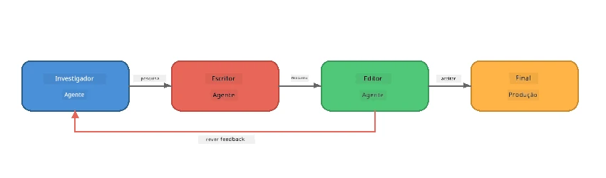
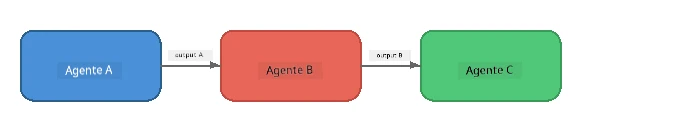
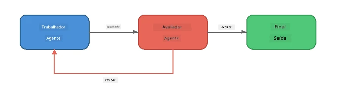
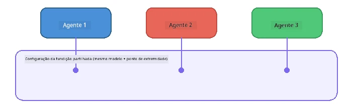

# Parte 6: Fluxos de Trabalho Multi-Agente

> **Objetivo:** Combinar múltiplos agentes especializados em pipelines coordenados que dividem tarefas complexas entre agentes colaboradores - todos a correr localmente com o Foundry Local.

## Porquê Multi-Agente?

Um único agente pode realizar muitas tarefas, mas fluxos de trabalho complexos beneficiam da **Especialização**. Em vez de um agente tentar pesquisar, escrever e editar simultaneamente, divide-se o trabalho em funções específicas:



| Padrão | Descrição |
|---------|-------------|
| **Sequencial** | A saída do Agente A alimenta o Agente B → Agente C |
| **Ciclo de feedback** | Um agente avaliador pode enviar trabalho de volta para revisão |
| **Contexto partilhado** | Todos os agentes usam o mesmo modelo/ponto final, mas com instruções diferentes |
| **Saída tipada** | Agentes produzem resultados estruturados (JSON) para passagens fiáveis |

---

## Exercícios

### Exercício 1 - Executar o Pipeline Multi-Agente

O workshop inclui um fluxo completo Investigador → Escritor → Editor.

<details>
<summary><strong>🐍 Python</strong></summary>

**Configuração:**
```bash
cd python
python -m venv venv

# Windows (PowerShell):
venv\Scripts\Activate.ps1
# macOS:
source venv/bin/activate

pip install -r requirements.txt
```

**Execução:**
```bash
python foundry-local-multi-agent.py
```

**O que acontece:**
1. O **Investigador** recebe um tópico e devolve factos em pontos-chave
2. O **Escritor** pega na investigação e escreve um post para o blog (3-4 parágrafos)
3. O **Editor** revê o artigo quanto à qualidade e devolve ACEITAR ou REVISAR

</details>

<details>
<summary><strong>📦 JavaScript</strong></summary>

**Configuração:**
```bash
cd javascript
npm install
```

**Execução:**
```bash
node foundry-local-multi-agent.mjs
```

**Mesmo pipeline em três etapas** - Investigador → Escritor → Editor.

</details>

<details>
<summary><strong>💜 C#</strong></summary>

**Configuração:**
```bash
cd csharp
dotnet restore
```

**Execução:**
```bash
dotnet run multi
```

**Mesmo pipeline em três etapas** - Investigador → Escritor → Editor.

</details>

---

### Exercício 2 - Anatomia do Pipeline

Estude como os agentes são definidos e conectados:

**1. Cliente de modelo partilhado**

Todos os agentes partilham o mesmo modelo Foundry Local:

```python
# Python - FoundryLocalClient trata de tudo
from agent_framework_foundry_local import FoundryLocalClient

client = FoundryLocalClient(model_id="phi-3.5-mini")
```

```javascript
// JavaScript - SDK OpenAI apontado para Foundry Local
const client = new OpenAI({
  baseURL: manager.urls[0] + "/v1",
  apiKey: "foundry-local",
});
```

```csharp
// C# - OpenAIClient pointed at Foundry Local
var key = new ApiKeyCredential("foundry-local");
var client = new OpenAIClient(key, new OpenAIClientOptions
{
    Endpoint = new Uri(manager.Urls[0] + "/v1")
});
var chatClient = client.GetChatClient(model.Id);
```

**2. instruções especializadas**

Cada agente tem uma persona distinta:

| Agente | Instruções (resumo) |
|-------|----------------------|
| Investigador | "Fornece factos-chave, estatísticas e contexto. Organiza como pontos-chave." |
| Escritor | "Escreve um post de blog envolvente (3-4 parágrafos) a partir das notas de investigação. Não inventar factos." |
| Editor | "Revisa a clareza, gramática e consistência factual. Veredito: ACEITAR ou REVISAR." |

**3. Fluxos de dados entre agentes**

```python
# Passo 1 - a saída do investigador torna-se a entrada do escritor
research_result = await researcher.run(f"Research: {topic}")

# Passo 2 - a saída do escritor torna-se a entrada do editor
writer_result = await writer.run(f"Write using:\n{research_result}")

# Passo 3 - o editor revê tanto a investigação como o artigo
editor_result = await editor.run(
    f"Research:\n{research_result}\n\nArticle:\n{writer_result}"
)
```

```csharp
// C# - same pattern, async calls with AIAgent
var researchNotes = await researcher.RunAsync(
    $"Research the following topic and provide key facts:\n{topic}");

var draft = await writer.RunAsync(
    $"Write a blog post based on these research notes:\n\n{researchNotes}");

var verdict = await editor.RunAsync(
    $"Review this article for quality and accuracy.\n\n" +
    $"Research notes:\n{researchNotes}\n\n" +
    $"Article:\n{draft}");
```

> **Ponto-chave:** Cada agente recebe o contexto cumulativo dos agentes anteriores. O editor vê tanto a investigação original como o rascunho - isto permite verificar a consistência factual.

---

### Exercício 3 - Adicionar um Quarto Agente

Estenda o pipeline adicionando um novo agente. Escolha um:

| Agente | Propósito | Instruções |
|-------|---------|-------------|
| **Verificador de Factos** | Verificar as afirmações no artigo | `"Verificas as afirmações factuais. Para cada afirmação, indica se está suportada pelas notas de investigação. Devolve JSON com itens verificados/não verificados."` |
| **Criador de Títulos** | Criar títulos apelativos | `"Gera 5 opções de títulos para o artigo. Varia o estilo: informativo, clickbait, pergunta, lista, emocional."` |
| **Redes Sociais** | Criar publicações promocionais | `"Cria 3 publicações para redes sociais promovendo este artigo: uma para Twitter (280 carateres), uma para LinkedIn (tom profissional), uma para Instagram (casual com sugestões de emojis)."` |

<details>
<summary><strong>🐍 Python - adicionar um Criador de Títulos</strong></summary>

```python
headline_agent = client.as_agent(
    name="HeadlineWriter",
    instructions=(
        "You are a headline specialist. Given an article, generate exactly "
        "5 headline options. Vary the style: informative, question-based, "
        "listicle, emotional, and provocative. Return them as a numbered list."
    ),
)

# Após a aceitação pelo editor, gerar títulos
headline_result = await headline_agent.run(
    f"Generate headlines for this article:\n\n{writer_result}"
)
print(f"\n--- Headlines ---\n{headline_result}")
```

</details>

<details>
<summary><strong>📦 JavaScript - adicionar um Criador de Títulos</strong></summary>

```javascript
const headlineAgent = new ChatAgent({
  client,
  modelId: modelInfo.id,
  instructions:
    "You are a headline specialist. Given an article, generate exactly " +
    "5 headline options. Vary the style: informative, question-based, " +
    "listicle, emotional, and provocative. Return them as a numbered list.",
  name: "HeadlineWriter",
});

const headlineResult = await headlineAgent.run(
  `Generate headlines for this article:\n\n${writerResult.text}`
);
console.log(`\n--- Headlines ---\n${headlineResult.text}`);
```

</details>

<details>
<summary><strong>💜 C# - adicionar um Criador de Títulos</strong></summary>

```csharp
AIAgent headlineAgent = chatClient.AsAIAgent(
    name: "HeadlineWriter",
    instructions:
        "You are a headline specialist. Given an article, generate exactly " +
        "5 headline options. Vary the style: informative, question-based, " +
        "listicle, emotional, and provocative. Return them as a numbered list."
);

// After the editor accepts, generate headlines
var headlines = await headlineAgent.RunAsync(
    $"Generate headlines for this article:\n\n{draft}");
Console.WriteLine($"\n--- Headlines ---\n{headlines}");
```

</details>

---

### Exercício 4 - Projete o Seu Próprio Fluxo de Trabalho

Projete um pipeline multi-agente para um domínio diferente. Eis algumas ideias:

| Domínio | Agentes | Fluxo |
|--------|--------|------|
| **Revisão de Código** | Analisador → Revisor → Sumariador | Analisa a estrutura do código → revê problemas → produz relatório sumário |
| **Suporte ao Cliente** | Classificador → Respondedor → QA | Classifica o pedido → redige resposta → verifica qualidade |
| **Educação** | Criador de Quiz → Simulador de Estudante → Avaliador | Gera quiz → simula respostas → avalia e explica |
| **Análise de Dados** | Interpretador → Analista → Relator | Interpreta pedido de dados → analisa padrões → escreve relatório |

**Passos:**
1. Defina 3+ agentes com `instruções` distintas
2. Decida o fluxo de dados - o que cada agente recebe e produz?
3. Implemente o pipeline usando os padrões dos Exercícios 1-3
4. Adicione um ciclo de feedback se um agente deve avaliar o trabalho de outro

---

## Padrões de Orquestração

Aqui estão padrões de orquestração que se aplicam a qualquer sistema multi-agente (explorados em detalhe em [Parte 7](part7-zava-creative-writer.md)):

### Pipeline Sequencial



Cada agente processa a saída do anterior. Simples e previsível.

### Ciclo de Feedback



Um agente avaliador pode desencadear reexecução de etapas anteriores. O Zava Writer usa isto: o editor pode enviar feedback de volta ao investigador e escritor.

### Contexto Partilhado



Todos os agentes partilham um único `foundry_config` para usarem o mesmo modelo e ponto final.

---

## Principais Conclusões

| Conceito | O Que Aprendeu |
|---------|-----------------|
| Especialização de Agentes | Cada agente executa bem uma tarefa com instruções focadas |
| Passagem de dados | A saída de um agente torna-se entrada para o seguinte |
| Ciclos de feedback | Um avaliador pode desencadear repetições para maior qualidade |
| Saída estruturada | Respostas formatadas em JSON permitem comunicação fiável entre agentes |
| Orquestração | Um coordenador gere a sequência do pipeline e o tratamento de erros |
| Padrões de produção | Aplicados em [Parte 7: Zava Creative Writer](part7-zava-creative-writer.md) |

---

## Próximos Passos

Continue para [Parte 7: Zava Creative Writer - Aplicação Final](part7-zava-creative-writer.md) para explorar uma aplicação multi-agente em estilo produção com 4 agentes especializados, saída em streaming, pesquisa de produtos e ciclos de feedback - disponível em Python, JavaScript e C#.

---

<!-- CO-OP TRANSLATOR DISCLAIMER START -->
**Aviso Legal**:  
Este documento foi traduzido utilizando o serviço de tradução automática [Co-op Translator](https://github.com/Azure/co-op-translator). Embora nos esforcemos pela precisão, por favor tenha em consideração que traduções automáticas podem conter erros ou imprecisões. O documento original, no seu idioma nativo, deve ser considerado a fonte autoritária. Para informações críticas, recomenda-se a tradução profissional humana. Não nos responsabilizamos por quaisquer mal-entendidos ou interpretações erradas decorrentes da utilização desta tradução.
<!-- CO-OP TRANSLATOR DISCLAIMER END -->