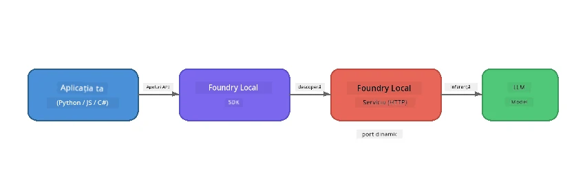

# Partea 1: Început cu Foundry Local


## Ce este Foundry Local?

[Foundry Local](https://foundrylocal.ai) îți permite să rulezi modele de limbaj AI open-source **direct pe calculatorul tău** - fără internet necesar, fără costuri în cloud și cu confidențialitate completă a datelor. Acesta:

- **Descarcă și rulează modelele local** cu optimizare automată pentru hardware (GPU, CPU sau NPU)
- **Oferă o API compatibilă cu OpenAI** pentru a putea folosi SDK-uri și instrumente familiare
- **Nu necesită abonament Azure** sau înregistrare - doar instalează și începe să construiești

Gândește-te la el ca la un AI privat care rulează complet pe mașina ta.

## Obiectivele de învățare

La finalul acestui laborator vei putea:

- Instala CLI-ul Foundry Local pe sistemul tău de operare
- Înțelege ce sunt aliasurile modelului și cum funcționează
- Descărca și rula primul tău model AI local
- Trimite un mesaj de chat către un model local din linia de comandă
- Înțelege diferența dintre modelele AI locale și cele găzduite în cloud

---

## Cerințe preliminare

### Cerințe de sistem

| Cerință | Minim | Recomandat |
|-------------|---------|-------------|
| **RAM** | 8 GB | 16 GB |
| **Spațiu pe disc** | 5 GB (pentru modele) | 10 GB |
| **CPU** | 4 nuclee | 8+ nuclee |
| **GPU** | Opțional | NVIDIA cu CUDA 11.8+ |
| **Sistem de operare** | Windows 10/11 (x64/ARM), Windows Server 2025, macOS 13+ | - |

> **Notă:** Foundry Local selectează automat cea mai bună variantă a modelului pentru hardware-ul tău. Dacă ai un GPU NVIDIA, folosește accelerarea CUDA. Dacă ai un NPU Qualcomm, îl folosește pe acela. Altfel, revine la o variantă optimizată pentru CPU.

### Instalează Foundry Local CLI

**Windows** (PowerShell):
```powershell
winget install Microsoft.FoundryLocal
```

**macOS** (Homebrew):
```bash
brew tap microsoft/foundrylocal
brew install foundrylocal
```

> **Notă:** Foundry Local suportă în prezent doar Windows și macOS. Linux nu este suportat momentan.

Verifică instalarea:
```bash
foundry --version
```

---

## Exerciții din laborator

### Exercițiul 1: Explorează modelele disponibile

Foundry Local include un catalog de modele open-source pre-optimizate. Listează-le:

```bash
foundry model list
```

Veți vedea modele precum:
- `phi-3.5-mini` - Modelul Microsoft cu 3.8 miliarde de parametri (rapid, calitate bună)
- `phi-4-mini` - Model Phi mai nou și mai capabil
- `phi-4-mini-reasoning` - Model Phi cu reasoning în lanț (`<think>` tag-uri)
- `phi-4` - Cel mai mare model Phi de la Microsoft (10.4 GB)
- `qwen2.5-0.5b` - Foarte mic și rapid (bun pentru dispozitive cu resurse limitate)
- `qwen2.5-7b` - Model puternic și general cu suport pentru apelare de unelte
- `qwen2.5-coder-7b` - Optimizat pentru generare de cod
- `deepseek-r1-7b` - Model puternic pentru raționament
- `gpt-oss-20b` - Model open-source mare (licență MIT, 12.5 GB)
- `whisper-base` - Transcriere vorbire-text (383 MB)
- `whisper-large-v3-turbo` - Transcriere cu acuratețe ridicată (9 GB)

> **Ce este un alias de model?** Aliasurile precum `phi-3.5-mini` sunt scurtături. Când folosești un alias, Foundry Local descarcă automat cea mai bună variantă pentru hardware-ul tău specific (CUDA pentru GPU NVIDIA, CPU optimizat în alte cazuri). Nu trebuie niciodată să-ți faci griji să alegi varianta potrivită.

### Exercițiul 2: Rulează primul tău model

Descarcă și începe o conversație cu un model interactiv:

```bash
foundry model run phi-3.5-mini
```

Prima dată când rulezi acest lucru, Foundry Local va:
1. Detecta hardware-ul tău
2. Descarca varianta optimă a modelului (poate dura câteva minute)
3. Încărca modelul în memorie
4. Porni o sesiune interactivă de chat

Încearcă să-i pui câteva întrebări:
```
You: What is the golden ratio?
You: Can you explain it as if I were 10 years old?
You: Write a haiku about mathematics
```

Tastează `exit` sau apasă `Ctrl+C` pentru a ieși.

### Exercițiul 3: Descarcă în avans un model

Dacă vrei să descarci un model fără să începi o conversație:

```bash
foundry model download phi-3.5-mini
```

Verifică ce modele sunt deja descărcate pe calculatorul tău:

```bash
foundry cache list
```

### Exercițiul 4: Înțelege arhitectura

Foundry Local rulează ca un **serviciu HTTP local** ce expune o API REST compatibilă cu OpenAI. Aceasta înseamnă:

1. Serviciul pornește pe un **port dinamic** (un port diferit de fiecare dată)
2. Folosești SDK-ul pentru a descoperi URL-ul endpoint-ului real
3. Poți folosi **orice** librărie client compatibilă OpenAI pentru a comunica cu el



> **Important:** Foundry Local atribuie un **port dinamic** de fiecare dată când pornește. Niciodată să nu fixezi în cod un număr de port precum `localhost:5272`. Folosește întotdeauna SDK-ul pentru a descoperi URL-ul curent (ex. `manager.endpoint` în Python sau `manager.urls[0]` în JavaScript).

---

## Puncte cheie

| Concept | Ce ai învățat |
|---------|------------------|
| AI pe dispozitiv | Foundry Local rulează modelele complet pe dispozitiv, fără cloud, chei API sau costuri |
| Aliasurile modelului | Aliasurile precum `phi-3.5-mini` selectează automat cea mai bună variantă pentru hardware |
| Porturi dinamice | Serviciul rulează pe un port dinamic; folosește SDK-ul pentru a descoperi endpoint-ul |
| CLI și SDK | Poți interacționa cu modelele prin CLI (`foundry model run`) sau programatic prin SDK |

---

## Pașii următori

Continuă cu [Partea 2: Explorare aprofundată a SDK-ului Foundry Local](part2-foundry-local-sdk.md) pentru a stăpâni API-ul SDK pentru gestionarea modelelor, serviciilor și caching programatic.