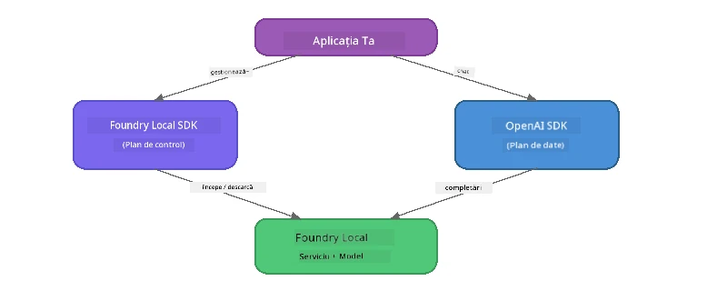

# Partea 3: Utilizarea Foundry Local SDK cu OpenAI

## Prezentare generală

În Partea 1 ai folosit CLI-ul Foundry Local pentru a rula modele interactiv. În Partea 2 ai explorat întreaga suprafață API a SDK-ului. Acum vei învăța să **integrezi Foundry Local în aplicațiile tale** folosind SDK-ul și API-ul compatibil OpenAI.

Foundry Local oferă SDK-uri pentru trei limbaje. Alege-l pe cel cu care ești cel mai confortabil - conceptele sunt identice în toate trei.

## Obiective de învățare

La sfârșitul acestui laborator vei putea:

- Instala SDK-ul Foundry Local pentru limbajul tău (Python, JavaScript sau C#)
- Inițializa `FoundryLocalManager` pentru a porni serviciul, verifica cache-ul, descărca și încărca un model
- Conecta la modelul local folosind SDK-ul OpenAI
- Trimite completări de chat și gestiona răspunsurile în streaming
- Înțelege arhitectura porturilor dinamice

---

## Cerințe preliminare

Finalizează mai întâi [Partea 1: Începerea cu Foundry Local](part1-getting-started.md) și [Partea 2: Explorarea aprofundată a Foundry Local SDK](part2-foundry-local-sdk.md).

Instalează **unul** dintre următoarele runtime-uri pentru limbaje:
- **Python 3.9+** - [python.org/downloads](https://www.python.org/downloads/)
- **Node.js 18+** - [nodejs.org](https://nodejs.org/)
- **.NET 9.0+** - [dot.net/download](https://dotnet.microsoft.com/download)

---

## Concept: Cum funcționează SDK-ul

Foundry Local SDK gestionează **planul de control** (pornirea serviciului, descărcarea modelelor), în timp ce SDK-ul OpenAI se ocupă de **planul de date** (trimiterea prompturilor, primirea completărilor).



---

## Exerciții de laborator

### Exercițiul 1: Configurarea mediului tău

<details>
<summary><b>🐍 Python</b></summary>

```bash
cd python
python -m venv venv

# Activează mediul virtual:
# Windows (PowerShell):
venv\Scripts\Activate.ps1
# Windows (Command Prompt):
venv\Scripts\activate.bat
# macOS:
source venv/bin/activate

pip install -r requirements.txt
```

Fișierul `requirements.txt` instalează:
- `foundry-local-sdk` - SDK-ul Foundry Local (importat ca `foundry_local`)
- `openai` - SDK-ul OpenAI pentru Python
- `agent-framework` - Microsoft Agent Framework (folosit în părțile următoare)

</details>

<details>
<summary><b>📘 JavaScript</b></summary>

```bash
cd javascript
npm install
```

Fișierul `package.json` instalează:
- `foundry-local-sdk` - SDK-ul Foundry Local
- `openai` - SDK-ul OpenAI pentru Node.js

</details>

<details>
<summary><b>💜 C#</b></summary>

```bash
cd csharp
dotnet restore
dotnet build
```

Fișierul `csharp.csproj` folosește:
- `Microsoft.AI.Foundry.Local` - SDK-ul Foundry Local (NuGet)
- `OpenAI` - SDK-ul OpenAI pentru C# (NuGet)

> **Structura proiectului:** Proiectul C# folosește un router CLI în `Program.cs` care direcționează către fișiere de exemplu separate. Rulează `dotnet run chat` (sau doar `dotnet run`) pentru această parte. Alte părți folosesc `dotnet run rag`, `dotnet run agent` și `dotnet run multi`.

</details>

---

### Exercițiul 2: Completarea de chat de bază

Deschide exemplul de bază pentru chat pentru limbajul tău și examinează codul. Fiecare script urmează același tipar în trei pași:

1. **Pornește serviciul** - `FoundryLocalManager` pornește runtime-ul Foundry Local
2. **Descarcă și încarcă modelul** - verifică cache-ul, descarcă dacă este nevoie, apoi încarcă în memorie
3. **Creează un client OpenAI** - conectează la endpointul local și trimite o completare de chat în streaming

<details>
<summary><b>🐍 Python - <code>python/foundry-local.py</code></b></summary>

```python
import sys
import openai
from foundry_local import FoundryLocalManager

alias = "phi-3.5-mini"

# Pasul 1: Creează un FoundryLocalManager și pornește serviciul
print("Starting Foundry Local service...")
manager = FoundryLocalManager()
manager.start_service()

# Pasul 2: Verifică dacă modelul este deja descărcat
cached = manager.list_cached_models()
catalog_info = manager.get_model_info(alias)
is_cached = any(m.id == catalog_info.id for m in cached) if catalog_info else False

if is_cached:
    print(f"Model already downloaded: {alias}")
else:
    print(f"Downloading model: {alias} (this may take several minutes)...")
    manager.download_model(alias)
    print(f"Download complete: {alias}")

# Pasul 3: Încarcă modelul în memorie
print(f"Loading model: {alias}...")
manager.load_model(alias)

# Creează un client OpenAI care să pointeze către serviciul LOCAL Foundry
client = openai.OpenAI(
    base_url=manager.endpoint,   # Port dinamic - niciodată să nu fie scris fix!
    api_key=manager.api_key
)

# Generează o completare pentru chat în streaming
stream = client.chat.completions.create(
    model=manager.get_model_info(alias).id,
    messages=[{"role": "user", "content": "What is the golden ratio?"}],
    stream=True,
)

for chunk in stream:
    if chunk.choices[0].delta.content is not None:
        print(chunk.choices[0].delta.content, end="", flush=True)
print()
```

**Rulează-l:**
```bash
python foundry-local.py
```

</details>

<details>
<summary><b>📘 JavaScript - <code>javascript/foundry-local.mjs</code></b></summary>

```javascript
import { OpenAI } from "openai";
import { FoundryLocalManager } from "foundry-local-sdk";

const alias = "phi-3.5-mini";

// Pasul 1: Pornește serviciul Foundry Local
console.log("Starting Foundry Local service...");
FoundryLocalManager.create({ appName: "FoundryLocalWorkshop" });
const manager = FoundryLocalManager.instance;
await manager.startWebService();

// Pasul 2: Verifică dacă modelul este deja descărcat
const catalog = manager.catalog;
const model = await catalog.getModel(alias);

if (model.isCached) {
  console.log(`Model already downloaded: ${alias}`);
} else {
  console.log(`Downloading model: ${alias} (this may take several minutes)...`);
  await model.download();
  console.log(`Download complete: ${alias}`);
}

// Pasul 3: Încarcă modelul în memorie
console.log(`Loading model: ${alias}...`);
await model.load();
console.log(`Model loaded: ${model.id}`);

// Creează un client OpenAI care indică către serviciul Foundry LOCAL
const client = new OpenAI({
  baseURL: manager.urls[0] + "/v1",   // Port dinamic - nu folosi niciodată un port fix!
  apiKey: "foundry-local",
});

// Generează o completare de chat prin streaming
const stream = await client.chat.completions.create({
  model: model.id,
  messages: [{ role: "user", content: "What is the golden ratio?" }],
  stream: true,
});

for await (const chunk of stream) {
  if (chunk.choices[0]?.delta?.content) {
    process.stdout.write(chunk.choices[0].delta.content);
  }
}
console.log();
```

**Rulează-l:**
```bash
node foundry-local.mjs
```

</details>

<details>
<summary><b>💜 C# - <code>csharp/BasicChat.cs</code></b></summary>

```csharp
using Microsoft.AI.Foundry.Local;
using Microsoft.Extensions.Logging.Abstractions;
using OpenAI;
using OpenAI.Chat;
using System.ClientModel;

var alias = "phi-3.5-mini";

// Step 1: Start the Foundry Local service
Console.WriteLine("Starting Foundry Local service...");
await FoundryLocalManager.CreateAsync(
    new Configuration
    {
        AppName = "FoundryLocalSamples",
        Web = new Configuration.WebService { Urls = "http://127.0.0.1:0" }
    }, NullLogger.Instance, default);
var manager = FoundryLocalManager.Instance;
await manager.StartWebServiceAsync(default);

// Step 2: Get the model from the catalog
var catalog = await manager.GetCatalogAsync(default);
var model = await catalog.GetModelAsync(alias, default);

// Step 3: Check if the model is already downloaded
var isCached = await model.IsCachedAsync(default);

if (isCached)
{
    Console.WriteLine($"Model already downloaded: {alias}");
}
else
{
    Console.WriteLine($"Downloading model: {alias} (this may take several minutes)...");
    await model.DownloadAsync(null, default);
    Console.WriteLine($"Download complete: {alias}");
}

// Step 4: Load the model into memory
Console.WriteLine($"Loading model: {alias}...");
await model.LoadAsync(default);
Console.WriteLine($"Loaded model: {model.Id}");
Console.WriteLine($"Endpoint: {manager.Urls[0]}");

// Create OpenAI client pointing to the LOCAL Foundry service
var key = new ApiKeyCredential("foundry-local");
var client = new OpenAIClient(key, new OpenAIClientOptions
{
    Endpoint = new Uri(manager.Urls[0] + "/v1")  // Dynamic port - never hardcode!
});

var chatClient = client.GetChatClient(model.Id);

// Stream a chat completion
var completionUpdates = chatClient.CompleteChatStreaming("What is the golden ratio?");

foreach (var update in completionUpdates)
{
    if (update.ContentUpdate.Count > 0)
    {
        Console.Write(update.ContentUpdate[0].Text);
    }
}
Console.WriteLine();
```

**Rulează-l:**
```bash
dotnet run chat
```

</details>

---

### Exercițiul 3: Experimentează cu prompturi

Odată ce exemplul tău de bază rulează, încearcă să modifici codul:

1. **Schimbă mesajul utilizatorului** - încearcă întrebări diferite
2. **Adaugă un prompt de sistem** - dă modelului o personalitate
3. **Dezactivează streamingul** - setează `stream=False` și afișează răspunsul complet odată
4. **Încearcă un model diferit** - schimbă aliasul de la `phi-3.5-mini` la un alt model din `foundry model list`

<details>
<summary><b>🐍 Python</b></summary>

```python
# Adaugă un prompt de sistem - oferă modelului o personalitate:
stream = client.chat.completions.create(
    model=manager.get_model_info(alias).id,
    messages=[
        {"role": "system", "content": "You are a pirate. Answer everything in pirate speak."},
        {"role": "user", "content": "What is the golden ratio?"}
    ],
    stream=True,
)

# Sau dezactivează streaming-ul:
response = client.chat.completions.create(
    model=manager.get_model_info(alias).id,
    messages=[{"role": "user", "content": "What is the golden ratio?"}],
    stream=False,
)
print(response.choices[0].message.content)
```

</details>

<details>
<summary><b>📘 JavaScript</b></summary>

```javascript
// Adaugă o solicitare de sistem - oferă modelului o persoană:
const stream = await client.chat.completions.create({
  model: modelInfo.id,
  messages: [
    { role: "system", content: "You are a pirate. Answer everything in pirate speak." },
    { role: "user", content: "What is the golden ratio?" },
  ],
  stream: true,
});

// Sau dezactivează streamingul:
const response = await client.chat.completions.create({
  model: modelInfo.id,
  messages: [{ role: "user", content: "What is the golden ratio?" }],
  stream: false,
});
console.log(response.choices[0].message.content);
```

</details>

<details>
<summary><b>💜 C#</b></summary>

```csharp
// Add a system prompt - give the model a persona:
var completionUpdates = chatClient.CompleteChatStreaming(
    new ChatMessage[]
    {
        new SystemChatMessage("You are a pirate. Answer everything in pirate speak."),
        new UserChatMessage("What is the golden ratio?")
    }
);

// Or turn off streaming:
var response = chatClient.CompleteChat("What is the golden ratio?");
Console.WriteLine(response.Value.Content[0].Text);
```

</details>

---

### Referință metode SDK

<details>
<summary><b>🐍 Metode SDK Python</b></summary>

| Metodă | Scop |
|--------|------|
| `FoundryLocalManager()` | Creează o instanță a managerului |
| `manager.start_service()` | Pornește serviciul Foundry Local |
| `manager.list_cached_models()` | Listează modelele descărcate pe dispozitivul tău |
| `manager.get_model_info(alias)` | Obține ID-ul modelului și metadata |
| `manager.download_model(alias, progress_callback=fn)` | Descarcă un model cu callback opțional pentru progres |
| `manager.load_model(alias)` | Încarcă un model în memorie |
| `manager.endpoint` | Obține URL-ul endpointului dinamic |
| `manager.api_key` | Obține cheia API (placeholder pentru local) |

</details>

<details>
<summary><b>📘 Metode SDK JavaScript</b></summary>

| Metodă | Scop |
|--------|------|
| `FoundryLocalManager.create({ appName })` | Creează o instanță a managerului |
| `FoundryLocalManager.instance` | Accesează instanța singleton a managerului |
| `await manager.startWebService()` | Pornește serviciul Foundry Local |
| `await manager.catalog.getModel(alias)` | Obține un model din catalog |
| `model.isCached` | Verifică dacă modelul este deja descărcat |
| `await model.download()` | Descarcă un model |
| `await model.load()` | Încarcă un model în memorie |
| `model.id` | Obține ID-ul modelului pentru apelurile API OpenAI |
| `manager.urls[0] + "/v1"` | Obține URL-ul endpointului dinamic |
| `"foundry-local"` | Cheia API (placeholder pentru local) |

</details>

<details>
<summary><b>💜 Metode SDK C#</b></summary>

| Metodă | Scop |
|--------|------|
| `FoundryLocalManager.CreateAsync(config)` | Creează și inițializează managerul |
| `manager.StartWebServiceAsync()` | Pornește serviciul web Foundry Local |
| `manager.GetCatalogAsync()` | Obține catalogul de modele |
| `catalog.ListModelsAsync()` | Listează toate modelele disponibile |
| `catalog.GetModelAsync(alias)` | Obține un model specific după alias |
| `model.IsCachedAsync()` | Verifică dacă modelul este descărcat |
| `model.DownloadAsync()` | Descarcă un model |
| `model.LoadAsync()` | Încarcă un model în memorie |
| `manager.Urls[0]` | Obține URL-ul endpointului dinamic |
| `new ApiKeyCredential("foundry-local")` | Cheia API pentru local |

</details>

---

### Exercițiul 4: Folosirea ChatClient nativ (alternativ la SDK-ul OpenAI)

În exercițiile 2 și 3 ai folosit SDK-ul OpenAI pentru completări de chat. SDK-urile JavaScript și C# oferă și un **ChatClient nativ** care elimină complet nevoia SDK-ului OpenAI.

<details>
<summary><b>📘 JavaScript - <code>model.createChatClient()</code></b></summary>

```javascript
import { FoundryLocalManager } from "foundry-local-sdk";

const alias = "phi-3.5-mini";

FoundryLocalManager.create({ appName: "ChatClientDemo" });
const manager = FoundryLocalManager.instance;
await manager.startWebService();

const model = await manager.catalog.getModel(alias);
if (!model.isCached) await model.download();
await model.load();

// Nu este necesară importarea OpenAI — obține un client direct de la model
const chatClient = model.createChatClient();

// Completare fără streaming
const response = await chatClient.completeChat([
  { role: "system", content: "You are a pirate. Answer everything in pirate speak." },
  { role: "user", content: "What is the golden ratio?" }
]);
console.log(response.choices[0].message.content);

// Completare cu streaming (folosește un model de tip callback)
await chatClient.completeStreamingChat(
  [{ role: "user", content: "What is the golden ratio?" }],
  (chunk) => {
    if (chunk.choices?.[0]?.delta?.content) {
      process.stdout.write(chunk.choices[0].delta.content);
    }
  }
);
console.log();
```

> **Notă:** Metoda `completeStreamingChat()` a ChatClient folosește un **pattern callback**, nu un iterator async. Trebuie să transmiți o funcție ca al doilea argument.

</details>

<details>
<summary><b>💜 C# - <code>model.GetChatClientAsync()</code></b></summary>

```csharp
var catalog = await manager.GetCatalogAsync(default);
var model = await catalog.GetModelAsync("phi-3.5-mini", default);
if (!await model.IsCachedAsync(default))
    await model.DownloadAsync(null, default);
await model.LoadAsync(default);

// No OpenAI NuGet needed — get a client directly from the model
var chatClient = await model.GetChatClientAsync(default);

// Use it like a standard OpenAI ChatClient
var response = chatClient.CompleteChat("What is the golden ratio?");
Console.WriteLine(response.Value.Content[0].Text);
```

</details>

> **Când să folosești care:**
> | Abordare | Cel mai potrivit pentru |
> |----------|------------------------|
> | SDK OpenAI | Control complet al parametrilor, aplicații de producție, cod existent OpenAI |
> | ChatClient nativ | Prototipuri rapide, mai puține dependențe, configurare mai simplă |

---

## Puncte importante de reținut

| Concept | Ce ai învățat |
|---------|---------------|
| Plan de control | Foundry Local SDK gestionează pornirea serviciului și încărcarea modelelor |
| Plan de date | SDK-ul OpenAI gestionează completările de chat și streamingul |
| Porturi dinamice | Folosește întotdeauna SDK-ul pentru descoperirea endpointului; nu folosi URL-uri hardcodate |
| Multilingvistic | Același tipar de cod funcționează în Python, JavaScript și C# |
| Compatibilitate OpenAI | Compatibilitatea completă cu API-ul OpenAI înseamnă că codul existent OpenAI funcționează cu modificări minime |
| ChatClient nativ | `createChatClient()` (JS) / `GetChatClientAsync()` (C#) oferă o alternativă la SDK-ul OpenAI |

---

## Pașii următori

Continuă cu [Partea 4: Construirea unei aplicații RAG](part4-rag-fundamentals.md) pentru a învăța cum să construiești un pipeline Retrieval-Augmented Generation care rulează complet pe dispozitivul tău.