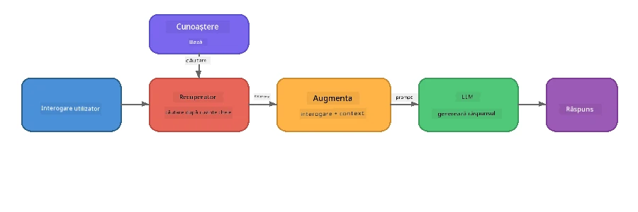

# Partea 4: Construirea unei Aplicații RAG cu Foundry Local

## Prezentare generală

Modelele mari de limbaj sunt puternice, dar cunosc doar ceea ce se află în datele lor de antrenament. **Generarea augmentată prin recuperare (RAG)** rezolvă acest lucru prin oferirea modelului unui context relevant în momentul interogării - extras din propriile tale documente, baze de date sau baze de cunoștințe.

În acest laborator vei construi un pipeline RAG complet care rulează **întregul pe dispozitivul tău** folosind Foundry Local. Fără servicii în cloud, fără baze de date vectoriale, fără API-uri pentru embeddings - doar recuperare locală și un model local.

## Obiective de învățare

La finalul acestui laborator vei putea să:

- Explici ce este RAG și de ce contează pentru aplicațiile AI
- Construiești o bază de cunoștințe locală din documente text
- Implementezi o funcție simplă de recuperare pentru a găsi context relevant
- Composezi un system prompt care ancorează modelul pe faptele recuperate
- Rulezi pipeline-ul complet Retrieve → Augment → Generate pe dispozitiv
- Înțelegi compromisurile dintre recuperarea prin cuvinte-cheie simple și căutarea vectorială

---

## Precondiții

- Finalizează [Partea 3: Folosind Foundry Local SDK cu OpenAI](part3-sdk-and-apis.md)
- Instalează Foundry Local CLI și descarcă modelul `phi-3.5-mini`

---

## Concept: Ce este RAG?

Fără RAG, un LLM poate răspunde doar din datele sale de antrenament - care pot fi depășite, incomplete sau să nu conțină informațiile tale private:

```
User: "What is Zava's return policy?"
LLM:  "I do not have information about Zava's return policy."  ← No context!
```

Cu RAG, **recuperezi** documentele relevante mai întâi, apoi **augmentați** promptul cu acel context înainte de a **genera** un răspuns:



Ideea-cheie: **modelul nu trebuie să "știe" răspunsul; trebuie doar să citească documentele corecte.**

---

## Exerciții de laborator

### Exercițiul 1: Înțelege baza de cunoștințe

Deschide exemplul RAG pentru limbajul tău și examinează baza de cunoștințe:

<details>
<summary><b>🐍 Python: <code>python/foundry-local-rag.py</code></b></summary>

Baza de cunoștințe este o listă simplă de dicționare cu câmpurile `title` și `content`:

```python
KNOWLEDGE_BASE = [
    {
        "title": "Foundry Local Overview",
        "content": (
            "Foundry Local brings the power of Azure AI Foundry to your local "
            "device without requiring an Azure subscription..."
        ),
    },
    {
        "title": "Supported Hardware",
        "content": (
            "Foundry Local automatically selects the best model variant for "
            "your hardware. If you have an Nvidia CUDA GPU it downloads the "
            "CUDA-optimized model..."
        ),
    },
    # ... mai multe intrări
]
```

Fiecare element reprezintă o "bucată" de cunoștințe - o informație concentrată pe un singur subiect.

</details>

<details>
<summary><b>📘 JavaScript: <code>javascript/foundry-local-rag.mjs</code></b></summary>

Baza de cunoștințe folosește aceeași structură ca un array de obiecte:

```javascript
const KNOWLEDGE_BASE = [
  {
    title: "Foundry Local Overview",
    content:
      "Foundry Local brings the power of Azure AI Foundry to your local " +
      "device without requiring an Azure subscription...",
  },
  {
    title: "Supported Hardware",
    content:
      "Foundry Local automatically selects the best model variant for " +
      "your hardware...",
  },
  // ... mai multe intrări
];
```

</details>

<details>
<summary><b>💜 C#: <code>csharp/RagPipeline.cs</code></b></summary>

Baza de cunoștințe folosește o listă de tuple denumite:

```csharp
private static readonly List<(string Title, string Content)> KnowledgeBase =
[
    ("Foundry Local Overview",
     "Foundry Local brings the power of Azure AI Foundry to your local " +
     "device without requiring an Azure subscription..."),

    ("Supported Hardware",
     "Foundry Local automatically selects the best model variant for " +
     "your hardware..."),

    // ... more entries
];
```

</details>

> **Într-o aplicație reală**, baza de cunoștințe ar veni din fișiere de pe disc, o bază de date, un index de căutare sau un API. Pentru acest laborator, folosim o listă în memorie pentru simplitate.

---

### Exercițiul 2: Înțelege funcția de recuperare

Pasul de recuperare găsește cele mai relevante bucăți pentru întrebarea utilizatorului. Acest exemplu folosește **suprapunerea de cuvinte-cheie** - numărând câte cuvinte din interogare apar și în fiecare bucată:

<details>
<summary><b>🐍 Python</b></summary>

```python
def retrieve(query: str, top_k: int = 2) -> list[dict]:
    """Return the top-k knowledge chunks most relevant to the query."""
    query_words = set(query.lower().split())
    scored = []
    for chunk in KNOWLEDGE_BASE:
        chunk_words = set(chunk["content"].lower().split())
        overlap = len(query_words & chunk_words)
        scored.append((overlap, chunk))
    scored.sort(key=lambda x: x[0], reverse=True)
    return [item[1] for item in scored[:top_k]]
```

</details>

<details>
<summary><b>📘 JavaScript</b></summary>

```javascript
function retrieve(query, topK = 2) {
  const queryWords = new Set(query.toLowerCase().split(/\s+/));
  const scored = KNOWLEDGE_BASE.map((chunk) => {
    const chunkWords = new Set(chunk.content.toLowerCase().split(/\s+/));
    let overlap = 0;
    for (const w of queryWords) {
      if (chunkWords.has(w)) overlap++;
    }
    return { overlap, chunk };
  });
  scored.sort((a, b) => b.overlap - a.overlap);
  return scored.slice(0, topK).map((s) => s.chunk);
}
```

</details>

<details>
<summary><b>💜 C#</b></summary>

```csharp
private static List<(string Title, string Content)> Retrieve(string query, int topK = 2)
{
    var queryWords = new HashSet<string>(
        query.ToLowerInvariant().Split(' ', StringSplitOptions.RemoveEmptyEntries));

    return KnowledgeBase
        .Select(chunk =>
        {
            var chunkWords = new HashSet<string>(
                chunk.Content.ToLowerInvariant().Split(' ', StringSplitOptions.RemoveEmptyEntries));
            var overlap = queryWords.Intersect(chunkWords).Count();
            return (Overlap: overlap, Chunk: chunk);
        })
        .OrderByDescending(x => x.Overlap)
        .Take(topK)
        .Select(x => x.Chunk)
        .ToList();
}
```

</details>

**Cum funcționează:**
1. Împarte interogarea în cuvinte individuale
2. Pentru fiecare bucată de cunoștințe, numără câte cuvinte din interogare apar în acea bucată
3. Sortează după scorul de suprapunere (de la cel mai mare)
4. Returnează primele k bucăți cele mai relevante

> **Compromis:** Suprapunerea cuvinte-cheie este simplă, dar limitată; nu înțelege sinonimele sau înțelesul. Sistemele RAG din producție folosesc de obicei **vectori de embeddings** și o **bază de date vectorială** pentru căutare semantică. Totuși, suprapunerea cuvintelor-cheie este un punct de plecare excelent și nu necesită dependențe suplimentare.

---

### Exercițiul 3: Înțelege promptul augmentat

Contextul recuperat este injectat în **system prompt** înainte de a fi trimis modelului:

```python
system_prompt = (
    "You are a helpful assistant. Answer the user's question using ONLY "
    "the information provided in the context below. If the context does "
    "not contain enough information, say so.\n\n"
    f"Context:\n{context_text}"
)
```

Decizii cheie de design:
- **"NUMAI informațiile furnizate"** - previne ca modelul să genereze fapte halucinante care nu sunt în context
- **"Dacă contextul nu conține suficiente informații, spune asta"** - încurajează răspunsuri oneste de tip "Nu știu"
- Contextul este plasat în mesajul de sistem astfel încât să influențeze toate răspunsurile

---

### Exercițiul 4: Rulează pipeline-ul RAG

Rulează exemplul complet:

**Python:**
```bash
cd python
python foundry-local-rag.py
```

**JavaScript:**
```bash
cd javascript
node foundry-local-rag.mjs
```

**C#:**
```bash
cd csharp
dotnet run rag
```

Ar trebui să vezi tipărite trei lucruri:
1. **Întrebarea** pusă
2. **Contextul recuperat** - bucățile selectate din baza de cunoștințe
3. **Răspunsul** - generat de model folosind doar acel context

Exemplu de ieșire:
```
Question: How do I install Foundry Local and what hardware does it support?

--- Retrieved Context ---
### Installation
On Windows install Foundry Local with: winget install Microsoft.FoundryLocal...

### Supported Hardware
Foundry Local automatically selects the best model variant for your hardware...
-------------------------

Answer: To install Foundry Local, you can use the following methods depending
on your operating system: On Windows, run `winget install Microsoft.FoundryLocal`.
On macOS, use `brew install microsoft/foundrylocal/foundrylocal`...
```

Observă cum răspunsul modelului este **încărcat** în contextul recuperat - menționează doar fapte din documentele bazei de cunoștințe.

---

### Exercițiul 5: Experimentează și extinde

Încearcă aceste modificări pentru a-ți adânci înțelegerea:

1. **Schimbă întrebarea** - întreabă ceva care ESTE în baza de cunoștințe versus ceva care NU ESTE:
   ```python
   question = "What programming languages does Foundry Local support?"  # ← În context
   question = "How much does Foundry Local cost?"                       # ← Nu este în context
   ```
   Modelul spune corect "Nu știu" când răspunsul nu este în context?

2. **Adaugă o nouă bucată de cunoștințe** - adaugă o nouă intrare în `KNOWLEDGE_BASE`:
   ```python
   {
       "title": "Pricing",
       "content": "Foundry Local is completely free and open source under the MIT license.",
   }
   ```
   Acum întreabă din nou despre prețuri.

3. **Schimbă `top_k`** - recuperează mai multe sau mai puține bucăți:
   ```python
   context_chunks = retrieve(question, top_k=3)  # Mai mult context
   context_chunks = retrieve(question, top_k=1)  # Mai puțin context
   ```
   Cum afectează cantitatea de context calitatea răspunsului?

4. **Elimină instrucțiunea de ancorare** - schimbă promptul de sistem doar cu "Ești un asistent amabil." și vezi dacă modelul începe să halucineze fapte.

---

## Analiză detaliată: Optimizarea RAG pentru performanță pe dispozitiv

Rularea RAG pe dispozitiv introduce constrângeri cu care nu te confrunți în cloud: RAM limitat, fără GPU dedicat (execuție CPU/NPU), și o fereastră mică de context a modelului. Deciziile de design de mai jos abordează direct aceste constrângeri și se bazează pe modelele aplicațiilor RAG locale din producție construite cu Foundry Local.

### Strategia de chunking: fereastră glisantă de dimensiune fixă

Chunking-ul - modul în care împarți documentele în bucăți - este una dintre cele mai importante decizii într-un sistem RAG. Pentru scenarii pe dispozitiv, o **fereastră glisantă de dimensiune fixă cu suprapunere** este punctul de plecare recomandat:

| Parametru | Valoare recomandată | De ce |
|-----------|--------------------|-------|
| **Dimensiune chunk** | ~200 tokeni | Păstrează contextul recuperat compact, lăsând loc în fereastra de context a Phi-3.5 Mini pentru promptul de sistem, istoria conversației și output-ul generat |
| **Suprapunere** | ~25 tokeni (12.5%) | Previne pierderea de informații la marginile bucăților - important pentru proceduri și instrucțiuni pas cu pas |
| **Tokenizare** | Împărțire după spații | Zero dependențe, nu este necesară o librărie de tokenizare. Tot bugetul de calcul merge către LLM |

Suprapunerea funcționează ca o fereastră glisantă: fiecare bucată nouă începe cu 25 de tokeni înainte de sfârșitul celei anterioare, astfel propozițiile care traversează granițele apar în ambele bucăți.

> **De ce nu alte strategii?**
> - **Împărțirea pe propoziții** produce dimensiuni imprevizibile ale chunk-urilor; unele proceduri de siguranță sunt propoziții lungi care nu s-ar împărți bine
> - **Împărțirea pe secțiuni** (pe heading-uri `##`) creează dimensiuni foarte diferite ale chunk-urilor - unele prea mici, altele prea mari pentru fereastra de context a modelului
> - **Chunking semantic** (detectarea topicurilor bazată pe embeddings) oferă cea mai bună calitate a recuperării, dar necesită un al doilea model în memorie alături de Phi-3.5 Mini - riscant pe hardware cu 8-16 GB memorie partajată

### Creșterea nivelului de recuperare: vectori TF-IDF

Abordarea suprapunerii cuvinte-cheie din acest laborator funcționează, dar dacă vrei o recuperare mai bună fără a adăuga un model de embeddings, **TF-IDF (Term Frequency-Inverse Document Frequency)** este o soluție excelentă de mijloc:

```
Keyword Overlap  →  TF-IDF Vectors  →  Embedding Models
    (this lab)     (lightweight upgrade)   (production)
  Simple & fast    Better ranking,         Best quality,
  No dependencies  still no ML model       requires embedding model
  ~Basic matching  ~1ms retrieval          ~100-500ms per query
```

TF-IDF transformă fiecare bucată într-un vector numeric bazat pe cât de important este fiecare cuvânt în acea bucată *în raport cu toate bucățile*. La momentul interogării, întrebarea este vectorizată la fel și comparată folosind similitudinea cosinusului. Poți implementa asta cu SQLite și JavaScript/Python pur - fără bază de date vectorială, fără API de embeddings.

> **Performanță:** Similitudinea cosinus TF-IDF peste chunk-uri de dimensiuni fixe obține de obicei **~1ms pentru recuperare**, comparativ cu ~100-500ms când un model de embeddings encodează fiecare interogare. Toate cele 20+ documente pot fi împărțite și indexate în mai puțin de o secundă.

### Modul Edge/Compact pentru dispozitive cu resurse limitate

Când rulezi pe hardware foarte limitat (laptop-uri vechi, tablete, dispozitive de teren), poți reduce resursele folosite micșorând trei parametri:

| Setare | Mod standard | Mod Edge/Compact |
|---------|--------------|-----------------|
| **Prompt sistem** | ~300 tokeni | ~80 tokeni |
| **Max tokeni output** | 1024 | 512 |
| **Bucăți recuperate (top-k)** | 5 | 3 |

Mai puține bucăți recuperate înseamnă mai puțin context de procesat de model, ceea ce reduce latența și presiunea pe memorie. Un prompt de sistem mai scurt eliberează mai mult spațiu în fereastra de context pentru răspunsul efectiv. Acest compromis merită pe dispozitive unde fiecare token din fereastra de context contează.

### Un singur model în memorie

Unul dintre cele mai importante principii pentru RAG pe dispozitiv: **ține doar un model încărcat**. Dacă folosești un model de embeddings pentru recuperare *și* un model de limbaj pentru generare, împarți resursele limitate NPU/RAM între două modele. Recuperarea ușoară (suprapunere cuvânt-cheie, TF-IDF) evită asta complet:

- Niciun model de embeddings care să concureze cu LLM-ul pentru memorie
- Start rece mai rapid - doar un singur model de încărcat
- Utilizare predictibilă a memoriei - LLM-ul primește toate resursele disponibile
- Funcționează pe mașini cu doar 8 GB RAM

### SQLite ca magazin vectorial local

Pentru colecții mici-mijlocii de documente (câteva sute până la câteva mii de bucăți), **SQLite este suficient de rapid** pentru căutare brută pe similitudinea cosinusului și nu necesită infrastructură suplimentară:

- Un singur fișier `.db` pe disc - fără proces server, fără configurare
- Vine cu fiecare runtime major de limbaj (Python `sqlite3`, Node.js `better-sqlite3`, .NET `Microsoft.Data.Sqlite`)
- Stochează bucățile de document împreună cu vectorii TF-IDF într-un tabel
- Nu ai nevoie de Pinecone, Qdrant, Chroma sau FAISS la această scară

### Sumarele performanței

Aceste alegeri de design se combină pentru a oferi un RAG receptiv pe hardware consumer:

| Metric | Performanță pe dispozitiv |
|--------|--------------------------|
| **Latența recuperării** | ~1ms (TF-IDF) până la ~5ms (suprapunere cuvânt-cheie) |
| **Viteza de ingestie** | 20 documente împărțite și indexate în < 1 secundă |
| **Modele în memorie** | 1 (doar LLM - fără model embeddings) |
| **Spațiu de stocare** | < 1 MB pentru bucăți + vectori în SQLite |
| **Start rece** | Încărcare unică de model, fără pornire runtime embeddings |
| **Limita hardware** | 8 GB RAM, doar CPU (fără GPU necesar) |

> **Când să faci upgrade:** Dacă scalezi la sute de documente lungi, conținut mixt (tabele, cod, proză) sau ai nevoie de înțelegere semantică a interogărilor, ia în considerare adăugarea unui model de embeddings și trecerea la căutarea pe similitudinea vectorială. Pentru majoritatea cazurilor pe dispozitiv cu seturi concentrate de documente, TF-IDF + SQLite oferă rezultate excelente cu consum minim de resurse.

---

## Concepte cheie

| Concept | Descriere |
|---------|-----------|
| **Recuperare** | Găsirea documentelor relevante dintr-o bază de cunoștințe bazat pe întrebarea utilizatorului |
| **Augmentare** | Inserarea documentelor recuperate în prompt ca context |
| **Generare** | Modelul de limbaj produce un răspuns ancorat în contextul oferit |
| **Chunking** | Împărțirea documentelor mari în bucăți mai mici, concentrate |
| **Ancorare** | Restricționarea modelului să folosească doar contextul furnizat (reduce halucinațiile) |
| **Top-k** | Numărul de bucăți cele mai relevante de recuperat |

---

## RAG în producție vs. acest laborator

| Aspect | Acest laborator | Optimizat pe dispozitiv | Producție în cloud |
|--------|-----------------|------------------------|--------------------|
| **Bază de cunoștințe** | Listă în memorie | Fișiere pe disc, SQLite | Bază de date, index de căutare |
| **Recuperare** | Suprapunere cuvinte-cheie | TF-IDF + similitudine cosinus | Embeddings vectoriale + căutare similaritate |
| **Embeddings** | Nu sunt necesare | Niciuna - vectori TF-IDF | Model embeddings (local sau cloud) |
| **Magazin vectorial** | Nu este necesar | SQLite (fișier `.db` unic) | FAISS, Chroma, Azure AI Search etc. |
| **Chunking** | Manual | Fereastră glisantă de dimensiune fixă (~200 tokeni, 25 tokeni suprapunere) | Chunking semantic sau recursiv |
| **Modele în memorie** | 1 (LLM) | 1 (LLM) | 2+ (embedding + LLM) |
| **Latenta de recuperare** | ~5ms | ~1ms | ~100-500ms |
| **Scală** | 5 documente | Sute de documente | Milioane de documente |

Modelele pe care le înveți aici (recuperare, augmentare, generare) sunt aceleași la orice scară. Metoda de recuperare se îmbunătățește, dar arhitectura generală rămâne identică. Coloana din mijloc arată ce este realizabil pe dispozitiv cu tehnici ușoare, adesea punctul ideal pentru aplicațiile locale unde faci schimb de scală în cloud pentru confidențialitate, capacitate offline și latență zero către serviciile externe.

---

## Concluzii cheie

| Concept | Ce ai învățat |
|---------|------------------|
| Modelul RAG | Recuperare + Augmentare + Generare: oferă modelului contextul corect și poate răspunde la întrebări despre datele tale |
| Pe dispozitiv | Totul rulează local, fără API-uri cloud sau abonamente la baze de date vectoriale |
| Instrucțiuni de fundamentare | Constrângerile de prompt ale sistemului sunt critice pentru a preveni halucinațiile |
| Suprapunerea cuvintelor-cheie | Un punct de plecare simplu, dar eficient pentru recuperare |
| TF-IDF + SQLite | O cale ușoară de upgrade care menține recuperarea sub 1ms fără model de încorporare |
| Un singur model în memorie | Evită încărcarea unui model de încorporare alături de LLM pe hardware limitat |
| Mărimea fragmentelor | Aproximativ 200 de tokeni cu suprapunere echilibrează precizia recuperării și eficiența ferestrei de context |
| Modul Edge/compact | Folosește mai puține fragmente și prompturi mai scurte pentru dispozitive foarte limitate |
| Model universal | Aceeași arhitectură RAG funcționează pentru orice sursă de date: documente, baze de date, API-uri sau wiki-uri |

> **Vrei să vezi o aplicație completă RAG pe dispozitiv?** Aruncă o privire la [Gas Field Local RAG](https://github.com/leestott/local-rag), un agent RAG offline de tip producție construit cu Foundry Local și Phi-3.5 Mini, care demonstrează aceste modele de optimizare cu un set real de documente.

---

## Următorii pași

Continuă cu [Partea 5: Construirea agenților AI](part5-single-agents.md) pentru a învăța cum să construiești agenți inteligenți cu personalități, instrucțiuni și conversații în mai multe runde folosind Microsoft Agent Framework.