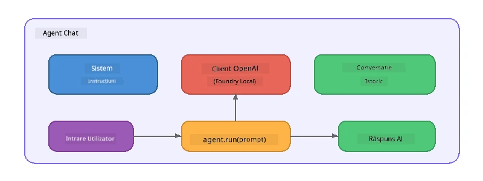

# Partea 5: Construirea Agenților AI cu Agent Framework

> **Scop:** Construiește-ți primul agent AI cu instrucțiuni persistente și o persona definită, alimentat de un model local prin Foundry Local.

## Ce este un Agent AI?

Un agent AI înfășoară un model de limbaj cu **instrucțiuni de sistem** care definesc comportamentul, personalitatea și constrângerile sale. Spre deosebire de un singur apel de completare chat, un agent oferă:

- **Persona** - o identitate consecventă („Ești un recenzor de cod util”)
- **Memorie** - istoricul conversației pe mai multe schimburi
- **Specializare** - comportament focalizat, condus de instrucțiuni bine construite



---

## Microsoft Agent Framework

**Microsoft Agent Framework** (AGF) oferă o abstracție standard de agent care funcționează peste diferite backend-uri de modele. În acest atelier îl combinăm cu Foundry Local astfel încât totul să ruleze pe mașina ta – fără cloud necesar.

| Concept | Descriere |
|---------|-----------|
| `FoundryLocalClient` | Python: gestionează începutul serviciului, descărcarea/încărcarea modelului și creează agenți |
| `client.as_agent()` | Python: creează un agent din clientul Foundry Local |
| `AsAIAgent()` | C#: metodă extensie pe `ChatClient` - creează un `AIAgent` |
| `instructions` | Prompt de sistem care modelează comportamentul agentului |
| `name` | Etichetă ușor de citit, utilă în scenarii cu mai mulți agenți |
| `agent.run(prompt)` / `RunAsync()` | Trimite un mesaj utilizator și returnează răspunsul agentului |

> **Notă:** Agent Framework are SDK-uri Python și .NET. Pentru JavaScript, implementăm o clasă ușoară `ChatAgent` care reflectă același tipar folosind direct SDK-ul OpenAI.

---

## Exerciții

### Exercițiul 1 - Înțelege Tiparul Agentului

Înainte de a scrie cod, studiază componentele cheie ale unui agent:

1. **Clientul modelului** - conectează la API-ul compatibil OpenAI al Foundry Local
2. **Instrucțiuni de sistem** - promptul „personalitate”
3. **Bucle de rulare** - trimite intrarea utilizatorului, primește ieșirea

> **Gândește-te:** Cum diferă instrucțiunile de sistem față de un mesaj obișnuit al utilizatorului? Ce se întâmplă dacă le schimbi?

---

### Exercițiul 2 - Rulează Exemplul cu Agent Unic

<details>
<summary><strong>🐍 Python</strong></summary>

**Prerechizite:**
```bash
cd python
python -m venv venv

# Windows (PowerShell):
venv\Scripts\Activate.ps1
# macOS:
source venv/bin/activate

pip install -r requirements.txt
```

**Rulare:**
```bash
python foundry-local-with-agf.py
```

**Parcurgere cod** (`python/foundry-local-with-agf.py`):

```python
import asyncio
from agent_framework_foundry_local import FoundryLocalClient

async def main():
    alias = "phi-4-mini"

    # FoundryLocalClient gestionează pornirea serviciului, descărcarea modelului și încărcarea
    client = FoundryLocalClient(model_id=alias)
    print(f"Client Model ID: {client.model_id}")

    # Creează un agent cu instrucțiuni de sistem
    agent = client.as_agent(
        name="Joker",
        instructions="You are good at telling jokes.",
    )

    # Non-streaming: obține răspunsul complet dintr-o dată
    result = await agent.run("Tell me a joke about a pirate.")
    print(f"Agent: {result}")

    # Streaming: obține rezultatele pe măsură ce sunt generate
    async for chunk in agent.run("Tell me another joke.", stream=True):
        if chunk.text:
            print(chunk.text, end="", flush=True)

asyncio.run(main())
```

**Puncte cheie:**
- `FoundryLocalClient(model_id=alias)` gestionează începutul serviciului, descărcarea și încărcarea modelului într-un singur pas
- `client.as_agent()` creează un agent cu instrucțiuni de sistem și un nume
- `agent.run()` suportă moduri atât fără streaming, cât și cu streaming
- Instalează cu `pip install agent-framework-foundry-local --pre`

</details>

<details>
<summary><strong>📦 JavaScript</strong></summary>

**Prerechizite:**
```bash
cd javascript
npm install
```

**Rulare:**
```bash
node foundry-local-with-agent.mjs
```

**Parcurgere cod** (`javascript/foundry-local-with-agent.mjs`):

```javascript
import { OpenAI } from "openai";
import { FoundryLocalManager } from "foundry-local-sdk";

class ChatAgent {
  constructor({ client, modelId, instructions, name }) {
    this.client = client;
    this.modelId = modelId;
    this.instructions = instructions;
    this.name = name;
    this.history = [];
  }

  async run(userMessage) {
    const messages = [
      { role: "system", content: this.instructions },
      ...this.history,
      { role: "user", content: userMessage },
    ];
    const response = await this.client.chat.completions.create({
      model: this.modelId,
      messages,
    });
    const assistantMessage = response.choices[0].message.content;

    // Păstrează istoricul conversației pentru interacțiuni cu mai multe runde
    this.history.push({ role: "user", content: userMessage });
    this.history.push({ role: "assistant", content: assistantMessage });
    return { text: assistantMessage };
  }
}

async function main() {
  FoundryLocalManager.create({ appName: "FoundryLocalWorkshop" });
  const manager = FoundryLocalManager.instance;
  await manager.startWebService();

  const catalog = manager.catalog;
  const model = await catalog.getModel("phi-3.5-mini");
  if (!model.isCached) {
    console.log("Downloading model: phi-3.5-mini...");
    await model.download();
  }
  await model.load();

  const client = new OpenAI({
    baseURL: manager.urls[0] + "/v1",
    apiKey: "foundry-local",
  });

  const agent = new ChatAgent({
    client,
    modelId: model.id,
    instructions: "You are good at telling jokes.",
    name: "Joker",
  });

  const result = await agent.run("Tell me a joke about a pirate.");
  console.log(result.text);
}

main();
```

**Puncte cheie:**
- JavaScript construiește propria clasă `ChatAgent` care reflectă modelul AGF Python
- `this.history` stochează schimburile conversației pentru suport multi-turn
- `startWebService()` explicit → verificare cache → `model.download()` → `model.load()` oferă vizibilitate completă

</details>

<details>
<summary><strong>💜 C#</strong></summary>

**Prerechizite:**
```bash
cd csharp
dotnet restore
```

**Rulare:**
```bash
dotnet run agent
```

**Parcurgere cod** (`csharp/SingleAgent.cs`):

```csharp
using Microsoft.AI.Foundry.Local;
using Microsoft.Extensions.Logging.Abstractions;
using Microsoft.Agents.AI;
using OpenAI;
using System.ClientModel;

// 1. Start Foundry Local and load a model
var alias = "phi-3.5-mini";
await FoundryLocalManager.CreateAsync(
    new Configuration
    {
        AppName = "FoundryLocalSamples",
        Web = new Configuration.WebService { Urls = "http://127.0.0.1:0" }
    }, NullLogger.Instance, default);
var manager = FoundryLocalManager.Instance;
await manager.StartWebServiceAsync(default);

var catalog = await manager.GetCatalogAsync(default);
var model = await catalog.GetModelAsync(alias, default);

var isCached = await model.IsCachedAsync(default);
if (!isCached)
{
    Console.WriteLine($"Downloading model: {alias}...");
    await model.DownloadAsync(null, default);
}
await model.LoadAsync(default);

var key = new ApiKeyCredential("foundry-local");
var client = new OpenAIClient(key, new OpenAIClientOptions
{
    Endpoint = new Uri(manager.Urls[0] + "/v1")
});

// 2. Create an AIAgent using the Agent Framework extension method
AIAgent joker = client
    .GetChatClient(model.Id)
    .AsAIAgent(
        instructions: "You are good at telling jokes. Keep your jokes short and family-friendly.",
        name: "Joker"
    );

// 3. Run the agent (non-streaming)
var response = await joker.RunAsync("Tell me a joke about a pirate.");
Console.WriteLine($"Joker: {response}");

// 4. Run with streaming
await foreach (var update in joker.RunStreamingAsync("Tell me another joke."))
{
    Console.Write(update);
}
```

**Puncte cheie:**
- `AsAIAgent()` este o metodă extensie din `Microsoft.Agents.AI.OpenAI` - nu este nevoie de clasă `ChatAgent` personalizată
- `RunAsync()` returnează răspunsul complet; `RunStreamingAsync()` transmite token cu token
- Instalează cu `dotnet add package Microsoft.Agents.AI.OpenAI --version 1.0.0-rc3`

</details>

---

### Exercițiul 3 - Schimbă Persona

Modifică `instructions` ale agentului pentru a crea o altă persoană. Încearcă fiecare și observă cum se schimbă răspunsul:

| Persona | Instrucțiuni |
|---------|--------------|
| Recenzor Cod | `"Ești un expert recenzor de cod. Oferă feedback constructiv concentrat pe lizibilitate, performanță și corectitudine."` |
| Ghid Turistic | `"Ești un ghid turistic prietenos. Oferă recomandări personalizate pentru destinații, activități și bucătărie locală."` |
| Tutor Socratic | `"Ești un tutor socratic. Nu dai niciodată răspunsuri directe – în schimb, ghidează studentul cu întrebări bine gândite."` |
| Redactor Tehnic | `"Ești un redactor tehnic. Explică conceptele clar și concis. Folosește exemple. Evită jargonul."` |

**Încearcă:**
1. Alege o persoană din tabelul de mai sus
2. Înlocuiește șirul `instructions` în cod
3. Ajustează promptul utilizatorului pentru a se potrivi (de ex. cere recenzorului să revizuiască o funcție)
4. Rulează din nou exemplul și compară ieșirea

> **Sfat:** Calitatea unui agent depinde mult de instrucțiuni. Instrucțiunile specifice și bine structurate generează rezultate mai bune decât cele vagi.

---

### Exercițiul 4 - Adaugă Conversație Multi-Turn

Extinde exemplul pentru a suporta un chat multi-turn astfel încât să poți avea o conversație dus-întors cu agentul.

<details>
<summary><strong>🐍 Python - buclă multi-turn</strong></summary>

```python
import asyncio
from agent_framework_foundry_local import FoundryLocalClient

async def main():
    client = FoundryLocalClient(model_id="phi-4-mini")

    agent = client.as_agent(
        name="Assistant",
        instructions="You are a helpful assistant.",
    )

    print("Chat with the agent (type 'quit' to exit):\n")
    while True:
        user_input = input("You: ")
        if user_input.strip().lower() in ("quit", "exit"):
            break
        result = await agent.run(user_input)
        print(f"Agent: {result}\n")

asyncio.run(main())
```

</details>

<details>
<summary><strong>📦 JavaScript - buclă multi-turn</strong></summary>

```javascript
import { OpenAI } from "openai";
import { FoundryLocalManager } from "foundry-local-sdk";
import * as readline from "node:readline/promises";

// (refolosește clasa ChatAgent din Exercițiul 2)

async function main() {
  FoundryLocalManager.create({ appName: "FoundryLocalWorkshop" });
  const manager = FoundryLocalManager.instance;
  await manager.startWebService();

  const catalog = manager.catalog;
  const model = await catalog.getModel("phi-3.5-mini");
  if (!model.isCached) {
    console.log("Downloading model: phi-3.5-mini...");
    await model.download();
  }
  await model.load();

  const client = new OpenAI({
    baseURL: manager.urls[0] + "/v1",
    apiKey: "foundry-local",
  });

  const agent = new ChatAgent({
    client,
    modelId: model.id,
    instructions: "You are a helpful assistant.",
    name: "Assistant",
  });

  const rl = readline.createInterface({
    input: process.stdin,
    output: process.stdout,
  });

  console.log("Chat with the agent (type 'quit' to exit):\n");
  while (true) {
    const userInput = await rl.question("You: ");
    if (["quit", "exit"].includes(userInput.trim().toLowerCase())) break;
    const result = await agent.run(userInput);
    console.log(`Agent: ${result.text}\n`);
  }
  rl.close();
}

main();
```

</details>

<details>
<summary><strong>💜 C# - buclă multi-turn</strong></summary>

```csharp
using Microsoft.AI.Foundry.Local;
using Microsoft.Extensions.Logging.Abstractions;
using Microsoft.Agents.AI;
using OpenAI;
using System.ClientModel;

var alias = "phi-3.5-mini";
var config = new Configuration
{
    AppName = "FoundryLocalSamples",
    Web = new Configuration.WebService { Urls = "http://127.0.0.1:0" }
};
await FoundryLocalManager.CreateAsync(config, NullLogger.Instance, default);
var manager = FoundryLocalManager.Instance;
await manager.StartWebServiceAsync(default);

var catalog = await manager.GetCatalogAsync(default);
var model = await catalog.GetModelAsync(alias, default);

var isCached = await model.IsCachedAsync(default);
if (!isCached)
{
    Console.WriteLine($"Downloading model: {alias}...");
    await model.DownloadAsync(null, default);
}
await model.LoadAsync(default);

var key = new ApiKeyCredential("foundry-local");
var client = new OpenAIClient(key, new OpenAIClientOptions
{
    Endpoint = new Uri(manager.Urls[0] + "/v1")
});

AIAgent agent = client
    .GetChatClient(model.Id)
    .AsAIAgent(
        instructions: "You are a helpful assistant.",
        name: "Assistant"
    );

Console.WriteLine("Chat with the agent (type 'quit' to exit):\n");
while (true)
{
    Console.Write("You: ");
    var userInput = Console.ReadLine();
    if (string.IsNullOrWhiteSpace(userInput) ||
        userInput.Equals("quit", StringComparison.OrdinalIgnoreCase) ||
        userInput.Equals("exit", StringComparison.OrdinalIgnoreCase))
        break;

    var result = await agent.RunAsync(userInput);
    Console.WriteLine($"Agent: {result}\n");
}
```

</details>

Observă cum agentul își amintește schimbările anterioare – pune o întrebare de urmărire și vezi cum contextul persistă.

---

### Exercițiul 5 - Ieșire Structurată

Instrucționează agentul să răspundă întotdeauna într-un format specific (ex. JSON) și parsează rezultatul:

<details>
<summary><strong>🐍 Python - ieșire JSON</strong></summary>

```python
import asyncio
import json
from agent_framework_foundry_local import FoundryLocalClient

async def main():
    client = FoundryLocalClient(model_id="phi-4-mini")

    agent = client.as_agent(
        name="SentimentAnalyzer",
        instructions=(
            "You are a sentiment analysis agent. "
            "For every user message, respond ONLY with valid JSON in this format: "
            '{"sentiment": "positive|negative|neutral", "confidence": 0.0-1.0, "summary": "brief reason"}'
        ),
    )

    result = await agent.run("I absolutely loved the new restaurant downtown!")
    print("Raw:", result)

    try:
        parsed = json.loads(str(result))
        print(f"Sentiment: {parsed['sentiment']} (confidence: {parsed['confidence']})")
    except json.JSONDecodeError:
        print("Agent did not return valid JSON - try refining the instructions.")

asyncio.run(main())
```

</details>

<details>
<summary><strong>💜 C# - ieșire JSON</strong></summary>

```csharp
using System.Text.Json;

AIAgent analyzer = chatClient.AsAIAgent(
    name: "SentimentAnalyzer",
    instructions:
        "You are a sentiment analysis agent. " +
        "For every user message, respond ONLY with valid JSON in this format: " +
        "{\"sentiment\": \"positive|negative|neutral\", \"confidence\": 0.0-1.0, \"summary\": \"brief reason\"}"
);

var response = await analyzer.RunAsync("I absolutely loved the new restaurant downtown!");
Console.WriteLine($"Raw: {response}");

try
{
    var parsed = JsonSerializer.Deserialize<JsonElement>(response.ToString());
    Console.WriteLine($"Sentiment: {parsed.GetProperty("sentiment")} " +
                      $"(confidence: {parsed.GetProperty("confidence")})");
}
catch (JsonException)
{
    Console.WriteLine("Agent did not return valid JSON - try refining the instructions.");
}
```

</details>

> **Notă:** Modelele locale mici pot să nu genereze întotdeauna JSON perfect valid. Poți îmbunătăți fiabilitatea incluzând un exemplu în instrucțiuni și fiind foarte explicit cu privire la formatul așteptat.

---

## Ce am reținut

| Concept | Ce ai învățat |
|---------|---------------|
| Agent vs apel simplu LLM | Un agent înfășoară un model cu instrucțiuni și memorie |
| Instrucțiuni de sistem | Palanca cea mai importantă pentru controlul comportamentului agentului |
| Conversație multi-turn | Agenții pot păstra contextul pe mai multe interacțiuni cu utilizatorul |
| Ieșire structurată | Instrucțiunile pot impune un format specific al răspunsului (JSON, markdown, etc.) |
| Executare locală | Totul rulează pe dispozitiv prin Foundry Local – fără cloud necesar |

---

## Pașii următori

În **[Partea 6: Fluxuri multi-agent](part6-multi-agent-workflows.md)**, vei combina mai mulți agenți într-un flux coordonat unde fiecare agent are un rol specializat.