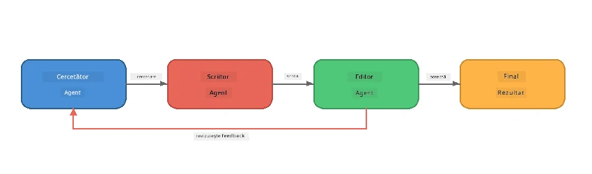
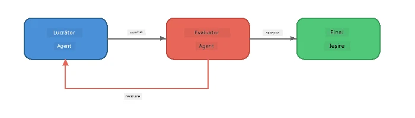
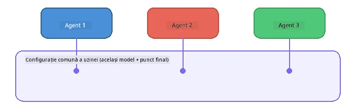

# Partea 6: Fluxuri de lucru multi-agent

> **Scop:** Combină mai mulți agenți specializați în conducte coordonate care împart sarcini complexe între agenți colaborativi - toți funcționând local cu Foundry Local.

## De ce Multi-Agent?

Un singur agent poate gestiona multe sarcini, dar fluxurile de lucru complexe beneficiază de **Specializare**. În loc ca un agent să încerce să cerceteze, să scrie și să editeze simultan, împarți munca în roluri concentrate:



| Model | Descriere |
|---------|-------------|
| **Secvențial** | Ieșirea Agentului A alimentează Agentul B → Agent C |
| **Buclă de feedback** | Un agent evaluator poate trimite lucrarea înapoi pentru revizuire |
| **Context partajat** | Toți agenții folosesc același model/endpoint, dar instrucțiuni diferite |
| **Ieșire tipizată** | Agenții produc rezultate structurate (JSON) pentru transferuri fiabile |

---

## Exerciții

### Exercițiul 1 - Rulează conductă multi-agent

Atelierul include un flux de lucru complet Researcher → Writer → Editor.

<details>
<summary><strong>🐍 Python</strong></summary>

**Configurare:**
```bash
cd python
python -m venv venv

# Windows (PowerShell):
venv\Scripts\Activate.ps1
# macOS:
source venv/bin/activate

pip install -r requirements.txt
```

**Rulează:**
```bash
python foundry-local-multi-agent.py
```

**Ce se întâmplă:**
1. **Researcher** primește un subiect și returnează fapte punctate
2. **Writer** ia cercetarea și redactează o postare pe blog (3-4 paragrafe)
3. **Editor** revizuiește articolul pentru calitate și returnează ACCEPT sau REVISE

</details>

<details>
<summary><strong>📦 JavaScript</strong></summary>

**Configurare:**
```bash
cd javascript
npm install
```

**Rulează:**
```bash
node foundry-local-multi-agent.mjs
```

**Aceeași conductă în trei etape** - Researcher → Writer → Editor.

</details>

<details>
<summary><strong>💜 C#</strong></summary>

**Configurare:**
```bash
cd csharp
dotnet restore
```

**Rulează:**
```bash
dotnet run multi
```

**Aceeași conductă în trei etape** - Researcher → Writer → Editor.

</details>

---

### Exercițiul 2 - Anatomia conductei

Studiază cum sunt definiți și conectați agenții:

**1. Client model partajat**

Toți agenții împart același model Foundry Local:

```python
# Python - FoundryLocalClient se ocupă de tot
from agent_framework_foundry_local import FoundryLocalClient

client = FoundryLocalClient(model_id="phi-3.5-mini")
```

```javascript
// JavaScript - SDK-ul OpenAI orientat către Foundry Local
const client = new OpenAI({
  baseURL: manager.urls[0] + "/v1",
  apiKey: "foundry-local",
});
```

```csharp
// C# - OpenAIClient pointed at Foundry Local
var key = new ApiKeyCredential("foundry-local");
var client = new OpenAIClient(key, new OpenAIClientOptions
{
    Endpoint = new Uri(manager.Urls[0] + "/v1")
});
var chatClient = client.GetChatClient(model.Id);
```

**2. instrucțiuni specializate**

Fiecare agent are o personalitate distinctă:

| Agent | Instrucțiuni (sumar) |
|-------|----------------------|
| Researcher | "Furnizează fapte cheie, statistici și context. Organizează-le ca puncte." |
| Writer | "Scrie o postare captivantă pe blog (3-4 paragrafe) pe baza notelor de cercetare. Nu inventa fapte." |
| Editor | "Revizuiește claritatea, gramatica și consistența factuală. Verdict: ACCEPT sau REVISE." |

**3. Fluxuri de date între agenți**

```python
# Pasul 1 - rezultatul cercetătorului devine intrare pentru scriitor
research_result = await researcher.run(f"Research: {topic}")

# Pasul 2 - rezultatul scriitorului devine intrare pentru editor
writer_result = await writer.run(f"Write using:\n{research_result}")

# Pasul 3 - editorul revizuiește atât cercetarea, cât și articolul
editor_result = await editor.run(
    f"Research:\n{research_result}\n\nArticle:\n{writer_result}"
)
```

```csharp
// C# - same pattern, async calls with AIAgent
var researchNotes = await researcher.RunAsync(
    $"Research the following topic and provide key facts:\n{topic}");

var draft = await writer.RunAsync(
    $"Write a blog post based on these research notes:\n\n{researchNotes}");

var verdict = await editor.RunAsync(
    $"Review this article for quality and accuracy.\n\n" +
    $"Research notes:\n{researchNotes}\n\n" +
    $"Article:\n{draft}");
```

> **Insight esențial:** Fiecare agent primește contextul cumulativ de la agenții anteriori. Editorul vede atât cercetarea originală, cât și schița - permițând verificarea consistenței factuale.

---

### Exercițiul 3 - Adaugă un al patrulea agent

Extinde conducta adăugând un agent nou. Alege unul:

| Agent | Scop | Instrucțiuni |
|-------|---------|-------------|
| **Fact-Checker** | Verifică afirmațiile din articol | `"Verifici afirmațiile factuale. Pentru fiecare afirmație, afirmă dacă este susținută de notele de cercetare. Returnează JSON cu elemente verificate/neconfirmate."` |
| **Headline Writer** | Creează titluri atrăgătoare | `"Generează 5 opțiuni de titlu pentru articol. Varietate de stiluri: informativ, clickbait, întrebare, listă, emoțional."` |
| **Social Media** | Creează postări promoționale | `"Creează 3 postări social media pentru promovarea acestui articol: una pentru Twitter (280 caractere), una pentru LinkedIn (ton profesional), una pentru Instagram (casual cu sugestii de emoji)."` |

<details>
<summary><strong>🐍 Python - adăugarea unui Headline Writer</strong></summary>

```python
headline_agent = client.as_agent(
    name="HeadlineWriter",
    instructions=(
        "You are a headline specialist. Given an article, generate exactly "
        "5 headline options. Vary the style: informative, question-based, "
        "listicle, emotional, and provocative. Return them as a numbered list."
    ),
)

# După ce editorul acceptă, generează titluri
headline_result = await headline_agent.run(
    f"Generate headlines for this article:\n\n{writer_result}"
)
print(f"\n--- Headlines ---\n{headline_result}")
```

</details>

<details>
<summary><strong>📦 JavaScript - adăugarea unui Headline Writer</strong></summary>

```javascript
const headlineAgent = new ChatAgent({
  client,
  modelId: modelInfo.id,
  instructions:
    "You are a headline specialist. Given an article, generate exactly " +
    "5 headline options. Vary the style: informative, question-based, " +
    "listicle, emotional, and provocative. Return them as a numbered list.",
  name: "HeadlineWriter",
});

const headlineResult = await headlineAgent.run(
  `Generate headlines for this article:\n\n${writerResult.text}`
);
console.log(`\n--- Headlines ---\n${headlineResult.text}`);
```

</details>

<details>
<summary><strong>💜 C# - adăugarea unui Headline Writer</strong></summary>

```csharp
AIAgent headlineAgent = chatClient.AsAIAgent(
    name: "HeadlineWriter",
    instructions:
        "You are a headline specialist. Given an article, generate exactly " +
        "5 headline options. Vary the style: informative, question-based, " +
        "listicle, emotional, and provocative. Return them as a numbered list."
);

// After the editor accepts, generate headlines
var headlines = await headlineAgent.RunAsync(
    $"Generate headlines for this article:\n\n{draft}");
Console.WriteLine($"\n--- Headlines ---\n{headlines}");
```

</details>

---

### Exercițiul 4 - Proiectează propriul flux de lucru

Proiectează o conductă multi-agent pentru un domeniu diferit. Iată câteva idei:

| Domeniu | Agenți | Flux |
|--------|--------|------|
| **Revizuire Cod** | Analyser → Reviewer → Summariser | Analizează structura codului → revizuiește probleme → generează raport sumar |
| **Suport Clienți** | Clasificator → Respondent → QA | Clasifică tichetul → redactează răspuns → verifică calitatea |
| **Educație** | Creator Quiz → Simulator Student → Evaluator | Generează quiz → simulează răspunsuri → evaluează și explică |
| **Analiză Date** | Interpret → Analist → Reporter | Interpretează cererea de date → analizează modele → scrie raport |

**Pași:**
1. Definește 3+ agenți cu `instrucțiuni` distincte
2. Decide fluxul de date - ce primește și produce fiecare agent?
3. Implementează conducta folosind modelele din Exercițiile 1-3
4. Adaugă o buclă de feedback dacă un agent trebuie să evalueze munca altuia

---

## Modele de orchestrare

Iată modele de orchestrare aplicabile oricărui sistem multi-agent (explorate în detaliu în [Partea 7](part7-zava-creative-writer.md)):

### Conductă secvențială


Fiecare agent procesează ieșirea celui precedent. Simplu și previzibil.

### Buclă de feedback



Un agent evaluator poate declanșa reluarea etapelor anterioare. Zava Writer folosește asta: editorul poate trimite feedback către researcher și writer.

### Context partajat



Toți agenții partajează un singur `foundry_config`, deci folosesc același model și endpoint.

---

## Aspecte cheie

| Concept | Ce ai învățat |
|---------|---------------|
| Specializarea agenților | Fiecare agent face bine un lucru cu instrucțiuni concentrate |
| Transferuri de date | Ieșirea unui agent devine intrarea următorului |
| Bucle de feedback | Un evaluator poate declanșa reîncercări pentru calitate mai ridicată |
| Ieșire structurată | Răspunsuri în format JSON permit comunicare fiabilă între agenți |
| Orchestrare | Un coordonator gestionează ordinea și tratarea erorilor în conductă |
| Modele de producție | Aplicate în [Partea 7: Zava Creative Writer](part7-zava-creative-writer.md) |

---

## Pașii următori

Continuă cu [Partea 7: Zava Creative Writer - Aplicație Capstone](part7-zava-creative-writer.md) pentru a explora o aplicație multi-agent de tip producție cu 4 agenți specializați, ieșire în streaming, căutare de produse și bucle de feedback - disponibilă în Python, JavaScript și C#.