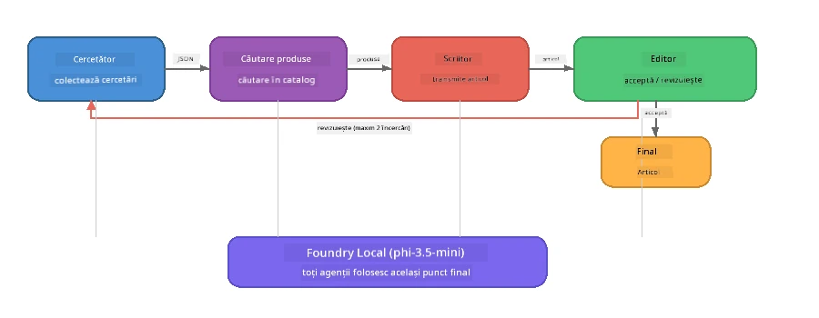

# Partea 7: Zava Creative Writer - Aplicația Capstone

> **Scop:** Explorează o aplicație multi-agent de tip producție în care patru agenți specializați colaborează pentru a produce articole de calitate jurnalistică pentru Zava Retail DIY - rulând integral pe dispozitivul tău cu Foundry Local.

Aceasta este **laboratorul capstone** al atelierului. Reunește tot ce ai învățat - integrare SDK (Partea 3), extragere din date locale (Partea 4), personaje de agenți (Partea 5) și orchestrare multi-agent (Partea 6) - într-o aplicație completă disponibilă în **Python**, **JavaScript** și **C#**.

---

## Ce Vei Explora

| Concept | Unde în Zava Writer |
|---------|---------------------|
| Încărcare model în 4 pași | Modulul de configurare partajată pornește Foundry Local |
| Extracție stil RAG | Agentul de produs caută într-un catalog local |
| Specializarea agenților | 4 agenți cu prompturi sistem distincte |
| Generare în flux | Writer produce tokeni în timp real |
| Transferuri structurate | Cercetător → JSON, Editor → decizie JSON |
| Buclă de feedback | Editorul poate declanșa reluarea execuției (maxim 2 încercări) |

---

## Arhitectură

Zava Creative Writer folosește o **conductă secvențială cu feedback condus de evaluator**. Toate cele trei implementări de limbaj urmează aceeași arhitectură:



### Cei Patru Agenți

| Agent | Intrare | Ieșire | Scop |
|-------|---------|--------|------|
| **Cercetător** | Subiect + feedback opțional | `{"web": [{url, name, description}, ...]}` | Colectează cercetare de bază prin LLM |
| **Căutare Produs** | Șir de context produs | Listă de produse potrivite | Interogări generate de LLM + căutare keyword în catalog local |
| **Writer** | Cercetare + produse + sarcină + feedback | Text articol în flux (împărțit la `---`) | Schițează un articol de calitate în timp real |
| **Editor** | Articol + auto-feedback al writer-ului | `{"decision": "accept/revise", "editorFeedback": "...", "researchFeedback": "..."}` | Evaluează calitatea, declanșează reluare dacă este nevoie |

### Fluxul Conductei

1. **Cercetătorul** primește subiectul și produce note de cercetare structurate (JSON)
2. **Căutare Produs** interoghează catalogul local cu termeni de căutare generați de LLM
3. **Writer** combină cercetarea + produsele + sarcina într-un articol transmis în flux, adăugând auto-feedback după separatorul `---`
4. **Editor** evaluează articolul și returnează un verdict JSON:
   - `"accept"` → conducta se încheie
   - `"revise"` → feedback-ul este trimis înapoi către Cercetător și Writer (maxim 2 încercări)

---

## Precondiții

- Completează [Partea 6: Fluxuri de lucru multi-agent](part6-multi-agent-workflows.md)
- CLI Foundry Local instalat și modelul `phi-3.5-mini` descărcat

---

## Exerciții

### Exercițiul 1 - Rulează Zava Creative Writer

Alege limbajul și pornește aplicația:

<details>
<summary><strong>🐍 Python - Serviciu Web FastAPI</strong></summary>

Versiunea Python rulează ca un **serviciu web** cu API REST, demonstrând cum să construiești un backend pentru producție.

**Configurare:**
```bash
cd zava-creative-writer-local/src/api
python -m venv venv

# Windows (PowerShell):
venv\Scripts\Activate.ps1
# macOS:
source venv/bin/activate

pip install -r requirements.txt
```

**Rulează:**
```bash
uvicorn main:app --reload
```

**Testare:**
```bash
curl -X POST http://localhost:8000/api/article \
  -H "Content-Type: application/json" \
  -d '{
    "research": "DIY home improvement trends",
    "products": "power tools and paints",
    "assignment": "Write an article about weekend renovation projects for DIY enthusiasts"
  }'
```

Răspunsul este transmis ca mesaje JSON delimitate prin newline, arătând progresul fiecărui agent.

</details>

<details>
<summary><strong>📦 JavaScript - CLI Node.js</strong></summary>

Versiunea JavaScript rulează ca o **aplicație CLI**, afișând progresul agenților și articolul direct în consolă.

**Configurare:**
```bash
cd zava-creative-writer-local/src/javascript
npm install
```

**Rulează:**
```bash
node main.mjs
```

Vei vedea:
1. Încărcarea modelului Foundry Local (cu bară de progres dacă se descarcă)
2. Execuția fiecărui agent în secvență cu mesaje de status
3. Articolul transmis în flux către consolă în timp real
4. Decizia editorului de acceptare/revizuire

</details>

<details>
<summary><strong>💜 C# - Aplicație Consolă .NET</strong></summary>

Versiunea C# rulează ca o **aplicație consolă .NET** cu aceeași conductă și generație în flux.

**Configurare:**
```bash
cd zava-creative-writer-local/src/csharp
dotnet restore
```

**Rulează:**
```bash
dotnet run
```

Același model de ieșire ca versiunea JavaScript - mesaje de status agenți, articol transmis în flux și verdictul editorului.

</details>

---

### Exercițiul 2 - Studiu Structură Cod

Fiecare implementare de limbaj are aceleași componente logice. Compară structurile:

**Python** (`src/api/`):
| Fișier | Scop |
|--------|------|
| `foundry_config.py` | Manager, model și client Foundry Local partajat (inițializare 4 pași) |
| `orchestrator.py` | Coordonarea conductei cu buclă de feedback |
| `main.py` | Endpoints FastAPI (`POST /api/article`) |
| `agents/researcher/researcher.py` | Cercetare bazată pe LLM cu ieșire JSON |
| `agents/product/product.py` | Interogări generate de LLM + căutare keyword |
| `agents/writer/writer.py` | Generarea articolului în flux |
| `agents/editor/editor.py` | Decizie acceptare/revizuire bazată pe JSON |

**JavaScript** (`src/javascript/`):
| Fișier | Scop |
|--------|------|
| `foundryConfig.mjs` | Configurare Foundry Local partajată (inițializare 4 pași cu bară progres) |
| `main.mjs` | Orchestrator + punct de intrare CLI |
| `researcher.mjs` | Agent cercetare bazat pe LLM |
| `product.mjs` | Generare interogări LLM + căutare keyword |
| `writer.mjs` | Generare articol în flux (generator async) |
| `editor.mjs` | Decizie acceptare/revizuire JSON |
| `products.mjs` | Date catalog produse |

**C#** (`src/csharp/`):
| Fișier | Scop |
|--------|------|
| `Program.cs` | Conductă completă: încărcare model, agenți, orchestrator, buclă feedback |
| `ZavaCreativeWriter.csproj` | Proiect .NET 9 cu pachete Foundry Local + OpenAI |

> **Notă de design:** Python separă fiecare agent în fișier/director propriu (util pentru echipe mari). JavaScript folosește un modul per agent (util pentru proiecte medii). C# ține totul într-un singur fișier cu funcții locale (ideal pentru exemple independente). În producție, alege modelul care se potrivește regulilor echipei tale.

---

### Exercițiul 3 - Urmărește Configurarea Partajată

Fiecare agent din conductă folosește un singur client Foundry Local model. Studiază cum este configurat în fiecare limbaj:

<details>
<summary><strong>🐍 Python - foundry_config.py</strong></summary>

```python
from foundry_local import FoundryLocalManager

MODEL_ALIAS = "phi-3.5-mini"

# Pasul 1: Creați managerul și porniți serviciul Foundry Local
manager = FoundryLocalManager()
manager.start_service()

# Pasul 2: Verificați dacă modelul este deja descărcat
cached = manager.list_cached_models()
catalog_info = manager.get_model_info(MODEL_ALIAS)
is_cached = any(m.id == catalog_info.id for m in cached) if catalog_info else False

if not is_cached:
    manager.download_model(MODEL_ALIAS)

# Pasul 3: Încărcați modelul în memorie
manager.load_model(MODEL_ALIAS)
model_id = manager.get_model_info(MODEL_ALIAS).id

# Client OpenAI partajat
client = openai.OpenAI(base_url=manager.endpoint, api_key=manager.api_key)
```

Toți agenții importă `from foundry_config import client, model_id`.

</details>

<details>
<summary><strong>📦 JavaScript - foundryConfig.mjs</strong></summary>

```javascript
import { FoundryLocalManager } from "foundry-local-sdk";
import { OpenAI } from "openai";

FoundryLocalManager.create({ appName: "ZavaCreativeWriter" });
const manager = FoundryLocalManager.instance;
await manager.startWebService();

// Verifică cache-ul → descarcă → încarcă (model nou SDK)
const catalog = manager.catalog;
const model = await catalog.getModel(MODEL_ALIAS);
if (!model.isCached) {
  console.log(`Downloading model: ${MODEL_ALIAS}...`);
  await model.download();
}
await model.load();

const client = new OpenAI({ baseURL: manager.urls[0] + "/v1", apiKey: "foundry-local" });
const modelId = model.id;
export { client, modelId };
```

Toți agenții importă `{ client, modelId } from "./foundryConfig.mjs"`.

</details>

<details>
<summary><strong>💜 C# - începutul Program.cs</strong></summary>

```csharp
await FoundryLocalManager.CreateAsync(
    new Configuration
    {
        AppName = "ZavaCreativeWriter",
        Web = new Configuration.WebService { Urls = "http://127.0.0.1:0" }
    }, NullLogger.Instance, default);
var manager = FoundryLocalManager.Instance;
await manager.StartWebServiceAsync(default);

var catalog = await manager.GetCatalogAsync(default);
var catalogModel = await catalog.GetModelAsync(alias, default);
var isCached = await catalogModel.IsCachedAsync(default);
if (!isCached)
    await catalogModel.DownloadAsync(null, default);

await catalogModel.LoadAsync(default);
var key = new ApiKeyCredential("foundry-local");
var chatClient = new OpenAIClient(key, new OpenAIClientOptions
{
    Endpoint = new Uri(manager.Urls[0] + "/v1")
}).GetChatClient(catalogModel.Id);
```

`chatClient` este apoi transmis tuturor funcțiilor agent în același fișier.

</details>

> **Model cheie:** Modelul de încărcare (start serviciu → verificare cache → descărcare → încărcare) asigură progres clar pentru utilizator și descarcă modelul o singură dată. Aceasta este o bună practică pentru orice aplicație Foundry Local.

---

### Exercițiul 4 - Înțelege Bucla de Feedback

Bucla de feedback face conductă „inteligentă” - Editorul poate trimite sarcina înapoi pentru revizuire. Urmărește logica:

```
Orchestrator:
  1. researcher.research(topic, "No Feedback")    ← first pass
  2. product.findProducts(productContext)
  3. writer.write(research, products, assignment)  ← streams article
  4. Split article at "---" → article + writerFeedback
  5. editor.edit(article, writerFeedback)

  WHILE editor says "revise" AND retryCount < 2:
    6. researcher.research(topic, editor.researchFeedback)  ← refined
    7. writer.write(research, products, editor.editorFeedback)
    8. editor.edit(newArticle, newWriterFeedback)
    9. retryCount++
```

**Întrebări de considerat:**
- De ce limita de încercări este setată la 2? Ce se întâmplă dacă o crești?
- De ce cercetătorul primește `researchFeedback`, iar writerul `editorFeedback`?
- Ce s-ar întâmpla dacă editorul ar spune întotdeauna „revizuiește”?

---

### Exercițiul 5 - Modifică un Agent

Încearcă să schimbi comportamentul unui agent și observă cum afectează conductă:

| Modificare | Ce să schimbi |
|------------|---------------|
| **Editor mai strict** | Schimbă promptul sistem editorului să ceară mereu cel puțin o revizuire |
| **Articole mai lungi** | Schimbă promptul writer-ului de la „800-1000 cuvinte” la „1500-2000 cuvinte” |
| **Produse diferite** | Adaugă sau modifică produse în catalogul de produse |
| **Subiect nou de cercetare** | Schimbă `researchContext` implicit cu alt subiect |
| **Cercetător doar JSON** | Fă ca cercetătorul să returneze 10 articole în loc de 3-5 |

> **Sfat:** Deoarece toate cele trei limbaje implementează aceeași arhitectură, poți face aceeași modificare în limbajul în care te simți mai confortabil.

---

### Exercițiul 6 - Adaugă un Al Cincilea Agent

Extinde conducta cu un agent nou. Câteva idei:

| Agent | Unde în conductă | Scop |
|-------|------------------|------|
| **Verificator de Fapte** | După Writer, înainte de Editor | Verifică afirmațiile față de datele de cercetare |
| **Optimizator SEO** | După acceptarea editorului | Adaugă meta descriere, cuvinte cheie, slug |
| **Ilustrator** | După acceptarea editorului | Generează prompturi de imagine pentru articol |
| **Translator** | După acceptarea editorului | Traduce articolul în altă limbă |

**Pași:**
1. Scrie promptul sistem al agentului
2. Creează funcția agent (potrivit modelului existent în limbajul tău)
3. Inserează-o în orchestrator la momentul corect
4. Actualizează ieșirea/jurnalizarea să arate contribuția agentului nou

---

## Cum Lucrează Împreună Foundry Local și Framework-ul Agent

Această aplicație demonstrează modelul recomandat pentru construirea sistemelor multi-agent cu Foundry Local:

| Nivel | Componentă | Rol |
|-------|------------|-----|
| **Runtime** | Foundry Local | Descarcă, gestionează și servește modelul local |
| **Client** | OpenAI SDK | Trimite completări chat către endpoint-ul local |
| **Agent** | Prompt sistem + apel chat | comportament specializat prin instrucțiuni precise |
| **Orchestrator** | Coordonator conductă | Gestionează fluxul de date, secvențiere și bucle feedback |
| **Framework** | Microsoft Agent Framework | Oferă abstractizarea și modelele `ChatAgent` |

Ideea principală: **Foundry Local înlocuiește backend-ul cloud, nu arhitectura aplicației.** Aceleași modele de agenți, strategii de orchestrare și transferuri structurate care funcționează cu modele găzduite în cloud funcționează identic cu modelele locale — doar clientul indică spre endpoint-ul local în loc de unul Azure.

---

## Concluzii Cheie

| Concept | Ce Ai Învățat |
|---------|---------------|
| Arhitectura de producție | Cum să structurezi o aplicație multi-agent cu configurare comună și agenți separați |
| Încărcare model în 4 pași | Bună practică pentru inițializarea Foundry Local cu progres vizibil |
| Specializarea agenților | Fiecare din cei 4 agenți are instrucțiuni concentrate și un format specific de ieșire |
| Generare în flux | Writer produce tokeni în timp real, permițând UI-uri receptive |
| Bucle de feedback | Încercările controlate de editor îmbunătățesc calitatea fără intervenție umană |
| Modele cross-language | Aceeași arhitectură funcționează în Python, JavaScript și C# |
| Local = producție | Foundry Local oferă aceeași API compatibilă OpenAI folosită în cloud |

---

## Pasul Următor

Continuă cu [Partea 8: Dezvoltare Condusă de Evaluare](part8-evaluation-led-development.md) pentru a crea un cadru sistematic de evaluare a agenților tăi, folosind seturi de date de referință, verificări bazate pe reguli și scoruri calculate de LLM ca judecător.