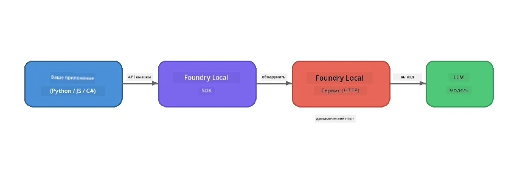

# Часть 1: Начало работы с Foundry Local


## Что такое Foundry Local?

[Foundry Local](https://foundrylocal.ai) позволяет запускать открытые языковые модели ИИ **напрямую на вашем компьютере** — без доступа в интернет, без облачных расходов и с полной конфиденциальностью данных. Она:

- **Скачивает и запускает модели локально** с автоматической оптимизацией под ваше оборудование (GPU, CPU или NPU)
- **Обеспечивает API, совместимый с OpenAI**, чтобы вы могли использовать знакомые SDK и инструменты
- **Не требует подписки на Azure** или регистрации — просто установите и начинайте работать

Думайте об этом как о вашем личном ИИ, который полностью работает на вашем устройстве.

## Цели обучения

К концу этого занятия вы сможете:

- Установить Foundry Local CLI на вашу операционную систему
- Понять, что такое псевдонимы моделей и как они работают
- Скачать и запустить свою первую локальную ИИ-модель
- Отправлять сообщения чата локальной модели из командной строки
- Понять разницу между локальными и облачными ИИ-моделями

---

## Требования

### Системные требования

| Требование | Минимально | Рекомендуется |
|-------------|---------|-------------|
| **ОЗУ** | 8 ГБ | 16 ГБ |
| **Место на диске** | 5 ГБ (для моделей) | 10 ГБ |
| **CPU** | 4 ядра | 8+ ядер |
| **GPU** | Необязательно | NVIDIA с CUDA 11.8+ |
| **ОС** | Windows 10/11 (x64/ARM), Windows Server 2025, macOS 13+ | - |

> **Примечание:** Foundry Local автоматически выбирает лучшую версию модели под ваше оборудование. Если у вас есть NVIDIA GPU, используется CUDA-ускорение. Если Qualcomm NPU — используется оно. В противном случае применяется оптимизированная версия для CPU.

### Установка Foundry Local CLI

**Windows** (PowerShell):
```powershell
winget install Microsoft.FoundryLocal
```

**macOS** (Homebrew):
```bash
brew tap microsoft/foundrylocal
brew install foundrylocal
```

> **Примечание:** В настоящее время Foundry Local поддерживает только Windows и macOS. Linux пока не поддерживается.

Проверьте установку:
```bash
foundry --version
```

---

## Практические задания

### Задание 1: Ознакомьтесь с доступными моделями

Foundry Local включает каталог предварительно оптимизированных моделей с открытым исходным кодом. Выведите их список:

```bash
foundry model list
```

Вы увидите модели такие как:
- `phi-3.5-mini` — модель Microsoft с 3.8 миллиардами параметров (быстрая, хорошее качество)
- `phi-4-mini` — более новая, более производительная модель Phi
- `phi-4-mini-reasoning` — модель Phi с пошаговым рассуждением (`<think>` теги)
- `phi-4` — самая большая модель Phi от Microsoft (10.4 ГБ)
- `qwen2.5-0.5b` — очень маленькая и быстрая (подходит для устройств с низкими ресурсами)
- `qwen2.5-7b` — мощная универсальная модель с поддержкой вызова инструментов
- `qwen2.5-coder-7b` — оптимизированная для генерации кода
- `deepseek-r1-7b` — сильная модель для рассуждений
- `gpt-oss-20b` — большая модель с открытым исходным кодом (лицензия MIT, 12.5 ГБ)
- `whisper-base` — преобразование речи в текст (383 МБ)
- `whisper-large-v3-turbo` — высокоточная транскрипция (9 ГБ)

> **Что такое псевдоним модели?** Псевдонимы вроде `phi-3.5-mini` — это ярлыки. При использовании псевдонима Foundry Local автоматически скачивает лучшую версию для вашего оборудования (CUDA для NVIDIA GPU, оптимизацию CPU иначе). Вам не нужно выбирать правильную версию вручную.

### Задание 2: Запустите первую модель

Скачайте и начните интерактивный чат с моделью:

```bash
foundry model run phi-3.5-mini
```

При первом запуске Foundry Local:
1. Определит ваше оборудование
2. Скачает оптимальную версию модели (это может занять несколько минут)
3. Загрузит модель в память
4. Запустит интерактивный чат

Попробуйте задать вопросы:
```
You: What is the golden ratio?
You: Can you explain it as if I were 10 years old?
You: Write a haiku about mathematics
```

Для выхода введите `exit` или нажмите `Ctrl+C`.

### Задание 3: Предварительно скачать модель

Если хотите скачать модель без запуска чата:

```bash
foundry model download phi-3.5-mini
```

Проверьте, какие модели уже скачаны на вашем устройстве:

```bash
foundry cache list
```

### Задание 4: Понимание архитектуры

Foundry Local работает как **локальный HTTP-сервис**, предоставляющий REST API, совместимый с OpenAI. Это означает:

1. Сервис запускается на **динамическом порту** (порт каждый раз разный)
2. Вы используете SDK, чтобы узнать актуальный URL-endpoint
3. Можно использовать **любую** клиентскую библиотеку, совместимую с OpenAI, для взаимодействия



> **Важно:** Foundry Local при каждом запуске назначает **динамический порт**. Никогда не задавайте порт вручную вроде `localhost:5272`. Всегда используйте SDK для определения текущего URL (например, `manager.endpoint` в Python или `manager.urls[0]` в JavaScript).

---

## Основные выводы

| Концепция | Чему вы научились |
|---------|------------------|
| ИИ на устройстве | Foundry Local запускает модели полностью на вашем устройстве без облака, API-ключей и расходов |
| Псевдонимы моделей | Псевдонимы вроде `phi-3.5-mini` автоматически выбирают лучший вариант для вашего оборудования |
| Динамические порты | Сервис работает на динамическом порту; всегда используйте SDK для получения endpoint |
| CLI и SDK | Взаимодействуйте с моделями через CLI (`foundry model run`) или программно через SDK |

---

## Следующие шаги

Продолжите с [Часть 2: Глубокое изучение Foundry Local SDK](part2-foundry-local-sdk.md), чтобы освоить API SDK для управления моделями, сервисами и кэшированием программно.

---

<!-- CO-OP TRANSLATOR DISCLAIMER START -->
**Отказ от ответственности**:  
Этот документ был переведен с использованием сервиса автоматического перевода [Co-op Translator](https://github.com/Azure/co-op-translator). Несмотря на стремление к точности, пожалуйста, имейте в виду, что автоматические переводы могут содержать ошибки или неточности. Оригинальный документ на родном языке следует считать авторитетным источником. Для важной информации рекомендуется профессиональный перевод человеком. Мы не несем ответственности за любые недоразумения или неправильные толкования, возникающие в результате использования данного перевода.
<!-- CO-OP TRANSLATOR DISCLAIMER END -->