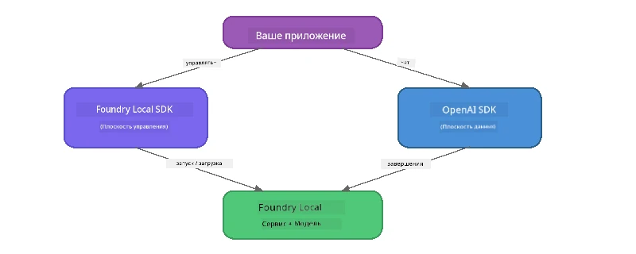

# Часть 3: Использование Foundry Local SDK с OpenAI

## Обзор

В Части 1 вы использовали Foundry Local CLI для интерактивного запуска моделей. В Части 2 вы изучали полный API SDK. Теперь вы научитесь **интегрировать Foundry Local в свои приложения** с помощью SDK и совместимого с OpenAI API.

Foundry Local предоставляет SDK для трёх языков. Выберите тот, с которым вам удобнее всего работать — концепции одинаковы для всех трёх.

## Цели обучения

К концу этой лабораторной работы вы сможете:

- Установить Foundry Local SDK для выбранного языка (Python, JavaScript или C#)
- Инициализировать `FoundryLocalManager` для запуска сервиса, проверки кэша, скачивания и загрузки модели
- Подключиться к локальной модели с помощью OpenAI SDK
- Отправлять завершения чата и обрабатывать потоковые ответы
- Понять архитектуру с динамическими портами

---

## Предварительные требования

Сначала завершите выполнение [Части 1: Начало работы с Foundry Local](part1-getting-started.md) и [Части 2: Глубокое погружение в Foundry Local SDK](part2-foundry-local-sdk.md).

Установите **один** из следующих рантаймов:
- **Python 3.9+** – [python.org/downloads](https://www.python.org/downloads/)
- **Node.js 18+** – [nodejs.org](https://nodejs.org/)
- **.NET 9.0+** – [dot.net/download](https://dotnet.microsoft.com/download)

---

## Концепция: как работает SDK

Foundry Local SDK управляет **плоскостью управления** (запуск сервиса, скачивание моделей), в то время как OpenAI SDK обрабатывает **плоскость данных** (отправка подсказок, получение завершений).



---

## Лабораторные упражнения

### Упражнение 1: Настройте среду

<details>
<summary><b>🐍 Python</b></summary>

```bash
cd python
python -m venv venv

# Активировать виртуальное окружение:
# Windows (PowerShell):
venv\Scripts\Activate.ps1
# Windows (Командная строка):
venv\Scripts\activate.bat
# macOS:
source venv/bin/activate

pip install -r requirements.txt
```

В `requirements.txt` устанавливаются:
- `foundry-local-sdk` – Foundry Local SDK (импортируется как `foundry_local`)
- `openai` – OpenAI Python SDK
- `agent-framework` – Microsoft Agent Framework (используется в последующих частях)

</details>

<details>
<summary><b>📘 JavaScript</b></summary>

```bash
cd javascript
npm install
```

В `package.json` устанавливаются:
- `foundry-local-sdk` – Foundry Local SDK
- `openai` – OpenAI Node.js SDK

</details>

<details>
<summary><b>💜 C#</b></summary>

```bash
cd csharp
dotnet restore
dotnet build
```

В `csharp.csproj` используются:
- `Microsoft.AI.Foundry.Local` – Foundry Local SDK (NuGet)
- `OpenAI` – OpenAI C# SDK (NuGet)

> **Структура проекта:** C# проект использует маршрутизатор командной строки в `Program.cs`, который направляет выполнение на отдельные файлы с примерами. Запустите `dotnet run chat` (или просто `dotnet run`) для этой части. Другие части используют `dotnet run rag`, `dotnet run agent` и `dotnet run multi`.

</details>

---

### Упражнение 2: Базовое завершение чата

Откройте базовый пример чата для вашего языка и изучите код. Каждый скрипт следует одинаковому трехэтапному шаблону:

1. **Запуск сервиса** – `FoundryLocalManager` запускает среду Foundry Local
2. **Скачивание и загрузка модели** – проверка кэша, скачивание при необходимости, затем загрузка в память
3. **Создание OpenAI клиента** – подключение к локальной точке доступа и отправка потокового завершения чата

<details>
<summary><b>🐍 Python - <code>python/foundry-local.py</code></b></summary>

```python
import sys
import openai
from foundry_local import FoundryLocalManager

alias = "phi-3.5-mini"

# Шаг 1: Создайте FoundryLocalManager и запустите сервис
print("Starting Foundry Local service...")
manager = FoundryLocalManager()
manager.start_service()

# Шаг 2: Проверьте, загружена ли модель
cached = manager.list_cached_models()
catalog_info = manager.get_model_info(alias)
is_cached = any(m.id == catalog_info.id for m in cached) if catalog_info else False

if is_cached:
    print(f"Model already downloaded: {alias}")
else:
    print(f"Downloading model: {alias} (this may take several minutes)...")
    manager.download_model(alias)
    print(f"Download complete: {alias}")

# Шаг 3: Загрузите модель в память
print(f"Loading model: {alias}...")
manager.load_model(alias)

# Создайте клиент OpenAI, указывающий на локальный сервис Foundry
client = openai.OpenAI(
    base_url=manager.endpoint,   # Динамический порт - никогда не используйте жесткую кодировку!
    api_key=manager.api_key
)

# Генерируйте потоковую завершенную чат-сессию
stream = client.chat.completions.create(
    model=manager.get_model_info(alias).id,
    messages=[{"role": "user", "content": "What is the golden ratio?"}],
    stream=True,
)

for chunk in stream:
    if chunk.choices[0].delta.content is not None:
        print(chunk.choices[0].delta.content, end="", flush=True)
print()
```

**Запуск:**
```bash
python foundry-local.py
```

</details>

<details>
<summary><b>📘 JavaScript - <code>javascript/foundry-local.mjs</code></b></summary>

```javascript
import { OpenAI } from "openai";
import { FoundryLocalManager } from "foundry-local-sdk";

const alias = "phi-3.5-mini";

// Шаг 1: Запустите локальный сервис Foundry
console.log("Starting Foundry Local service...");
FoundryLocalManager.create({ appName: "FoundryLocalWorkshop" });
const manager = FoundryLocalManager.instance;
await manager.startWebService();

// Шаг 2: Проверьте, загружена ли модель
const catalog = manager.catalog;
const model = await catalog.getModel(alias);

if (model.isCached) {
  console.log(`Model already downloaded: ${alias}`);
} else {
  console.log(`Downloading model: ${alias} (this may take several minutes)...`);
  await model.download();
  console.log(`Download complete: ${alias}`);
}

// Шаг 3: Загрузите модель в память
console.log(`Loading model: ${alias}...`);
await model.load();
console.log(`Model loaded: ${model.id}`);

// Создайте клиент OpenAI, указывающий на локальный сервис Foundry
const client = new OpenAI({
  baseURL: manager.urls[0] + "/v1",   // Динамический порт — никогда не задавайте жестко!
  apiKey: "foundry-local",
});

// Сгенерируйте потоковое завершение чата
const stream = await client.chat.completions.create({
  model: model.id,
  messages: [{ role: "user", content: "What is the golden ratio?" }],
  stream: true,
});

for await (const chunk of stream) {
  if (chunk.choices[0]?.delta?.content) {
    process.stdout.write(chunk.choices[0].delta.content);
  }
}
console.log();
```

**Запуск:**
```bash
node foundry-local.mjs
```

</details>

<details>
<summary><b>💜 C# - <code>csharp/BasicChat.cs</code></b></summary>

```csharp
using Microsoft.AI.Foundry.Local;
using Microsoft.Extensions.Logging.Abstractions;
using OpenAI;
using OpenAI.Chat;
using System.ClientModel;

var alias = "phi-3.5-mini";

// Step 1: Start the Foundry Local service
Console.WriteLine("Starting Foundry Local service...");
await FoundryLocalManager.CreateAsync(
    new Configuration
    {
        AppName = "FoundryLocalSamples",
        Web = new Configuration.WebService { Urls = "http://127.0.0.1:0" }
    }, NullLogger.Instance, default);
var manager = FoundryLocalManager.Instance;
await manager.StartWebServiceAsync(default);

// Step 2: Get the model from the catalog
var catalog = await manager.GetCatalogAsync(default);
var model = await catalog.GetModelAsync(alias, default);

// Step 3: Check if the model is already downloaded
var isCached = await model.IsCachedAsync(default);

if (isCached)
{
    Console.WriteLine($"Model already downloaded: {alias}");
}
else
{
    Console.WriteLine($"Downloading model: {alias} (this may take several minutes)...");
    await model.DownloadAsync(null, default);
    Console.WriteLine($"Download complete: {alias}");
}

// Step 4: Load the model into memory
Console.WriteLine($"Loading model: {alias}...");
await model.LoadAsync(default);
Console.WriteLine($"Loaded model: {model.Id}");
Console.WriteLine($"Endpoint: {manager.Urls[0]}");

// Create OpenAI client pointing to the LOCAL Foundry service
var key = new ApiKeyCredential("foundry-local");
var client = new OpenAIClient(key, new OpenAIClientOptions
{
    Endpoint = new Uri(manager.Urls[0] + "/v1")  // Dynamic port - never hardcode!
});

var chatClient = client.GetChatClient(model.Id);

// Stream a chat completion
var completionUpdates = chatClient.CompleteChatStreaming("What is the golden ratio?");

foreach (var update in completionUpdates)
{
    if (update.ContentUpdate.Count > 0)
    {
        Console.Write(update.ContentUpdate[0].Text);
    }
}
Console.WriteLine();
```

**Запуск:**
```bash
dotnet run chat
```

</details>

---

### Упражнение 3: Эксперименты с подсказками

Когда базовый пример запустится, попробуйте изменить код:

1. **Измените сообщение пользователя** – попробуйте разные вопросы
2. **Добавьте системную подсказку** – задайте модели персонаж
3. **Отключите потоковую передачу** – установите `stream=False` и выведите полный ответ целиком
4. **Попробуйте другую модель** – измените псевдоним с `phi-3.5-mini` на другую модель из `foundry model list`

<details>
<summary><b>🐍 Python</b></summary>

```python
# Добавьте системное приглашение - задайте модели персону:
stream = client.chat.completions.create(
    model=manager.get_model_info(alias).id,
    messages=[
        {"role": "system", "content": "You are a pirate. Answer everything in pirate speak."},
        {"role": "user", "content": "What is the golden ratio?"}
    ],
    stream=True,
)

# Или отключите потоковую передачу:
response = client.chat.completions.create(
    model=manager.get_model_info(alias).id,
    messages=[{"role": "user", "content": "What is the golden ratio?"}],
    stream=False,
)
print(response.choices[0].message.content)
```

</details>

<details>
<summary><b>📘 JavaScript</b></summary>

```javascript
// Добавьте системное приглашение - задайте модели персонажа:
const stream = await client.chat.completions.create({
  model: modelInfo.id,
  messages: [
    { role: "system", content: "You are a pirate. Answer everything in pirate speak." },
    { role: "user", content: "What is the golden ratio?" },
  ],
  stream: true,
});

// Или отключите потоковую передачу:
const response = await client.chat.completions.create({
  model: modelInfo.id,
  messages: [{ role: "user", content: "What is the golden ratio?" }],
  stream: false,
});
console.log(response.choices[0].message.content);
```

</details>

<details>
<summary><b>💜 C#</b></summary>

```csharp
// Add a system prompt - give the model a persona:
var completionUpdates = chatClient.CompleteChatStreaming(
    new ChatMessage[]
    {
        new SystemChatMessage("You are a pirate. Answer everything in pirate speak."),
        new UserChatMessage("What is the golden ratio?")
    }
);

// Or turn off streaming:
var response = chatClient.CompleteChat("What is the golden ratio?");
Console.WriteLine(response.Value.Content[0].Text);
```

</details>

---

### Справочник методов SDK

<details>
<summary><b>🐍 Методы Python SDK</b></summary>

| Метод | Назначение |
|--------|------------|
| `FoundryLocalManager()` | Создать экземпляр менеджера |
| `manager.start_service()` | Запустить сервис Foundry Local |
| `manager.list_cached_models()` | Список моделей, скачанных на устройстве |
| `manager.get_model_info(alias)` | Получить ID модели и метаданные |
| `manager.download_model(alias, progress_callback=fn)` | Скачать модель с опциональным callback прогресса |
| `manager.load_model(alias)` | Загрузить модель в память |
| `manager.endpoint` | Получить URL динамической точки доступа |
| `manager.api_key` | Получить API ключ (заглушка для локального режима) |

</details>

<details>
<summary><b>📘 Методы JavaScript SDK</b></summary>

| Метод | Назначение |
|--------|------------|
| `FoundryLocalManager.create({ appName })` | Создать экземпляр менеджера |
| `FoundryLocalManager.instance` | Доступ к синглтону менеджера |
| `await manager.startWebService()` | Запустить сервис Foundry Local |
| `await manager.catalog.getModel(alias)` | Получить модель из каталога |
| `model.isCached` | Проверить, скачана ли модель |
| `await model.download()` | Скачать модель |
| `await model.load()` | Загрузить модель в память |
| `model.id` | Получить ID модели для вызовов API OpenAI |
| `manager.urls[0] + "/v1"` | Получить URL динамической точки доступа |
| `"foundry-local"` | API ключ (заглушка для локального режима) |

</details>

<details>
<summary><b>💜 Методы C# SDK</b></summary>

| Метод | Назначение |
|--------|------------|
| `FoundryLocalManager.CreateAsync(config)` | Создать и инициализировать менеджер |
| `manager.StartWebServiceAsync()` | Запустить сервис Foundry Local |
| `manager.GetCatalogAsync()` | Получить каталог моделей |
| `catalog.ListModelsAsync()` | Получить список всех доступных моделей |
| `catalog.GetModelAsync(alias)` | Получить конкретную модель по псевдониму |
| `model.IsCachedAsync()` | Проверить, скачана ли модель |
| `model.DownloadAsync()` | Скачать модель |
| `model.LoadAsync()` | Загрузить модель в память |
| `manager.Urls[0]` | Получить URL динамической точки доступа |
| `new ApiKeyCredential("foundry-local")` | Учётные данные API ключа для локального режима |

</details>

---

### Упражнение 4: Использование нативного ChatClient (альтернатива OpenAI SDK)

В Упражнениях 2 и 3 вы использовали OpenAI SDK для завершения чатов. JavaScript и C# SDK также предоставляют **нативный ChatClient**, который избавляет от необходимости использовать OpenAI SDK.

<details>
<summary><b>📘 JavaScript - <code>model.createChatClient()</code></b></summary>

```javascript
import { FoundryLocalManager } from "foundry-local-sdk";

const alias = "phi-3.5-mini";

FoundryLocalManager.create({ appName: "ChatClientDemo" });
const manager = FoundryLocalManager.instance;
await manager.startWebService();

const model = await manager.catalog.getModel(alias);
if (!model.isCached) await model.download();
await model.load();

// Нет необходимости импортировать OpenAI — получите клиента напрямую из модели
const chatClient = model.createChatClient();

// Завершение без потока
const response = await chatClient.completeChat([
  { role: "system", content: "You are a pirate. Answer everything in pirate speak." },
  { role: "user", content: "What is the golden ratio?" }
]);
console.log(response.choices[0].message.content);

// Завершение с потоком (использует паттерн обратного вызова)
await chatClient.completeStreamingChat(
  [{ role: "user", content: "What is the golden ratio?" }],
  (chunk) => {
    if (chunk.choices?.[0]?.delta?.content) {
      process.stdout.write(chunk.choices[0].delta.content);
    }
  }
);
console.log();
```

> **Примечание:** `completeStreamingChat()` в ChatClient использует паттерн **callback**, а не асинхронный итератор. Передайте функцию вторым аргументом.

</details>

<details>
<summary><b>💜 C# - <code>model.GetChatClientAsync()</code></b></summary>

```csharp
var catalog = await manager.GetCatalogAsync(default);
var model = await catalog.GetModelAsync("phi-3.5-mini", default);
if (!await model.IsCachedAsync(default))
    await model.DownloadAsync(null, default);
await model.LoadAsync(default);

// No OpenAI NuGet needed — get a client directly from the model
var chatClient = await model.GetChatClientAsync(default);

// Use it like a standard OpenAI ChatClient
var response = chatClient.CompleteChat("What is the golden ratio?");
Console.WriteLine(response.Value.Content[0].Text);
```

</details>

> **Когда использовать что:**
> | Подход | Лучше всего для |
> |--------|-----------------|
> | OpenAI SDK | Полный контроль параметров, production-приложения, существующий OpenAI код |
> | Нативный ChatClient | Быстрое прототипирование, меньше зависимостей, проще настроить |

---

## Основные выводы

| Концепция | Чему вы научились |
|-----------|-------------------|
| Плоскость управления | Foundry Local SDK управляет запуском сервиса и загрузкой моделей |
| Плоскость данных | OpenAI SDK обрабатывает завершения чата и потоковые ответы |
| Динамические порты | Всегда используйте SDK для определения точки доступа; не жёстко кодируйте URL |
| Кросс-языковая совместимость | Одинаковый код работает на Python, JavaScript и C# |
| Совместимость с OpenAI | Полная совместимость с OpenAI API позволяет использовать существующий код OpenAI с минимальными изменениями |
| Нативный ChatClient | `createChatClient()` (JS) / `GetChatClientAsync()` (C#) предоставляет альтернативу OpenAI SDK |

---

## Следующие шаги

Продолжайте с [Частью 4: Создание приложения RAG](part4-rag-fundamentals.md), чтобы узнать, как построить конвейер Retrieval-Augmented Generation, работающий полностью на вашем устройстве.

---

<!-- CO-OP TRANSLATOR DISCLAIMER START -->
**Отказ от ответственности**:  
Этот документ был переведен с использованием сервиса автоматического перевода [Co-op Translator](https://github.com/Azure/co-op-translator). Несмотря на наши усилия по обеспечению точности, предупреждаем, что автоматический перевод может содержать ошибки или неточности. Оригинальный документ на исходном языке следует считать авторитетным источником. Для получения критически важной информации рекомендуется обратиться к профессиональному человеческому переводу. Мы не несем ответственности за любые недоразумения или неправильные толкования, возникшие в результате использования данного перевода.
<!-- CO-OP TRANSLATOR DISCLAIMER END -->