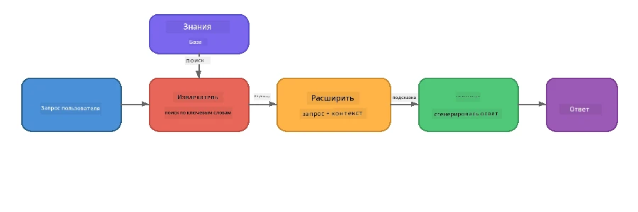

# Часть 4: Создание RAG-приложения с Foundry Local

## Обзор

Большие языковые модели мощные, но они знают только то, что было в их обучающих данных. **Retrieval-Augmented Generation (RAG)** решает эту проблему, предоставляя модели релевантный контекст во время запроса — извлекаемый из ваших собственных документов, баз данных или баз знаний.

На этой лабораторной работе вы построите полный конвейер RAG, который запускается **полностью на вашем устройстве** с помощью Foundry Local. Без облачных сервисов, без векторных баз данных, без API для эмбеддингов — только локальный поиск и локальная модель.

## Цели обучения

К концу этой лабораторной работы вы сможете:

- Объяснить, что такое RAG и почему это важно для AI-приложений
- Построить локальную базу знаний из текстовых документов
- Реализовать простую функцию поиска для нахождения релевантного контекста
- Составить системный запрос, который ориентирует модель на найденные факты
- Запустить полный конвейер Retrieve → Augment → Generate на устройстве
- Понять компромиссы между простым поиском по ключевым словам и векторным поиском

---

## Требования

- Завершить [Часть 3: Использование Foundry Local SDK с OpenAI](part3-sdk-and-apis.md)
- Установленный Foundry Local CLI и загруженная модель `phi-3.5-mini`

---

## Концепция: Что такое RAG?

Без RAG LLM может отвечать только на основе своих обучающих данных — которые могут быть устаревшими, неполными или не содержать вашей приватной информации:

```
User: "What is Zava's return policy?"
LLM:  "I do not have information about Zava's return policy."  ← No context!
```

С RAG вы сначала **извлекаете** релевантные документы, затем **дополняете** запрос этим контекстом перед тем, как **сгенерировать** ответ:



Ключевое понимание: **модели не нужно «знать» ответ; ей нужно просто прочитать нужные документы.**

---

## Лабораторные упражнения

### Упражнение 1: Изучите базу знаний

Откройте пример RAG для вашего языка и изучите базу знаний:

<details>
<summary><b>🐍 Python: <code>python/foundry-local-rag.py</code></b></summary>

База знаний — это простой список словарей с полями `title` и `content`:

```python
KNOWLEDGE_BASE = [
    {
        "title": "Foundry Local Overview",
        "content": (
            "Foundry Local brings the power of Azure AI Foundry to your local "
            "device without requiring an Azure subscription..."
        ),
    },
    {
        "title": "Supported Hardware",
        "content": (
            "Foundry Local automatically selects the best model variant for "
            "your hardware. If you have an Nvidia CUDA GPU it downloads the "
            "CUDA-optimized model..."
        ),
    },
    # ... больше записей
]
```

Каждая запись представляет собой «кусок» знаний — сфокусированную информацию по одной теме.

</details>

<details>
<summary><b>📘 JavaScript: <code>javascript/foundry-local-rag.mjs</code></b></summary>

База знаний использует ту же структуру, как массив объектов:

```javascript
const KNOWLEDGE_BASE = [
  {
    title: "Foundry Local Overview",
    content:
      "Foundry Local brings the power of Azure AI Foundry to your local " +
      "device without requiring an Azure subscription...",
  },
  {
    title: "Supported Hardware",
    content:
      "Foundry Local automatically selects the best model variant for " +
      "your hardware...",
  },
  // ... еще записи
];
```

</details>

<details>
<summary><b>💜 C#: <code>csharp/RagPipeline.cs</code></b></summary>

База знаний использует список именованных кортежей:

```csharp
private static readonly List<(string Title, string Content)> KnowledgeBase =
[
    ("Foundry Local Overview",
     "Foundry Local brings the power of Azure AI Foundry to your local " +
     "device without requiring an Azure subscription..."),

    ("Supported Hardware",
     "Foundry Local automatically selects the best model variant for " +
     "your hardware..."),

    // ... more entries
];
```

</details>

> **В настоящем приложении** база знаний получалась бы из файлов на диске, базы данных, поискового индекса или API. В этой лабораторной работе мы используем список в памяти для простоты.

---

### Упражнение 2: Понимание функции поиска

Шаг поиска находит самые релевантные куски для вопроса пользователя. В этом примере используется **перекрытие ключевых слов** — подсчет, сколько слов из запроса также встречается в каждом куске:

<details>
<summary><b>🐍 Python</b></summary>

```python
def retrieve(query: str, top_k: int = 2) -> list[dict]:
    """Return the top-k knowledge chunks most relevant to the query."""
    query_words = set(query.lower().split())
    scored = []
    for chunk in KNOWLEDGE_BASE:
        chunk_words = set(chunk["content"].lower().split())
        overlap = len(query_words & chunk_words)
        scored.append((overlap, chunk))
    scored.sort(key=lambda x: x[0], reverse=True)
    return [item[1] for item in scored[:top_k]]
```

</details>

<details>
<summary><b>📘 JavaScript</b></summary>

```javascript
function retrieve(query, topK = 2) {
  const queryWords = new Set(query.toLowerCase().split(/\s+/));
  const scored = KNOWLEDGE_BASE.map((chunk) => {
    const chunkWords = new Set(chunk.content.toLowerCase().split(/\s+/));
    let overlap = 0;
    for (const w of queryWords) {
      if (chunkWords.has(w)) overlap++;
    }
    return { overlap, chunk };
  });
  scored.sort((a, b) => b.overlap - a.overlap);
  return scored.slice(0, topK).map((s) => s.chunk);
}
```

</details>

<details>
<summary><b>💜 C#</b></summary>

```csharp
private static List<(string Title, string Content)> Retrieve(string query, int topK = 2)
{
    var queryWords = new HashSet<string>(
        query.ToLowerInvariant().Split(' ', StringSplitOptions.RemoveEmptyEntries));

    return KnowledgeBase
        .Select(chunk =>
        {
            var chunkWords = new HashSet<string>(
                chunk.Content.ToLowerInvariant().Split(' ', StringSplitOptions.RemoveEmptyEntries));
            var overlap = queryWords.Intersect(chunkWords).Count();
            return (Overlap: overlap, Chunk: chunk);
        })
        .OrderByDescending(x => x.Overlap)
        .Take(topK)
        .Select(x => x.Chunk)
        .ToList();
}
```

</details>

**Как это работает:**
1. Разбить запрос на отдельные слова
2. Для каждого куска знаний подсчитать, сколько слов из запроса встречаются в этом куске
3. Отсортировать по количеству совпадений (по убыванию)
4. Вернуть топ-k самых релевантных кусков

> **Компромисс:** Перекрытие ключевых слов просто, но ограничено; оно не понимает синонимы или смысл. В производственных системах RAG обычно используют **векторные эмбеддинги** и **векторные базы данных** для семантического поиска. Тем не менее, перекрытие ключевых слов — отличный старт и не требует дополнительных зависимостей.

---

### Упражнение 3: Понимание дополненного запроса

Извлечённый контекст вставляется в **системный запрос** перед его отправкой модели:

```python
system_prompt = (
    "You are a helpful assistant. Answer the user's question using ONLY "
    "the information provided in the context below. If the context does "
    "not contain enough information, say so.\n\n"
    f"Context:\n{context_text}"
)
```

Ключевые решения в дизайне:
- **«ТОЛЬКО предоставленная информация»** — предотвращает галлюцинации фактов, отсутствующих в контексте
- **«Если контекст недостаточен, укажите это»** — стимулирует честные ответы «Я не знаю»
- Контекст помещается в системное сообщение, чтобы формировать все последующие ответы

---

### Упражнение 4: Запустите конвейер RAG

Запустите полный пример:

**Python:**  
```bash
cd python
python foundry-local-rag.py
```
  
**JavaScript:**  
```bash
cd javascript
node foundry-local-rag.mjs
```
  
**C#:**  
```bash
cd csharp
dotnet run rag
```
  
Вы увидите три вещи в выводе:  
1. **Вопрос**, который задаётся  
2. **Извлечённый контекст** — выбранные куски из базы знаний  
3. **Ответ** — сгенерированный моделью, используя только этот контекст

Пример вывода:  
```
Question: How do I install Foundry Local and what hardware does it support?

--- Retrieved Context ---
### Installation
On Windows install Foundry Local with: winget install Microsoft.FoundryLocal...

### Supported Hardware
Foundry Local automatically selects the best model variant for your hardware...
-------------------------

Answer: To install Foundry Local, you can use the following methods depending
on your operating system: On Windows, run `winget install Microsoft.FoundryLocal`.
On macOS, use `brew install microsoft/foundrylocal/foundrylocal`...
```
  
Обратите внимание, что ответ модели **основан** на извлечённом контексте — он упоминает только факты из документов базы знаний.

---

### Упражнение 5: Экспериментируйте и расширяйте

Попробуйте эти изменения, чтобы глубже понять процесс:

1. **Измените вопрос** — спросите что-то, что ЕСТЬ в базе знаний, и что-то, чего НЕТ:  
   ```python
   question = "What programming languages does Foundry Local support?"  # ← В контексте
   question = "How much does Foundry Local cost?"                       # ← Не в контексте
   ```
  Модель корректно скажет «Я не знаю», когда ответа нет в контексте?

2. **Добавьте новый кусок знаний** — добавьте новую запись в `KNOWLEDGE_BASE`:  
   ```python
   {
       "title": "Pricing",
       "content": "Foundry Local is completely free and open source under the MIT license.",
   }
   ```
  Теперь снова задайте вопрос о ценах.

3. **Измените `top_k`** — извлеките больше или меньше кусков:  
   ```python
   context_chunks = retrieve(question, top_k=3)  # Больше контекста
   context_chunks = retrieve(question, top_k=1)  # Меньше контекста
   ```
  Как количество контекста влияет на качество ответа?

4. **Удалите инструкцию обоснования** — поменяйте системный запрос на просто «Вы — полезный помощник.» и проверьте, начнёт ли модель галлюцинировать факты.

---

## Глубокое погружение: Оптимизация RAG для работы на устройстве

Запуск RAG на устройстве накладывает ограничения, которых нет в облаке: ограниченная ОЗУ, отсутствие выделенного GPU (выполнение на CPU/NPU), небольшой контекстный размер модели. Ниже перечислены решения, которые напрямую учитывают эти ограничения и основаны на опыте продакшн-стиля локальных RAG-приложений с Foundry Local.

### Стратегия разбиения на куски: фиксированное окно с перекрытием

Разбиение — как вы делите документы на части — одно из самых важных решений в любой RAG-системе. Для сценариев на устройстве рекомендуется начинать с **фиксированного размера окна с перекрытием**:

| Параметр | Рекомендуемое значение | Причина |
|-----------|-----------------------|---------|
| **Размер куска** | ~200 токенов | Позволяет держать контекст компактным, оставляя место в контекстном окне Phi-3.5 Mini для системного запроса, истории переписки и сгенерированного ответа |
| **Перекрытие** | ~25 токенов (12,5%) | Предотвращает потерю информации на границах кусков — важно для процедур и пошаговых инструкций |
| **Токенизация** | Разделение пробелами | Нет зависимостей, не нужна библиотека токенизатора. Весь ресурс идёт на LLM |

Перекрытие работает как скользящее окно: каждый новый кусок начинается на 25 токенов раньше, чем закончился предыдущий, поэтому предложения, пересекающиеся границы кусков, появляются в обоих.

> **Почему не другие стратегии?**  
> - **Разбиение по предложениям** даёт непредсказуемый размер кусков; некоторые процедуры — это одни длинные предложения, которые плохо разбиваются  
> - **Разбиение по разделам** (по заголовкам `##`) создаёт сильно разный размер кусков — некоторые слишком маленькие, другие слишком большие для контекстного окна модели  
> - **Семантическое разбиение** (на основе эмбеддингов и темы) даёт лучшее качество поиска, но требует второй модели в памяти рядом с Phi-3.5 Mini — рискованно для устройств с 8-16 ГБ памяти

### Улучшенный поиск: векторы TF-IDF

Метод перекрытия ключевых слов в лабораторной работе работает, но если хочется лучшего поиска без добавления модели эмбеддингов, **TF-IDF (Term Frequency-Inverse Document Frequency)** — отличный компромисс:

```
Keyword Overlap  →  TF-IDF Vectors  →  Embedding Models
    (this lab)     (lightweight upgrade)   (production)
  Simple & fast    Better ranking,         Best quality,
  No dependencies  still no ML model       requires embedding model
  ~Basic matching  ~1ms retrieval          ~100-500ms per query
```
  
TF-IDF преобразует каждый кусок в числовой вектор, основанный на важности каждого слова внутри куска *относительно всех кусков*. В момент запроса вопрос векторизуется аналогично и сравнивается с помощью косинусного сходства. Это можно реализовать с помощью SQLite и чисто на JavaScript/Python — без векторной базы и API эмбеддингов.

> **Производительность:** Косинусное сходство TF-IDF по кускам фиксированного размера обычно занимает **около 1 мс**, по сравнению с ~100-500 мс при кодировании каждого запроса моделью эмбеддингов. Все 20+ документов можно разбить на куски и индексировать менее чем за секунду.

### Режим Edge/Compact для ограниченных устройств

При запуске на очень слабом железе (старые ноутбуки, планшеты, полевые устройства) можно снизить потребление ресурсов, уменьшая три параметра:

| Настройка | Стандартный режим | Edge/Compact режим |
|-----------|------------------|--------------------|
| **Системный запрос** | ~300 токенов | ~80 токенов |
| **Максимум токенов вывода** | 1024 | 512 |
| **Извлечённые куски (top-k)** | 5 | 3 |

Меньше извлечённых кусков — меньше контекста для обработки моделью, что снижает задержки и нагрузку на память. Короткий системный запрос освобождает больше места в контекстном окне для основного ответа. Такой компромисс оправдан на устройствах, где каждый токен контекстного окна важен.

### Одна модель в памяти

Одно из важнейших правил он-девис RAG: **держите в памяти только одну модель**. Если используете модель эмбеддингов для поиска *и* языковую модель для генерации, вы делите ограниченные ресурсы NPU/ОЗУ между двумя моделями. Лёгкий поиск (перекрытие ключевых слов, TF-IDF) полностью этого избегает:

- Нет модели эмбеддингов, конкурирующей с LLM за память  
- Быстрый холодный старт — загружается только одна модель  
- Предсказуемое использование памяти — LLM получает все ресурсы  
- Работает на машинах с 8 ГБ ОЗУ

### SQLite как локальное хранилище векторов

Для небольших и средних коллекций документов (от сотен до низких тысяч кусков) **SQLite достаточно быстр** для поиска косинусного сходства в лоб и не требует инфраструктуры:

- Один `.db` файл на диске — без серверных процессов и настроек  
- Входит во все основные среды: Python `sqlite3`, Node.js `better-sqlite3`, .NET `Microsoft.Data.Sqlite`  
- Хранит куски документов и их TF-IDF векторы в одной таблице  
- Нет необходимости в Pinecone, Qdrant, Chroma или FAISS на таких масштабах

### Итоги по производительности

Эти архитектурные решения дают отзывчивый RAG на бытовом железе:

| Показатель | Производительность на устройстве |
|------------|---------------------------------|
| **Задержка поиска** | ~1 мс (TF-IDF) до ~5 мс (перекрытие ключевых слов) |
| **Скорость индексации** | 20 документов разбиты и проиндексированы менее чем за 1 секунду |
| **Модели в памяти** | 1 (только LLM — без модели эмбеддингов) |
| **Объем хранения** | < 1 МБ для кусков и векторов в SQLite |
| **Холодный старт** | Загрузка одной модели, без запуска эмбеддингового окружения |
| **Минимальные требования** | 8 ГБ ОЗУ, CPU-only (GPU не требуется) |

> **Когда стоит обновиться:** При масштабировании до сотен длинных документов, смешанных типов контента (таблицы, код, проза) или необходимости семантического понимания запросов стоит добавить модель эмбеддингов и перейти на поиск по векторному сходству. Для большинства он-девис кейсов с узконаправленными наборами документов TF-IDF + SQLite дают отличные результаты с минимальными затратами ресурсов.

---

## Ключевые понятия

| Понятие | Описание |
|---------|----------|
| **Поиск (Retrieval)** | Нахождение релевантных документов в базе знаний на основе запроса пользователя |
| **Дополнение (Augmentation)** | Вставка найденных документов в запрос в качестве контекста |
| **Генерация (Generation)** | LLM формирует ответ, основанный на предоставленном контексте |
| **Разбиение (Chunking)** | Деление больших документов на маленькие, сфокусированные части |
| **Обоснование (Grounding)** | Ограничение модели использованием только предоставленного контекста (уменьшает галлюцинации) |
| **Top-k** | Количество самых релевантных кусков, которые извлекаются |

---

## RAG в продакшене против этой лабораторной работы

| Аспект | Эта лабораторная | Оптимизация под устройство | Облако (продакшен) |
|--------|------------------|----------------------------|--------------------|
| **База знаний** | Список в памяти | Файлы на диске, SQLite | База данных, поисковый индекс |
| **Поиск** | Перекрытие ключевых слов | TF-IDF + косинусное сходство | Векторные эмбеддинги + поиск по вектору |
| **Эмбеддинги** | Не нужны | Не нужны — TF-IDF векторы | Модель эмбеддингов (локальная или облачная) |
| **Векторное хранилище** | Не нужно | SQLite (один `.db` файл) | FAISS, Chroma, Azure AI Search и др. |
| **Разбиение** | Ручное | Фиксированное окно (~200 токенов, 25 токенов перекрытия) | Семантическое или рекурсивное разбиение |
| **Модели в памяти** | 1 (LLM) | 1 (LLM) | 2+ (эмбеддинг + LLM) |
| **Задержка извлечения** | ~5 мс | ~1 мс | ~100-500 мс |
| **Масштаб** | 5 документов | Сотни документов | Миллионы документов |

Шаблоны, которые вы изучаете здесь (извлечение, дополнение, генерация), одинаковы на любом масштабе. Метод извлечения улучшается, но общая архитектура остается идентичной. Средний столбец показывает, что возможно на устройстве с использованием легковесных техник, часто это оптимальный вариант для локальных приложений, где вы жертвуете масштабом облака ради конфиденциальности, офлайн-работы и нулевой задержки при обращении к внешним сервисам.

---

## Основные выводы

| Концепция | Что вы узнали |
|-----------|---------------|
| Шаблон RAG | Получение + Дополнение + Генерация: предоставьте модели правильный контекст, и она сможет отвечать на вопросы о ваших данных |
| На устройстве | Всё работает локально без облачных API или подписок на векторные базы данных |
| Инструкции заземления | Ограничения системного запроса критичны для предотвращения галлюцинаций |
| Перекрытие ключевых слов | Простой, но эффективный старт для извлечения |
| TF-IDF + SQLite | Легкий путь обновления, который удерживает время извлечения менее 1 мс без модели эмбеддингов |
| Одна модель в памяти | Избегайте загрузки модели эмбеддингов вместе с большим языковым моделем на ограниченном оборудовании |
| Размер чанка | Примерно 200 токенов с перекрытием обеспечивает баланс между точностью извлечения и эффективностью окна контекста |
| Режим Edge/compact | Используйте меньше чанков и более короткие подсказки для очень ограниченных устройств |
| Универсальный шаблон | Та же архитектура RAG работает с любым источником данных: документы, базы данных, API или вики |

> **Хотите увидеть полноценное приложение RAG на устройстве?** Ознакомьтесь с [Gas Field Local RAG](https://github.com/leestott/local-rag) — офлайн-агентом RAG промышленного типа, созданным с Foundry Local и Phi-3.5 Mini, демонстрирующим эти оптимизационные шаблоны на реальном наборе документов.

---

## Следующие шаги

Продолжайте с [Часть 5: Создание AI-агентов](part5-single-agents.md), чтобы узнать, как создавать интеллектуальных агентов с персонажами, инструкциями и многократными диалогами с использованием Microsoft Agent Framework.

---

<!-- CO-OP TRANSLATOR DISCLAIMER START -->
**Отказ от ответственности**:  
Этот документ был переведен с использованием сервиса машинного перевода [Co-op Translator](https://github.com/Azure/co-op-translator). Несмотря на наши усилия обеспечить точность, имейте в виду, что автоматический перевод может содержать ошибки или неточности. Оригинальный документ на его исходном языке следует считать авторитетным источником. Для критически важной информации рекомендуется обратиться к профессиональному человеческому переводу. Мы не несем ответственности за любые недоразумения или неправильные толкования, возникшие в результате использования этого перевода.
<!-- CO-OP TRANSLATOR DISCLAIMER END -->