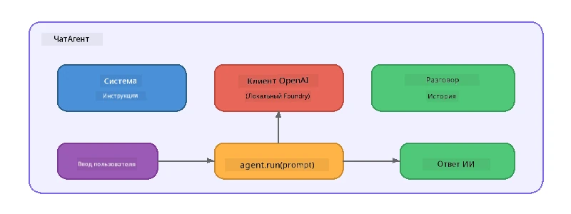

# Часть 5: Создание AI-Агентов с помощью Agent Framework

> **Цель:** Построить вашего первого AI-агента с постоянными инструкциями и определённой персоной, работающего на локальной модели через Foundry Local.

## Что такое AI-Агент?

AI-агент оборачивает языковую модель с помощью **системных инструкций**, которые определяют его поведение, личность и ограничения. В отличие от одиночного вызова chat completion, агент предоставляет:

- **Персону** — постоянную идентичность («Вы — полезный рецензент кода»)
- **Память** — историю разговора по ходам
- **Специализацию** — сфокусированное поведение, управляемое тщательно составленными инструкциями



---

## Microsoft Agent Framework

**Microsoft Agent Framework** (AGF) предоставляет стандартную абстракцию агента, работающую с разными бекендами моделей. В этой мастерской мы используем его вместе с Foundry Local, чтобы всё работало на вашем компьютере — без необходимости в облаке.

| Понятие | Описание |
|---------|-------------|
| `FoundryLocalClient` | Python: отвечает за запуск сервиса, скачивание/загрузку модели и создание агентов |
| `client.as_agent()` | Python: создаёт агента из клиента Foundry Local |
| `AsAIAgent()` | C#: метод расширения `ChatClient` — создаёт `AIAgent` |
| `instructions` | Системный промпт, формирующий поведение агента |
| `name` | Читаемая метка, полезна в сценариях с несколькими агентами |
| `agent.run(prompt)` / `RunAsync()` | Отправляет сообщение пользователя и возвращает ответ агента |

> **Примечание:** Agent Framework имеет SDK для Python и .NET. Для JavaScript мы реализуем лёгкий класс `ChatAgent`, который повторяет этот же паттерн с использованием OpenAI SDK напрямую.

---

## Упражнения

### Упражнение 1 — Понять паттерн агента

Перед написанием кода изучите основные компоненты агента:

1. **Клиент модели** — подключается к совместимому с OpenAI API Foundry Local
2. **Системные инструкции** — промпт с "личностью"
3. **Цикл запуска** — отправка ввода от пользователя, получение вывода

> **Подумайте:** Чем системные инструкции отличаются от обычного сообщения пользователя? Что произойдёт, если изменить их?

---

### Упражнение 2 — Запустить пример с одним агентом

<details>
<summary><strong>🐍 Python</strong></summary>

**Требования:**
```bash
cd python
python -m venv venv

# Windows (PowerShell):
venv\Scripts\Activate.ps1
# macOS:
source venv/bin/activate

pip install -r requirements.txt
```

**Запуск:**
```bash
python foundry-local-with-agf.py
```

**Прогон кода** (`python/foundry-local-with-agf.py`):

```python
import asyncio
from agent_framework_foundry_local import FoundryLocalClient

async def main():
    alias = "phi-4-mini"

    # FoundryLocalClient обрабатывает запуск сервиса, загрузку модели и ее загрузку
    client = FoundryLocalClient(model_id=alias)
    print(f"Client Model ID: {client.model_id}")

    # Создайте агента с системными инструкциями
    agent = client.as_agent(
        name="Joker",
        instructions="You are good at telling jokes.",
    )

    # Без потоковой передачи: получить полный ответ сразу
    result = await agent.run("Tell me a joke about a pirate.")
    print(f"Agent: {result}")

    # Потоковая передача: получать результаты по мере их генерации
    async for chunk in agent.run("Tell me another joke.", stream=True):
        if chunk.text:
            print(chunk.text, end="", flush=True)

asyncio.run(main())
```

**Основные моменты:**
- `FoundryLocalClient(model_id=alias)` в одной операции запускает сервис, скачивает и загружает модель
- `client.as_agent()` создаёт агента с системными инструкциями и именем
- `agent.run()` поддерживает как режим без стрима, так и потоковый (streaming)
- Установка через `pip install agent-framework-foundry-local --pre`

</details>

<details>
<summary><strong>📦 JavaScript</strong></summary>

**Требования:**
```bash
cd javascript
npm install
```

**Запуск:**
```bash
node foundry-local-with-agent.mjs
```

**Прогон кода** (`javascript/foundry-local-with-agent.mjs`):

```javascript
import { OpenAI } from "openai";
import { FoundryLocalManager } from "foundry-local-sdk";

class ChatAgent {
  constructor({ client, modelId, instructions, name }) {
    this.client = client;
    this.modelId = modelId;
    this.instructions = instructions;
    this.name = name;
    this.history = [];
  }

  async run(userMessage) {
    const messages = [
      { role: "system", content: this.instructions },
      ...this.history,
      { role: "user", content: userMessage },
    ];
    const response = await this.client.chat.completions.create({
      model: this.modelId,
      messages,
    });
    const assistantMessage = response.choices[0].message.content;

    // Сохранять историю разговора для многошаговых взаимодействий
    this.history.push({ role: "user", content: userMessage });
    this.history.push({ role: "assistant", content: assistantMessage });
    return { text: assistantMessage };
  }
}

async function main() {
  FoundryLocalManager.create({ appName: "FoundryLocalWorkshop" });
  const manager = FoundryLocalManager.instance;
  await manager.startWebService();

  const catalog = manager.catalog;
  const model = await catalog.getModel("phi-3.5-mini");
  if (!model.isCached) {
    console.log("Downloading model: phi-3.5-mini...");
    await model.download();
  }
  await model.load();

  const client = new OpenAI({
    baseURL: manager.urls[0] + "/v1",
    apiKey: "foundry-local",
  });

  const agent = new ChatAgent({
    client,
    modelId: model.id,
    instructions: "You are good at telling jokes.",
    name: "Joker",
  });

  const result = await agent.run("Tell me a joke about a pirate.");
  console.log(result.text);
}

main();
```

**Основные моменты:**
- JavaScript создаёт собственный класс `ChatAgent`, повторяющий паттерн Python AGF
- `this.history` хранит историю разговоров для поддержки нескольких ходов
- Явный вызов `startWebService()` → проверка кэша → `model.download()` → `model.load()` обеспечивает полный контроль

</details>

<details>
<summary><strong>💜 C#</strong></summary>

**Требования:**
```bash
cd csharp
dotnet restore
```

**Запуск:**
```bash
dotnet run agent
```

**Прогон кода** (`csharp/SingleAgent.cs`):

```csharp
using Microsoft.AI.Foundry.Local;
using Microsoft.Extensions.Logging.Abstractions;
using Microsoft.Agents.AI;
using OpenAI;
using System.ClientModel;

// 1. Start Foundry Local and load a model
var alias = "phi-3.5-mini";
await FoundryLocalManager.CreateAsync(
    new Configuration
    {
        AppName = "FoundryLocalSamples",
        Web = new Configuration.WebService { Urls = "http://127.0.0.1:0" }
    }, NullLogger.Instance, default);
var manager = FoundryLocalManager.Instance;
await manager.StartWebServiceAsync(default);

var catalog = await manager.GetCatalogAsync(default);
var model = await catalog.GetModelAsync(alias, default);

var isCached = await model.IsCachedAsync(default);
if (!isCached)
{
    Console.WriteLine($"Downloading model: {alias}...");
    await model.DownloadAsync(null, default);
}
await model.LoadAsync(default);

var key = new ApiKeyCredential("foundry-local");
var client = new OpenAIClient(key, new OpenAIClientOptions
{
    Endpoint = new Uri(manager.Urls[0] + "/v1")
});

// 2. Create an AIAgent using the Agent Framework extension method
AIAgent joker = client
    .GetChatClient(model.Id)
    .AsAIAgent(
        instructions: "You are good at telling jokes. Keep your jokes short and family-friendly.",
        name: "Joker"
    );

// 3. Run the agent (non-streaming)
var response = await joker.RunAsync("Tell me a joke about a pirate.");
Console.WriteLine($"Joker: {response}");

// 4. Run with streaming
await foreach (var update in joker.RunStreamingAsync("Tell me another joke."))
{
    Console.Write(update);
}
```

**Основные моменты:**
- `AsAIAgent()` — метод расширения из `Microsoft.Agents.AI.OpenAI` — не требуется свой класс `ChatAgent`
- `RunAsync()` возвращает полный ответ; `RunStreamingAsync()` транслирует токен за токеном
- Установка через `dotnet add package Microsoft.Agents.AI.OpenAI --version 1.0.0-rc3`

</details>

---

### Упражнение 3 — Изменить персону

Измените `instructions` агента, чтобы создать другую персону. Попробуйте каждую и посмотрите, как меняется вывод:

| Персона | Инструкции |
|---------|-------------|
| Рецензент кода | `"Вы — эксперт по рецензированию кода. Давайте конструктивную обратную связь, сосредоточенную на читаемости, производительности и корректности."` |
| Туристический гид | `"Вы — дружелюбный туристический гид. Предлагайте персонализированные рекомендации по направлениям, мероприятиям и местной кухне."` |
| Сократический наставник | `"Вы — сократический наставник. Никогда не давайте прямых ответов — вместо этого направляйте студента продуманными вопросами."` |
| Технический писатель | `"Вы — технический писатель. Объясняйте концепции ясно и кратко. Используйте примеры. Избегайте жаргона."` |

**Попробуйте:**
1. Выберите персону из таблицы
2. Замените строку `instructions` в коде
3. Отредактируйте запрос пользователя соответственно (например, попросите рецензента кода проверить функцию)
4. Запустите пример снова и сравните выход

> **Совет:** Качество агента сильно зависит от инструкций. Конкретные, чётко структурированные инструкции дают лучший результат, чем расплывчатые.

---

### Упражнение 4 — Добавить поддержку общения в несколько ходов

Расширьте пример, чтобы поддерживался цикл чата с несколькими ходами для диалога с агентом.

<details>
<summary><strong>🐍 Python — цикл с несколькими ходами</strong></summary>

```python
import asyncio
from agent_framework_foundry_local import FoundryLocalClient

async def main():
    client = FoundryLocalClient(model_id="phi-4-mini")

    agent = client.as_agent(
        name="Assistant",
        instructions="You are a helpful assistant.",
    )

    print("Chat with the agent (type 'quit' to exit):\n")
    while True:
        user_input = input("You: ")
        if user_input.strip().lower() in ("quit", "exit"):
            break
        result = await agent.run(user_input)
        print(f"Agent: {result}\n")

asyncio.run(main())
```

</details>

<details>
<summary><strong>📦 JavaScript — цикл с несколькими ходами</strong></summary>

```javascript
import { OpenAI } from "openai";
import { FoundryLocalManager } from "foundry-local-sdk";
import * as readline from "node:readline/promises";

// (повторное использование класса ChatAgent из Упражнения 2)

async function main() {
  FoundryLocalManager.create({ appName: "FoundryLocalWorkshop" });
  const manager = FoundryLocalManager.instance;
  await manager.startWebService();

  const catalog = manager.catalog;
  const model = await catalog.getModel("phi-3.5-mini");
  if (!model.isCached) {
    console.log("Downloading model: phi-3.5-mini...");
    await model.download();
  }
  await model.load();

  const client = new OpenAI({
    baseURL: manager.urls[0] + "/v1",
    apiKey: "foundry-local",
  });

  const agent = new ChatAgent({
    client,
    modelId: model.id,
    instructions: "You are a helpful assistant.",
    name: "Assistant",
  });

  const rl = readline.createInterface({
    input: process.stdin,
    output: process.stdout,
  });

  console.log("Chat with the agent (type 'quit' to exit):\n");
  while (true) {
    const userInput = await rl.question("You: ");
    if (["quit", "exit"].includes(userInput.trim().toLowerCase())) break;
    const result = await agent.run(userInput);
    console.log(`Agent: ${result.text}\n`);
  }
  rl.close();
}

main();
```

</details>

<details>
<summary><strong>💜 C# — цикл с несколькими ходами</strong></summary>

```csharp
using Microsoft.AI.Foundry.Local;
using Microsoft.Extensions.Logging.Abstractions;
using Microsoft.Agents.AI;
using OpenAI;
using System.ClientModel;

var alias = "phi-3.5-mini";
var config = new Configuration
{
    AppName = "FoundryLocalSamples",
    Web = new Configuration.WebService { Urls = "http://127.0.0.1:0" }
};
await FoundryLocalManager.CreateAsync(config, NullLogger.Instance, default);
var manager = FoundryLocalManager.Instance;
await manager.StartWebServiceAsync(default);

var catalog = await manager.GetCatalogAsync(default);
var model = await catalog.GetModelAsync(alias, default);

var isCached = await model.IsCachedAsync(default);
if (!isCached)
{
    Console.WriteLine($"Downloading model: {alias}...");
    await model.DownloadAsync(null, default);
}
await model.LoadAsync(default);

var key = new ApiKeyCredential("foundry-local");
var client = new OpenAIClient(key, new OpenAIClientOptions
{
    Endpoint = new Uri(manager.Urls[0] + "/v1")
});

AIAgent agent = client
    .GetChatClient(model.Id)
    .AsAIAgent(
        instructions: "You are a helpful assistant.",
        name: "Assistant"
    );

Console.WriteLine("Chat with the agent (type 'quit' to exit):\n");
while (true)
{
    Console.Write("You: ");
    var userInput = Console.ReadLine();
    if (string.IsNullOrWhiteSpace(userInput) ||
        userInput.Equals("quit", StringComparison.OrdinalIgnoreCase) ||
        userInput.Equals("exit", StringComparison.OrdinalIgnoreCase))
        break;

    var result = await agent.RunAsync(userInput);
    Console.WriteLine($"Agent: {result}\n");
}
```

</details>

Обратите внимание, как агент запоминает предыдущие ходы — задайте дополнительный вопрос и увидьте, как сохраняется контекст.

---

### Упражнение 5 — Структурированный вывод

Настройте агента так, чтобы он всегда отвечал в определённом формате (например, JSON) и распарсьте результат:

<details>
<summary><strong>🐍 Python — JSON вывод</strong></summary>

```python
import asyncio
import json
from agent_framework_foundry_local import FoundryLocalClient

async def main():
    client = FoundryLocalClient(model_id="phi-4-mini")

    agent = client.as_agent(
        name="SentimentAnalyzer",
        instructions=(
            "You are a sentiment analysis agent. "
            "For every user message, respond ONLY with valid JSON in this format: "
            '{"sentiment": "positive|negative|neutral", "confidence": 0.0-1.0, "summary": "brief reason"}'
        ),
    )

    result = await agent.run("I absolutely loved the new restaurant downtown!")
    print("Raw:", result)

    try:
        parsed = json.loads(str(result))
        print(f"Sentiment: {parsed['sentiment']} (confidence: {parsed['confidence']})")
    except json.JSONDecodeError:
        print("Agent did not return valid JSON - try refining the instructions.")

asyncio.run(main())
```

</details>

<details>
<summary><strong>💜 C# — JSON вывод</strong></summary>

```csharp
using System.Text.Json;

AIAgent analyzer = chatClient.AsAIAgent(
    name: "SentimentAnalyzer",
    instructions:
        "You are a sentiment analysis agent. " +
        "For every user message, respond ONLY with valid JSON in this format: " +
        "{\"sentiment\": \"positive|negative|neutral\", \"confidence\": 0.0-1.0, \"summary\": \"brief reason\"}"
);

var response = await analyzer.RunAsync("I absolutely loved the new restaurant downtown!");
Console.WriteLine($"Raw: {response}");

try
{
    var parsed = JsonSerializer.Deserialize<JsonElement>(response.ToString());
    Console.WriteLine($"Sentiment: {parsed.GetProperty("sentiment")} " +
                      $"(confidence: {parsed.GetProperty("confidence")})");
}
catch (JsonException)
{
    Console.WriteLine("Agent did not return valid JSON - try refining the instructions.");
}
```

</details>

> **Примечание:** Маленькие локальные модели не всегда могут выдать идеально валидный JSON. Чтобы повысить надёжность, включайте пример в инструкции и максимально чётко указывайте ожидаемый формат.

---

## Основные выводы

| Понятие | Что вы узнали |
|---------|-----------------|
| Агент vs. прямой вызов LLM | Агент оборачивает модель инструкциями и памятью |
| Системные инструкции | Самый важный инструмент для управления поведением агента |
| Многоходовой разговор | Агенты могут сохранять контекст через несколько взаимодействий с пользователем |
| Структурированный вывод | Инструкции могут принудительно задавать формат вывода (JSON, markdown и т. д.) |
| Локальный запуск | Всё работает на устройстве через Foundry Local — облако не требуется |

---

## Следующие шаги

В **[Части 6: Мультиагентные рабочие процессы](part6-multi-agent-workflows.md)** вы объедините нескольких агентов в координированный пайплайн, где каждый агент имеет специализированную роль.

---

<!-- CO-OP TRANSLATOR DISCLAIMER START -->
**Отказ от ответственности**:  
Этот документ был переведен с помощью сервиса автоматического перевода [Co-op Translator](https://github.com/Azure/co-op-translator). Несмотря на то, что мы стремимся к точности, имейте в виду, что автоматический перевод может содержать ошибки или неточности. Оригинальный документ на родном языке следует считать авторитетным источником. Для критически важной информации рекомендуется профессиональный перевод человеком. Мы не несем ответственности за любые недоразумения или неверные толкования, возникшие в результате использования данного перевода.
<!-- CO-OP TRANSLATOR DISCLAIMER END -->