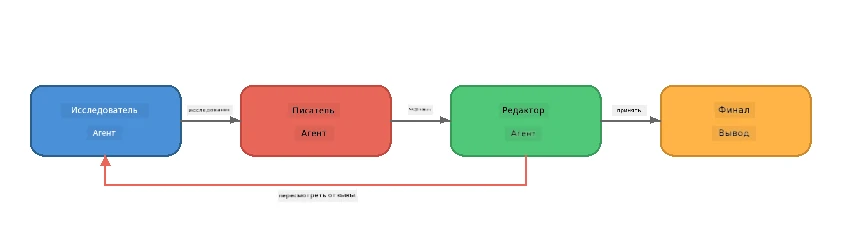
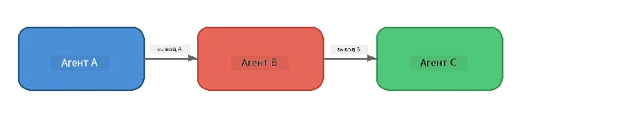
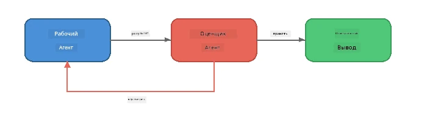
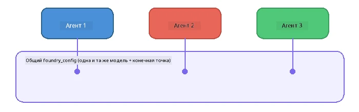

# Часть 6: Многоагентные рабочие процессы

> **Цель:** Объединить нескольких специализированных агентов в согласованные конвейеры, которые разделяют сложные задачи между сотрудничающими агентами — все это работает локально с Foundry Local.

## Зачем многоагентные системы?

Один агент может справляться со многими задачами, но сложные рабочие процессы выигрывают от **специализации**. Вместо того чтобы один агент пытался одновременно исследовать, писать и редактировать, работу разбивают на сфокусированные роли:



| Шаблон | Описание |
|---------|-------------|
| **Последовательный** | Вывод Агента A поступает агенту B → агенту C |
| **Цикл обратной связи** | Агент-оценщик может отправлять работу на доработку |
| **Общий контекст** | Все агенты используют одну модель/эндпоинт, но разные инструкции |
| **Типизированный вывод** | Агенты создают структурированные результаты (JSON) для надежной передачи |

---

## Упражнения

### Упражнение 1 – Запуск многоагентного конвейера

В этом семинаре есть полный рабочий процесс: Исследователь → Писатель → Редактор.

<details>
<summary><strong>🐍 Python</strong></summary>

**Настройка:**
```bash
cd python
python -m venv venv

# Windows (PowerShell):
venv\Scripts\Activate.ps1
# macOS:
source venv/bin/activate

pip install -r requirements.txt
```

**Запуск:**
```bash
python foundry-local-multi-agent.py
```

**Что происходит:**
1. **Исследователь** получает тему и возвращает основные факты в виде списока
2. **Писатель** берет исследование и пишет черновик блога (3-4 абзаца)
3. **Редактор** проверяет статью на качество и выдает ПРИНЯТЬ или ДОРАБОТАТЬ

</details>

<details>
<summary><strong>📦 JavaScript</strong></summary>

**Настройка:**
```bash
cd javascript
npm install
```

**Запуск:**
```bash
node foundry-local-multi-agent.mjs
```

**Тот же трехэтапный конвейер** — Исследователь → Писатель → Редактор.

</details>

<details>
<summary><strong>💜 C#</strong></summary>

**Настройка:**
```bash
cd csharp
dotnet restore
```

**Запуск:**
```bash
dotnet run multi
```

**Тот же трехэтапный конвейер** — Исследователь → Писатель → Редактор.

</details>

---

### Упражнение 2 – Структура конвейера

Изучите, как определяются и связываются агенты:

**1. Общий клиент модели**

Все агенты используют один и тот же Foundry Local:

```python
# Python - FoundryLocalClient обрабатывает всё
from agent_framework_foundry_local import FoundryLocalClient

client = FoundryLocalClient(model_id="phi-3.5-mini")
```

```javascript
// JavaScript - OpenAI SDK, направленный на локальный сервер Foundry
const client = new OpenAI({
  baseURL: manager.urls[0] + "/v1",
  apiKey: "foundry-local",
});
```

```csharp
// C# - OpenAIClient pointed at Foundry Local
var key = new ApiKeyCredential("foundry-local");
var client = new OpenAIClient(key, new OpenAIClientOptions
{
    Endpoint = new Uri(manager.Urls[0] + "/v1")
});
var chatClient = client.GetChatClient(model.Id);
```

**2. Специализированные инструкции**

У каждого агента уникальная персона:

| Агент | Инструкции (кратко) |
|-------|----------------------|
| Исследователь | "Предоставьте ключевые факты, статистику и фон. Организуйте в виде пунктов." |
| Писатель | "Напишите интересный блог пост (3-4 абзаца) на основе заметок исследования. Не выдумывайте факты." |
| Редактор | "Проверьте на ясность, грамматику и соответствие фактам. Решение: ПРИНЯТЬ или ДОРАБОТАТЬ." |

**3. Потоки данных между агентами**

```python
# Шаг 1 - вывод исследователя становится входом для писателя
research_result = await researcher.run(f"Research: {topic}")

# Шаг 2 - вывод писателя становится входом для редактора
writer_result = await writer.run(f"Write using:\n{research_result}")

# Шаг 3 - редактор просматривает и исследование, и статью
editor_result = await editor.run(
    f"Research:\n{research_result}\n\nArticle:\n{writer_result}"
)
```

```csharp
// C# - same pattern, async calls with AIAgent
var researchNotes = await researcher.RunAsync(
    $"Research the following topic and provide key facts:\n{topic}");

var draft = await writer.RunAsync(
    $"Write a blog post based on these research notes:\n\n{researchNotes}");

var verdict = await editor.RunAsync(
    $"Review this article for quality and accuracy.\n\n" +
    $"Research notes:\n{researchNotes}\n\n" +
    $"Article:\n{draft}");
```

> **Ключевой вывод:** Каждый агент получает накопленный контекст от предыдущих агентов. Редактор видит и оригинальное исследование, и черновик — это позволяет проверить точность фактов.

---

### Упражнение 3 – Добавьте четвертого агента

Расширьте конвейер, добавив нового агента. Выберите одного:

| Агент | Назначение | Инструкции |
|-------|---------|-------------|
| **Фактчекинг** | Проверка заявлений в статье | `"Вы проверяете фактические утверждения. Для каждого утверждения укажите, подтверждается ли оно заметками исследования. Верните JSON с проверенными/непроверенными элементами."` |
| **Создатель заголовков** | Создает цепляющие заголовки | `"Сгенерируйте 5 вариантов заголовков для статьи. Разнообразьте стиль: информативный, кликбейт, вопрос, список, эмоциональный."` |
| **Соцсети** | Создает промо-посты | `"Создайте 3 поста для соцсетей, рекламирующих эту статью: один для Twitter (280 символов), один для LinkedIn (профессиональный тон), один для Instagram (неформальный с предложениями эмодзи)."` |

<details>
<summary><strong>🐍 Python – добавление Создателя заголовков</strong></summary>

```python
headline_agent = client.as_agent(
    name="HeadlineWriter",
    instructions=(
        "You are a headline specialist. Given an article, generate exactly "
        "5 headline options. Vary the style: informative, question-based, "
        "listicle, emotional, and provocative. Return them as a numbered list."
    ),
)

# После того как редактор одобрит, сгенерировать заголовки
headline_result = await headline_agent.run(
    f"Generate headlines for this article:\n\n{writer_result}"
)
print(f"\n--- Headlines ---\n{headline_result}")
```

</details>

<details>
<summary><strong>📦 JavaScript – добавление Создателя заголовков</strong></summary>

```javascript
const headlineAgent = new ChatAgent({
  client,
  modelId: modelInfo.id,
  instructions:
    "You are a headline specialist. Given an article, generate exactly " +
    "5 headline options. Vary the style: informative, question-based, " +
    "listicle, emotional, and provocative. Return them as a numbered list.",
  name: "HeadlineWriter",
});

const headlineResult = await headlineAgent.run(
  `Generate headlines for this article:\n\n${writerResult.text}`
);
console.log(`\n--- Headlines ---\n${headlineResult.text}`);
```

</details>

<details>
<summary><strong>💜 C# – добавление Создателя заголовков</strong></summary>

```csharp
AIAgent headlineAgent = chatClient.AsAIAgent(
    name: "HeadlineWriter",
    instructions:
        "You are a headline specialist. Given an article, generate exactly " +
        "5 headline options. Vary the style: informative, question-based, " +
        "listicle, emotional, and provocative. Return them as a numbered list."
);

// After the editor accepts, generate headlines
var headlines = await headlineAgent.RunAsync(
    $"Generate headlines for this article:\n\n{draft}");
Console.WriteLine($"\n--- Headlines ---\n{headlines}");
```

</details>

---

### Упражнение 4 – Разработайте свой рабочий процесс

Создайте многоагентный конвейер для другой области. Вот несколько идей:

| Область | Агенты | Поток |
|--------|--------|-------|
| **Код-ревью** | Анализатор → Рецензент → Итоговый доклад | Анализ структуры кода → проверка на ошибки → создание сводного отчета |
| **Поддержка клиентов** | Классификатор → Ответчик → QA | Классификация тикета → составление ответа → проверка качества |
| **Образование** | Создатель тестов → Имитация ученика → Оценщик | Создание теста → моделирование ответов → оценка и объяснение |
| **Анализ данных** | Интерпретатор → Аналитик → Репортер | Интерпретация запроса → анализ паттернов → написание отчета |

**Шаги:**
1. Определите 3+ агента с уникальными `instructions`
2. Решите, как данные будут передаваться: что получает и создает каждый агент?
3. Реализуйте конвейер, используя шаблоны из упражнений 1–3 
4. Добавьте цикл обратной связи, если один агент должен оценивать работу другого

---

## Шаблоны оркестрации

Ниже приведены шаблоны оркестрации, применимые к любой многоагентной системе (подробно описаны в [Части 7](part7-zava-creative-writer.md)):

### Последовательный конвейер



Каждый агент обрабатывает вывод предыдущего. Просто и предсказуемо.

### Цикл обратной связи



Агент-оценщик может инициировать повторное выполнение предыдущих этапов. В Zava Writer редактор может отправлять обратную связь исследователю и писателю.

### Общий контекст



Все агенты используют одну и ту же `foundry_config`, чтобы работать с одной моделью и эндпоинтом.

---

## Основные выводы

| Концепция | Чему вы научились |
|---------|-----------------|
| Специализация агента | Каждый агент хорошо выполняет одну задачу согласно четким инструкциям |
| Передача данных | Вывод одного агента становится входом для следующего |
| Циклы обратной связи | Агент-оценщик может запускать повторы для повышения качества |
| Структурированный вывод | Ответы в формате JSON обеспечивают надежное взаимодействие между агентами |
| Оркестрация | Координатор управляет последовательностью конвейера и обработкой ошибок |
| Производственные шаблоны | Применяются в [Части 7: Zava Creative Writer](part7-zava-creative-writer.md) |

---

## Следующие шаги

Продолжайте с [Часть 7: Zava Creative Writer — выпускаемое приложение](part7-zava-creative-writer.md), чтобы изучить многоагентное приложение производственного уровня с 4 специализированными агентами, потоковым выводом, поиском по продукту и циклами обратной связи — доступно на Python, JavaScript и C#.

---

<!-- CO-OP TRANSLATOR DISCLAIMER START -->
**Отказ от ответственности**:  
Этот документ был переведен с помощью сервиса машинного перевода [Co-op Translator](https://github.com/Azure/co-op-translator). Несмотря на наши усилия по обеспечению точности, имейте в виду, что автоматические переводы могут содержать ошибки или неточности. Оригинальный документ на языке оригинала следует считать авторитетным источником. Для критически важной информации рекомендуется профессиональный перевод человеком. Мы не несем ответственности за любые недоразумения или неправильные толкования, возникшие в результате использования этого перевода.
<!-- CO-OP TRANSLATOR DISCLAIMER END -->