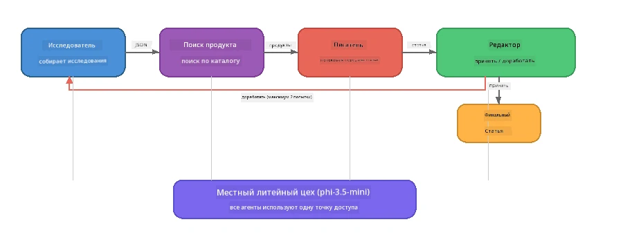

# Часть 7: Творческий писатель Zava - Итоговое приложение

> **Цель:** Исследовать производственное многоагентное приложение, в котором четыре специализированных агента сотрудничают для создания статей уровня журнала для Zava Retail DIY — полностью работающее на вашем устройстве с Foundry Local.

Это **итоговая лабораторная работа** мастер-класса. Она объединяет всё, что вы изучили — интеграцию SDK (Часть 3), поиск информации из локальных данных (Часть 4), персоны агентов (Часть 5) и оркестровку многоагентных систем (Часть 6) — в полноценное приложение, доступное на **Python**, **JavaScript** и **C#**.

---

## Что вы изучите

| Концепция | Где в Zava Writer |
|-----------|--------------------|
| Загрузка модели в 4 шага | Общий модуль конфигурации запускает Foundry Local |
| Извлечение по принципу RAG | Агент продуктов ищет в локальном каталоге |
| Специализация агентов | 4 агента с разными системными подсказками |
| Потоковый вывод | Писатель выдаёт токены в реальном времени |
| Структурированные передачи | Исследователь → JSON, Редактор → JSON с решением |
| Циклы обратной связи | Редактор может инициировать повторное выполнение (макс. 2 попытки) |

---

## Архитектура

Zava Creative Writer использует **последовательный конвейер с обратной связью, управляемой оценщиком**. Все три реализации следуют одинаковой архитектуре:



### Четыре агента

| Агент | Входные данные | Выходные данные | Назначение |
|-------|----------------|-----------------|------------|
| **Исследователь** | Тема + необязательная обратная связь | `{"web": [{url, name, description}, ...]}` | Собирает фоновое исследование через LLM |
| **Поиск продуктов** | Строка с контекстом продукта | Список подходящих продуктов | Запросы, сгенерированные LLM + ключевой поиск по локальному каталогу |
| **Писатель** | Исследование + продукты + задание + обратная связь | Потоковый текст статьи (разделённый по `---`) | Создаёт черновик статьи уровня журнала в реальном времени |
| **Редактор** | Статья + саморефлексия писателя | `{"decision": "accept/revise", "editorFeedback": "...", "researchFeedback": "..."}` | Проверяет качество, запускает повтор при необходимости |

### Ход конвейера

1. **Исследователь** получает тему и создаёт структурированные заметки исследования (JSON)
2. **Поиск продуктов** ищет в локальном каталоге, используя запросы, сгенерированные LLM
3. **Писатель** объединяет исследование + продукты + задание в потоковую статью, добавляя саморефлексию после разделителя `---`
4. **Редактор** оценивает статью и возвращает JSON-вердикт:
   - `"accept"` → конвейер завершается
   - `"revise"` → обратная связь отправляется Исследователю и Писателю (макс. 2 попытки)

---

## Требования

- Завершите [Часть 6: Многоагентные рабочие процессы](part6-multi-agent-workflows.md)
- Установлен Foundry Local CLI и загружена модель `phi-3.5-mini`

---

## Упражнения

### Упражнение 1 – Запуск Zava Creative Writer

Выберите ваш язык и запустите приложение:

<details>
<summary><strong>🐍 Python – веб-сервис FastAPI</strong></summary>

Версия на Python работает как **веб-сервис** с REST API, демонстрируя, как создать производственный backend.

**Установка:**
```bash
cd zava-creative-writer-local/src/api
python -m venv venv

# Windows (PowerShell):
venv\Scripts\Activate.ps1
# macOS:
source venv/bin/activate

pip install -r requirements.txt
```

**Запуск:**
```bash
uvicorn main:app --reload
```

**Тестирование:**
```bash
curl -X POST http://localhost:8000/api/article \
  -H "Content-Type: application/json" \
  -d '{
    "research": "DIY home improvement trends",
    "products": "power tools and paints",
    "assignment": "Write an article about weekend renovation projects for DIY enthusiasts"
  }'
```

Ответ поступает в виде потоковых JSON-сообщений, разделённых переводами строки, показывающих прогресс каждого агента.

</details>

<details>
<summary><strong>📦 JavaScript – CLI на Node.js</strong></summary>

Версия на JavaScript работает как **CLI-приложение**, выводя прогресс агентов и статью напрямую в консоль.

**Установка:**
```bash
cd zava-creative-writer-local/src/javascript
npm install
```

**Запуск:**
```bash
node main.mjs
```

Вы увидите:
1. Загрузку модели Foundry Local (с индикатором прогресса при скачивании)
2. Последовательное выполнение каждого агента с сообщениями о состоянии
3. Текст статьи в реальном времени, выводимый в консоль
4. Решение редактора «принять/переработать»

</details>

<details>
<summary><strong>💜 C# – консольное приложение .NET</strong></summary>

Версия на C# работает как **консольное приложение .NET** с тем же конвейером и потоковым выводом.

**Установка:**
```bash
cd zava-creative-writer-local/src/csharp
dotnet restore
```

**Запуск:**
```bash
dotnet run
```

Вывод аналогичен версии на JavaScript — сообщения состояния агентов, потоковая статья и вердикт редактора.

</details>

---

### Упражнение 2 – Изучите структуру кода

Каждая реализация имеет одинаковые логические компоненты. Сравните их структуру:

**Python** (`src/api/`):
| Файл | Назначение |
|-------|------------|
| `foundry_config.py` | Общий менеджер Foundry Local, модель и клиент (инициализация в 4 шага) |
| `orchestrator.py` | Координация конвейера с обратной связью |
| `main.py` | Точки доступа FastAPI (`POST /api/article`) |
| `agents/researcher/researcher.py` | Исследование с выводом JSON через LLM |
| `agents/product/product.py` | Запросы LLM + ключевой поиск |
| `agents/writer/writer.py` | Генерация статьи в потоке |
| `agents/editor/editor.py` | Решение в формате JSON «принять/переработать» |

**JavaScript** (`src/javascript/`):
| Файл | Назначение |
|-------|------------|
| `foundryConfig.mjs` | Общая конфигурация Foundry Local (4 шага с индикатором прогресса) |
| `main.mjs` | Оркестратор + точка входа CLI |
| `researcher.mjs` | Агент исследования с LLM |
| `product.mjs` | Генерация запросов LLM + поиск по ключевым словам |
| `writer.mjs` | Генерация статьи в потоке (асинхронный генератор) |
| `editor.mjs` | Решение «принять/переработать» в JSON |
| `products.mjs` | Данные каталога продуктов |

**C#** (`src/csharp/`):
| Файл | Назначение |
|-------|------------|
| `Program.cs` | Полный конвейер: загрузка модели, агенты, оркестратор, цикл обратной связи |
| `ZavaCreativeWriter.csproj` | Проект .NET 9 с Foundry Local + пакетами OpenAI |

> **Примечание по дизайну:** Python разделяет каждого агента в отдельном файле/папке (подходит для больших команд). JavaScript использует по одному модулю на агента (подходит для средних проектов). C# хранит всё в одном файле с локальными функциями (удобно для самостоятельных примеров). В производстве выбирайте шаблон в соответствии с принятыми у вашей команды стандартами.

---

### Упражнение 3 – Отследите общую конфигурацию

Каждый агент использует общий клиент модели Foundry Local. Изучите, как это настроено на каждом языке:

<details>
<summary><strong>🐍 Python – foundry_config.py</strong></summary>

```python
from foundry_local import FoundryLocalManager

MODEL_ALIAS = "phi-3.5-mini"

# Шаг 1: Создайте менеджер и запустите службу Foundry Local
manager = FoundryLocalManager()
manager.start_service()

# Шаг 2: Проверьте, загружена ли модель
cached = manager.list_cached_models()
catalog_info = manager.get_model_info(MODEL_ALIAS)
is_cached = any(m.id == catalog_info.id for m in cached) if catalog_info else False

if not is_cached:
    manager.download_model(MODEL_ALIAS)

# Шаг 3: Загрузите модель в память
manager.load_model(MODEL_ALIAS)
model_id = manager.get_model_info(MODEL_ALIAS).id

# Общий клиент OpenAI
client = openai.OpenAI(base_url=manager.endpoint, api_key=manager.api_key)
```

Все агенты импортируют `from foundry_config import client, model_id`.

</details>

<details>
<summary><strong>📦 JavaScript – foundryConfig.mjs</strong></summary>

```javascript
import { FoundryLocalManager } from "foundry-local-sdk";
import { OpenAI } from "openai";

FoundryLocalManager.create({ appName: "ZavaCreativeWriter" });
const manager = FoundryLocalManager.instance;
await manager.startWebService();

// Проверить кэш → скачать → загрузить (новый шаблон SDK)
const catalog = manager.catalog;
const model = await catalog.getModel(MODEL_ALIAS);
if (!model.isCached) {
  console.log(`Downloading model: ${MODEL_ALIAS}...`);
  await model.download();
}
await model.load();

const client = new OpenAI({ baseURL: manager.urls[0] + "/v1", apiKey: "foundry-local" });
const modelId = model.id;
export { client, modelId };
```

Все агенты импортируют `{ client, modelId } from "./foundryConfig.mjs"`.

</details>

<details>
<summary><strong>💜 C# – верхняя часть Program.cs</strong></summary>

```csharp
await FoundryLocalManager.CreateAsync(
    new Configuration
    {
        AppName = "ZavaCreativeWriter",
        Web = new Configuration.WebService { Urls = "http://127.0.0.1:0" }
    }, NullLogger.Instance, default);
var manager = FoundryLocalManager.Instance;
await manager.StartWebServiceAsync(default);

var catalog = await manager.GetCatalogAsync(default);
var catalogModel = await catalog.GetModelAsync(alias, default);
var isCached = await catalogModel.IsCachedAsync(default);
if (!isCached)
    await catalogModel.DownloadAsync(null, default);

await catalogModel.LoadAsync(default);
var key = new ApiKeyCredential("foundry-local");
var chatClient = new OpenAIClient(key, new OpenAIClientOptions
{
    Endpoint = new Uri(manager.Urls[0] + "/v1")
}).GetChatClient(catalogModel.Id);
```

Клиент `chatClient` передается всем функциям агентов в том же файле.

</details>

> **Ключевой паттерн:** Паттерн загрузки модели (запуск сервиса → проверка кэша → загрузка → загрузка модели) гарантирует, что пользователь видит прогресс и модель скачивается только один раз. Это лучшая практика для любого приложения Foundry Local.

---

### Упражнение 4 – Поймите цикл обратной связи

Цикл обратной связи делает конвейер «умным» – редактор может отправить работу на доработку. Проследите логику:

```
Orchestrator:
  1. researcher.research(topic, "No Feedback")    ← first pass
  2. product.findProducts(productContext)
  3. writer.write(research, products, assignment)  ← streams article
  4. Split article at "---" → article + writerFeedback
  5. editor.edit(article, writerFeedback)

  WHILE editor says "revise" AND retryCount < 2:
    6. researcher.research(topic, editor.researchFeedback)  ← refined
    7. writer.write(research, products, editor.editorFeedback)
    8. editor.edit(newArticle, newWriterFeedback)
    9. retryCount++
```

**Вопросы для размышления:**
- Почему лимит повторов установлен в 2? Что если увеличить?
- Почему исследователь получает `researchFeedback`, а писатель – `editorFeedback`?
- Что будет, если редактор всегда выбирает «переработать»?

---

### Упражнение 5 – Измените агента

Попробуйте изменить поведение одного из агентов и посмотрите, как это повлияет на конвейер:

| Модификация | Что изменить |
|-------------|--------------|
| **Строже редактор** | Измените системную подсказку редактора, чтобы он всегда требовал хотя бы одну доработку |
| **Более длинные статьи** | Измените подсказку писателя с "800-1000 слов" на "1500-2000 слов" |
| **Другие продукты** | Добавьте или измените продукты в каталоге |
| **Новая тема исследования** | Замените значение `researchContext` на другую тему |
| **Исследователь только в JSON** | Сделайте, чтобы исследователь возвращал 10 элементов вместо 3-5 |

> **Совет:** Поскольку все три языка реализуют одну архитектуру, можете внести изменения в том, с которым вам удобнее работать.

---

### Упражнение 6 – Добавьте пятого агента

Расширьте конвейер новым агентом. Например:

| Агент | Место в конвейере | Назначение |
|-------|-------------------|------------|
| **Фактче́кер** | После Писателя, перед Редактором | Проверяет факты на основе данных исследования |
| **SEO-оптимизатор** | После принятия редактором | Добавляет метаописание, ключевые слова, ярлык URL |
| **Иллюстратор** | После принятия редактором | Генерирует подсказки для изображений статьи |
| **Переводчик** | После принятия редактором | Переводит статью на другой язык |

**Шаги:**
1. Написать системную подсказку агента
2. Создать функцию агента (следуя существующему шаблону вашего языка)
3. Вставить её в оркестратор в нужном месте
4. Обновить вывод/логи для отображения вклада нового агента

---

## Как работают Foundry Local и агентская платформа вместе

Это приложение демонстрирует рекомендуемый паттерн построения многоагентных систем с Foundry Local:

| Уровень | Компонент | Роль |
|---------|-----------|------|
| **Время выполнения** | Foundry Local | Загружает, управляет и обслуживает модель локально |
| **Клиент** | OpenAI SDK | Отправляет чат-запросы на локальную конечную точку |
| **Агент** | Системная подсказка + чат-вызов | специализированное поведение через фокусированные инструкции |
| **Оркестратор** | Координатор конвейера | Управляет потоком данных, последовательностью и циклами обратной связи |
| **Фреймворк** | Microsoft Agent Framework | Обеспечивает абстракцию `ChatAgent` и шаблоны |

Ключевой вывод: **Foundry Local заменяет облачный backend, а не архитектуру приложения.** Те же паттерны агентов, стратегии оркестрации и структурированные передачи, которые работают с облачными моделями, работают так же с локальными — вы просто указываете клиенту локальный endpoint вместо Azure.

---

## Основные выводы

| Концепция | Чему вы научились |
|-----------|-------------------|
| Производственная архитектура | Как строить многоагентное приложение с общей конфигурацией и отдельными агентами |
| Загрузка модели в 4 шага | Лучшая практика инициализации Foundry Local с видимым прогрессом |
| Специализация агентов | Каждый из 4 агентов получает фокусированные инструкции и специфичный формат вывода |
| Потоковая генерация | Писатель выдаёт токены в реальном времени, что позволяет создавать отзывчивые интерфейсы |
| Циклы обратной связи | Попытки повторения по инициативе редактора улучшают качество без вмешательства человека |
| Кросс-языковые паттерны | Одинаковая архитектура работает на Python, JavaScript и C# |
| Локальная модель = готовность к производству | Foundry Local предоставляет тот же OpenAI-совместимый API, что и облачные деплои |

---

## Следующий шаг

Перейдите к [Части 8: Разработка основанная на оценке](part8-evaluation-led-development.md), чтобы создать систематическую систему оценки ваших агентов с помощью эталонных наборов данных, правил проверки и оценки ролей LLM в качестве судьи.

---

<!-- CO-OP TRANSLATOR DISCLAIMER START -->
**Отказ от ответственности**:
Этот документ был переведен с помощью сервиса автоматического перевода [Co-op Translator](https://github.com/Azure/co-op-translator). Несмотря на наши усилия по обеспечению точности, имейте в виду, что автоматические переводы могут содержать ошибки или неточности. Оригинальный документ на родном языке следует считать авторитетным источником. Для критически важной информации рекомендуются профессиональные услуги человеческого перевода. Мы не несем ответственности за любые недоразумения или неправильные толкования, возникшие в результате использования данного перевода.
<!-- CO-OP TRANSLATOR DISCLAIMER END -->