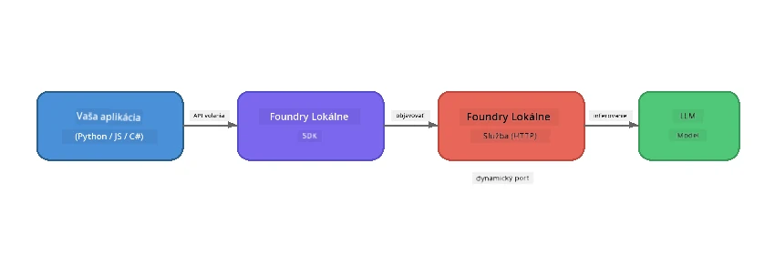

# Časť 1: Začíname s Foundry Local


## Čo je Foundry Local?

[Foundry Local](https://foundrylocal.ai) vám umožňuje spúšťať open-source AI jazykové modely **priamo na vašom počítači** - nie je potrebné pripojenie na internet, žiadne náklady na cloud a kompletné súkromie údajov. Tento nástroj:

- **Sťahuje a spúšťa modely lokálne** s automatickou optimalizáciou hardvéru (GPU, CPU alebo NPU)
- **Poskytuje OpenAI-kompatibilné API** takže môžete používať známe SDK a nástroje
- **Nevyžaduje predplatné Azure** ani registráciu - stačí nainštalovať a začať vytvárať

Môžete si to predstaviť ako vlastného súkromného AI, ktorý beží výhradne na vašom zariadení.

## Ciele učenia

Na konci tohto labu budete vedieť:

- Nainštalovať Foundry Local CLI na váš operačný systém
- Rozumieť, čo sú aliasy modelov a ako fungujú
- Stiahnuť a spustiť svoj prvý lokálny AI model
- Poslať chatovaciu správu lokálnemu modelu z príkazového riadku
- Rozlíšiť rozdiel medzi lokálnymi a cloud-hostovanými AI modelmi

---

## Požiadavky

### Systémové požiadavky

| Požiadavka | Minimálne | Odporúčané |
|-------------|---------|-------------|
| **RAM** | 8 GB | 16 GB |
| **Diskový priestor** | 5 GB (pre modely) | 10 GB |
| **CPU** | 4 jadrá | 8+ jadier |
| **GPU** | Voliteľné | NVIDIA s CUDA 11.8+ |
| **OS** | Windows 10/11 (x64/ARM), Windows Server 2025, macOS 13+ | - |

> **Poznámka:** Foundry Local automaticky vyberá najlepšiu variantu modelu pre váš hardvér. Ak máte NVIDIA GPU, využíva akceleráciu CUDA. Ak máte Qualcomm NPU, využíva ho. Inak použije optimalizovanú CPU variantu.

### Inštalácia Foundry Local CLI

**Windows** (PowerShell):
```powershell
winget install Microsoft.FoundryLocal
```

**macOS** (Homebrew):
```bash
brew tap microsoft/foundrylocal
brew install foundrylocal
```

> **Poznámka:** Foundry Local momentálne podporuje len Windows a macOS. Linux zatiaľ nie je podporovaný.

Overte inštaláciu:
```bash
foundry --version
```

---

## Cvičenia v laboratóriu

### Cvičenie 1: Preskúmajte dostupné modely

Foundry Local obsahuje katalóg predoptimalizovaných open-source modelov. Vypíšte ich:

```bash
foundry model list
```

Uvidíte modely ako:
- `phi-3.5-mini` - Microsoft model s 3,8 miliardami parametrov (rýchly, dobrá kvalita)
- `phi-4-mini` - Novší, schopnejší Phi model
- `phi-4-mini-reasoning` - Phi model s reťazovým uvažovaním (`<think>` značky)
- `phi-4` - Najväčší Phi model od Microsoftu (10,4 GB)
- `qwen2.5-0.5b` - Veľmi malý a rýchly (vhodný pre zariadenia s nízkymi zdrojmi)
- `qwen2.5-7b` - Silný všeobecný model s podporou volania nástrojov
- `qwen2.5-coder-7b` - Optimalizovaný na generovanie kódu
- `deepseek-r1-7b` - Výkonný model na uvažovanie
- `gpt-oss-20b` - Veľký open-source model (MIT licencia, 12,5 GB)
- `whisper-base` - Prepis reči na text (383 MB)
- `whisper-large-v3-turbo` - Vysokopresný prepis (9 GB)

> **Čo je alias modelu?** Aliasy ako `phi-3.5-mini` sú skratky. Keď použijete alias, Foundry Local automaticky stiahne najlepšiu variantu pre váš špecifický hardvér (CUDA pre NVIDIA GPU, optimalizované CPU inak). Nemusíte si zbytočne vyberať správnu variantu.

### Cvičenie 2: Spustite svoj prvý model

Stiahnite si a začnite konverzovať s modelom interaktívne:

```bash
foundry model run phi-3.5-mini
```

Pri prvom spustení Foundry Local:
1. Zistí váš hardvér
2. Stiahne optimálnu variantu modelu (môže to chvíľu trvať)
3. Načíta model do pamäte
4. Spustí interaktívnu chatovaciu reláciu

Skúste sa ho niečo opýtať:
```
You: What is the golden ratio?
You: Can you explain it as if I were 10 years old?
You: Write a haiku about mathematics
```

Na ukončenie napíšte `exit` alebo stlačte `Ctrl+C`.

### Cvičenie 3: Predbežne stiahnite model

Ak chcete model stiahnuť bez spustenia chatu:

```bash
foundry model download phi-3.5-mini
```

Skontrolujte, ktoré modely už máte stiahnuté na svojom zariadení:

```bash
foundry cache list
```

### Cvičenie 4: Pochopte architektúru

Foundry Local beží ako **lokálna HTTP služba**, ktorá poskytuje OpenAI-kompatibilné REST API. To znamená:

1. Služba sa spúšťa na **dynamickom porte** (iný port zakaždým)
2. Používate SDK na zistenie skutočnej adresy URL koncového bodu
3. Môžete použiť **akúkoľvek** OpenAI-kompatibilnú knižnicu klienta na komunikáciu



> **Dôležité:** Foundry Local priraďuje **dynamický port** pri každom spustení. Nikdy nepíšte do kódu pevne číslo portu ako `localhost:5272`. Vždy používajte SDK na zistenie aktuálnej URL (napr. `manager.endpoint` v Pythone alebo `manager.urls[0]` v JavaScripte).

---

## Kľúčové poznatky

| Koncept | Čo ste sa naučili |
|---------|------------------|
| AI na zariadení | Foundry Local spúšťa modely úplne na vašom zariadení bez cloudu, API kľúčov a nákladov |
| Alias modelu | Aliasy ako `phi-3.5-mini` automaticky vyberajú najlepšiu variantu pre váš hardvér |
| Dynamické porty | Služba beží na dynamickom porte; vždy používajte SDK na získanie koncového bodu |
| CLI a SDK | Môžete komunikovať s modelmi cez CLI (`foundry model run`) alebo programaticky cez SDK |

---

## Ďalšie kroky

Pokračujte na [Časť 2: Hlboký pohľad na Foundry Local SDK](part2-foundry-local-sdk.md), aby ste ovládli API SDK na správu modelov, služieb a cache programaticky.