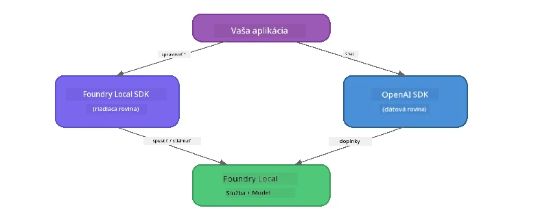

# Časť 3: Používanie Foundry Local SDK s OpenAI

## Prehľad

V časti 1 ste používali Foundry Local CLI na interaktívne spúšťanie modelov. V časti 2 ste preskúmali celý povrch API SDK. Teraz sa naučíte **integrovať Foundry Local do svojich aplikácií** pomocou SDK a API kompatibilného s OpenAI.

Foundry Local poskytuje SDK pre tri jazyky. Vyberte si ten, s ktorým ste najpohodlnejší – koncepty sú identické vo všetkých troch.

## Ciele učenia

Na konci tohto laboratória budete vedieť:

- Nainštalovať Foundry Local SDK pre váš jazyk (Python, JavaScript alebo C#)
- Inicializovať `FoundryLocalManager` na spustenie služby, kontrolu cache, stiahnutie a načítanie modelu
- Pripojiť sa k lokálnemu modelu pomocou OpenAI SDK
- Posielať chatové dokončenia a spracovávať streamingové odpovede
- Porozumieť dynamickej architektúre portov

---

## Predpoklady

Najskôr dokončite [Časť 1: Začíname s Foundry Local](part1-getting-started.md) a [Časť 2: Detailný ponor do Foundry Local SDK](part2-foundry-local-sdk.md).

Nainštalujte **jeden** z nasledujúcich jazykových runtime:
- **Python 3.9+** - [python.org/downloads](https://www.python.org/downloads/)
- **Node.js 18+** - [nodejs.org](https://nodejs.org/)
- **.NET 9.0+** - [dot.net/download](https://dotnet.microsoft.com/download)

---

## Koncept: Ako SDK funguje

Foundry Local SDK spravuje **riadiacu rovinu** (spúšťanie služby, sťahovanie modelov), zatiaľ čo OpenAI SDK spracováva **dátovú rovinu** (odosielanie promptov, prijímanie dokončení).



---

## Laboratórne cvičenia

### Cvičenie 1: Nastavte si prostredie

<details>
<summary><b>🐍 Python</b></summary>

```bash
cd python
python -m venv venv

# Aktivujte virtuálne prostredie:
# Windows (PowerShell):
venv\Scripts\Activate.ps1
# Windows (Príkazový riadok):
venv\Scripts\activate.bat
# macOS:
source venv/bin/activate

pip install -r requirements.txt
```

`requirements.txt` inštaluje:
- `foundry-local-sdk` - Foundry Local SDK (importované ako `foundry_local`)
- `openai` - OpenAI Python SDK
- `agent-framework` - Microsoft Agent Framework (používaný v neskorších častiach)

</details>

<details>
<summary><b>📘 JavaScript</b></summary>

```bash
cd javascript
npm install
```

`package.json` inštaluje:
- `foundry-local-sdk` - Foundry Local SDK
- `openai` - OpenAI Node.js SDK

</details>

<details>
<summary><b>💜 C#</b></summary>

```bash
cd csharp
dotnet restore
dotnet build
```

`csharp.csproj` používa:
- `Microsoft.AI.Foundry.Local` - Foundry Local SDK (NuGet)
- `OpenAI` - OpenAI C# SDK (NuGet)

> **Štruktúra projektu:** C# projekt používa príkazový router v `Program.cs`, ktorý smeruje do samostatných ukážkových súborov. Spustite `dotnet run chat` (alebo len `dotnet run`) pre túto časť. Ostatné časti používajú `dotnet run rag`, `dotnet run agent` a `dotnet run multi`.

</details>

---

### Cvičenie 2: Základné chatové dokončenie

Otvorte základný chatový príklad pre váš jazyk a pozrite si kód. Každý skript nasleduje rovnaký trojstupňový vzor:

1. **Spustiť službu** - `FoundryLocalManager` spúšťa Foundry Local runtime
2. **Stiahnuť a načítať model** - skontrolovať cache, stiahnuť ak treba, potom načítať do pamäte
3. **Vytvoriť OpenAI klienta** - pripojiť sa k lokálnemu endpointu a odoslať chatové dokončenie so streamingom

<details>
<summary><b>🐍 Python - <code>python/foundry-local.py</code></b></summary>

```python
import sys
import openai
from foundry_local import FoundryLocalManager

alias = "phi-3.5-mini"

# Krok 1: Vytvorte FoundryLocalManager a spustite službu
print("Starting Foundry Local service...")
manager = FoundryLocalManager()
manager.start_service()

# Krok 2: Skontrolujte, či je model už stiahnutý
cached = manager.list_cached_models()
catalog_info = manager.get_model_info(alias)
is_cached = any(m.id == catalog_info.id for m in cached) if catalog_info else False

if is_cached:
    print(f"Model already downloaded: {alias}")
else:
    print(f"Downloading model: {alias} (this may take several minutes)...")
    manager.download_model(alias)
    print(f"Download complete: {alias}")

# Krok 3: Načítajte model do pamäte
print(f"Loading model: {alias}...")
manager.load_model(alias)

# Vytvorte klienta OpenAI smerujúceho na LOKÁLNU službu Foundry
client = openai.OpenAI(
    base_url=manager.endpoint,   # Dynamický port - nikdy nezadávajte napevno!
    api_key=manager.api_key
)

# Generujte streamovanú chatovú odpoveď
stream = client.chat.completions.create(
    model=manager.get_model_info(alias).id,
    messages=[{"role": "user", "content": "What is the golden ratio?"}],
    stream=True,
)

for chunk in stream:
    if chunk.choices[0].delta.content is not None:
        print(chunk.choices[0].delta.content, end="", flush=True)
print()
```

**Spustite ho:**
```bash
python foundry-local.py
```

</details>

<details>
<summary><b>📘 JavaScript - <code>javascript/foundry-local.mjs</code></b></summary>

```javascript
import { OpenAI } from "openai";
import { FoundryLocalManager } from "foundry-local-sdk";

const alias = "phi-3.5-mini";

// Krok 1: Spustite službu Foundry Local
console.log("Starting Foundry Local service...");
FoundryLocalManager.create({ appName: "FoundryLocalWorkshop" });
const manager = FoundryLocalManager.instance;
await manager.startWebService();

// Krok 2: Skontrolujte, či je model už stiahnutý
const catalog = manager.catalog;
const model = await catalog.getModel(alias);

if (model.isCached) {
  console.log(`Model already downloaded: ${alias}`);
} else {
  console.log(`Downloading model: ${alias} (this may take several minutes)...`);
  await model.download();
  console.log(`Download complete: ${alias}`);
}

// Krok 3: Načítajte model do pamäte
console.log(`Loading model: ${alias}...`);
await model.load();
console.log(`Model loaded: ${model.id}`);

// Vytvorte klienta OpenAI smerujúceho na LOKÁLNU službu Foundry
const client = new OpenAI({
  baseURL: manager.urls[0] + "/v1",   // Dynamický port - nikdy nezabudujte na pevný kód!
  apiKey: "foundry-local",
});

// Generujte prúdový chatový doplnok
const stream = await client.chat.completions.create({
  model: model.id,
  messages: [{ role: "user", content: "What is the golden ratio?" }],
  stream: true,
});

for await (const chunk of stream) {
  if (chunk.choices[0]?.delta?.content) {
    process.stdout.write(chunk.choices[0].delta.content);
  }
}
console.log();
```

**Spustite ho:**
```bash
node foundry-local.mjs
```

</details>

<details>
<summary><b>💜 C# - <code>csharp/BasicChat.cs</code></b></summary>

```csharp
using Microsoft.AI.Foundry.Local;
using Microsoft.Extensions.Logging.Abstractions;
using OpenAI;
using OpenAI.Chat;
using System.ClientModel;

var alias = "phi-3.5-mini";

// Step 1: Start the Foundry Local service
Console.WriteLine("Starting Foundry Local service...");
await FoundryLocalManager.CreateAsync(
    new Configuration
    {
        AppName = "FoundryLocalSamples",
        Web = new Configuration.WebService { Urls = "http://127.0.0.1:0" }
    }, NullLogger.Instance, default);
var manager = FoundryLocalManager.Instance;
await manager.StartWebServiceAsync(default);

// Step 2: Get the model from the catalog
var catalog = await manager.GetCatalogAsync(default);
var model = await catalog.GetModelAsync(alias, default);

// Step 3: Check if the model is already downloaded
var isCached = await model.IsCachedAsync(default);

if (isCached)
{
    Console.WriteLine($"Model already downloaded: {alias}");
}
else
{
    Console.WriteLine($"Downloading model: {alias} (this may take several minutes)...");
    await model.DownloadAsync(null, default);
    Console.WriteLine($"Download complete: {alias}");
}

// Step 4: Load the model into memory
Console.WriteLine($"Loading model: {alias}...");
await model.LoadAsync(default);
Console.WriteLine($"Loaded model: {model.Id}");
Console.WriteLine($"Endpoint: {manager.Urls[0]}");

// Create OpenAI client pointing to the LOCAL Foundry service
var key = new ApiKeyCredential("foundry-local");
var client = new OpenAIClient(key, new OpenAIClientOptions
{
    Endpoint = new Uri(manager.Urls[0] + "/v1")  // Dynamic port - never hardcode!
});

var chatClient = client.GetChatClient(model.Id);

// Stream a chat completion
var completionUpdates = chatClient.CompleteChatStreaming("What is the golden ratio?");

foreach (var update in completionUpdates)
{
    if (update.ContentUpdate.Count > 0)
    {
        Console.Write(update.ContentUpdate[0].Text);
    }
}
Console.WriteLine();
```

**Spustite ho:**
```bash
dotnet run chat
```

</details>

---

### Cvičenie 3: Experimentovanie s promptami

Keď váš základný príklad funguje, skúste upraviť kód:

1. **Zmeňte správu používateľa** - skúste rôzne otázky
2. **Pridajte systémový prompt** - dajte modelu personu
3. **Vypnite streaming** - nastavte `stream=False` a vypíšte celú odpoveď naraz
4. **Vyskúšajte iný model** - zmeňte alias z `phi-3.5-mini` na iný model z `foundry model list`

<details>
<summary><b>🐍 Python</b></summary>

```python
# Pridajte systémový prompt - dajte modelu personu:
stream = client.chat.completions.create(
    model=manager.get_model_info(alias).id,
    messages=[
        {"role": "system", "content": "You are a pirate. Answer everything in pirate speak."},
        {"role": "user", "content": "What is the golden ratio?"}
    ],
    stream=True,
)

# Alebo vypnite streamovanie:
response = client.chat.completions.create(
    model=manager.get_model_info(alias).id,
    messages=[{"role": "user", "content": "What is the golden ratio?"}],
    stream=False,
)
print(response.choices[0].message.content)
```

</details>

<details>
<summary><b>📘 JavaScript</b></summary>

```javascript
// Pridajte systémový prompt - dajte modelu osobnosť:
const stream = await client.chat.completions.create({
  model: modelInfo.id,
  messages: [
    { role: "system", content: "You are a pirate. Answer everything in pirate speak." },
    { role: "user", content: "What is the golden ratio?" },
  ],
  stream: true,
});

// Alebo vypnite streamovanie:
const response = await client.chat.completions.create({
  model: modelInfo.id,
  messages: [{ role: "user", content: "What is the golden ratio?" }],
  stream: false,
});
console.log(response.choices[0].message.content);
```

</details>

<details>
<summary><b>💜 C#</b></summary>

```csharp
// Add a system prompt - give the model a persona:
var completionUpdates = chatClient.CompleteChatStreaming(
    new ChatMessage[]
    {
        new SystemChatMessage("You are a pirate. Answer everything in pirate speak."),
        new UserChatMessage("What is the golden ratio?")
    }
);

// Or turn off streaming:
var response = chatClient.CompleteChat("What is the golden ratio?");
Console.WriteLine(response.Value.Content[0].Text);
```

</details>

---

### Referenčné metódy SDK

<details>
<summary><b>🐍 Python SDK metódy</b></summary>

| Metóda | Účel |
|--------|---------|
| `FoundryLocalManager()` | Vytvorenie inštancie manažéra |
| `manager.start_service()` | Spustenie Foundry Local služby |
| `manager.list_cached_models()` | Zoznam modelov stiahnutých v zariadení |
| `manager.get_model_info(alias)` | Získanie ID modelu a metadát |
| `manager.download_model(alias, progress_callback=fn)` | Stiahnutie modelu s voliteľným callbackom na priebeh |
| `manager.load_model(alias)` | Načítanie modelu do pamäte |
| `manager.endpoint` | Získanie URL dynamického endpointu |
| `manager.api_key` | Získanie API kľúča (placeholder pre lokálny režim) |

</details>

<details>
<summary><b>📘 JavaScript SDK metódy</b></summary>

| Metóda | Účel |
|--------|---------|
| `FoundryLocalManager.create({ appName })` | Vytvorenie inštancie manažéra |
| `FoundryLocalManager.instance` | Prístup k singleton manažérovi |
| `await manager.startWebService()` | Spustenie Foundry Local služby |
| `await manager.catalog.getModel(alias)` | Získanie modelu z katalógu |
| `model.isCached` | Overenie, či je model už stiahnutý |
| `await model.download()` | Stiahnutie modelu |
| `await model.load()` | Načítanie modelu do pamäte |
| `model.id` | Získanie ID modelu pre API volania OpenAI |
| `manager.urls[0] + "/v1"` | Získanie URL dynamického endpointu |
| `"foundry-local"` | API kľúč (placeholder pre lokálny režim) |

</details>

<details>
<summary><b>💜 C# SDK metódy</b></summary>

| Metóda | Účel |
|--------|---------|
| `FoundryLocalManager.CreateAsync(config)` | Vytvorenie a inicializácia manažéra |
| `manager.StartWebServiceAsync()` | Spustenie Foundry Local webovej služby |
| `manager.GetCatalogAsync()` | Získanie katalógu modelov |
| `catalog.ListModelsAsync()` | Zoznam dostupných modelov |
| `catalog.GetModelAsync(alias)` | Získanie konkrétneho modelu podľa aliasu |
| `model.IsCachedAsync()` | Overenie, či je model stiahnutý |
| `model.DownloadAsync()` | Stiahnutie modelu |
| `model.LoadAsync()` | Načítanie modelu do pamäte |
| `manager.Urls[0]` | Získanie URL dynamického endpointu |
| `new ApiKeyCredential("foundry-local")` | API kľúčový credential pre lokálny režim |

</details>

---

### Cvičenie 4: Použitie natívneho ChatClienta (alternatíva k OpenAI SDK)

V cvičeniach 2 a 3 ste používali OpenAI SDK na chatové dokončenia. JavaScript a C# SDK tiež poskytujú **natívny ChatClient**, ktorý úplne eliminuje potrebu používať OpenAI SDK.

<details>
<summary><b>📘 JavaScript - <code>model.createChatClient()</code></b></summary>

```javascript
import { FoundryLocalManager } from "foundry-local-sdk";

const alias = "phi-3.5-mini";

FoundryLocalManager.create({ appName: "ChatClientDemo" });
const manager = FoundryLocalManager.instance;
await manager.startWebService();

const model = await manager.catalog.getModel(alias);
if (!model.isCached) await model.download();
await model.load();

// Nie je potrebný import OpenAI — získajte klienta priamo z modelu
const chatClient = model.createChatClient();

// Dokončenie bez streamovania
const response = await chatClient.completeChat([
  { role: "system", content: "You are a pirate. Answer everything in pirate speak." },
  { role: "user", content: "What is the golden ratio?" }
]);
console.log(response.choices[0].message.content);

// Dokončenie so streamovaním (používa vzor spätného volania)
await chatClient.completeStreamingChat(
  [{ role: "user", content: "What is the golden ratio?" }],
  (chunk) => {
    if (chunk.choices?.[0]?.delta?.content) {
      process.stdout.write(chunk.choices[0].delta.content);
    }
  }
);
console.log();
```

> **Poznámka:** `completeStreamingChat()` ChatClienta používa **callback** vzor, nie asynchrónny iterátor. Ako druhý argument odovzdajte funkciu.

</details>

<details>
<summary><b>💜 C# - <code>model.GetChatClientAsync()</code></b></summary>

```csharp
var catalog = await manager.GetCatalogAsync(default);
var model = await catalog.GetModelAsync("phi-3.5-mini", default);
if (!await model.IsCachedAsync(default))
    await model.DownloadAsync(null, default);
await model.LoadAsync(default);

// No OpenAI NuGet needed — get a client directly from the model
var chatClient = await model.GetChatClientAsync(default);

// Use it like a standard OpenAI ChatClient
var response = chatClient.CompleteChat("What is the golden ratio?");
Console.WriteLine(response.Value.Content[0].Text);
```

</details>

> **Kedy použiť ktorý:**
> | Prístup | Najlepšie pre |
> |----------|----------|
> | OpenAI SDK | Plná kontrola parametrov, produkčné aplikácie, existujúci OpenAI kód |
> | Natívny ChatClient | Rýchle prototypovanie, menej závislostí, jednoduchšie nastavenie |

---

## Kľúčové závery

| Koncept | Čo ste sa naučili |
|---------|------------------|
| Riadiaca rovina | Foundry Local SDK spravuje spúšťanie služby a načítanie modelov |
| Dátová rovina | OpenAI SDK spracováva chatové dokončenia a streaming |
| Dynamické porty | Vždy používajte SDK na zistenie endpointu; nikdy nepoužívajte pevné URL |
| Naprieč jazykmi | Rovnaký vzor kódu funguje v Pythone, JavaScripte a C# |
| Kompatibilita s OpenAI | Plná kompatibilita s OpenAI API znamená, že existujúci OpenAI kód funguje s minimálnymi zmenami |
| Natívny ChatClient | `createChatClient()` (JS) / `GetChatClientAsync()` (C#) poskytuje alternatívu k OpenAI SDK |

---

## Ďalšie kroky

Pokračujte do [Časti 4: Budovanie RAG aplikácie](part4-rag-fundamentals.md), kde sa naučíte, ako vytvoriť Retrieval-Augmented Generation pipeline, ktorá beží úplne na vašom zariadení.