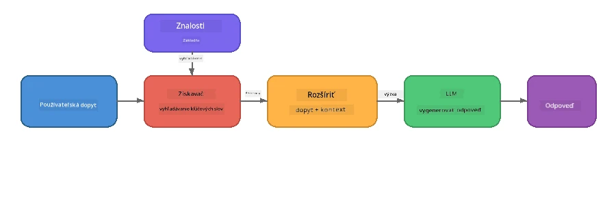

# Časť 4: Tvorba RAG aplikácie s Foundry Local

## Prehľad

Veľké jazykové modely sú výkonné, ale poznajú len to, čo je v ich tréningových dátach. **Retrieval-Augmented Generation (RAG)** tento problém rieši tým, že modelu pri kladení otázok poskytuje relevantný kontext - vyťahovaný z vašich vlastných dokumentov, databáz alebo znalostných bázi.

V tomto kurze vytvoríte kompletný RAG pipeline, ktorý beží **úplne na vašom zariadení** pomocou Foundry Local. Žiadne cloudové služby, žiadne vektorové databázy, žiadne embeddings API - iba lokálny retrieval a lokálny model.

## Ciele učenia

Na konci tohto kurzu budete schopní:

- Vysvetliť, čo je RAG a prečo je dôležitý pre AI aplikácie
- Vytvoriť lokálnu znalostnú bázu z textových dokumentov
- Implementovať jednoduchú retrieval funkciu na nájdenie relevantného kontextu
- Sestaviť systémový prompt, ktorý zakotví model na získaných faktoch
- Spustiť celý Retrieve → Augment → Generate pipeline priamo na zariadení
- Pochopiť kompromisy medzi jednoduchým vyhľadávaním podľa kľúčových slov a vektorovým vyhľadávaním

---

## Predpoklady

- Dokončiť [Časť 3: Používanie Foundry Local SDK s OpenAI](part3-sdk-and-apis.md)
- Mať nainštalovaný Foundry Local CLI a stiahnutý model `phi-3.5-mini`

---

## Koncept: Čo je RAG?

Bez RAG môže LLM odpovedať iba na základe svojich tréningových dát – ktoré môžu byť zastarané, neúplné alebo bez vašich súkromných informácií:

```
User: "What is Zava's return policy?"
LLM:  "I do not have information about Zava's return policy."  ← No context!
```

S RAG najskôr **získavate** relevantné dokumenty a potom **dopĺňate** prompt týmto kontextom pred **generovaním** odpovede:



Kľúčový poznatok: **model nemusí "vedieť" odpoveď; stačí, ak prečíta správne dokumenty.**

---

## Laboratórne cvičenia

### Cvičenie 1: Pochopenie znalostnej bázy

Otvorte RAG príklad pre váš jazyk a preskúmajte znalostnú bázu:

<details>
<summary><b>🐍 Python: <code>python/foundry-local-rag.py</code></b></summary>

Znalostná báza je jednoduchý zoznam slovníkov s poľami `title` a `content`:

```python
KNOWLEDGE_BASE = [
    {
        "title": "Foundry Local Overview",
        "content": (
            "Foundry Local brings the power of Azure AI Foundry to your local "
            "device without requiring an Azure subscription..."
        ),
    },
    {
        "title": "Supported Hardware",
        "content": (
            "Foundry Local automatically selects the best model variant for "
            "your hardware. If you have an Nvidia CUDA GPU it downloads the "
            "CUDA-optimized model..."
        ),
    },
    # ... viac položiek
]
```

Každý záznam predstavuje "kúsok" vedomostí - zameranú časť informácie na jednu tému.

</details>

<details>
<summary><b>📘 JavaScript: <code>javascript/foundry-local-rag.mjs</code></b></summary>

Znalostná báza používa rovnakú štruktúru ako pole objektov:

```javascript
const KNOWLEDGE_BASE = [
  {
    title: "Foundry Local Overview",
    content:
      "Foundry Local brings the power of Azure AI Foundry to your local " +
      "device without requiring an Azure subscription...",
  },
  {
    title: "Supported Hardware",
    content:
      "Foundry Local automatically selects the best model variant for " +
      "your hardware...",
  },
  // ... viac položiek
];
```

</details>

<details>
<summary><b>💜 C#: <code>csharp/RagPipeline.cs</code></b></summary>

Znalostná báza používa zoznam pomenovaných tupleov:

```csharp
private static readonly List<(string Title, string Content)> KnowledgeBase =
[
    ("Foundry Local Overview",
     "Foundry Local brings the power of Azure AI Foundry to your local " +
     "device without requiring an Azure subscription..."),

    ("Supported Hardware",
     "Foundry Local automatically selects the best model variant for " +
     "your hardware..."),

    // ... more entries
];
```

</details>

> **V reálnej aplikácii** by znalostná báza pochádzala zo súborov na disku, databázy, vyhľadávacieho indexu alebo API. Pre tento kurz používame zoznam v pamäti pre jednoduchosť.

---

### Cvičenie 2: Pochopenie retrieval funkcie

Retrieval krok nájde najrelevantnejšie kúsky informácií pre používateľovu otázku. Tento príklad používa **prekryv kľúčových slov** - počítanie, koľko slov v dotaze sa nachádza v každom kuse:

<details>
<summary><b>🐍 Python</b></summary>

```python
def retrieve(query: str, top_k: int = 2) -> list[dict]:
    """Return the top-k knowledge chunks most relevant to the query."""
    query_words = set(query.lower().split())
    scored = []
    for chunk in KNOWLEDGE_BASE:
        chunk_words = set(chunk["content"].lower().split())
        overlap = len(query_words & chunk_words)
        scored.append((overlap, chunk))
    scored.sort(key=lambda x: x[0], reverse=True)
    return [item[1] for item in scored[:top_k]]
```

</details>

<details>
<summary><b>📘 JavaScript</b></summary>

```javascript
function retrieve(query, topK = 2) {
  const queryWords = new Set(query.toLowerCase().split(/\s+/));
  const scored = KNOWLEDGE_BASE.map((chunk) => {
    const chunkWords = new Set(chunk.content.toLowerCase().split(/\s+/));
    let overlap = 0;
    for (const w of queryWords) {
      if (chunkWords.has(w)) overlap++;
    }
    return { overlap, chunk };
  });
  scored.sort((a, b) => b.overlap - a.overlap);
  return scored.slice(0, topK).map((s) => s.chunk);
}
```

</details>

<details>
<summary><b>💜 C#</b></summary>

```csharp
private static List<(string Title, string Content)> Retrieve(string query, int topK = 2)
{
    var queryWords = new HashSet<string>(
        query.ToLowerInvariant().Split(' ', StringSplitOptions.RemoveEmptyEntries));

    return KnowledgeBase
        .Select(chunk =>
        {
            var chunkWords = new HashSet<string>(
                chunk.Content.ToLowerInvariant().Split(' ', StringSplitOptions.RemoveEmptyEntries));
            var overlap = queryWords.Intersect(chunkWords).Count();
            return (Overlap: overlap, Chunk: chunk);
        })
        .OrderByDescending(x => x.Overlap)
        .Take(topK)
        .Select(x => x.Chunk)
        .ToList();
}
```

</details>

**Ako to funguje:**
1. Rozdelí dotaz na jednotlivé slová
2. Pre každý knowledge chunk spočíta, koľko slov z dotazu sa v ňom vyskytuje
3. Zoradí podľa skóre prekryvu (najvyššie prvé)
4. Vráti top-k najrelevantnejších kúskov

> **Kompromis:** Prekryv kľúčových slov je jednoduchý, ale obmedzený; nerozumie synonymám ani významu. Produkčné RAG systémy často používajú **embedding vektory** a **vektorové databázy** pre sémantické vyhľadávanie. Prekryv kľúčových slov je však dobrým východiskovým bodom a nevyžaduje žiadne ďalšie závislosti.

---

### Cvičenie 3: Pochopenie doplneného promptu

Získaný kontext sa vloží do **systémového promptu** pred odoslaním do modelu:

```python
system_prompt = (
    "You are a helpful assistant. Answer the user's question using ONLY "
    "the information provided in the context below. If the context does "
    "not contain enough information, say so.\n\n"
    f"Context:\n{context_text}"
)
```

Kľúčové dizajnové rozhodnutia:
- **"LEN informácie uvedené"** - zabraňuje modelu halucinovať fakty, ktoré v kontexte nie sú
- **"Ak kontext neobsahuje dostatok informácií, povedz to"** - povzbudzuje k poctivým odpovediam "neviem"
- Kontext je vložený do systémovej správy, preto ovplyvňuje všetky odpovede

---

### Cvičenie 4: Spustenie RAG pipeline

Spustite kompletný príklad:

**Python:**
```bash
cd python
python foundry-local-rag.py
```

**JavaScript:**
```bash
cd javascript
node foundry-local-rag.mjs
```

**C#:**
```bash
cd csharp
dotnet run rag
```

Mali by ste vidieť vytlačené tri veci:
1. **Otázka** položená modelu
2. **Získaný kontext** - kúsky vybrané zo znalostnej bázy
3. **Odpoveď** - generovaná modelom iba na základe tohto kontextu

Ukážkový výstup:
```
Question: How do I install Foundry Local and what hardware does it support?

--- Retrieved Context ---
### Installation
On Windows install Foundry Local with: winget install Microsoft.FoundryLocal...

### Supported Hardware
Foundry Local automatically selects the best model variant for your hardware...
-------------------------

Answer: To install Foundry Local, you can use the following methods depending
on your operating system: On Windows, run `winget install Microsoft.FoundryLocal`.
On macOS, use `brew install microsoft/foundrylocal/foundrylocal`...
```

Všimnite si, že odpoveď modelu je **zakotvená** v získanom kontexte – spomína len fakty zo znalostných dokumentov.

---

### Cvičenie 5: Experimentujte a rozširujte

Vyskúšajte tieto úpravy, aby ste si rozšírili porozumenie:

1. **Zmeňte otázku** - položte niečo, čo JE v znalostnej báze voči tomu, čo NIE JE:
   ```python
   question = "What programming languages does Foundry Local support?"  # ← V kontexte
   question = "How much does Foundry Local cost?"                       # ← Nie v kontexte
   ```
   Model správne povie "Neviem", ak odpoveď v kontexte nie je?

2. **Pridajte nový knowledge chunk** - doplňte nový záznam do `KNOWLEDGE_BASE`:
   ```python
   {
       "title": "Pricing",
       "content": "Foundry Local is completely free and open source under the MIT license.",
   }
   ```
   Potom znova položte otázku o cene.

3. **Zmeňte `top_k`** - získajte viac alebo menej kúskov:
   ```python
   context_chunks = retrieve(question, top_k=3)  # Viac kontextu
   context_chunks = retrieve(question, top_k=1)  # Menej kontextu
   ```
   Ako množstvo kontextu ovplyvňuje kvalitu odpovede?

4. **Odstráňte inštrukciu na zakotvenie** - zmente systémový prompt na „Si užitočný asistent.“ a sledujte, či model začne halucinovať fakty.

---

## Hĺbkový pohľad: Optimalizácia RAG pre výkon na zariadení

Spustenie RAG priamo na zariadení prináša obmedzenia, ktoré v cloude nemáte: limitovaná RAM, žiadna grafická karta (výkon CPU/NPU), a malá pamäťová kapacita kontextu modelu. Nižšie uvedené dizajnové rozhodnutia priamo riešia tieto obmedzenia a vychádzajú zo vzorov produkčných lokálnych RAG aplikácií vytvorených s Foundry Local.

### Stratégiа rozdeľovania: Pevne veľké posuvné okno

Chunkovanie - spôsob, akým rozdeľujete dokumenty na kúsky - je jedným z najdôležitejších rozhodnutí v RAG systéme. Pre on-device scenáre je odporúčané výchozie riešenie **posuvné okno pevnej veľkosti s prekrytím**:

| Parameter | Odporúčaná hodnota | Prečo |
|-----------|--------------------|-------|
| **Veľkosť kúsku** | ~200 tokenov | Udržuje získaný kontext kompaktný, necháva miesto v kontextovom okne Phi-3.5 Mini pre systémový prompt, históriu konverzácie a generovaný výstup |
| **Prekryv** | ~25 tokenov (12.5 %) | Zabraňuje strate informácií na hraniciach kúskov - dôležité pre postupy a krok-za-krokom inštrukcie |
| **Tokenizácia** | Rozdelenie podľa medzier | Žiadne závislosti, nepotrebujete knižnicu na tokenizáciu. Celý výpočtový výkon zostáva modelu |

Prekryv funguje ako posuvné okno: každý nový kúsok začína 25 tokenov pred koncom predchádzajúceho, takže vety cez hranice sú v oboch kúskach.

> **Prečo nie iné stratégie?**
> - **Rozdelenie podľa viet** produkuje nepredvídateľné veľkosti kúskov; niektoré bezpečnostné postupy sú dlhé jednovetné bloky, ktoré by sa ťažko delili
> - **Rozdelenie podľa sekcií** (podľa nadpisov `##`) vytvára veľmi rôznorodé veľkosti kúskov - niektoré príliš malé, iné príliš veľké pre kontextové okno modelu
> - **Sémantické chunkovanie** (detekcia tém pomocou embeddingov) poskytuje najlepšiu kvalitu vyhľadávania, ale vyžaduje druhý model v pamäti vedľa Phi-3.5 Mini - rizikové pre hardvér s 8-16 GB zdieľanej pamäte

### Vylepšené vyhľadávanie: TF-IDF vektory

Prístup s prekryvom kľúčových slov v tomto kurze funguje, no ak chcete lepšie vyhľadávanie bez pridania embedding modelu, **TF-IDF (Term Frequency-Inverse Document Frequency)** je výborný kompromis:

```
Keyword Overlap  →  TF-IDF Vectors  →  Embedding Models
    (this lab)     (lightweight upgrade)   (production)
  Simple & fast    Better ranking,         Best quality,
  No dependencies  still no ML model       requires embedding model
  ~Basic matching  ~1ms retrieval          ~100-500ms per query
```

TF-IDF prevedie každý chunk na číselný vektor na základe dôležitosti jednotlivých slov *v porovnaní so všetkými chunkmi*. Pri vyhľadávaní sa dotaz prevedie rovnako a porovnáva sa pomocou kosínusovej podobnosti. Dá sa implementovať so SQLite a čistým JavaScriptom/Pythonom - bez vektorovej databázy, bez embedding API.

> **Výkon:** Kosínusová podobnosť TF-IDF cez pevne veľké chunks zvyčajne dosahuje **~1 ms retrieval**, oproti ~100-500 ms v prípade enkódovania každého dotazu embedding modelom. Všetkých 20+ dokumentov je možné chunkovať a indexovať za menej než sekundu.

### Edge/Compact režim pre obmedzené zariadenia

Na veľmi obmedzenom hardvéri (staršie notebooky, tablety, terénne zariadenia) môžete znížiť nároky na zdroje tromi nastaveniami:

| Nastavenie | Štandardný režim | Edge/Compact režim |
|------------|------------------|--------------------|
| **Systémový prompt** | ~300 tokenov | ~80 tokenov |
| **Maximálny počet výstupných tokenov** | 1024 | 512 |
| **Počet získaných chunkov (top-k)** | 5 | 3 |

Menej získaných chunkov znamená menej kontextu na spracovanie modelom, čo znižuje latenciu a pamäťové nároky. Kratší systémový prompt uvoľní viac miesta v kontextovom okne pre samotnú odpoveď. Tento kompromis je veľmi užitočný na zariadeniach, kde každý token kontextového okna má význam.

### Jeden model v pamäti

Jedno z najdôležitejších pravidiel pre on-device RAG: **držte v pamäti iba jeden model**. Ak používate embedding model na retrieval *a* jazykový model na generovanie, delíte si obmedzené NPU/RAM zdroje medzi dva modely. Ľahký retrieval (prekryv kľúčových slov, TF-IDF) toto úplne obchádza:

- Žiadny embedding model, ktorý by konkuroval LLM o pamäť
- Rýchlejšie štartovanie - načítava sa iba jeden model
- Predvídateľná spotreba pamäte - LLM dostane všetky dostupné zdroje
- Funguje na zariadeniach s iba 8 GB RAM

### SQLite ako lokálne vektorové úložisko

Pre malé až stredné kolekcie dokumentov (stovky až nižšie tisíce chunkov) je **SQLite dostatočne rýchly** na brute-force kosínusové vyhľadávanie a nepridáva žiadnu infraštruktúru:

- Jeden `.db` súbor na disku - žiadny server, žiadna konfigurácia
- Dodáva sa so všetkými významnými runtime-ami (Python `sqlite3`, Node.js `better-sqlite3`, .NET `Microsoft.Data.Sqlite`)
- Ukladá chunks dokumentov spolu s TF-IDF vektormi v jednej tabuľke
- Nie je potrebné Pinecone, Qdrant, Chroma alebo FAISS v tomto rozsahu

### Zhrnutie výkonu

Tieto dizajnové rozhodnutia spoločne umožňujú plynulý RAG na bežnom hardvéri:

| Metrika | Výkon na zariadení |
|---------|--------------------|
| **Latencia retrieval** | ~1 ms (TF-IDF) až ~5 ms (prekryv kľúčových slov) |
| **Rýchlosť spracovania** | 20 dokumentov chunkovaných a indexovaných pod 1 sekundu |
| **Počet modelov v pamäti** | 1 (len LLM, bez embedding modelu) |
| **Veľkosť úložiska** | < 1 MB pre chunks + vektory v SQLite |
| **Studený štart** | Načítanie jedného modelu, bez spúšťania embedding runtime |
| **Hardvérové minimum** | 8 GB RAM, CPU len (bez potreby GPU) |

> **Kedy vylepšiť:** Ak škálujete na stovky dlhých dokumentov, zmiešaný obsah (tabuľky, kód, text) alebo potrebujete sémantické porozumenie dotazov, zvážte pridanie embedding modelu a prechod na vektorové vyhľadávanie. Pre väčšinu on-device prípadov použitia so zameranými dokumentmi prináša TF-IDF + SQLite vynikajúce výsledky s minimálnou spotrebou zdrojov.

---

## Kľúčové koncepty

| Koncept | Popis |
|---------|-------|
| **Retrieval** | Nájdenie relevantných dokumentov v znalostnej báze na základe používateľovho dotazu |
| **Augmentation** | Vloženie získaných dokumentov do promptu ako kontext |
| **Generation** | Model generuje odpoveď zakotvenú v poskytnutom kontexte |
| **Chunkovanie** | Rozdelenie veľkých dokumentov na menšie, zamerané časti |
| **Zakotvenie (Grounding)** | Obmedzenie modelu používať iba poskytnutý kontext (znižuje halucinácie) |
| **Top-k** | Počet najrelevantnejších kúskov, ktoré sa získavajú |

---

## RAG v produkcii vs. tento kurz

| Aspekt | Tento kurz | Optimalizované on-device | Produkcia v cloude |
|--------|------------|-------------------------|--------------------|
| **Znalostná báza** | Zo zoznamu v pamäti | Súbory na disku, SQLite | Databáza, vyhľadávací index |
| **Retrieval** | Prekryv kľúčových slov | TF-IDF + kosínusová podobnosť | Vektorové embeddingy + vyhľadávanie podľa podobnosti |
| **Embeddingy** | Nie sú potrebné | Nie sú potrebné - TF-IDF vektory | Embedding model (lokálny alebo cloudový) |
| **Vektorové úložisko** | Nie je potrebné | SQLite (jeden `.db` súbor) | FAISS, Chroma, Azure AI Search a pod. |
| **Chunkovanie** | Manuálne | Pevné posuvné okno (~200 tokenov, 25 tokenov prekryv) | Sémantické alebo rekurzívne chunkovanie |
| **Modely v pamäti** | 1 (LLM) | 1 (LLM) | 2+ (embedding + LLM) |
| **Latencia vyhľadávania** | ~5 ms | ~1 ms | ~100–500 ms |
| **Škálovanie** | 5 dokumentov | Stovky dokumentov | Milióny dokumentov |

Vzory, ktoré sa tu naučíte (vyhľadávanie, dopĺňanie, generovanie), sú rovnaké v akejkoľvek škále. Metóda vyhľadávania sa zlepšuje, ale celková architektúra zostáva identická. Stredný stĺpec zobrazuje, čo je možné dosiahnuť priamo na zariadení pomocou ľahkých techník, často ideálny bod pre lokálne aplikácie, kde vymieňate cloudovú škálovateľnosť za súkromie, schopnosť fungovať offline a nulovú latenciu voči externým službám.

---

## Kľúčové poznatky

| Koncept | Čo ste sa naučili |
|---------|-------------------|
| Vzor RAG | Vyhľadať + Dopĺňať + Generovať: dajte modelu správny kontext a dokáže odpovedať na otázky o vašich dátach |
| Na zariadení | Všetko beží lokálne bez cloudových API alebo predplatných vektorových databáz |
| Inštrukcie na ukotvenie | Obmedzenia systémového promptu sú kľúčové na zabránenie halucinácií |
| Prekrytie kľúčových slov | Jednoduchý, ale účinný východiskový bod pre vyhľadávanie |
| TF-IDF + SQLite | Ľahká cesta na upgrade, ktorá udržiava vyhľadávanie pod 1 ms bez použitia modelu vkladania |
| Jeden model v pamäti | Vyhnite sa načítavaniu modelu vkladania spolu s LLM na obmedzenom hardvéri |
| Veľkosť kúskov | Približne 200 tokenov s prekrytím vyvažuje presnosť vyhľadávania a efektivitu kontextového okna |
| Režim edge/kompaktný | Používajte menej kúskov a kratšie promptu pre veľmi obmedzené zariadenia |
| Univerzálny vzor | Rovnaká architektúra RAG funguje pre akýkoľvek zdroj dát: dokumenty, databázy, API alebo wikipédie |

> **Chcete vidieť úplnú on-device RAG aplikáciu?** Pozrite si [Gas Field Local RAG](https://github.com/leestott/local-rag), produkčne štýlového offline RAG agenta postaveného s Foundry Local a Phi-3.5 Mini, ktorý demonštruje tieto optimalizačné vzory na reálnej množine dokumentov.

---

## Ďalšie kroky

Pokračujte na [Časť 5: Budovanie AI agentov](part5-single-agents.md) a naučte sa, ako vytvárať inteligentných agentov s osobnosťami, inštrukciami a viackolovými konverzáciami pomocou Microsoft Agent Framework.