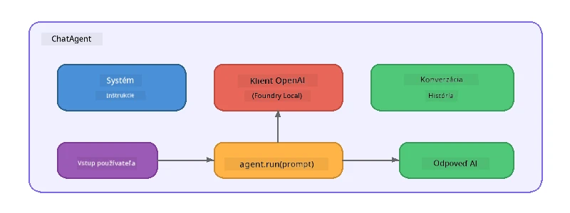

# Časť 5: Vytváranie AI agentov pomocou Agent Frameworku

> **Cieľ:** Vytvorte svojho prvého AI agenta s trvalými inštrukciami a definovanou osobnosťou, poháňaného lokálnym modelom cez Foundry Local.

## Čo je to AI agent?

AI agent obaluje jazykový model so **systémovými inštrukciami**, ktoré definujú jeho správanie, osobnosť a obmedzenia. Na rozdiel od jednorazového volania chatového doplnenia, agent poskytuje:

- **Persona** - konzistentná identita („Ste užitočný recenzent kódu“)
- **Pamäť** - história konverzácie naprieč kolami
- **Špecializácia** - zamerané správanie riadené dobre zostavenými inštrukciami



---

## Microsoft Agent Framework

**Microsoft Agent Framework** (AGF) poskytuje štandardnú agentovú abstrakciu, ktorá funguje naprieč rôznymi modelovými backendmi. V tomto workshope ho kombinujeme s Foundry Local, aby všetko fungovalo na vašom počítači – bez potreby cloudu.

| Koncept | Popis |
|---------|-------|
| `FoundryLocalClient` | Python: zabezpečuje spustenie služby, stiahnutie/nahranie modelu a vytvára agentov |
| `client.as_agent()` | Python: vytvára agenta z Foundry Local klienta |
| `AsAIAgent()` | C#: rozširujúca metóda na `ChatClient` – vytvára `AIAgent` |
| `instructions` | Systémový prompt, ktorý formuje správanie agenta |
| `name` | Ľudsky čitateľný názov, užitočný pri scénach s viacerými agentmi |
| `agent.run(prompt)` / `RunAsync()` | Posiela používateľskú správu a vracia odpoveď agenta |

> **Poznámka:** Agent Framework má Python a .NET SDK. Pre JavaScript implementujeme ľahkú triedu `ChatAgent`, ktorá zrkadlí rovnaký vzor priamo cez OpenAI SDK.

---

## Cvičenia

### Cvičenie 1 - Pochopiť vzor agenta

Pred písaním kódu si naštudujte kľúčové súčasti agenta:

1. **Modelový klient** – pripája sa na OpenAI-kompatibilné API Foundry Local
2. **Systémové inštrukcie** – prompt „osobnosti“
3. **Behový cyklus** – posiela vstup od používateľa, prijíma výstup

> **Premýšľajte:** Ako sa systémové inštrukcie líšia od bežnej používateľskej správy? Čo sa stane, keď ich zmeníte?

---

### Cvičenie 2 - Spustiť príklad jedného agenta

<details>
<summary><strong>🐍 Python</strong></summary>

**Požiadavky:**
```bash
cd python
python -m venv venv

# Windows (PowerShell):
venv\Scripts\Activate.ps1
# macOS:
source venv/bin/activate

pip install -r requirements.txt
```

**Spustenie:**
```bash
python foundry-local-with-agf.py
```

**Prechod kódom** (`python/foundry-local-with-agf.py`):

```python
import asyncio
from agent_framework_foundry_local import FoundryLocalClient

async def main():
    alias = "phi-4-mini"

    # FoundryLocalClient spravuje spustenie služby, sťahovanie modelu a načítanie
    client = FoundryLocalClient(model_id=alias)
    print(f"Client Model ID: {client.model_id}")

    # Vytvorte agenta so systémovými inštrukciami
    agent = client.as_agent(
        name="Joker",
        instructions="You are good at telling jokes.",
    )

    # Neprúdové: získajte celú odpoveď naraz
    result = await agent.run("Tell me a joke about a pirate.")
    print(f"Agent: {result}")

    # Prúdové: získavajte výsledky, ako sú generované
    async for chunk in agent.run("Tell me another joke.", stream=True):
        if chunk.text:
            print(chunk.text, end="", flush=True)

asyncio.run(main())
```

**Kľúčové body:**
- `FoundryLocalClient(model_id=alias)` zabezpečuje spustenie služby, stiahnutie a načítanie modelu v jednom kroku
- `client.as_agent()` vytvára agenta so systémovými inštrukciami a menom
- `agent.run()` podporuje režimy bez streamovania aj so streamovaním
- Inštalácia cez `pip install agent-framework-foundry-local --pre`

</details>

<details>
<summary><strong>📦 JavaScript</strong></summary>

**Požiadavky:**
```bash
cd javascript
npm install
```

**Spustenie:**
```bash
node foundry-local-with-agent.mjs
```

**Prechod kódom** (`javascript/foundry-local-with-agent.mjs`):

```javascript
import { OpenAI } from "openai";
import { FoundryLocalManager } from "foundry-local-sdk";

class ChatAgent {
  constructor({ client, modelId, instructions, name }) {
    this.client = client;
    this.modelId = modelId;
    this.instructions = instructions;
    this.name = name;
    this.history = [];
  }

  async run(userMessage) {
    const messages = [
      { role: "system", content: this.instructions },
      ...this.history,
      { role: "user", content: userMessage },
    ];
    const response = await this.client.chat.completions.create({
      model: this.modelId,
      messages,
    });
    const assistantMessage = response.choices[0].message.content;

    // Uchovávajte históriu rozhovoru pre viackolové interakcie
    this.history.push({ role: "user", content: userMessage });
    this.history.push({ role: "assistant", content: assistantMessage });
    return { text: assistantMessage };
  }
}

async function main() {
  FoundryLocalManager.create({ appName: "FoundryLocalWorkshop" });
  const manager = FoundryLocalManager.instance;
  await manager.startWebService();

  const catalog = manager.catalog;
  const model = await catalog.getModel("phi-3.5-mini");
  if (!model.isCached) {
    console.log("Downloading model: phi-3.5-mini...");
    await model.download();
  }
  await model.load();

  const client = new OpenAI({
    baseURL: manager.urls[0] + "/v1",
    apiKey: "foundry-local",
  });

  const agent = new ChatAgent({
    client,
    modelId: model.id,
    instructions: "You are good at telling jokes.",
    name: "Joker",
  });

  const result = await agent.run("Tell me a joke about a pirate.");
  console.log(result.text);
}

main();
```

**Kľúčové body:**
- JavaScript si vytvára vlastnú triedu `ChatAgent`, ktorá zrkadlí vzor AGF z Pythonu
- `this.history` ukladá jednotlivé kolá konverzácie pre podporu multi-turn
- Explicitné volania `startWebService()` → kontrola cache → `model.download()` → `model.load()` poskytujú úplnú viditeľnosť

</details>

<details>
<summary><strong>💜 C#</strong></summary>

**Požiadavky:**
```bash
cd csharp
dotnet restore
```

**Spustenie:**
```bash
dotnet run agent
```

**Prechod kódom** (`csharp/SingleAgent.cs`):

```csharp
using Microsoft.AI.Foundry.Local;
using Microsoft.Extensions.Logging.Abstractions;
using Microsoft.Agents.AI;
using OpenAI;
using System.ClientModel;

// 1. Start Foundry Local and load a model
var alias = "phi-3.5-mini";
await FoundryLocalManager.CreateAsync(
    new Configuration
    {
        AppName = "FoundryLocalSamples",
        Web = new Configuration.WebService { Urls = "http://127.0.0.1:0" }
    }, NullLogger.Instance, default);
var manager = FoundryLocalManager.Instance;
await manager.StartWebServiceAsync(default);

var catalog = await manager.GetCatalogAsync(default);
var model = await catalog.GetModelAsync(alias, default);

var isCached = await model.IsCachedAsync(default);
if (!isCached)
{
    Console.WriteLine($"Downloading model: {alias}...");
    await model.DownloadAsync(null, default);
}
await model.LoadAsync(default);

var key = new ApiKeyCredential("foundry-local");
var client = new OpenAIClient(key, new OpenAIClientOptions
{
    Endpoint = new Uri(manager.Urls[0] + "/v1")
});

// 2. Create an AIAgent using the Agent Framework extension method
AIAgent joker = client
    .GetChatClient(model.Id)
    .AsAIAgent(
        instructions: "You are good at telling jokes. Keep your jokes short and family-friendly.",
        name: "Joker"
    );

// 3. Run the agent (non-streaming)
var response = await joker.RunAsync("Tell me a joke about a pirate.");
Console.WriteLine($"Joker: {response}");

// 4. Run with streaming
await foreach (var update in joker.RunStreamingAsync("Tell me another joke."))
{
    Console.Write(update);
}
```

**Kľúčové body:**
- `AsAIAgent()` je rozširujúca metóda z `Microsoft.Agents.AI.OpenAI` – vlastná trieda `ChatAgent` nie je potrebná
- `RunAsync()` vracia celú odpoveď; `RunStreamingAsync()` streamuje token po tokenu
- Inštalácia cez `dotnet add package Microsoft.Agents.AI.OpenAI --version 1.0.0-rc3`

</details>

---

### Cvičenie 3 - Zmeniť personu

Upravte `instructions` agenta, aby ste vytvorili inú personu. Vyskúšajte každú a pozorujte, ako sa výstup mení:

| Persona | Inštrukcie |
|---------|------------|
| Recenzent kódu | `"You are an expert code reviewer. Provide constructive feedback focused on readability, performance, and correctness."` |
| Cestovateľský sprievodca | `"You are a friendly travel guide. Give personalized recommendations for destinations, activities, and local cuisine."` |
| Sókratov tutor | `"You are a Socratic tutor. Never give direct answers - instead, guide the student with thoughtful questions."` |
| Technický spisovateľ | `"You are a technical writer. Explain concepts clearly and concisely. Use examples. Avoid jargon."` |

**Vyskúšajte to:**
1. Vyberte personu z tabuľky vyššie
2. Nahraďte reťazec `instructions` v kóde
3. Prispôsobte používateľský prompt podľa persony (napr. požiadajte recenzenta kódu o kontrolu funkcie)
4. Znova spustite príklad a porovnajte výstup

> **Tip:** Kvalita agenta veľmi závisí od inštrukcií. Špecifické, dobre štruktúrované inštrukcie prinášajú lepšie výsledky než nejasné.

---

### Cvičenie 4 - Pridať multi-turn konverzáciu

Rozšírte príklad, aby podporoval viackolovú chatovaciu slučku, v ktorej môžete viesť dialóg tam a späť s agentom.

<details>
<summary><strong>🐍 Python - viackolová slučka</strong></summary>

```python
import asyncio
from agent_framework_foundry_local import FoundryLocalClient

async def main():
    client = FoundryLocalClient(model_id="phi-4-mini")

    agent = client.as_agent(
        name="Assistant",
        instructions="You are a helpful assistant.",
    )

    print("Chat with the agent (type 'quit' to exit):\n")
    while True:
        user_input = input("You: ")
        if user_input.strip().lower() in ("quit", "exit"):
            break
        result = await agent.run(user_input)
        print(f"Agent: {result}\n")

asyncio.run(main())
```

</details>

<details>
<summary><strong>📦 JavaScript - viackolová slučka</strong></summary>

```javascript
import { OpenAI } from "openai";
import { FoundryLocalManager } from "foundry-local-sdk";
import * as readline from "node:readline/promises";

// (znovu použiť triedu ChatAgent z cvičenia 2)

async function main() {
  FoundryLocalManager.create({ appName: "FoundryLocalWorkshop" });
  const manager = FoundryLocalManager.instance;
  await manager.startWebService();

  const catalog = manager.catalog;
  const model = await catalog.getModel("phi-3.5-mini");
  if (!model.isCached) {
    console.log("Downloading model: phi-3.5-mini...");
    await model.download();
  }
  await model.load();

  const client = new OpenAI({
    baseURL: manager.urls[0] + "/v1",
    apiKey: "foundry-local",
  });

  const agent = new ChatAgent({
    client,
    modelId: model.id,
    instructions: "You are a helpful assistant.",
    name: "Assistant",
  });

  const rl = readline.createInterface({
    input: process.stdin,
    output: process.stdout,
  });

  console.log("Chat with the agent (type 'quit' to exit):\n");
  while (true) {
    const userInput = await rl.question("You: ");
    if (["quit", "exit"].includes(userInput.trim().toLowerCase())) break;
    const result = await agent.run(userInput);
    console.log(`Agent: ${result.text}\n`);
  }
  rl.close();
}

main();
```

</details>

<details>
<summary><strong>💜 C# - viackolová slučka</strong></summary>

```csharp
using Microsoft.AI.Foundry.Local;
using Microsoft.Extensions.Logging.Abstractions;
using Microsoft.Agents.AI;
using OpenAI;
using System.ClientModel;

var alias = "phi-3.5-mini";
var config = new Configuration
{
    AppName = "FoundryLocalSamples",
    Web = new Configuration.WebService { Urls = "http://127.0.0.1:0" }
};
await FoundryLocalManager.CreateAsync(config, NullLogger.Instance, default);
var manager = FoundryLocalManager.Instance;
await manager.StartWebServiceAsync(default);

var catalog = await manager.GetCatalogAsync(default);
var model = await catalog.GetModelAsync(alias, default);

var isCached = await model.IsCachedAsync(default);
if (!isCached)
{
    Console.WriteLine($"Downloading model: {alias}...");
    await model.DownloadAsync(null, default);
}
await model.LoadAsync(default);

var key = new ApiKeyCredential("foundry-local");
var client = new OpenAIClient(key, new OpenAIClientOptions
{
    Endpoint = new Uri(manager.Urls[0] + "/v1")
});

AIAgent agent = client
    .GetChatClient(model.Id)
    .AsAIAgent(
        instructions: "You are a helpful assistant.",
        name: "Assistant"
    );

Console.WriteLine("Chat with the agent (type 'quit' to exit):\n");
while (true)
{
    Console.Write("You: ");
    var userInput = Console.ReadLine();
    if (string.IsNullOrWhiteSpace(userInput) ||
        userInput.Equals("quit", StringComparison.OrdinalIgnoreCase) ||
        userInput.Equals("exit", StringComparison.OrdinalIgnoreCase))
        break;

    var result = await agent.RunAsync(userInput);
    Console.WriteLine($"Agent: {result}\n");
}
```

</details>

Všimnite si, ako si agent pamätá predchádzajúce kolá – položte doplňujúcu otázku a všimnite si, že kontext pretrváva.

---

### Cvičenie 5 - Štruktúrovaný výstup

Nastavte agenta, aby vždy odpovedal v konkrétnom formáte (napr. JSON) a následne analyzujte výsledok:

<details>
<summary><strong>🐍 Python - JSON výstup</strong></summary>

```python
import asyncio
import json
from agent_framework_foundry_local import FoundryLocalClient

async def main():
    client = FoundryLocalClient(model_id="phi-4-mini")

    agent = client.as_agent(
        name="SentimentAnalyzer",
        instructions=(
            "You are a sentiment analysis agent. "
            "For every user message, respond ONLY with valid JSON in this format: "
            '{"sentiment": "positive|negative|neutral", "confidence": 0.0-1.0, "summary": "brief reason"}'
        ),
    )

    result = await agent.run("I absolutely loved the new restaurant downtown!")
    print("Raw:", result)

    try:
        parsed = json.loads(str(result))
        print(f"Sentiment: {parsed['sentiment']} (confidence: {parsed['confidence']})")
    except json.JSONDecodeError:
        print("Agent did not return valid JSON - try refining the instructions.")

asyncio.run(main())
```

</details>

<details>
<summary><strong>💜 C# - JSON výstup</strong></summary>

```csharp
using System.Text.Json;

AIAgent analyzer = chatClient.AsAIAgent(
    name: "SentimentAnalyzer",
    instructions:
        "You are a sentiment analysis agent. " +
        "For every user message, respond ONLY with valid JSON in this format: " +
        "{\"sentiment\": \"positive|negative|neutral\", \"confidence\": 0.0-1.0, \"summary\": \"brief reason\"}"
);

var response = await analyzer.RunAsync("I absolutely loved the new restaurant downtown!");
Console.WriteLine($"Raw: {response}");

try
{
    var parsed = JsonSerializer.Deserialize<JsonElement>(response.ToString());
    Console.WriteLine($"Sentiment: {parsed.GetProperty("sentiment")} " +
                      $"(confidence: {parsed.GetProperty("confidence")})");
}
catch (JsonException)
{
    Console.WriteLine("Agent did not return valid JSON - try refining the instructions.");
}
```

</details>

> **Poznámka:** Malé lokálne modely nemusia vždy produkovať úplne platný JSON. Spoľahlivosť môžete vylepšiť tým, že do inštrukcií zahrniete príklad a budete veľmi explicitní ohľadom požadovaného formátu.

---

## Kľúčové zistenia

| Koncept | Čo ste sa naučili |
|---------|-------------------|
| Agent vs. priamy LLM volanie | Agent obaluje model inštrukciami a pamäťou |
| Systémové inštrukcie | Najdôležitejší pákový nástroj na riadenie správania agenta |
| Multi-turn konverzácia | Agenti nesú kontext cez viacero používateľských interakcií |
| Štruktúrovaný výstup | Inštrukcie môžu vynucovať formát výstupu (JSON, markdown, atď.) |
| Lokálne spustenie | Všetko beží na zariadení cez Foundry Local – nie je potrebný cloud |

---

## Ďalšie kroky

V **[Časti 6: Multiagentné pracovné toky](part6-multi-agent-workflows.md)** skombinujete viacerých agentov do koordinovaného reťazca, kde každý agent má špecializovanú úlohu.