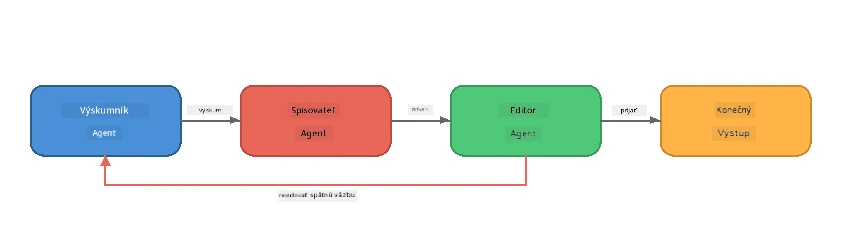
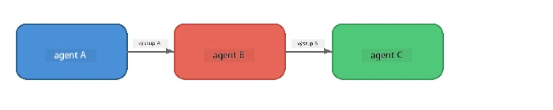
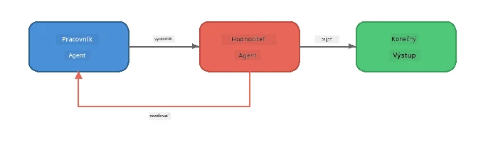
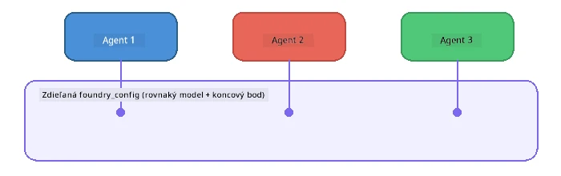

# Časť 6: Viacagentové pracovné toky

> **Cieľ:** Kombinovať niekoľko špecializovaných agentov do koordinovaných pipeline, ktoré rozdeľujú komplexné úlohy medzi spolupracujúcich agentov - všetko bežiace lokálne s Foundry Local.

## Prečo viac agentov?

Jeden agent dokáže zvládnuť veľa úloh, ale komplexné pracovné toky profitujú zo **špecializácie**. Namiesto toho, aby jeden agent skúmal, písal a upravoval súčasne, rozdelíte prácu na zamerané úlohy:



| Vzor | Popis |
|---------|-------------|
| **Sekvenčný** | Výstup Agenta A smeruje do Agenta B → Agenta C |
| **Spätná väzba** | Evaluátor agent môže poslať prácu späť na revíziu |
| **Zdieľaný kontext** | Všetci agenti používajú ten istý model/endpoint, ale rôzne inštrukcie |
| **Typizovaný výstup** | Agenti produkujú štruktúrované výsledky (JSON) pre spoľahlivé odovzdávanie |

---

## Cvičenia

### Cvičenie 1 - Spustite viacagentový pipeline

Workshop obsahuje kompletný Researcher → Writer → Editor pracovný tok.

<details>
<summary><strong>🐍 Python</strong></summary>

**Nastavenie:**
```bash
cd python
python -m venv venv

# Windows (PowerShell):
venv\Scripts\Activate.ps1
# macOS:
source venv/bin/activate

pip install -r requirements.txt
```

**Spustenie:**
```bash
python foundry-local-multi-agent.py
```

**Čo sa stane:**
1. **Researcher** dostane tému a vráti fakty v bodoch
2. **Writer** vezme výskum a napíše blogový príspevok (3-4 odseky)
3. **Editor** skontroluje článok z hľadiska kvality a vráti PRIJATÉ alebo ÚPRAVY

</details>

<details>
<summary><strong>📦 JavaScript</strong></summary>

**Nastavenie:**
```bash
cd javascript
npm install
```

**Spustenie:**
```bash
node foundry-local-multi-agent.mjs
```

**Ten istý trojstupňový pipeline** - Researcher → Writer → Editor.

</details>

<details>
<summary><strong>💜 C#</strong></summary>

**Nastavenie:**
```bash
cd csharp
dotnet restore
```

**Spustenie:**
```bash
dotnet run multi
```

**Ten istý trojstupňový pipeline** - Researcher → Writer → Editor.

</details>

---

### Cvičenie 2 - Analýza pipeline

Študujte, ako sú agenti definovaní a prepojení:

**1. Zdieľaný klient modelu**

Všetci agenti zdieľajú ten istý Foundry Local model:

```python
# Python - FoundryLocalClient rieši všetko
from agent_framework_foundry_local import FoundryLocalClient

client = FoundryLocalClient(model_id="phi-3.5-mini")
```

```javascript
// JavaScript - OpenAI SDK nasmerovaný na Foundry Local
const client = new OpenAI({
  baseURL: manager.urls[0] + "/v1",
  apiKey: "foundry-local",
});
```

```csharp
// C# - OpenAIClient pointed at Foundry Local
var key = new ApiKeyCredential("foundry-local");
var client = new OpenAIClient(key, new OpenAIClientOptions
{
    Endpoint = new Uri(manager.Urls[0] + "/v1")
});
var chatClient = client.GetChatClient(model.Id);
```

**2. špecializované inštrukcie**

Každý agent má jasne odlíšenú personu:

| Agent | Inštrukcie (zhrnutie) |
|-------|----------------------|
| Researcher | "Poskytnite kľúčové fakty, štatistiky a pozadie. Usporiadajte ako odrážky." |
| Writer | "Napíšte zaujímavý blogový príspevok (3-4 odseky) z prieskumných poznámok. Nevymýšľajte fakty." |
| Editor | "Skontrolujte zrozumiteľnosť, gramatiku a faktickú konzistenciu. Rozsudok: PRIJATÉ alebo ÚPRAVY." |

**3. Tok dát medzi agentmi**

```python
# Krok 1 - výstup od výskumníka sa stáva vstupom pre spisovateľa
research_result = await researcher.run(f"Research: {topic}")

# Krok 2 - výstup od spisovateľa sa stáva vstupom pre redaktora
writer_result = await writer.run(f"Write using:\n{research_result}")

# Krok 3 - redaktor kontroluje výskum aj článok
editor_result = await editor.run(
    f"Research:\n{research_result}\n\nArticle:\n{writer_result}"
)
```

```csharp
// C# - same pattern, async calls with AIAgent
var researchNotes = await researcher.RunAsync(
    $"Research the following topic and provide key facts:\n{topic}");

var draft = await writer.RunAsync(
    $"Write a blog post based on these research notes:\n\n{researchNotes}");

var verdict = await editor.RunAsync(
    $"Review this article for quality and accuracy.\n\n" +
    $"Research notes:\n{researchNotes}\n\n" +
    $"Article:\n{draft}");
```

> **Kľúčový postreh:** Každý agent dostáva kumulatívny kontext od predchádzajúcich agentov. Editor vidí pôvodný výskum aj návrh - to mu umožňuje kontrolovať faktickú konzistenciu.

---

### Cvičenie 3 - Pridajte štvrtého agenta

Rozšírte pipeline pridaním nového agenta. Vyberte si jeden:

| Agent | Účel | Inštrukcie |
|-------|---------|-------------|
| **Fact-Checker** | Overovanie tvrdení v článku | `"Overujete faktické tvrdenia. Pre každé tvrdenie uveďte, či je podporené prieskumnými poznámkami. Vráťte JSON s overenými/neoverenými položkami."` |
| **Headline Writer** | Vytváranie pútavých titulkov | `"Vygenerujte 5 možností titulkov pre článok. Štýly rôzne: informatívny, clickbait, otázka, zoznam, emocionálny."` |
| **Social Media** | Vytváranie propagačných príspevkov | `"Vytvorte 3 príspevky na sociálne siete na propagáciu článku: jeden pre Twitter (280 znakov), jeden pre LinkedIn (profesionálny tón), jeden pre Instagram (neformálny so návrhmi emoji)."` |

<details>
<summary><strong>🐍 Python - pridanie Headline Writer</strong></summary>

```python
headline_agent = client.as_agent(
    name="HeadlineWriter",
    instructions=(
        "You are a headline specialist. Given an article, generate exactly "
        "5 headline options. Vary the style: informative, question-based, "
        "listicle, emotional, and provocative. Return them as a numbered list."
    ),
)

# Po prijatí editorom vygenerujte nadpisy
headline_result = await headline_agent.run(
    f"Generate headlines for this article:\n\n{writer_result}"
)
print(f"\n--- Headlines ---\n{headline_result}")
```

</details>

<details>
<summary><strong>📦 JavaScript - pridanie Headline Writer</strong></summary>

```javascript
const headlineAgent = new ChatAgent({
  client,
  modelId: modelInfo.id,
  instructions:
    "You are a headline specialist. Given an article, generate exactly " +
    "5 headline options. Vary the style: informative, question-based, " +
    "listicle, emotional, and provocative. Return them as a numbered list.",
  name: "HeadlineWriter",
});

const headlineResult = await headlineAgent.run(
  `Generate headlines for this article:\n\n${writerResult.text}`
);
console.log(`\n--- Headlines ---\n${headlineResult.text}`);
```

</details>

<details>
<summary><strong>💜 C# - pridanie Headline Writer</strong></summary>

```csharp
AIAgent headlineAgent = chatClient.AsAIAgent(
    name: "HeadlineWriter",
    instructions:
        "You are a headline specialist. Given an article, generate exactly " +
        "5 headline options. Vary the style: informative, question-based, " +
        "listicle, emotional, and provocative. Return them as a numbered list."
);

// After the editor accepts, generate headlines
var headlines = await headlineAgent.RunAsync(
    $"Generate headlines for this article:\n\n{draft}");
Console.WriteLine($"\n--- Headlines ---\n{headlines}");
```

</details>

---

### Cvičenie 4 - Navrhnite vlastný pracovný tok

Navrhnite viacagentový pipeline pre inú oblasť. Tu je niekoľko nápadov:

| Oblasť | Agenti | Tok |
|--------|--------|------|
| **Code Review** | Analyser → Reviewer → Summariser | Analyzovať štruktúru kódu → recenzovať chyby → vytvoriť súhrnnú správu |
| **Zákaznícka podpora** | Classifier → Responder → QA | Kategorizovať tiket → navrhnúť odpoveď → skontrolovať kvalitu |
| **Vzdelávanie** | Quiz Maker → Student Simulator → Grader | Vytvoriť kvíz → simulovať odpovede → ohodnotiť a vysvetliť |
| **Analýza dát** | Interpreter → Analyst → Reporter | Interpretovať dátovú požiadavku → analyzovať vzory → napísať správu |

**Kroky:**
1. Definujte 3+ agentov s jasnými `inštrukciami`
2. Rozhodnite o toku dát - čo každý agent prijíma a čo produkuje?
3. Implementujte pipeline pomocou vzorov z cvičení 1-3
4. Pridajte spätnú slučku, ak má agent hodnotiť prácu iného

---

## Orkestrácia vzory

Tu sú orkestráciu vzory použiteľné v akomkoľvek multiagentovom systéme (podrobne prebrané v [Časti 7](part7-zava-creative-writer.md)):

### Sekvenčný pipeline



Každý agent spracúva výstup predchádzajúceho. Jednoduché a predvídateľné.

### Spätná väzba



Evaluátor agent môže spustiť opätovné spustenie predchádzajúcich fáz. Zava Writer to využíva: editor môže poslať spätnú väzbu výskumníkovi a spisovateľovi.

### Zdieľaný kontext



Všetci agenti zdieľajú jednu `foundry_config`, takže používajú ten istý model a endpoint.

---

## Kľúčové poznatky

| Koncept | Čo ste sa naučili |
|---------|-----------------|
| Špecializácia agenta | Každý agent robí jednu vec dobre s jasnými inštrukciami |
| Prenášanie dát | Výstup jedného agenta sa stáva vstupom ďalšieho |
| Spätné väzby | Evaluátor môže spôsobiť opakovanie pre vyššiu kvalitu |
| Štruktúrovaný výstup | Odpovede v JSON formáte umožňujú spoľahlivú komunikáciu medzi agentmi |
| Orkestrácia | Koordinátor riadi sekvenciu pipeline a spracovanie chýb |
| Produkčné vzory | Použité v [Časti 7: Zava Creative Writer](part7-zava-creative-writer.md) |

---

## Ďalšie kroky

Pokračujte do [Časti 7: Zava Creative Writer - záverečná aplikácia](part7-zava-creative-writer.md) a spoznajte produkčnú viacagentovú aplikáciu so 4 špecializovanými agentmi, streaming výstupom, vyhľadávaním produktov a spätnými väzbami - dostupnú v Pythone, JavaScripte a C#.