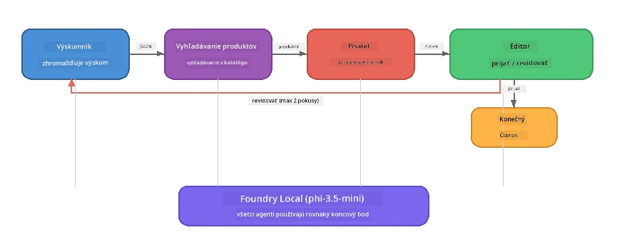

# Časť 7: Zava Creative Writer - záverečná aplikácia

> **Cieľ:** Preskúmať produkčného štýlu viacagentnú aplikáciu, kde štyria špecializovaní agenti spolupracujú na vytváraní článkov kvality magazínu pre Zava Retail DIY - bežiacu výlučne na vašom zariadení s Foundry Local.

Toto je **záverečná laboratórna úloha** workshopu. Spája všetko, čo ste sa naučili - integráciu SDK (Časť 3), vyhľadávanie v lokálnych dátach (Časť 4), agentné persony (Časť 5) a viacagentnú orchestráciu (Časť 6) - do kompletnej aplikácie dostupnej v **Pythone**, **JavaScripte** a **C#**.

---

## Čo preskúmate

| Koncept | Kde v Zava Writer |
|---------|----------------------|
| 4-krokové načítanie modelu | Zdieľaný konfiguračný modul spúšťa Foundry Local |
| RAG-štýl vyhľadávania | Agent produktu prehľadáva lokálny katalóg |
| Špecializácia agentov | 4 agenti s odlišnými systémovými promptmi |
| Streamovanie výstupu | Writer prináša tokeny v reálnom čase |
| Štruktúrované predávanie | Researcher → JSON, Editor → JSON rozhodnutie |
| Spätné väzby | Editor môže vyvolať opakované vykonanie (max 2 opakovania) |

---

## Architektúra

Zava Creative Writer používa **sekvenčný pipeline s hodnotiacou spätnou väzbou**. Všetky tri jazykové implementácie používajú rovnakú architektúru:



### Štyria agenti

| Agent | Vstup | Výstup | Účel |
|-------|-------|---------|------|
| **Researcher** | Téma + voliteľná spätná väzba | `{"web": [{url, name, description}, ...]}` | Zhromažďuje pozadie pomocou LLM |
| **Product Search** | Kontext produktu ako reťazec | Zoznam zodpovedajúcich produktov | LLM-generované dopyty + vyhľadávanie kľúčových slov v lokálnom katalógu |
| **Writer** | Výskum + produkty + zadanie + spätná väzba | Streamovaný text článku (delený na `---`) | Návrh článku kvality magazínu v reálnom čase |
| **Editor** | Článok + self-feedback autora | `{"decision": "accept/revise", "editorFeedback": "...", "researchFeedback": "..."}` | Posudzuje kvalitu, vyvoláva opakovanie podľa potreby |

### Priebeh pipeline

1. **Researcher** prijme tému a vytvorí štruktúrované poznámky výskumu (JSON)
2. **Product Search** prehľadá lokálny produktový katalóg pomocou LLM-generovaných vyhľadávacích termínov
3. **Writer** kombinuje výskum + produkty + zadanie do streamovaného článku, za ktorým nasleduje self-feedback po `---` separátore
4. **Editor** posúdi článok a vráti JSON rozsudok:
   - `"accept"` → pipeline sa dokončí
   - `"revise"` → spätná väzba sa posiela Researcherovi a Writerovi (max 2 opakovania)

---

## Predpoklady

- Dokončiť [Časť 6: Viacagentné pracovné postupy](part6-multi-agent-workflows.md)
- Nainštalovaný Foundry Local CLI a stiahnutý model `phi-3.5-mini`

---

## Úlohy

### Úloha 1 - Spustite Zava Creative Writer

Vyberte svoj jazyk a spustite aplikáciu:

<details>
<summary><strong>🐍 Python - FastAPI webová služba</strong></summary>

Python verzia beží ako **webová služba** s REST API, ukazujúca, ako vybudovať produkčný backend.

**Inštalácia:**
```bash
cd zava-creative-writer-local/src/api
python -m venv venv

# Windows (PowerShell):
venv\Scripts\Activate.ps1
# macOS:
source venv/bin/activate

pip install -r requirements.txt
```

**Spustenie:**
```bash
uvicorn main:app --reload
```

**Testovanie:**
```bash
curl -X POST http://localhost:8000/api/article \
  -H "Content-Type: application/json" \
  -d '{
    "research": "DIY home improvement trends",
    "products": "power tools and paints",
    "assignment": "Write an article about weekend renovation projects for DIY enthusiasts"
  }'
```

Odpoveď sa streamuje ako JSON správy oddelené novými riadkami, zobrazujúce priebeh každého agenta.

</details>

<details>
<summary><strong>📦 JavaScript - Node.js CLI</strong></summary>

JavaScript verzia beží ako **CLI aplikácia**, ktorá tlačí priebeh agentov a článok priamo do konzoly.

**Inštalácia:**
```bash
cd zava-creative-writer-local/src/javascript
npm install
```

**Spustenie:**
```bash
node main.mjs
```

Uvidíte:
1. Načítanie Foundry Local modelu (s progress barom pri sťahovaní)
2. Každý agent sa vykoná v sekvencii so stavovými správami
3. Článok sa streamuje do konzoly v reálnom čase
4. Editorovo rozhodnutie accept/revise

</details>

<details>
<summary><strong>💜 C# - .NET konzolová aplikácia</strong></summary>

C# verzia beží ako **.NET konzolová aplikácia** s rovnakým pipeline a streamovaným výstupom.

**Inštalácia:**
```bash
cd zava-creative-writer-local/src/csharp
dotnet restore
```

**Spustenie:**
```bash
dotnet run
```

Rovnaký vzor výstupu ako v JavaScripte - stavové správy agentov, streamovaný článok a verdict editora.

</details>

---

### Úloha 2 - Študujte štruktúru kódu

Každá jazyková implementácia má rovnaké logické komponenty. Porovnajte štruktúry:

**Python** (`src/api/`):
| Súbor | Účel |
|-------|------|
| `foundry_config.py` | Zdieľaný Foundry Local manažér, model a klient (4-kroková inicializácia) |
| `orchestrator.py` | Koordinácia pipeline so spätnou väzbou |
| `main.py` | FastAPI endpointy (`POST /api/article`) |
| `agents/researcher/researcher.py` | Výskum založený na LLM s JSON výstupom |
| `agents/product/product.py` | LLM-generované dopyty + vyhľadávanie kľúčových slov |
| `agents/writer/writer.py` | Streamovanie generovania článku |
| `agents/editor/editor.py` | Rozhodnutie accept/revise v JSON |

**JavaScript** (`src/javascript/`):
| Súbor | Účel |
|-------|------|
| `foundryConfig.mjs` | Zdieľaná Foundry Local konfigurácia (4-kroková inicializácia s progress barom) |
| `main.mjs` | Orchestrátor + vstup do CLI |
| `researcher.mjs` | Agent výskumu založený na LLM |
| `product.mjs` | Generovanie dopytov LLM + vyhľadávanie kľúčových slov |
| `writer.mjs` | Streamovanie generovania článku (asynchrónny generátor) |
| `editor.mjs` | Rozhodnutie accept/revise v JSON |
| `products.mjs` | Dáta produktového katalógu |

**C#** (`src/csharp/`):
| Súbor | Účel |
|-------|------|
| `Program.cs` | Kompletný pipeline: načítanie modelu, agenti, orchestrátor, spätná väzba |
| `ZavaCreativeWriter.csproj` | Projekt .NET 9 s Foundry Local a OpenAI balíkmi |

> **Poznámka k dizajnu:** Python rozdeľuje každého agenta do vlastného súboru/adresára (vhodné pre väčšie tímy). JavaScript používa jeden modul na agenta (vhodné pre stredne veľké projekty). C# drží všetko v jednom súbore s lokálnymi funkciami (vhodné pre samostatné príklady). V produkcii si vyberte model podľa konvencií vášho tímu.

---

### Úloha 3 - Sledovanie zdieľanej konfigurácie

Každý agent v pipeline používa rovnakého Foundry Local modelového klienta. Preskúmajte, ako je to nastavené v každom jazyku:

<details>
<summary><strong>🐍 Python - foundry_config.py</strong></summary>

```python
from foundry_local import FoundryLocalManager

MODEL_ALIAS = "phi-3.5-mini"

# Krok 1: Vytvorte manažéra a spustite službu Foundry Local
manager = FoundryLocalManager()
manager.start_service()

# Krok 2: Skontrolujte, či je model už stiahnutý
cached = manager.list_cached_models()
catalog_info = manager.get_model_info(MODEL_ALIAS)
is_cached = any(m.id == catalog_info.id for m in cached) if catalog_info else False

if not is_cached:
    manager.download_model(MODEL_ALIAS)

# Krok 3: Načítajte model do pamäti
manager.load_model(MODEL_ALIAS)
model_id = manager.get_model_info(MODEL_ALIAS).id

# Zdieľaný klient OpenAI
client = openai.OpenAI(base_url=manager.endpoint, api_key=manager.api_key)
```

Všetci agenti importujú `from foundry_config import client, model_id`.

</details>

<details>
<summary><strong>📦 JavaScript - foundryConfig.mjs</strong></summary>

```javascript
import { FoundryLocalManager } from "foundry-local-sdk";
import { OpenAI } from "openai";

FoundryLocalManager.create({ appName: "ZavaCreativeWriter" });
const manager = FoundryLocalManager.instance;
await manager.startWebService();

// Skontrolovať vyrovnávaciu pamäť → stiahnuť → načítať (nový vzor SDK)
const catalog = manager.catalog;
const model = await catalog.getModel(MODEL_ALIAS);
if (!model.isCached) {
  console.log(`Downloading model: ${MODEL_ALIAS}...`);
  await model.download();
}
await model.load();

const client = new OpenAI({ baseURL: manager.urls[0] + "/v1", apiKey: "foundry-local" });
const modelId = model.id;
export { client, modelId };
```

Všetci agenti importujú `{ client, modelId } from "./foundryConfig.mjs"`.

</details>

<details>
<summary><strong>💜 C# - začiatok Program.cs</strong></summary>

```csharp
await FoundryLocalManager.CreateAsync(
    new Configuration
    {
        AppName = "ZavaCreativeWriter",
        Web = new Configuration.WebService { Urls = "http://127.0.0.1:0" }
    }, NullLogger.Instance, default);
var manager = FoundryLocalManager.Instance;
await manager.StartWebServiceAsync(default);

var catalog = await manager.GetCatalogAsync(default);
var catalogModel = await catalog.GetModelAsync(alias, default);
var isCached = await catalogModel.IsCachedAsync(default);
if (!isCached)
    await catalogModel.DownloadAsync(null, default);

await catalogModel.LoadAsync(default);
var key = new ApiKeyCredential("foundry-local");
var chatClient = new OpenAIClient(key, new OpenAIClientOptions
{
    Endpoint = new Uri(manager.Urls[0] + "/v1")
}).GetChatClient(catalogModel.Id);
```

`chatClient` je potom odovzdaný všetkým agentným funkciám v rovnakom súbore.

</details>

> **Kľúčový vzor:** Šablóna načítavania modelu (spustenie služby → kontrola cache → stiahnutie → načítanie) zabezpečuje, že používateľ vidí jasný priebeh, a model sa stiahne len raz. Toto je najlepšia prax pre akúkoľvek Foundry Local aplikáciu.

---

### Úloha 4 - Pochopenie spätného cyklu

Spätný cyklus je to, čo robí pipeline „inteligentnou“ - Editor môže vrátiť prácu na revíziu. Sledovanie logiky:

```
Orchestrator:
  1. researcher.research(topic, "No Feedback")    ← first pass
  2. product.findProducts(productContext)
  3. writer.write(research, products, assignment)  ← streams article
  4. Split article at "---" → article + writerFeedback
  5. editor.edit(article, writerFeedback)

  WHILE editor says "revise" AND retryCount < 2:
    6. researcher.research(topic, editor.researchFeedback)  ← refined
    7. writer.write(research, products, editor.editorFeedback)
    8. editor.edit(newArticle, newWriterFeedback)
    9. retryCount++
```

**Otázky na zváženie:**
- Prečo je limit opakovaní nastavený na 2? Čo sa stane, ak ho zvýšite?
- Prečo výskumník dostáva `researchFeedback`, ale writer dostáva `editorFeedback`?
- Čo by sa stalo, keby editor vždy povedal „revise“?

---

### Úloha 5 - Upraviť agenta

Skúste zmeniť správanie jedného agenta a sledujte, ako to ovplyvní pipeline:

| Úprava | Čo zmeniť |
|--------|-----------|
| **Prísnejší editor** | Zmeniť systémový prompt editora tak, aby vždy požadoval aspoň jednu revíziu |
| **Dlhšie články** | Zmeniť prompt writera z „800-1000 slov“ na „1500-2000 slov“ |
| **Rôzne produkty** | Pridať alebo zmeniť produkty v produktovom katalógu |
| **Nová téma výskumu** | Zmeniť štandardný `researchContext` na inú tému |
| **Výskumník iba s JSON** | Nech výskumník vráti 10 položiek namiesto 3-5 |

> **Tip:** Keďže všetky tri jazyky implementujú rovnakú architektúru, môžete rovnakú úpravu spraviť v jazyku, s ktorým sa cítite najkomfortnejšie.

---

### Úloha 6 - Pridať piateho agenta

Rozšírte pipeline o nového agenta. Niekoľko nápadov:

| Agent | Kde v pipeline | Účel |
|-------|----------------|------|
| **Fact-Checker** | Po Writerovi, pred Editorom | Overenie tvrdení podľa výskumných dát |
| **SEO Optimiser** | Po akceptácii editora | Pridanie meta popisu, kľúčových slov, URL slug |
| **Illustrator** | Po akceptácii editora | Generovanie promptov na obrázky pre článok |
| **Translator** | Po akceptácii editora | Preklad článku do iného jazyka |

**Kroky:**
1. Napíšte systémový prompt agenta
2. Vytvorte funkciu agenta (podľa existujúceho vzoru vo vašom jazyku)
3. Vložte ho na správne miesto do orchestrátora
4. Aktualizujte výstup/logovanie tak, aby zobrazovalo príspevok nového agenta

---

## Ako Foundry Local a agentný framework spolupracujú

Táto aplikácia demonštruje odporúčaný vzor budovania viacagentných systémov s Foundry Local:

| Vrstva | Komponent | Úloha |
|--------|-----------|-------|
| **Runtime** | Foundry Local | Sťahuje, spravuje a poskytuje model lokálne |
| **Klient** | OpenAI SDK | Posiela chatové dokončenia na lokálny endpoint |
| **Agent** | Systémový prompt + chat volanie | špecializované správanie cez zamerané inštrukcie |
| **Orchestrátorka** | Koordinátor pipeline | Riadi tok dát, sekvenovanie a spätnoväzbové slučky |
| **Framework** | Microsoft Agent Framework | Poskytuje abstrakciu `ChatAgent` a vzory |

Kľúčová myšlienka: **Foundry Local nahrádza cloudový backend, nie architektúru aplikácie.** Rovnaké vzory agentov, orchestrácie a štruktúrované predávania, ktoré fungujú s cloud-hostovanými modelmi, fungujú identicky s lokálnymi modelmi — len klient smerujete na lokálny endpoint namiesto Azure endpointu.

---

## Kľúčové poznatky

| Koncept | Čo ste sa naučili |
|---------|-------------------|
| Produkčná architektúra | Ako štruktúrovať viacagentnú appku so zdieľanou konfiguráciou a samostatnými agentmi |
| 4-krokové načítanie modelu | Najlepšia prax inicializácie Foundry Local s používateľsky viditeľným priebehom |
| Špecializácia agentov | Každý zo 4 agentov má zamerané inštrukcie a špecifický výstupný formát |
| Streamovanie generovania | Writer prináša tokeny v reálnom čase, umožňujúce responzívne UI |
| Spätné väzby | Opakovanie riadené editorom zlepšuje kvalitu výstupu bez ľudskej intervencie |
| Medzijazykové vzory | Rovnaká architektúra funguje v Pythone, JavaScripte a C# |
| Lokálne = produkčné | Foundry Local poskytuje rovnaké OpenAI-kompatibilné API ako cloudové nasadenia |

---

## Ďalší krok

Pokračujte do [Časti 8: Vývoj riadený hodnotením](part8-evaluation-led-development.md) a vybudujte systematický vyhodnocovací framework pre vašich agentov pomocou zlatých datasetov, pravidlových kontrol a hodnotenia LLM ako rozhodcu.