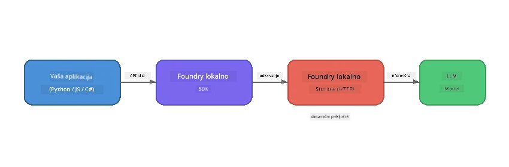

# 1. del: Začetek z Foundry Local


## Kaj je Foundry Local?

[Foundry Local](https://foundrylocal.ai) vam omogoča, da izvajate odprtokodne jezikovne modele AI **natančno na vašem računalniku** – brez internetne povezave, brez stroškov oblaka in z popolno zasebnostjo podatkov. To:

- **Prenese in zažene modele lokalno** z avtomatsko optimizacijo za strojno opremo (GPU, CPU ali NPU)
- **Nudi API, združljiv z OpenAI**, da lahko uporabljate znane SDK-je in orodja
- **Ne zahteva naročnine na Azure** ali prijave – samo namestite in začnite graditi

Predstavljajte si, da imate svojo lastno zasebno AI, ki teče povsem na vaši napravi.

## Cilji učenja

Na koncu te vaje boste znali:

- Namestiti Foundry Local CLI na svoj operacijski sistem
- Razumeti, kaj so aliasi modelov in kako delujejo
- Prenesti in zagnati svoj prvi lokalni AI model
- Poslati sporočilo v klepet lokalnemu modelu preko ukazne vrstice
- Razumeti razliko med lokalnimi in v oblaku gostovanimi AI modeli

---

## Pogoji

### Sistemske zahteve

| Zahteva | Minimalno | Priporočeno |
|---------|-----------|-------------|
| **RAM** | 8 GB | 16 GB |
| **Diskovni prostor** | 5 GB (za modele) | 10 GB |
| **CPU** | 4 jedra | 8+ jeder |
| **GPU** | Izbirno | NVIDIA s CUDA 11.8+ |
| **OS** | Windows 10/11 (x64/ARM), Windows Server 2025, macOS 13+ | - |

> **Opomba:** Foundry Local samodejno izbere najboljšo različico modela za vašo strojno opremo. Če imate NVIDIA GPU, uporabi pospešek CUDA. Če imate Qualcomm NPU, uporabi to. V nasprotnem primeru uporabi optimizirano CPU različico.

### Namestitev Foundry Local CLI

**Windows** (PowerShell):
```powershell
winget install Microsoft.FoundryLocal
```

**macOS** (Homebrew):
```bash
brew tap microsoft/foundrylocal
brew install foundrylocal
```

> **Opomba:** Trenutno Foundry Local podpira le Windows in macOS. Linux trenutno ni podprt.

Preverite namestitev:
```bash
foundry --version
```

---

## Laboratorijske vaje

### Vaja 1: Raziščite razpoložljive modele

Foundry Local vključuje katalog vnaprej optimiziranih odprtokodnih modelov. Naštejte jih:

```bash
foundry model list
```

Videli boste modele, kot so:
- `phi-3.5-mini` - Microsoftov model s 3,8 milijardami parametrov (hiter, dobra kakovost)
- `phi-4-mini` - novejši, zmogljivejši Phi model
- `phi-4-mini-reasoning` - Phi model z verigo mišljenja (`<think>` oznake)
- `phi-4` - Microsoftov največji Phi model (10,4 GB)
- `qwen2.5-0.5b` - zelo majhen in hiter (primeren za naprave z nizkimi viri)
- `qwen2.5-7b` - močan splošni model s podporo klicanju orodij
- `qwen2.5-coder-7b` - optimiziran za generiranje kode
- `deepseek-r1-7b` - močan model za razmišljanje
- `gpt-oss-20b` - velik odprtokodni model (licenca MIT, 12,5 GB)
- `whisper-base` - pretvorba govora v besedilo (383 MB)
- `whisper-large-v3-turbo` - natančna pretvorba besedila (9 GB)

> **Kaj je alias modela?** Aliasi, kot je `phi-3.5-mini`, so bližnjice. Ko uporabite alias, Foundry Local samodejno prenese najboljšo različico za vašo specifično strojno opremo (CUDA za NVIDIA GPU, drugače optimizirano za CPU). Nikoli vam ni treba skrbeti za izbiro ustrezne različice.

### Vaja 2: Zaženite svoj prvi model

Prenesite in začnite interaktivno klepetati z modelom:

```bash
foundry model run phi-3.5-mini
```

Prvič ko to zaženete, bo Foundry Local:
1. Prepoznal vašo strojno opremo
2. Prenesel optimalno različico modela (to lahko traja nekaj minut)
3. Naložil model v pomnilnik
4. Začel interaktiven klepet

Poskusite mu zastaviti nekaj vprašanj:
```
You: What is the golden ratio?
You: Can you explain it as if I were 10 years old?
You: Write a haiku about mathematics
```

Za izhod vpišite `exit` ali pritisnite `Ctrl+C`.

### Vaja 3: Predhodno prenesite model

Če želite model prenesti, ne da bi začeli klepet:

```bash
foundry model download phi-3.5-mini
```

Preverite, kateri modeli so že preneseni na vaš računalnik:

```bash
foundry cache list
```

### Vaja 4: Razumite arhitekturo

Foundry Local teče kot **lokalna HTTP storitev**, ki zagotavlja REST API, združljiv z OpenAI. To pomeni:

1. Storitev se zažene na **dinamičnem pristanišču** (vsakič na drugem pristanišču)
2. Za odkrivanje dejanskega URL-ja uporabite SDK
3. Za pogovor lahko uporabite **katero koli** knjižnico odjemalca, združljivo z OpenAI



> **Pomembno:** Foundry Local vsakič ob zagonu dodeli **dinamično pristanišče**. Nikoli ne vnesite trde kode za številko pristanišča, kot je `localhost:5272`. Vedno uporabite SDK za odkritje trenutnega URL-ja (npr. `manager.endpoint` v Pythonu ali `manager.urls[0]` v JavaScriptu).

---

## Ključne ugotovitve

| Koncept | Kaj ste se naučili |
|---------|--------------------|
| AI na napravi | Foundry Local izvaja modele povsem na vaši napravi brez oblaka, brez API ključev in brez stroškov |
| Aliasi modelov | Aliasi, kot je `phi-3.5-mini`, samodejno izberejo najboljšo različico za vašo opremo |
| Dinamična pristanišča | Storitev teče na dinamičnem pristanišču; vedno uporabite SDK za odkrivanje točne poti |
| CLI in SDK | Z modeli lahko komunicirate preko CLI (`foundry model run`) ali programsko preko SDK |

---

## Naslednji koraki

Nadaljujte na [2. del: Podroben vpogled v Foundry Local SDK](part2-foundry-local-sdk.md), da obvladate SDK API za upravljanje modelov, storitev in predpomnjenja programsko.

---

<!-- CO-OP TRANSLATOR DISCLAIMER START -->
**Omejitev odgovornosti**:  
Ta dokument je bil preveden z uporabo storitve za strojno prevajanje AI [Co-op Translator](https://github.com/Azure/co-op-translator). Čeprav si prizadevamo za natančnost, vas opozarjamo, da samodejni prevodi lahko vsebujejo napake ali netočnosti. Izvirni dokument v njegovem izvorno jeziku velja za avtoritativni vir. Za kritične informacije priporočamo strokovni človeški prevod. Ne odgovarjamo za morebitne nesporazume ali napačne interpretacije, ki izhajajo iz uporabe tega prevoda.
<!-- CO-OP TRANSLATOR DISCLAIMER END -->