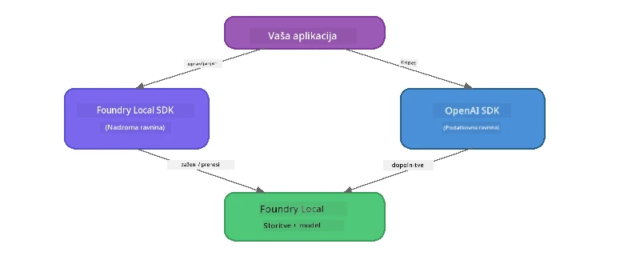

# 3. del: Uporaba Foundry Local SDK z OpenAI

## Pregled

V 1. delu ste z uporabo Foundry Local CLI interaktivno izvajali modele. V 2. delu ste raziskali celotno površino API-ja SDK. Zdaj boste izvedeli, kako **integrirati Foundry Local v vaše aplikacije** z uporabo SDK in API-ja, združljivega z OpenAI.

Foundry Local ponuja SDK-je za tri jezike. Izberite tistega, s katerim ste najbolj vešči – koncepti so identični za vse tri.

## Cilji učenja

Na koncu tega laboratorija boste znali:

- Namestiti Foundry Local SDK za vaš jezik (Python, JavaScript ali C#)
- Inicializirati `FoundryLocalManager` za zagon storitve, preveriti predpomnilnik, prenesti in naložiti model
- Povezati se z lokalnim modelom preko OpenAI SDK
- Pošiljati pogovorne dokončnice in obdelovati pretočne odzive
- Razumeti arhitekturo dinamičnih vrat

---

## Zahteve

Najprej dokončajte [1. del: Začetek z Foundry Local](part1-getting-started.md) in [2. del: Poglobljen pogled v Foundry Local SDK](part2-foundry-local-sdk.md).

Namestite **eno** od naslednjih jezikovnih okolij:
- **Python 3.9+** - [python.org/downloads](https://www.python.org/downloads/)
- **Node.js 18+** - [nodejs.org](https://nodejs.org/)
- **.NET 9.0+** - [dot.net/download](https://dotnet.microsoft.com/download)

---

## Koncept: Kako deluje SDK

Foundry Local SDK upravlja **krmilno ploskev** (zagon storitve, prenos modelov), medtem ko OpenAI SDK upravlja **podatkovno ploskev** (pošiljanje pozivov, prejema dokončnic).



---

## Laboratorijske vaje

### Naloga 1: Nastavite svoje okolje

<details>
<summary><b>🐍 Python</b></summary>

```bash
cd python
python -m venv venv

# Aktivirajte virtualno okolje:
# Windows (PowerShell):
venv\Scripts\Activate.ps1
# Windows (Command Prompt):
venv\Scripts\activate.bat
# macOS:
source venv/bin/activate

pip install -r requirements.txt
```

Datoteka `requirements.txt` namesti:
- `foundry-local-sdk` - Foundry Local SDK (uvožen kot `foundry_local`)
- `openai` - OpenAI Python SDK
- `agent-framework` - Microsoft Agent Framework (uporabljen v kasnejših delih)

</details>

<details>
<summary><b>📘 JavaScript</b></summary>

```bash
cd javascript
npm install
```

Datoteka `package.json` namesti:
- `foundry-local-sdk` - Foundry Local SDK
- `openai` - OpenAI Node.js SDK

</details>

<details>
<summary><b>💜 C#</b></summary>

```bash
cd csharp
dotnet restore
dotnet build
```

Datoteka `csharp.csproj` uporablja:
- `Microsoft.AI.Foundry.Local` - Foundry Local SDK (NuGet)
- `OpenAI` - OpenAI C# SDK (NuGet)

> **Struktura projekta:** C# projekt uporablja usmerjevalnik ukazne vrstice v `Program.cs`, ki pošilja ukaze v ločene primere. Zaženite `dotnet run chat` (ali samo `dotnet run`) za ta del. Drugi deli uporabljajo `dotnet run rag`, `dotnet run agent` in `dotnet run multi`.

</details>

---

### Naloga 2: Osnovni pogovorni zaključek

Odprite osnovni pogovorni primer za vaš jezik in preglejte kodo. Vsak skript sledi istemu tristo korakov:

1. **Zagon storitve** – `FoundryLocalManager` zažene Foundry Local okolje
2. **Prenos in nalaganje modela** – preverite predpomnilnik, prenesite, če je potrebno, nato naložite v spomin
3. **Ustvarjanje OpenAI odjemalca** – povežite se z lokalno končno točko in pošljite pretočni pogovorni zaključek

<details>
<summary><b>🐍 Python - <code>python/foundry-local.py</code></b></summary>

```python
import sys
import openai
from foundry_local import FoundryLocalManager

alias = "phi-3.5-mini"

# Korak 1: Ustvari FoundryLocalManager in zaženi storitev
print("Starting Foundry Local service...")
manager = FoundryLocalManager()
manager.start_service()

# Korak 2: Preveri, ali je model že prenesen
cached = manager.list_cached_models()
catalog_info = manager.get_model_info(alias)
is_cached = any(m.id == catalog_info.id for m in cached) if catalog_info else False

if is_cached:
    print(f"Model already downloaded: {alias}")
else:
    print(f"Downloading model: {alias} (this may take several minutes)...")
    manager.download_model(alias)
    print(f"Download complete: {alias}")

# Korak 3: Naloži model v pomnilnik
print(f"Loading model: {alias}...")
manager.load_model(alias)

# Ustvari OpenAI odjemalca, usmerjenega na LOKALNO Foundry storitev
client = openai.OpenAI(
    base_url=manager.endpoint,   # Dinamičen priključek - nikoli ne uporabljaš na trdo kodirano!
    api_key=manager.api_key
)

# Ustvari pretočni klepetalni odgovor
stream = client.chat.completions.create(
    model=manager.get_model_info(alias).id,
    messages=[{"role": "user", "content": "What is the golden ratio?"}],
    stream=True,
)

for chunk in stream:
    if chunk.choices[0].delta.content is not None:
        print(chunk.choices[0].delta.content, end="", flush=True)
print()
```

**Zaženite ga:**
```bash
python foundry-local.py
```

</details>

<details>
<summary><b>📘 JavaScript - <code>javascript/foundry-local.mjs</code></b></summary>

```javascript
import { OpenAI } from "openai";
import { FoundryLocalManager } from "foundry-local-sdk";

const alias = "phi-3.5-mini";

// Korak 1: Zaženite storitev Foundry Local
console.log("Starting Foundry Local service...");
FoundryLocalManager.create({ appName: "FoundryLocalWorkshop" });
const manager = FoundryLocalManager.instance;
await manager.startWebService();

// Korak 2: Preverite, ali je model že prenesen
const catalog = manager.catalog;
const model = await catalog.getModel(alias);

if (model.isCached) {
  console.log(`Model already downloaded: ${alias}`);
} else {
  console.log(`Downloading model: ${alias} (this may take several minutes)...`);
  await model.download();
  console.log(`Download complete: ${alias}`);
}

// Korak 3: Naložite model v pomnilnik
console.log(`Loading model: ${alias}...`);
await model.load();
console.log(`Model loaded: ${model.id}`);

// Ustvarite OpenAI odjemalca, ki kaže na lokalno storitev Foundry
const client = new OpenAI({
  baseURL: manager.urls[0] + "/v1",   // Dinamični priključek - nikoli ne uporabljajte trdno kodiranega!
  apiKey: "foundry-local",
});

// Generirajte pretakanje dokončanja klepeta
const stream = await client.chat.completions.create({
  model: model.id,
  messages: [{ role: "user", content: "What is the golden ratio?" }],
  stream: true,
});

for await (const chunk of stream) {
  if (chunk.choices[0]?.delta?.content) {
    process.stdout.write(chunk.choices[0].delta.content);
  }
}
console.log();
```

**Zaženite ga:**
```bash
node foundry-local.mjs
```

</details>

<details>
<summary><b>💜 C# - <code>csharp/BasicChat.cs</code></b></summary>

```csharp
using Microsoft.AI.Foundry.Local;
using Microsoft.Extensions.Logging.Abstractions;
using OpenAI;
using OpenAI.Chat;
using System.ClientModel;

var alias = "phi-3.5-mini";

// Step 1: Start the Foundry Local service
Console.WriteLine("Starting Foundry Local service...");
await FoundryLocalManager.CreateAsync(
    new Configuration
    {
        AppName = "FoundryLocalSamples",
        Web = new Configuration.WebService { Urls = "http://127.0.0.1:0" }
    }, NullLogger.Instance, default);
var manager = FoundryLocalManager.Instance;
await manager.StartWebServiceAsync(default);

// Step 2: Get the model from the catalog
var catalog = await manager.GetCatalogAsync(default);
var model = await catalog.GetModelAsync(alias, default);

// Step 3: Check if the model is already downloaded
var isCached = await model.IsCachedAsync(default);

if (isCached)
{
    Console.WriteLine($"Model already downloaded: {alias}");
}
else
{
    Console.WriteLine($"Downloading model: {alias} (this may take several minutes)...");
    await model.DownloadAsync(null, default);
    Console.WriteLine($"Download complete: {alias}");
}

// Step 4: Load the model into memory
Console.WriteLine($"Loading model: {alias}...");
await model.LoadAsync(default);
Console.WriteLine($"Loaded model: {model.Id}");
Console.WriteLine($"Endpoint: {manager.Urls[0]}");

// Create OpenAI client pointing to the LOCAL Foundry service
var key = new ApiKeyCredential("foundry-local");
var client = new OpenAIClient(key, new OpenAIClientOptions
{
    Endpoint = new Uri(manager.Urls[0] + "/v1")  // Dynamic port - never hardcode!
});

var chatClient = client.GetChatClient(model.Id);

// Stream a chat completion
var completionUpdates = chatClient.CompleteChatStreaming("What is the golden ratio?");

foreach (var update in completionUpdates)
{
    if (update.ContentUpdate.Count > 0)
    {
        Console.Write(update.ContentUpdate[0].Text);
    }
}
Console.WriteLine();
```

**Zaženite ga:**
```bash
dotnet run chat
```

</details>

---

### Naloga 3: Eksperimentirajte s pozivi

Ko vaš osnovni primer deluje, poskusite spremeniti kodo:

1. **Spremenite uporabniško sporočilo** – preizkusite različna vprašanja
2. **Dodajte sistemski poziv** – dodelite modelu osebnost
3. **Izklopite pretakanje** – nastavite `stream=False` in natisnite celoten odgovor naenkrat
4. **Preizkusite drugačen model** – zamenjajte alias `phi-3.5-mini` za drug model iz `foundry model list`

<details>
<summary><b>🐍 Python</b></summary>

```python
# Dodajte sistemski poziv - dajte modelu osebnost:
stream = client.chat.completions.create(
    model=manager.get_model_info(alias).id,
    messages=[
        {"role": "system", "content": "You are a pirate. Answer everything in pirate speak."},
        {"role": "user", "content": "What is the golden ratio?"}
    ],
    stream=True,
)

# Ali izključite pretočno predvajanje:
response = client.chat.completions.create(
    model=manager.get_model_info(alias).id,
    messages=[{"role": "user", "content": "What is the golden ratio?"}],
    stream=False,
)
print(response.choices[0].message.content)
```

</details>

<details>
<summary><b>📘 JavaScript</b></summary>

```javascript
// Dodajte sistemski poziv - dajte modelu osebnost:
const stream = await client.chat.completions.create({
  model: modelInfo.id,
  messages: [
    { role: "system", content: "You are a pirate. Answer everything in pirate speak." },
    { role: "user", content: "What is the golden ratio?" },
  ],
  stream: true,
});

// Ali izklopite pretakanje:
const response = await client.chat.completions.create({
  model: modelInfo.id,
  messages: [{ role: "user", content: "What is the golden ratio?" }],
  stream: false,
});
console.log(response.choices[0].message.content);
```

</details>

<details>
<summary><b>💜 C#</b></summary>

```csharp
// Add a system prompt - give the model a persona:
var completionUpdates = chatClient.CompleteChatStreaming(
    new ChatMessage[]
    {
        new SystemChatMessage("You are a pirate. Answer everything in pirate speak."),
        new UserChatMessage("What is the golden ratio?")
    }
);

// Or turn off streaming:
var response = chatClient.CompleteChat("What is the golden ratio?");
Console.WriteLine(response.Value.Content[0].Text);
```

</details>

---

### Referenca metod SDK

<details>
<summary><b>🐍 Metode Python SDK</b></summary>

| Metoda | Namen |
|--------|-------|
| `FoundryLocalManager()` | Ustvari instanco upravljavca |
| `manager.start_service()` | Zažene Foundry Local storitev |
| `manager.list_cached_models()` | Prikaže modele, prenesene na vašo napravo |
| `manager.get_model_info(alias)` | Dobi ID modela in metapodatke |
| `manager.download_model(alias, progress_callback=fn)` | Prenese model z opcijskim povratnim klicem za napredek |
| `manager.load_model(alias)` | Naloži model v spomin |
| `manager.endpoint` | Pridobi URL dinamične končne točke |
| `manager.api_key` | Pridobi API ključ (zamik za lokalno uporabo) |

</details>

<details>
<summary><b>📘 Metode JavaScript SDK</b></summary>

| Metoda | Namen |
|--------|-------|
| `FoundryLocalManager.create({ appName })` | Ustvari instanco upravljavca |
| `FoundryLocalManager.instance` | Dostop do singleton upravljavca |
| `await manager.startWebService()` | Zažene Foundry Local storitev |
| `await manager.catalog.getModel(alias)` | Pridobi model iz kataloga |
| `model.isCached` | Preveri, ali je model že prenesen |
| `await model.download()` | Prenese model |
| `await model.load()` | Naloži model v spomin |
| `model.id` | Pridobi ID modela za klice OpenAI API |
| `manager.urls[0] + "/v1"` | Pridobi URL dinamične končne točke |
| `"foundry-local"` | API ključ (zamik za lokalno uporabo) |

</details>

<details>
<summary><b>💜 Metode C# SDK</b></summary>

| Metoda | Namen |
|--------|-------|
| `FoundryLocalManager.CreateAsync(config)` | Ustvari in inicializira upravljavca |
| `manager.StartWebServiceAsync()` | Zažene Foundry Local spletno storitev |
| `manager.GetCatalogAsync()` | Pridobi katalog modelov |
| `catalog.ListModelsAsync()` | Našteje vse razpoložljive modele |
| `catalog.GetModelAsync(alias)` | Pridobi določen model po aliasu |
| `model.IsCachedAsync()` | Preveri, ali je model prenesen |
| `model.DownloadAsync()` | Prenese model |
| `model.LoadAsync()` | Naloži model v spomin |
| `manager.Urls[0]` | Pridobi URL dinamične končne točke |
| `new ApiKeyCredential("foundry-local")` | API ključ za lokalno uporabo |

</details>

---

### Naloga 4: Uporaba native ChatClient (alternativa OpenAI SDK)

V vajah 2 in 3 ste uporabili OpenAI SDK za pogovorne zaključke. JavaScript in C# SDK-ji ponujajo tudi **native ChatClient**, ki popolnoma odpravi potrebo po OpenAI SDK.

<details>
<summary><b>📘 JavaScript - <code>model.createChatClient()</code></b></summary>

```javascript
import { FoundryLocalManager } from "foundry-local-sdk";

const alias = "phi-3.5-mini";

FoundryLocalManager.create({ appName: "ChatClientDemo" });
const manager = FoundryLocalManager.instance;
await manager.startWebService();

const model = await manager.catalog.getModel(alias);
if (!model.isCached) await model.download();
await model.load();

// Uvoz OpenAI ni potreben — pridobite odjemalca neposredno iz modela
const chatClient = model.createChatClient();

// Nepretakanje dokončanja
const response = await chatClient.completeChat([
  { role: "system", content: "You are a pirate. Answer everything in pirate speak." },
  { role: "user", content: "What is the golden ratio?" }
]);
console.log(response.choices[0].message.content);

// Pretakanje dokončanja (uporablja vzorec povratnega klica)
await chatClient.completeStreamingChat(
  [{ role: "user", content: "What is the golden ratio?" }],
  (chunk) => {
    if (chunk.choices?.[0]?.delta?.content) {
      process.stdout.write(chunk.choices[0].delta.content);
    }
  }
);
console.log();
```

> **Opomba:** Metoda `completeStreamingChat()` ChatClient uporablja vzorec **callback**, ne pa asinhronih iteracij. Funkcijo prenesite kot drugi argument.

</details>

<details>
<summary><b>💜 C# - <code>model.GetChatClientAsync()</code></b></summary>

```csharp
var catalog = await manager.GetCatalogAsync(default);
var model = await catalog.GetModelAsync("phi-3.5-mini", default);
if (!await model.IsCachedAsync(default))
    await model.DownloadAsync(null, default);
await model.LoadAsync(default);

// No OpenAI NuGet needed — get a client directly from the model
var chatClient = await model.GetChatClientAsync(default);

// Use it like a standard OpenAI ChatClient
var response = chatClient.CompleteChat("What is the golden ratio?");
Console.WriteLine(response.Value.Content[0].Text);
```

</details>

> **Kdaj uporabiti kaj:**
> | Pristop | Najbolj primeren za |
> |---------|--------------------|
> | OpenAI SDK | Poln nadzor parametrov, produkcijske aplikacije, obstoječa OpenAI koda |
> | Native ChatClient | Hitro prototipiranje, manj odvisnosti, enostavnejša nastavitev |

---

## Ključne ugotovitve

| Koncept | Kaj ste se naučili |
|---------|--------------------|
| Krmilna ploskev | Foundry Local SDK upravlja zagon storitve in nalaganje modelov |
| Podatkovna ploskev | OpenAI SDK upravlja pogovorne zaključke in pretakanje |
| Dinamična vrata | Vedno uporabite SDK za odkrivanje končne točke; nikoli ne kodirajte URL naslovov na trdo |
| Večjezičnost | Enak vzorec kode deluje v Python, JavaScript in C# |
| Združljivost z OpenAI | Popolna združljivost z OpenAI API pomeni, da obstoječa koda OpenAI deluje z minimalnimi spremembami |
| Native ChatClient | `createChatClient()` (JS) / `GetChatClientAsync()` (C#) nudita alternativo OpenAI SDK |

---

## Naslednji koraki

Nadaljujte z [4. del: Gradnja RAG aplikacije](part4-rag-fundamentals.md), kjer boste spoznali, kako zgraditi pipeline za generiranje z iskanjem (Retrieval-Augmented Generation), ki teče popolnoma na vaši napravi.

---

<!-- CO-OP TRANSLATOR DISCLAIMER START -->
**Omejitev odgovornosti**:
Ta dokument je bil preveden z uporabo storitve za prevajanje z umetno inteligenco [Co-op Translator](https://github.com/Azure/co-op-translator). Čeprav si prizadevamo za natančnost, prosimo, upoštevajte, da lahko samodejni prevodi vsebujejo napake ali netočnosti. Izvirni dokument v svojem izvirnem jeziku je treba šteti za avtoritativni vir. Za ključne informacije priporočamo strokovni človeški prevod. Ne odgovarjamo za morebitne napačne interpretacije ali nesporazume, ki izhajajo iz uporabe tega prevoda.
<!-- CO-OP TRANSLATOR DISCLAIMER END -->