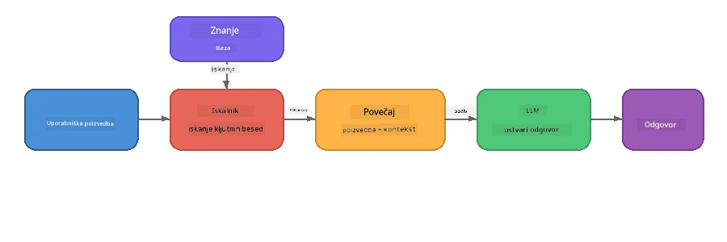

# 4. del: Gradnja RAG aplikacije z Foundry Local

## Pregled

Veliki jezikovni modeli so zmogljivi, vendar poznajo le tisto, kar je bilo v njihovi učni zbirki podatkov. **Generacija, podprta z iskanjem (Retrieval-Augmented Generation, RAG)** to reši tako, da modelu ob poizvedbi ponudi ustrezen kontekst – pridobljen iz vaših lastnih dokumentov, podatkovnih baz ali zbirk znanja.

V tej delavnici boste zgradili popoln RAG potek, ki teče **popolnoma na vaši napravi** z uporabo Foundry Local. Brez oblačnih storitev, brez vektorskih podatkovnih baz, brez API-jev za vdelave – samo lokalno iskanje in lokalni model.

## Cilji učenja

Na koncu te delavnice boste znali:

- Pojasniti, kaj je RAG in zakaj je pomemben za AI aplikacije
- Zgraditi lokalno bazo znanja iz besedilnih dokumentov
- Izvesti preprosto funkcijo iskanja za najdbo relevantnega konteksta
- Sestaviti sistemski poziv, ki temelji na pridobljenih dejstvih
- Zagnati celoten potek Retrieve → Augment → Generate na napravi
- Razumeti kompromise med preprostim iskanjem po ključnih besedah in vektorskim iskanjem

---

## Predpogoji

- Dokončajte [3. del: Uporaba Foundry Local SDK z OpenAI](part3-sdk-and-apis.md)
- Namestite Foundry Local CLI in prenesite model `phi-3.5-mini`

---

## Koncept: Kaj je RAG?

Brez RAG lahko LLM odgovarja le na podlagi svojih učnih podatkov – ki so lahko zastareli, nepopolni ali pa nimajo vaših zasebnih informacij:

```
User: "What is Zava's return policy?"
LLM:  "I do not have information about Zava's return policy."  ← No context!
```

Z RAG najprej **pridobite** relevantne dokumente, nato **razširite** poziv s tem kontekstom, preden **generirate** odgovor:



Ključni vpogled: **model ne potrebuje, da "pozna" odgovor; le prebrati mora prave dokumente.**

---

## Laboratorijske vaje

### Vaja 1: Razumevanje baze znanja

Odprite RAG primer za vaš jezik in si oglejte bazo znanja:

<details>
<summary><b>🐍 Python: <code>python/foundry-local-rag.py</code></b></summary>

Baza znanja je preprost seznam slovarjev s polji `title` in `content`:

```python
KNOWLEDGE_BASE = [
    {
        "title": "Foundry Local Overview",
        "content": (
            "Foundry Local brings the power of Azure AI Foundry to your local "
            "device without requiring an Azure subscription..."
        ),
    },
    {
        "title": "Supported Hardware",
        "content": (
            "Foundry Local automatically selects the best model variant for "
            "your hardware. If you have an Nvidia CUDA GPU it downloads the "
            "CUDA-optimized model..."
        ),
    },
    # ... več vnosov
]
```

Vsak zapis predstavlja "košček" znanja – osredotočen del informacij o eni temi.

</details>

<details>
<summary><b>📘 JavaScript: <code>javascript/foundry-local-rag.mjs</code></b></summary>

Baza znanja uporablja isto strukturo kot polje objektov:

```javascript
const KNOWLEDGE_BASE = [
  {
    title: "Foundry Local Overview",
    content:
      "Foundry Local brings the power of Azure AI Foundry to your local " +
      "device without requiring an Azure subscription...",
  },
  {
    title: "Supported Hardware",
    content:
      "Foundry Local automatically selects the best model variant for " +
      "your hardware...",
  },
  // ... več vnosov
];
```

</details>

<details>
<summary><b>💜 C#: <code>csharp/RagPipeline.cs</code></b></summary>

Baza znanja uporablja seznam imenovanih tupleov:

```csharp
private static readonly List<(string Title, string Content)> KnowledgeBase =
[
    ("Foundry Local Overview",
     "Foundry Local brings the power of Azure AI Foundry to your local " +
     "device without requiring an Azure subscription..."),

    ("Supported Hardware",
     "Foundry Local automatically selects the best model variant for " +
     "your hardware..."),

    // ... more entries
];
```

</details>

> **V resnični aplikaciji** bi baza znanja prihajala iz datotek na disku, baze podatkov, iskalnega indeksa ali API-ja. Za to delavnico uporabljamo seznam v pomnilniku, da ohranimo enostavnost.

---

### Vaja 2: Razumevanje funkcije iskanja

Korak iskanja najde najbolj relevantne koščke za uporabnikovo vprašanje. Ta primer uporablja **prekrivanje ključnih besed** – šteje, koliko besed iz poizvedbe se pojavi v vsakem koščku:

<details>
<summary><b>🐍 Python</b></summary>

```python
def retrieve(query: str, top_k: int = 2) -> list[dict]:
    """Return the top-k knowledge chunks most relevant to the query."""
    query_words = set(query.lower().split())
    scored = []
    for chunk in KNOWLEDGE_BASE:
        chunk_words = set(chunk["content"].lower().split())
        overlap = len(query_words & chunk_words)
        scored.append((overlap, chunk))
    scored.sort(key=lambda x: x[0], reverse=True)
    return [item[1] for item in scored[:top_k]]
```

</details>

<details>
<summary><b>📘 JavaScript</b></summary>

```javascript
function retrieve(query, topK = 2) {
  const queryWords = new Set(query.toLowerCase().split(/\s+/));
  const scored = KNOWLEDGE_BASE.map((chunk) => {
    const chunkWords = new Set(chunk.content.toLowerCase().split(/\s+/));
    let overlap = 0;
    for (const w of queryWords) {
      if (chunkWords.has(w)) overlap++;
    }
    return { overlap, chunk };
  });
  scored.sort((a, b) => b.overlap - a.overlap);
  return scored.slice(0, topK).map((s) => s.chunk);
}
```

</details>

<details>
<summary><b>💜 C#</b></summary>

```csharp
private static List<(string Title, string Content)> Retrieve(string query, int topK = 2)
{
    var queryWords = new HashSet<string>(
        query.ToLowerInvariant().Split(' ', StringSplitOptions.RemoveEmptyEntries));

    return KnowledgeBase
        .Select(chunk =>
        {
            var chunkWords = new HashSet<string>(
                chunk.Content.ToLowerInvariant().Split(' ', StringSplitOptions.RemoveEmptyEntries));
            var overlap = queryWords.Intersect(chunkWords).Count();
            return (Overlap: overlap, Chunk: chunk);
        })
        .OrderByDescending(x => x.Overlap)
        .Take(topK)
        .Select(x => x.Chunk)
        .ToList();
}
```

</details>

**Kako deluje:**
1. Razdeli poizvedbo na posamezne besede
2. Za vsak košček znanja prešteje, koliko besed iz poizvedbe se pojavi v tem koščku
3. Sortira po oceni prekrivanja (najvišja prva)
4. Vrne top-k najbolj relevantnih koščkov

> **Kompromis:** Prekrivanje ključnih besed je preprosto, a omejeno; ne razume sopomenk ali pomena. Proizvodni RAG sistemi običajno uporabljajo **vektorske vdelave** in **vektorsko bazo podatkov** za semantično iskanje. Vendar je prekrivanje po ključnih besedah odličen začetni pristop in ne zahteva dodatnih odvisnosti.

---

### Vaja 3: Razumevanje razširjenega poziva

Pridobljeni kontekst se vgradi v **sistemski poziv**, preden ga pošljemo modelu:

```python
system_prompt = (
    "You are a helpful assistant. Answer the user's question using ONLY "
    "the information provided in the context below. If the context does "
    "not contain enough information, say so.\n\n"
    f"Context:\n{context_text}"
)
```

Ključne oblikovalske odločitve:
- **"IZKLJUČNO podane informacije"** – preprečuje, da bi model haluciniral dejstva, ki niso v kontekstu
- **"Če kontekst ne vsebuje dovolj informacij, povej to"** – spodbuja iskrene »Ne vem« odgovore
- Konec koncev je kontekst priložen v sistemsko sporočilo, da oblikuje vse odgovore

---

### Vaja 4: Zaženi RAG potek

Zaženi celoten primer:

**Python:**
```bash
cd python
python foundry-local-rag.py
```

**JavaScript:**
```bash
cd javascript
node foundry-local-rag.mjs
```

**C#:**
```bash
cd csharp
dotnet run rag
```

Videli boste tri stvari natisnjene:
1. **Vprašanje**, ki se postavi
2. **Pridobljeni kontekst** – izbrani koščki iz baze znanja
3. **Odgovor** – ki ga generira model samo z uporabo tega konteksta

Primer izpisa:
```
Question: How do I install Foundry Local and what hardware does it support?

--- Retrieved Context ---
### Installation
On Windows install Foundry Local with: winget install Microsoft.FoundryLocal...

### Supported Hardware
Foundry Local automatically selects the best model variant for your hardware...
-------------------------

Answer: To install Foundry Local, you can use the following methods depending
on your operating system: On Windows, run `winget install Microsoft.FoundryLocal`.
On macOS, use `brew install microsoft/foundrylocal/foundrylocal`...
```

Opazite, kako je modelov odgovor **zasidran** v pridobljenem kontekstu – omenja le dejstva iz dokumentov baze znanja.

---

### Vaja 5: Eksperimentiraj in razširi

Preizkusi te spremembe za poglobitev razumevanja:

1. **Spremeni vprašanje** – vprašaj nekaj, kar JE v bazi znanja in nekaj, kar NI:
   ```python
   question = "What programming languages does Foundry Local support?"  # ← V kontekstu
   question = "How much does Foundry Local cost?"                       # ← Ni v kontekstu
   ```
   Ali model pravilno pove »Ne vem«, če odgovora ni v kontekstu?

2. **Dodaj nov košček znanja** – dodaj nov zapis v `KNOWLEDGE_BASE`:
   ```python
   {
       "title": "Pricing",
       "content": "Foundry Local is completely free and open source under the MIT license.",
   }
   ```
   Sedaj ponovno postavi vprašanje o cenah.

3. **Spremeni `top_k`** – pridobi več ali manj koščkov:
   ```python
   context_chunks = retrieve(question, top_k=3)  # Več konteksta
   context_chunks = retrieve(question, top_k=1)  # Manj konteksta
   ```
   Kako količina konteksta vpliva na kakovost odgovora?

4. **Odstrani navodilo o zasidranju** – spremeni sistemski poziv v "Ste v pomoč asistent." in poglej, ali model začne halucinirati dejstva.

---

## Podrobno: Optimizacija RAG za delovanje na napravi

Zagon RAG na napravi uvaja omejitve, ki jih v oblaku ni: omejen RAM, brez namensko grafično enoto (CPU/NPU izvrševanje) in majhno okno konteksta modela. Spodnje oblikovalske odločitve neposredno naslavljajo te omejitve in temeljijo na vzorcih proizvodnih lokalnih RAG aplikacij zgrajenih z Foundry Local.

### Strategija razdeljevanja: drseče okno s fiksno velikostjo

Razdeljevanje – kako dokumente razdelite na dele – je ena najpomembnejših odločitev v vsakem RAG sistemu. Za scenarije na napravi je priporočljiv začetek s **drsečim oknom fiksne velikosti z prekrivanjem**:

| Parameter | Priporočena vrednost | Zakaj |
|-----------|---------------------|--------|
| **Velikost koščka** | ~200 tokenov | Ohranja pridobljeni kontekst kompakten, z dovolj prostora v oknu konteksta Phi-3.5 Mini modela za sistemski poziv, zgodovino pogovora in generiran izhod |
| **Prekrivanje** | ~25 tokenov (12,5 %) | Preprečuje izgubo informacij na mejah koščkov – pomembno za postopke in navodila po korakih |
| **Tokenizacija** | Delitev po presledkih | Brez odvisnosti, ni potrebna knjižnica za tokenizacijo. Celoten proračun računanja ostane pri LLM |

Prekrivanje deluje kot drseče okno: vsak nov košček začne 25 tokenov pred koncem prejšnjega, tako da stavki, ki presegajo meje koščkov, nastopijo v obeh.

> **Zakaj ne druge strategije?**
> - **Razdelitev glede na stavke** da nepredvidljive velikosti koščkov; nekateri varnostni postopki so dolgi stavki, ki bi se slabo razdelili
> - **Razdelitev na odstavke** (na `##` naslove) ustvarja zelo različne velikosti koščkov – nekateri so premajhni, drugi preveliki za okno modela
> - **Semantično razdeljevanje** (zaznavanje tem na osnovi vdelav) daje najboljšo kakovost pridobivanja, a zahteva dodaten model v pomnilniku poleg Phi-3.5 Mini – tvegano na strojni opremi z 8-16 GB deljenega pomnilnika

### Nadgradnja pridobivanja: TF-IDF vektorji

Pristop z iskanjem po ključnih besedah v tej delavnici deluje, a če želite boljše pridobivanje brez dodajanja modela za vdelave, je **TF-IDF (frekvenca termina - inverzna frekvenca dokumenta)** odličen kompromis:

```
Keyword Overlap  →  TF-IDF Vectors  →  Embedding Models
    (this lab)     (lightweight upgrade)   (production)
  Simple & fast    Better ranking,         Best quality,
  No dependencies  still no ML model       requires embedding model
  ~Basic matching  ~1ms retrieval          ~100-500ms per query
```

TF-IDF pretvori vsak košček v numerični vektor, ki temelji na pomembnosti vsake besede znotraj koščka *glede na vse koščke*. Ob poizvedbi se vprašanje enako vektorizira in primerja s kosinusno podobnostjo. To lahko implementirate s SQLite in čisto JavaScript/Python – brez vektorske baze podatkov ali embedding API.

> **Zmogelnost:** TF-IDF s kosinusno podobnostjo nad koščki fiksne velikosti običajno doseže **~1 ms pridobivanja**, v primerjavi z ~100-500 ms, ko embedding model kodira vsako poizvedbo. Vsi 20+ dokumentov se lahko razdelijo in indeksirajo v manj kot sekundi.

### Režim Edge/Compact za omejene naprave

Ko tečete na zelo omejeni strojni opremi (starejši prenosniki, tablice, terenske naprave), lahko zmanjšate porabo virov s prilagoditvijo treh nastavitev:

| Nastavitev | Standardni način | Edge/Compact način |
|------------|------------------|--------------------|
| **Sistemski poziv** | ~300 tokenov | ~80 tokenov |
| **Maksimalno izhodnih tokenov** | 1024 | 512 |
| **Pridobljeni koščki (top-k)** | 5 | 3 |

Manj pridobljenih koščkov pomeni manj konteksta za model, kar zmanjša zamik in pritisk na pomnilnik. Krajši sistemski poziv sprosti več prostora v oknu konteksta za dejanski odgovor. Ta kompromis je vreden na napravah, kjer šteje vsak token okna konteksta.

### En model v pomnilniku

Ena najpomembnejših načel za RAG na napravi: **naj bo naložen samo en model**. Če uporabljate model za vdelave za pridobivanje *in* jezikovni model za generacijo, razdeljujete omejene NPU/RAM vire med dva modela. Lahka pridobitev (prekrivanje ključnih besed, TF-IDF) tega povsem izogne:

- Brez konkurence modela za vdelave za pomnilnik z LLM
- Hitrejši hladni zagon – nalagan samo en model
- Predvidljiva poraba pomnilnika – LLM ima vse razpoložljive vire
- Deluje na napravah z le 8 GB RAM

### SQLite kot lokalno skladišče vektorskih predstavitev

Za majhne do srednje zbirke dokumentov (stotine do tisoči koščkov), je **SQLite dovolj hiter** za brutalno iskanje s kosinusno podobnostjo in ne potrebuje dodatne infrastrukture:

- Ena `.db` datoteka na disku – brez strežniškega procesa, brez konfiguracije
- Priložen vsakemu pomembnemu jeziku (Python `sqlite3`, Node.js `better-sqlite3`, .NET `Microsoft.Data.Sqlite`)
- Shranjuje koščke dokumentov ob njihovih TF-IDF vektorjih v eni tabeli
- Ni potrebe po Pinecone, Qdrant, Chroma ali FAISS za to mero

### Povzetek zmogljivosti

Te oblikovalske odločitve omogočajo odziven RAG na potrošniški strojni opremi:

| Merilo | Zmogljivost na napravi |
|--------|------------------------|
| **Čas pridobivanja** | ~1 ms (TF-IDF) do ~5 ms (prekrivanje ključnih besed) |
| **Hitrost indeksiranja** | 20 dokumentov razdeljenih in indeksiranih v manj kot 1 sekundi |
| **Modeli v pomnilniku** | 1 (samo LLM) |
| **Velikost skladišča** | < 1 MB za koščke + vektorje v SQLite |
| **Hladni zagon** | En sam model, brez zagona embedding okolja |
| **Minimalna strojna oprema** | 8 GB RAM, samo CPU (brez GPU potrebnega) |

> **Kdaj nadgraditi:** Če se širite na stotine dolgih dokumentov, mešane vsebinske tipe (tabele, kodo, prozo) ali potrebujete semantično razumevanje poizvedb, razmislite o dodajanju embedding modela in prehodu na vektorsko podobnost. Za večino primerov uporabe na napravi s fokusiranimi zbirkami dokumentov TF-IDF + SQLite prinaša odlične rezultate z minimalno porabo virov.

---

## Ključni pojmi

| Pojem | Opis |
|-------|-------|
| **Pridobivanje (Retrieval)** | Iskanje relevantnih dokumentov iz baze znanja glede na uporabnikovo poizvedbo |
| **Razširjanje (Augmentation)** | Vstavljanje pridobljenih dokumentov v poziv kot kontekst |
| **Generacija (Generation)** | LLM ustvari odgovor, zasidran v podanem kontekstu |
| **Razdeljevanje (Chunking)** | Razbijanje velikih dokumentov v manjše, fokusirane dele |
| **Zasidranje (Grounding)** | Omejevanje modela, da uporablja samo dani kontekst (zmanjšuje halucinacije) |
| **Top-k** | Število najbolj relevantnih koščkov za pridobivanje |

---

## RAG v proizvodnji v primerjavi s to delavnico

| Vidik | Ta delavnica | Optimizirano za napravo | Proizvodnja v oblaku |
|-------|--------------|-------------------------|----------------------|
| **Baza znanja** | Seznam v pomnilniku | Datoteke na disku, SQLite | Baza podatkov, iskalni indeks |
| **Pridobivanje** | Prekrivanje ključnih besed | TF-IDF + kosinusna podobnost | Vektorske vdelave + iskanje podobnosti |
| **Vdelave (Embeddings)** | Niso potrebne | Niso – TF-IDF vektorji | Embedding model (lokalni ali oblačni) |
| **Vektorska baza** | Ni potrebna | SQLite (ena `.db` datoteka) | FAISS, Chroma, Azure AI Search itd. |
| **Razdeljevanje** | Ročno | Drseče okno s fiksno velikostjo (~200 tokenov, 25-token prekrivanje) | Semantično ali rekurzivno razdeljevanje |
| **Modeli v pomnilniku** | 1 (LLM) | 1 (LLM) | 2+ (embedding + LLM) |
| **Zakasnitev pridobivanja** | ~5 ms | ~1 ms | ~100-500 ms |
| **Obseg** | 5 dokumentov | Stotine dokumentov | Milijoni dokumentov |

Vzorce, ki se jih tukaj naučite (pridobivanje, dopolnjevanje, generiranje), so enaki na katerikoli lestvici. Metoda pridobivanja se izboljšuje, vendar osnovna arhitektura ostaja enaka. Srednji stolpec prikazuje, kaj je dosegljivo na napravi z lahkotnimi tehnikami, pogosto idealno za lokalne aplikacije, kjer zamenjate obsežnost v oblaku za zasebnost, delovanje brez povezave in ničelno zakasnitev do zunanjih storitev.

---

## Ključni zaključki

| Pojem | Kaj ste se naučili |
|---------|------------------|
| Vzorec RAG | Pridobi + Dopolni + Generiraj: daj modelu pravi kontekst in lahko odgovori na vprašanja o vaših podatkih |
| Na napravi | Vse teče lokalno brez API-jev v oblaku ali naročnin za vektorsko podatkovno bazo |
| Navodila za utemeljitev | Sistemskih pozivnih omejitev je ključnega pomena za preprečevanje halucinacij |
| Prekrivanje ključnih besed | Preprosta a učinkovita izhodiščna točka za pridobivanje |
| TF-IDF + SQLite | Lahka nadgradnja, ki ohranja pridobivanje pod 1 ms brez modela za vdelavo |
| En model v pomnilniku | Izogibanje nalaganju modela za vdelavo poleg LLM na omejeni strojni opremi |
| Velikost koščkov | Približno 200 oznak z prekrivanjem uravnoteži natančnost pridobivanja in učinkovitost kontekstnega okna |
| Robni/kompaktni način | Uporaba manj koščkov in krajši pozivi za zelo omejene naprave |
| Univerzalni vzorec | Enaka RAG arhitektura deluje za vsak vir podatkov: dokumente, podatkovne baze, API-je ali wikipedije |

> **Želite videti celotno RAG aplikacijo na napravi?** Oglejte si [Gas Field Local RAG](https://github.com/leestott/local-rag), produkcijski offline RAG agent zgrajen s Foundry Local in Phi-3.5 Mini, ki prikazuje te vzorce optimizacije z resničnim naborom dokumentov.

---

## Naslednji koraki

Nadaljujte na [Del 5: Gradnja AI agentov](part5-single-agents.md) in se naučite, kako graditi inteligentne agente s personami, navodili in večkrožnimi pogovori z uporabo Microsoft Agent Framework.

---

<!-- CO-OP TRANSLATOR DISCLAIMER START -->
**Omejitev odgovornosti**:  
Ta dokument je bil preveden z uporabo AI prevajalske storitve [Co-op Translator](https://github.com/Azure/co-op-translator). Čeprav si prizadevamo za natančnost, vas opozarjamo, da samodejni prevodi lahko vsebujejo napake ali netočnosti. Izvirni dokument v njegovem izvorno jeziku velja za avtoritativni vir. Za kritične informacije priporočamo strokovni človeški prevod. Za kakršne koli nesporazume ali napačne razlage, ki izhajajo iz uporabe tega prevoda, ne prevzemamo odgovornosti.
<!-- CO-OP TRANSLATOR DISCLAIMER END -->