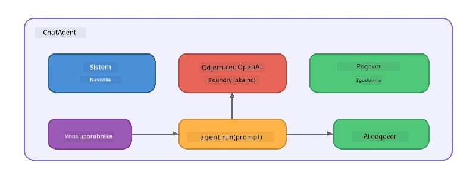

# Del 5: Izdelava AI agentov s pomočjo Agent Framework

> **Cilj:** Zgradite svojega prvega AI agenta s trajnimi navodili in opredeljeno osebnostjo, ki ga poganja lokalni model prek Foundry Local.

## Kaj je AI agent?

AI agent ovije jezikovni model z **sistemskimi navodili**, ki določajo njegovo vedenje, osebnost in omejitve. Za razliko od enkratnega klica klepetalnega zaključka agent omogoča:

- **Osebnost** – dosledna identiteta ("Ste v pomoč kot recenzent kode")
- **Spomin** – zgodovina pogovora preko več izmenjav
- **Specializacija** – osredotočeno vedenje, ki ga poganjajo skrbno oblikovana navodila



---

## Microsoft Agent Framework

**Microsoft Agent Framework** (AGF) zagotavlja standardno abstrakcijo agenta, ki deluje prek različnih izvedbenih modelov. V tej delavnici ga združujemo s Foundry Local, tako da vse poteka na vašem računalniku – brez potrebe po oblaku.

| Koncept | Opis |
|---------|-------|
| `FoundryLocalClient` | Python: upravlja z zagonom storitve, prenosom/nalaganje modela in ustvarjanjem agentov |
| `client.as_agent()` | Python: ustvari agenta iz Foundry Local klienta |
| `AsAIAgent()` | C#: razširitvena metoda na `ChatClient` – ustvari `AIAgent` |
| `instructions` | Sistemsko navodilo, ki oblikuje vedenje agenta |
| `name` | Berljiv človeški zapis, uporaben v scenarijih z več agenti |
| `agent.run(prompt)` / `RunAsync()` | Pošlje uporabniško sporočilo in prejme odgovor agenta |

> **Opomba:** Agent Framework ima Python in .NET SDK. Za JavaScript pa implementiramo lahkotno razredno `ChatAgent`, ki odseva isti vzorec z uporabo OpenAI SDK neposredno.

---

## Vaje

### Vaja 1 - Razumeti vzorec agenta

Pred pisanjem kode preučite ključne komponente agenta:

1. **Modelni klient** – poveže se z OpenAI-kompatibilnim API-jem Foundry Local
2. **Sistemska navodila** – "osebnostni" poziv
3. **Zanka izvajanja** – pošiljanje uporabniškega vnosa, prejemanje izhoda

> **Premislite:** Kako se sistemska navodila razlikujejo od običajnega uporabniškega sporočila? Kaj se zgodi, če jih spremenite?

---

### Vaja 2 - Zaženite primer enega agenta

<details>
<summary><strong>🐍 Python</strong></summary>

**Pogoj za začetek:**
```bash
cd python
python -m venv venv

# Windows (PowerShell):
venv\Scripts\Activate.ps1
# macOS:
source venv/bin/activate

pip install -r requirements.txt
```

**Zagon:**
```bash
python foundry-local-with-agf.py
```

**Razdelava kode** (`python/foundry-local-with-agf.py`):

```python
import asyncio
from agent_framework_foundry_local import FoundryLocalClient

async def main():
    alias = "phi-4-mini"

    # FoundryLocalClient upravlja z zagonom storitve, prenosom modela in nalaganjem
    client = FoundryLocalClient(model_id=alias)
    print(f"Client Model ID: {client.model_id}")

    # Ustvari agenta z navodili sistema
    agent = client.as_agent(
        name="Joker",
        instructions="You are good at telling jokes.",
    )

    # Brez pretoka: takoj pridobi celoten odgovor
    result = await agent.run("Tell me a joke about a pirate.")
    print(f"Agent: {result}")

    # Pretakanje: prejmi rezultate, ko so ustvarjeni
    async for chunk in agent.run("Tell me another joke.", stream=True):
        if chunk.text:
            print(chunk.text, end="", flush=True)

asyncio.run(main())
```

**Ključne točke:**
- `FoundryLocalClient(model_id=alias)` upravlja z zagonom storitve, prenosom in nalaganjem modela v enem koraku
- `client.as_agent()` ustvari agenta s sistemskimi navodili in imenom
- `agent.run()` podpira tako način brez pretoka kot pretok
- Namestitev prek `pip install agent-framework-foundry-local --pre`

</details>

<details>
<summary><strong>📦 JavaScript</strong></summary>

**Pogoj za začetek:**
```bash
cd javascript
npm install
```

**Zagon:**
```bash
node foundry-local-with-agent.mjs
```

**Razdelava kode** (`javascript/foundry-local-with-agent.mjs`):

```javascript
import { OpenAI } from "openai";
import { FoundryLocalManager } from "foundry-local-sdk";

class ChatAgent {
  constructor({ client, modelId, instructions, name }) {
    this.client = client;
    this.modelId = modelId;
    this.instructions = instructions;
    this.name = name;
    this.history = [];
  }

  async run(userMessage) {
    const messages = [
      { role: "system", content: this.instructions },
      ...this.history,
      { role: "user", content: userMessage },
    ];
    const response = await this.client.chat.completions.create({
      model: this.modelId,
      messages,
    });
    const assistantMessage = response.choices[0].message.content;

    // Ohrani zgodovino pogovora za večkratne interakcije
    this.history.push({ role: "user", content: userMessage });
    this.history.push({ role: "assistant", content: assistantMessage });
    return { text: assistantMessage };
  }
}

async function main() {
  FoundryLocalManager.create({ appName: "FoundryLocalWorkshop" });
  const manager = FoundryLocalManager.instance;
  await manager.startWebService();

  const catalog = manager.catalog;
  const model = await catalog.getModel("phi-3.5-mini");
  if (!model.isCached) {
    console.log("Downloading model: phi-3.5-mini...");
    await model.download();
  }
  await model.load();

  const client = new OpenAI({
    baseURL: manager.urls[0] + "/v1",
    apiKey: "foundry-local",
  });

  const agent = new ChatAgent({
    client,
    modelId: model.id,
    instructions: "You are good at telling jokes.",
    name: "Joker",
  });

  const result = await agent.run("Tell me a joke about a pirate.");
  console.log(result.text);
}

main();
```

**Ključne točke:**
- JavaScript gradi lastno razredno `ChatAgent`, ki odseva Python AGF vzorec
- `this.history` shranjuje izmenjave pogovorov za podporo večnivojskega klepeta
- Izrecni `startWebService()` → preverjanje predpomnilnika → `model.download()` → `model.load()` zagotavlja popolno preglednost

</details>

<details>
<summary><strong>💜 C#</strong></summary>

**Pogoj za začetek:**
```bash
cd csharp
dotnet restore
```

**Zagon:**
```bash
dotnet run agent
```

**Razdelava kode** (`csharp/SingleAgent.cs`):

```csharp
using Microsoft.AI.Foundry.Local;
using Microsoft.Extensions.Logging.Abstractions;
using Microsoft.Agents.AI;
using OpenAI;
using System.ClientModel;

// 1. Start Foundry Local and load a model
var alias = "phi-3.5-mini";
await FoundryLocalManager.CreateAsync(
    new Configuration
    {
        AppName = "FoundryLocalSamples",
        Web = new Configuration.WebService { Urls = "http://127.0.0.1:0" }
    }, NullLogger.Instance, default);
var manager = FoundryLocalManager.Instance;
await manager.StartWebServiceAsync(default);

var catalog = await manager.GetCatalogAsync(default);
var model = await catalog.GetModelAsync(alias, default);

var isCached = await model.IsCachedAsync(default);
if (!isCached)
{
    Console.WriteLine($"Downloading model: {alias}...");
    await model.DownloadAsync(null, default);
}
await model.LoadAsync(default);

var key = new ApiKeyCredential("foundry-local");
var client = new OpenAIClient(key, new OpenAIClientOptions
{
    Endpoint = new Uri(manager.Urls[0] + "/v1")
});

// 2. Create an AIAgent using the Agent Framework extension method
AIAgent joker = client
    .GetChatClient(model.Id)
    .AsAIAgent(
        instructions: "You are good at telling jokes. Keep your jokes short and family-friendly.",
        name: "Joker"
    );

// 3. Run the agent (non-streaming)
var response = await joker.RunAsync("Tell me a joke about a pirate.");
Console.WriteLine($"Joker: {response}");

// 4. Run with streaming
await foreach (var update in joker.RunStreamingAsync("Tell me another joke."))
{
    Console.Write(update);
}
```

**Ključne točke:**
- `AsAIAgent()` je razširitvena metoda iz `Microsoft.Agents.AI.OpenAI` – ni potrebna lastna razred `ChatAgent`
- `RunAsync()` vrne celoten odgovor; `RunStreamingAsync()` pretaka po posameznih tokenih
- Namestitev z `dotnet add package Microsoft.Agents.AI.OpenAI --version 1.0.0-rc3`

</details>

---

### Vaja 3 - Spremenite osebnost

Spremenite agentova `instructions` za ustvarjanje drugačne osebnosti. Preizkusite vsako in opazujte spremembe izhoda:

| Osebnost | Navodila |
|---------|-------------|
| Recenzent kode | `"Ste strokovnjak za pregledovanje kode. Zagotavljajte konstruktivne povratne informacije osredotočene na berljivost, zmogljivost in pravilnost."` |
| Potovalni vodič | `"Ste prijazen potovalni vodič. Podajte osebne priporočila za destinacije, dejavnosti in lokalno kulinariko."` |
| Sokratski tutor | `"Ste sokratski tutor. Nikoli ne dajte neposrednih odgovorov – namesto tega vodite študenta z premišljenimi vprašanji."` |
| Tehnični pisec | `"Ste tehnični pisec. Koncepte razložite jasno in jedrnato. Uporabljajte primere. Izogibajte se žargonu."` |

**Preizkusite:**
1. Izberite osebnost iz zgornje tabele
2. Zamenjajte niz `instructions` v kodi
3. Prilagodite uporabniški poziv, da se ujema (npr. prosite recenzenta, naj pregleda funkcijo)
4. Ponovno zaženite primer in primerjajte izhod

> **Nasvet:** Kakovost agenta je močno odvisna od navodil. Specifična, dobro strukturirana navodila nudijo boljše rezultate kot nejasna.

---

### Vaja 4 - Dodajte večnivojski pogovor

Razširite primer, da podpira večnivojski klepet, tako da lahko vodite dialog z agentom.

<details>
<summary><strong>🐍 Python - večnivojska zanka</strong></summary>

```python
import asyncio
from agent_framework_foundry_local import FoundryLocalClient

async def main():
    client = FoundryLocalClient(model_id="phi-4-mini")

    agent = client.as_agent(
        name="Assistant",
        instructions="You are a helpful assistant.",
    )

    print("Chat with the agent (type 'quit' to exit):\n")
    while True:
        user_input = input("You: ")
        if user_input.strip().lower() in ("quit", "exit"):
            break
        result = await agent.run(user_input)
        print(f"Agent: {result}\n")

asyncio.run(main())
```

</details>

<details>
<summary><strong>📦 JavaScript - večnivojska zanka</strong></summary>

```javascript
import { OpenAI } from "openai";
import { FoundryLocalManager } from "foundry-local-sdk";
import * as readline from "node:readline/promises";

// (ponovno uporabi razred ChatAgent iz Vaje 2)

async function main() {
  FoundryLocalManager.create({ appName: "FoundryLocalWorkshop" });
  const manager = FoundryLocalManager.instance;
  await manager.startWebService();

  const catalog = manager.catalog;
  const model = await catalog.getModel("phi-3.5-mini");
  if (!model.isCached) {
    console.log("Downloading model: phi-3.5-mini...");
    await model.download();
  }
  await model.load();

  const client = new OpenAI({
    baseURL: manager.urls[0] + "/v1",
    apiKey: "foundry-local",
  });

  const agent = new ChatAgent({
    client,
    modelId: model.id,
    instructions: "You are a helpful assistant.",
    name: "Assistant",
  });

  const rl = readline.createInterface({
    input: process.stdin,
    output: process.stdout,
  });

  console.log("Chat with the agent (type 'quit' to exit):\n");
  while (true) {
    const userInput = await rl.question("You: ");
    if (["quit", "exit"].includes(userInput.trim().toLowerCase())) break;
    const result = await agent.run(userInput);
    console.log(`Agent: ${result.text}\n`);
  }
  rl.close();
}

main();
```

</details>

<details>
<summary><strong>💜 C# - večnivojska zanka</strong></summary>

```csharp
using Microsoft.AI.Foundry.Local;
using Microsoft.Extensions.Logging.Abstractions;
using Microsoft.Agents.AI;
using OpenAI;
using System.ClientModel;

var alias = "phi-3.5-mini";
var config = new Configuration
{
    AppName = "FoundryLocalSamples",
    Web = new Configuration.WebService { Urls = "http://127.0.0.1:0" }
};
await FoundryLocalManager.CreateAsync(config, NullLogger.Instance, default);
var manager = FoundryLocalManager.Instance;
await manager.StartWebServiceAsync(default);

var catalog = await manager.GetCatalogAsync(default);
var model = await catalog.GetModelAsync(alias, default);

var isCached = await model.IsCachedAsync(default);
if (!isCached)
{
    Console.WriteLine($"Downloading model: {alias}...");
    await model.DownloadAsync(null, default);
}
await model.LoadAsync(default);

var key = new ApiKeyCredential("foundry-local");
var client = new OpenAIClient(key, new OpenAIClientOptions
{
    Endpoint = new Uri(manager.Urls[0] + "/v1")
});

AIAgent agent = client
    .GetChatClient(model.Id)
    .AsAIAgent(
        instructions: "You are a helpful assistant.",
        name: "Assistant"
    );

Console.WriteLine("Chat with the agent (type 'quit' to exit):\n");
while (true)
{
    Console.Write("You: ");
    var userInput = Console.ReadLine();
    if (string.IsNullOrWhiteSpace(userInput) ||
        userInput.Equals("quit", StringComparison.OrdinalIgnoreCase) ||
        userInput.Equals("exit", StringComparison.OrdinalIgnoreCase))
        break;

    var result = await agent.RunAsync(userInput);
    Console.WriteLine($"Agent: {result}\n");
}
```

</details>

Opazite, kako se agent spomni prejšnjih izmenjav – zastavite nadaljnje vprašanje in opazujte, kako se kontekst prenaša.

---

### Vaja 5 - Strukturiran izhod

Naročite agentu, naj vedno odgovori v specifičnem formatu (npr. JSON) in razčlenite rezultat:

<details>
<summary><strong>🐍 Python - JSON izhod</strong></summary>

```python
import asyncio
import json
from agent_framework_foundry_local import FoundryLocalClient

async def main():
    client = FoundryLocalClient(model_id="phi-4-mini")

    agent = client.as_agent(
        name="SentimentAnalyzer",
        instructions=(
            "You are a sentiment analysis agent. "
            "For every user message, respond ONLY with valid JSON in this format: "
            '{"sentiment": "positive|negative|neutral", "confidence": 0.0-1.0, "summary": "brief reason"}'
        ),
    )

    result = await agent.run("I absolutely loved the new restaurant downtown!")
    print("Raw:", result)

    try:
        parsed = json.loads(str(result))
        print(f"Sentiment: {parsed['sentiment']} (confidence: {parsed['confidence']})")
    except json.JSONDecodeError:
        print("Agent did not return valid JSON - try refining the instructions.")

asyncio.run(main())
```

</details>

<details>
<summary><strong>💜 C# - JSON izhod</strong></summary>

```csharp
using System.Text.Json;

AIAgent analyzer = chatClient.AsAIAgent(
    name: "SentimentAnalyzer",
    instructions:
        "You are a sentiment analysis agent. " +
        "For every user message, respond ONLY with valid JSON in this format: " +
        "{\"sentiment\": \"positive|negative|neutral\", \"confidence\": 0.0-1.0, \"summary\": \"brief reason\"}"
);

var response = await analyzer.RunAsync("I absolutely loved the new restaurant downtown!");
Console.WriteLine($"Raw: {response}");

try
{
    var parsed = JsonSerializer.Deserialize<JsonElement>(response.ToString());
    Console.WriteLine($"Sentiment: {parsed.GetProperty("sentiment")} " +
                      $"(confidence: {parsed.GetProperty("confidence")})");
}
catch (JsonException)
{
    Console.WriteLine("Agent did not return valid JSON - try refining the instructions.");
}
```

</details>

> **Opomba:** Majhni lokalni modeli morda ne proizvajajo vedno popolnoma veljavnega JSON. Zanesljivost lahko izboljšate z vključitvijo primera v navodila in z zelo jasnimi zahtevami glede pričakovanega formata.

---

## Glavne ugotovitve

| Koncept | Kaj ste se naučili |
|---------|---------------------|
| Agent vs. neposredni klic LLM | Agent ovije model z navodili in spominom |
| Sistemska navodila | Najpomembnejši mehanizem za nadzor vedenja agenta |
| Večnivojski pogovor | Agenti lahko prenašajo kontekst prek več uporabniških interakcij |
| Strukturiran izhod | Navodila lahko določijo format izhoda (JSON, markdown itd.) |
| Lokalna izvedba | Vse se izvaja na napravi prek Foundry Local – brez oblaka |

---

## Naslednji koraki

V **[Del 6: Tokovi dela z več agenti](part6-multi-agent-workflows.md)** boste združili več agentov v usklajen potek dela, kjer ima vsak agent specializirano vlogo.

---

<!-- CO-OP TRANSLATOR DISCLAIMER START -->
**Omejitev odgovornosti**:
Ta dokument je bil preveden z uporabo AI prevajalske storitve [Co-op Translator](https://github.com/Azure/co-op-translator). Čeprav si prizadevamo za natančnost, vas prosimo, da upoštevate, da lahko avtomatizirani prevodi vsebujejo napake ali netočnosti. Izvirni dokument v njegovem izvirnem jeziku velja za avtoritativni vir. Za kritične informacije priporočamo strokovni človeški prevod. Nismo odgovorni za morebitne nesporazume ali napačne interpretacije, ki izhajajo iz uporabe tega prevoda.
<!-- CO-OP TRANSLATOR DISCLAIMER END -->