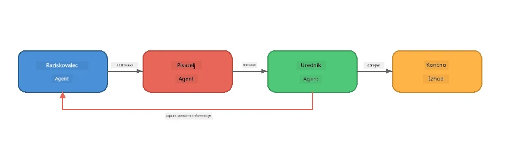
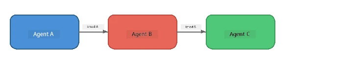
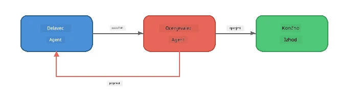
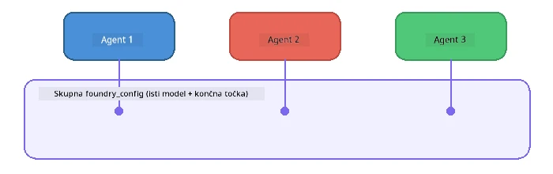

# Poglavje 6: Večagentni delovni poteki

> **Cilj:** Združiti več specializiranih agentov v usklajene tokove, ki delijo kompleksne naloge med sodelujoče agente - vsi lokalno z Foundry Local.

## Zakaj več agentov?

En sam agent lahko opravi veliko nalog, a kompleksni delovni poteki imajo koristi od **specializacije**. Namesto da bi en agent hkrati raziskoval, pisal in urejal, delo razdelite na osredotočene vloge:



| Vzorec | Opis |
|--------|------|
| **Zaporedni** | Izhod Agenta A gre v Agenta B → Agenta C |
| **Zanka povratnih informacij** | Agent ocenjevalec lahko delo pošlje nazaj v revizijo |
| **Skupni kontekst** | Vsi agenti uporabljajo isti model/endpoint, a različna navodila |
| **Tipiziran izhod** | Agenti proizvajajo strukturirane rezultate (JSON) za zanesljive predaje |

---

## Vaje

### Vaja 1 - Zaženite večagentni tok

Delavnica vključuje popoln delovni potek Raziskovalec → Pisec → Urednik.

<details>
<summary><strong>🐍 Python</strong></summary>

**Nastavitev:**
```bash
cd python
python -m venv venv

# Windows (PowerShell):
venv\Scripts\Activate.ps1
# macOS:
source venv/bin/activate

pip install -r requirements.txt
```

**Zaženi:**
```bash
python foundry-local-multi-agent.py
```

**Kaj se zgodi:**
1. **Raziskovalec** prejme temo in vrne ključne dejstvo v alinejah
2. **Pisec** vzame raziskavo in pripravi osnutek bloga (3-4 odstavki)
3. **Urednik** pregleda članek glede kakovosti in vrne SPREJEM ali POPRAVEK

</details>

<details>
<summary><strong>📦 JavaScript</strong></summary>

**Nastavitev:**
```bash
cd javascript
npm install
```

**Zaženi:**
```bash
node foundry-local-multi-agent.mjs
```

**Enaka trilinijska cevovod** - Raziskovalec → Pisec → Urednik.

</details>

<details>
<summary><strong>💜 C#</strong></summary>

**Nastavitev:**
```bash
cd csharp
dotnet restore
```

**Zaženi:**
```bash
dotnet run multi
```

**Enaka trilinijska cevovod** - Raziskovalec → Pisec → Urednik.

</details>

---

### Vaja 2 - Anatomija cevovoda

Preučite, kako so agenti definirani in povezani:

**1. Skupni model klient**

Vsi agenti uporabljajo isti Foundry Local model:

```python
# Python - FoundryLocalClient upravlja vse
from agent_framework_foundry_local import FoundryLocalClient

client = FoundryLocalClient(model_id="phi-3.5-mini")
```

```javascript
// JavaScript - OpenAI SDK usmerjen na Foundry Local
const client = new OpenAI({
  baseURL: manager.urls[0] + "/v1",
  apiKey: "foundry-local",
});
```

```csharp
// C# - OpenAIClient pointed at Foundry Local
var key = new ApiKeyCredential("foundry-local");
var client = new OpenAIClient(key, new OpenAIClientOptions
{
    Endpoint = new Uri(manager.Urls[0] + "/v1")
});
var chatClient = client.GetChatClient(model.Id);
```

**2. specializirana navodila**

Vsak agent ima svojo persona:

| Agent | Navodila (povzetek) |
|-------|---------------------|
| Raziskovalec | "Podajte ključna dejstva, statistike in ozadje. Organizirajte jih kot alineje." |
| Pisec | "Napiši privlačen blog (3-4 odstavke) na podlagi raziskovalnih zapiskov. Ne izmišljaj dejstev." |
| Urednik | "Preglej jasnost, slovnico in dejansko skladnost. Razsodba: SPREJEM ali POPRAVEK." |

**3. Pretok podatkov med agenti**

```python
# Korak 1 - izhod raziskovalca postane vhod za pisca
research_result = await researcher.run(f"Research: {topic}")

# Korak 2 - izhod pisca postane vhod za urednika
writer_result = await writer.run(f"Write using:\n{research_result}")

# Korak 3 - urednik pregleda tako raziskavo kot članek
editor_result = await editor.run(
    f"Research:\n{research_result}\n\nArticle:\n{writer_result}"
)
```

```csharp
// C# - same pattern, async calls with AIAgent
var researchNotes = await researcher.RunAsync(
    $"Research the following topic and provide key facts:\n{topic}");

var draft = await writer.RunAsync(
    $"Write a blog post based on these research notes:\n\n{researchNotes}");

var verdict = await editor.RunAsync(
    $"Review this article for quality and accuracy.\n\n" +
    $"Research notes:\n{researchNotes}\n\n" +
    $"Article:\n{draft}");
```

> **Ključni vpogled:** Vsak agent prejme kumulativni kontekst od prejšnjih agentov. Urednik vidi tako izvirno raziskavo kot osnutek - to omogoča preverjanje dejanske skladnosti.

---

### Vaja 3 - Dodaj četrtega agenta

Razširite cevovod z dodajanjem novega agenta. Izberite enega:

| Agent | Namen | Navodila |
|-------|-------|----------|
| **Preverjevalec dejstev** | Preveri trditve v članku | `"Preveri dejanske trditve. Za vsako navedbo potrdi, ali jo podpirajo raziskovalni zapiski. Vrni JSON s potrjenimi/nepotrjenimi elementi."` |
| **Pisec naslovov** | Ustvari privlačne naslove | `"Ustvari 5 možnosti za naslov članka. Različni stili: informativen, kliktalen, vprašalni, seznam, čustven."` |
| **Družbena omrežja** | Ustvari promocijske objave | `"Ustvari 3 objave za družbena omrežja za promocijo tega članka: eno za Twitter (280 znakov), eno za LinkedIn (profesionalni ton), eno za Instagram (sproščen ton in predlogi emoji)." `|

<details>
<summary><strong>🐍 Python - dodajanje pisca naslovov</strong></summary>

```python
headline_agent = client.as_agent(
    name="HeadlineWriter",
    instructions=(
        "You are a headline specialist. Given an article, generate exactly "
        "5 headline options. Vary the style: informative, question-based, "
        "listicle, emotional, and provocative. Return them as a numbered list."
    ),
)

# Ko urednik sprejme, ustvari naslove
headline_result = await headline_agent.run(
    f"Generate headlines for this article:\n\n{writer_result}"
)
print(f"\n--- Headlines ---\n{headline_result}")
```

</details>

<details>
<summary><strong>📦 JavaScript - dodajanje pisca naslovov</strong></summary>

```javascript
const headlineAgent = new ChatAgent({
  client,
  modelId: modelInfo.id,
  instructions:
    "You are a headline specialist. Given an article, generate exactly " +
    "5 headline options. Vary the style: informative, question-based, " +
    "listicle, emotional, and provocative. Return them as a numbered list.",
  name: "HeadlineWriter",
});

const headlineResult = await headlineAgent.run(
  `Generate headlines for this article:\n\n${writerResult.text}`
);
console.log(`\n--- Headlines ---\n${headlineResult.text}`);
```

</details>

<details>
<summary><strong>💜 C# - dodajanje pisca naslovov</strong></summary>

```csharp
AIAgent headlineAgent = chatClient.AsAIAgent(
    name: "HeadlineWriter",
    instructions:
        "You are a headline specialist. Given an article, generate exactly " +
        "5 headline options. Vary the style: informative, question-based, " +
        "listicle, emotional, and provocative. Return them as a numbered list."
);

// After the editor accepts, generate headlines
var headlines = await headlineAgent.RunAsync(
    $"Generate headlines for this article:\n\n{draft}");
Console.WriteLine($"\n--- Headlines ---\n{headlines}");
```

</details>

---

### Vaja 4 - Oblikujte svoj lasten delovni potek

Oblikujte večagentni cevovod za drugo področje. Tukaj je nekaj idej:

| Področje | Agenti | Tok |
|----------|--------|-----|
| **Pregled kode** | Analitik → Recenzent → Povzetkar | Analiza kode → pregledovanje napak → izdelava povzetka |
| **Podpora strankam** | Razvrščevalec → Odgovorec → Kontrola kakovosti | Razvrsti tiket → pripravi odgovor → preveri kakovost |
| **Izobraževanje** | Ustvarjalec kvizov → Simulator študenta → Ocenevalec | Ustvari kviz → simuliraj odgovore → oceni in obrazloži |
| **Analiza podatkov** | Interpret → Analitik → Poročevalec | Interpretiraj zahtevo po podatkih → analizira vzorce → napiši poročilo |

**Koraki:**
1. Določite 3+ agente z jasno razlikujočimi se `navodili`
2. Odločite o pretoku podatkov - kaj vsak agent prejme in ustvari?
3. Implementirajte cevovod z vzorci iz vaj 1-3
4. Dodajte zanko povratnih informacij, če naj en agent ocenjuje drugega

---

## Vzorci orkestracije

Tukaj so vzorci orkestracije, ki veljajo za vsak večagentni sistem (podrobno opisani v [Poglavju 7](part7-zava-creative-writer.md)):

### Zaporedni cevovod



Vsak agent obdeluje izhod prejšnjega. Preprosto in predvidljivo.

### Zanka povratnih informacij



Agent ocenjevalec lahko sproži ponovni zagon zgodnejših faz. Zava Pisec to uporablja: urednik lahko pošlje povratne informacije raziskovalcu in piscu.

### Skupni kontekst



Vsi agenti uporabljajo en sam `foundry_config`, zato uporabljajo isti model in endpoint.

---

## Ključne ugotovitve

| Koncept | Kaj ste se naučili |
|---------|--------------------|
| Specializacija agentov | Vsak agent opravlja eno stvar dobro s ciljno usmerjenimi navodili |
| Predaja podatkov | Izhod enega agenta postane vhod za naslednjega |
| Zanke povratnih informacij | Agent ocenjevalec lahko sproži ponovitev za boljšo kakovost |
| Strukturiran izhod | Odgovori v JSON formatu omogočajo zanesljivo komunikacijo med agenti |
| Orkestracija | Koordinator upravlja zaporedje cevovoda in obravnavo napak |
| Vzorci produkcije | Uporabljeno v [Poglavju 7: Zava Creative Writer](part7-zava-creative-writer.md) |

---

## Naslednji koraki

Nadaljujte na [Poglavje 7: Zava Creative Writer - Capstone Application](part7-zava-creative-writer.md), da raziščete večagentno aplikacijo v produkcijskem slogu s 4 specializiranimi agenti, pretakanjem izhoda, iskanjem izdelkov in zankami povratnih informacij - na voljo v Pythonu, JavaScriptu in C#.

---

<!-- CO-OP TRANSLATOR DISCLAIMER START -->
**Omejitev odgovornosti**:  
Ta dokument je bil preveden z uporabo AI prevajalske storitve [Co-op Translator](https://github.com/Azure/co-op-translator). Čeprav si prizadevamo za natančnost, vas prosimo, da upoštevate, da lahko avtomatizirani prevodi vsebujejo napake ali netočnosti. Izvirni dokument v izvorni jezik je treba obravnavati kot avtoritativni vir. Za ključne informacije je priporočljiv strokovni človeški prevod. Nismo odgovorni za morebitne nesporazume ali napačne interpretacije, ki izhajajo iz uporabe tega prevoda.
<!-- CO-OP TRANSLATOR DISCLAIMER END -->