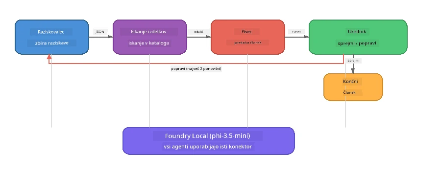

# Del 7: Zava Creative Writer - zaključno delo

> **Cilj:** Raziskati produkcijsko večagentno aplikacijo, kjer štirje specializirani agenti sodelujejo pri izdelavi člankov kakovosti za revije za Zava Retail DIY - deluje povsem na vašem napravi z Foundry Local.

To je **zaključno delo** delavnice. Združuje vse, kar ste se naučili - integracijo SDK (del 3), pridobivanje podatkov iz lokalnih virov (del 4), agentne persone (del 5) in večagentno orkestracijo (del 6) - v popolno aplikacijo, na voljo v **Pythonu**, **JavaScriptu** in **C#**.

---

## Kaj boste raziskali

| Pojem | Kje v Zava Writer |
|---------|----------------------------|
| Nalaganje modela v 4 korakih | Skupni konfiguracijski modul zažene Foundry Local |
| RAG-stil pridobivanja | Agent za izdelke išče v lokalnem katalogu |
| Specializacija agentov | 4 agenti z različnimi sistemskimi pozivi |
| Pretakanje izhoda | Pisec oddaja tokene v realnem času |
| Strukturirane predaje | Raziskovalec → JSON, Urednik → JSON odločitev |
| Povratne zanke | Urednik lahko sproži ponovni zagon (največ 2 ponovitvi) |

---

## Arhitektura

Zava Creative Writer uporablja **zaporedno cevovodno obdelavo z evaluatorsko povratno zanko**. Vsi trije jezikovni implementaciji sledijo isti arhitekturi:



### Štirje agenti

| Agent | Vhod | Izhod | Namen |
|-------|-------|--------|---------|
| **Raziskovalec** | Tema + opcijski povratni odziv | `{"web": [{url, name, description}, ...]}` | Zbira ozadje z raziskavami preko LLM |
| **Iskanje izdelkov** | Besedilni opis izdelka | Seznam ujemajočih izdelkov | LLM-ustvarjeni poizvedbe + iskanje ključnih besed v lokalnem katalogu |
| **Pisec** | Raziskave + izdelki + naloga + povratni odziv | Tekst članka v streaming načinu (razdeljen z `---`) | Sestavi članek kakovosti za revijo v realnem času |
| **Urednik** | Članek + samovrednotenje pisca | `{"decision": "accept/revise", "editorFeedback": "...", "researchFeedback": "..."}` | Pregleda kakovost, sproži ponovni poskus po potrebi |

### Potek cevovoda

1. **Raziskovalec** prejme temo in ustvari strukturirane raziskovalne zapiske (JSON)
2. **Iskanje izdelkov** poizveduje v lokalnem katalogu izdelkov z LLM-ustvarjenimi iskalnimi izrazi
3. **Pisec** združi raziskave + izdelke + nalogo v tok članka, za `---` pa doda samovrednotenje
4. **Urednik** pregleda članek in vrne JSON odločitev:
   - `"accept"` → cevovod je zaključen
   - `"revise"` → povratni odziv se pošlje raziskovalcu in piscu (največ 2 ponovitvi)

---

## Predpogoji

- Dokončajte [Del 6: Večagentni delovni tokovi](part6-multi-agent-workflows.md)
- Foundry Local CLI nameščen in model `phi-3.5-mini` prenesen

---

## Vaje

### Vaja 1 - Zaženite Zava Creative Writer

Izberite svoj jezik in zaženite aplikacijo:

<details>
<summary><strong>🐍 Python - FastAPI spletna storitev</strong></summary>

Python različica teče kot **spletna storitev** z REST API-jem, prikazuje, kako zgraditi produkcijsko zaledje.

**Nastavitev:**
```bash
cd zava-creative-writer-local/src/api
python -m venv venv

# Windows (PowerShell):
venv\Scripts\Activate.ps1
# macOS:
source venv/bin/activate

pip install -r requirements.txt
```

**Zagon:**
```bash
uvicorn main:app --reload
```

**Testiranje:**
```bash
curl -X POST http://localhost:8000/api/article \
  -H "Content-Type: application/json" \
  -d '{
    "research": "DIY home improvement trends",
    "products": "power tools and paints",
    "assignment": "Write an article about weekend renovation projects for DIY enthusiasts"
  }'
```

Odgovor se pretaka nazaj kot JSON sporočila, ločena z novimi vrsticami, ki prikazujejo napredek vsakega agenta.

</details>

<details>
<summary><strong>📦 JavaScript - Node.js CLI</strong></summary>

JavaScript različica teče kot **CLI aplikacija**, ki izpisuje napredek agentov in članek neposredno v konzoli.

**Nastavitev:**
```bash
cd zava-creative-writer-local/src/javascript
npm install
```

**Zagon:**
```bash
node main.mjs
```

Videli boste:
1. Nalaganje Foundry Local modela (z vrstico napredka pri prenosu)
2. Vsak agent izvršuje zaporedno s prikazom stanja
3. Članek se pretaka v konzolo v realnem času
4. Urednikova odločitev o sprejemu/uredbi

</details>

<details>
<summary><strong>💜 C# - .NET konzolna aplikacija</strong></summary>

C# različica teče kot **.NET konzolna aplikacija** z enakim cevovodom in streaming izhodom.

**Nastavitev:**
```bash
cd zava-creative-writer-local/src/csharp
dotnet restore
```

**Zagon:**
```bash
dotnet run
```

Izhodni vzorec enak JavaScript različici - sporočila o stanju agentov, pretok članka in urednikova odločitev.

</details>

---

### Vaja 2 - Preučite strukturo kode

Vsaka jezikovna implementacija ima iste logične komponente. Primerjajte strukture:

**Python** (`src/api/`):
| Datoteka | Namen |
|------|---------|
| `foundry_config.py` | Skupni upravljalnik Foundry Local, model in klient (nalaganje v 4 korakih) |
| `orchestrator.py` | Koordinacija cevovoda s povratno zanko |
| `main.py` | FastAPI končne točke (`POST /api/article`) |
| `agents/researcher/researcher.py` | Raziskave z LLM, izhod JSON |
| `agents/product/product.py` | LLM-ustvarjene poizvedbe + iskanje ključnih besed |
| `agents/writer/writer.py` | Generiranje članka v streamingu |
| `agents/editor/editor.py` | Odločitev o sprejemu/uredbi v JSON |

**JavaScript** (`src/javascript/`):
| Datoteka | Namen |
|------|---------|
| `foundryConfig.mjs` | Skupna konfiguracija Foundry Local (nalaganje v 4 korakih z vrstico napredka) |
| `main.mjs` | Orkestrator + vstopna točka CLI |
| `researcher.mjs` | Agent raziskovalec z LLM |
| `product.mjs` | Generiranje poizvedb LLM + iskanje |
| `writer.mjs` | Generiranje članka (asinkron generator) |
| `editor.mjs` | Odločitev o sprejemu/uredbi v JSON |
| `products.mjs` | Podatki kataloga izdelkov |

**C#** (`src/csharp/`):
| Datoteka | Namen |
|------|---------|
| `Program.cs` | Popoln cevovod: nalaganje modela, agenti, orkestrator, povratna zanka |
| `ZavaCreativeWriter.csproj` | .NET 9 projekt z Foundry Local in OpenAI paketi |

> **Oblika:** Python loči vsak agent v svojo datoteko/mape (primerno za večje ekipe). JavaScript uporablja en modul na agenta (primerno za srednje projekte). C# drži vse v eni datoteki z lokalnimi funkcijami (primerno za samostojne primere). V produkciji izberite obliko, ki ustreza vašim ekipnim konvencijam.

---

### Vaja 3 - Sledi skupni konfiguraciji

Vsak agent v cevovodu deli enega Foundry Local klienta za model. Preučite, kako je to nastavljeno v vsakem jeziku:

<details>
<summary><strong>🐍 Python - foundry_config.py</strong></summary>

```python
from foundry_local import FoundryLocalManager

MODEL_ALIAS = "phi-3.5-mini"

# Korak 1: Ustvarite upravitelja in zaženite storitev Foundry Local
manager = FoundryLocalManager()
manager.start_service()

# Korak 2: Preverite, ali je model že prenesen
cached = manager.list_cached_models()
catalog_info = manager.get_model_info(MODEL_ALIAS)
is_cached = any(m.id == catalog_info.id for m in cached) if catalog_info else False

if not is_cached:
    manager.download_model(MODEL_ALIAS)

# Korak 3: Naložite model v pomnilnik
manager.load_model(MODEL_ALIAS)
model_id = manager.get_model_info(MODEL_ALIAS).id

# Skupni OpenAI odjemalec
client = openai.OpenAI(base_url=manager.endpoint, api_key=manager.api_key)
```

Vsi agenti uvozijo `from foundry_config import client, model_id`.

</details>

<details>
<summary><strong>📦 JavaScript - foundryConfig.mjs</strong></summary>

```javascript
import { FoundryLocalManager } from "foundry-local-sdk";
import { OpenAI } from "openai";

FoundryLocalManager.create({ appName: "ZavaCreativeWriter" });
const manager = FoundryLocalManager.instance;
await manager.startWebService();

// Preveri predpomnilnik → prenesi → naloži (nov vzorec SDK)
const catalog = manager.catalog;
const model = await catalog.getModel(MODEL_ALIAS);
if (!model.isCached) {
  console.log(`Downloading model: ${MODEL_ALIAS}...`);
  await model.download();
}
await model.load();

const client = new OpenAI({ baseURL: manager.urls[0] + "/v1", apiKey: "foundry-local" });
const modelId = model.id;
export { client, modelId };
```

Vsi agenti uvozijo `{ client, modelId } from "./foundryConfig.mjs"`.

</details>

<details>
<summary><strong>💜 C# - vrh datoteke Program.cs</strong></summary>

```csharp
await FoundryLocalManager.CreateAsync(
    new Configuration
    {
        AppName = "ZavaCreativeWriter",
        Web = new Configuration.WebService { Urls = "http://127.0.0.1:0" }
    }, NullLogger.Instance, default);
var manager = FoundryLocalManager.Instance;
await manager.StartWebServiceAsync(default);

var catalog = await manager.GetCatalogAsync(default);
var catalogModel = await catalog.GetModelAsync(alias, default);
var isCached = await catalogModel.IsCachedAsync(default);
if (!isCached)
    await catalogModel.DownloadAsync(null, default);

await catalogModel.LoadAsync(default);
var key = new ApiKeyCredential("foundry-local");
var chatClient = new OpenAIClient(key, new OpenAIClientOptions
{
    Endpoint = new Uri(manager.Urls[0] + "/v1")
}).GetChatClient(catalogModel.Id);
```

`chatClient` se potem posreduje vsem funkcijam agentov v isti datoteki.

</details>

> **Ključni vzorec:** Vzorec nalaganja modela (start storitve → preveri predpomnilnik → prenesi → naloži) zagotavlja jasen prikaz napredka uporabniku in da je model prenesen samo enkrat. To je najboljša praksa za katero koli aplikacijo Foundry Local.

---

### Vaja 4 - Razumite povratno zanko

Povratna zanka naredi ta cevovod "pametnega" - Urednik lahko delo pošlje nazaj v revizijo. Sledite logiki:

```
Orchestrator:
  1. researcher.research(topic, "No Feedback")    ← first pass
  2. product.findProducts(productContext)
  3. writer.write(research, products, assignment)  ← streams article
  4. Split article at "---" → article + writerFeedback
  5. editor.edit(article, writerFeedback)

  WHILE editor says "revise" AND retryCount < 2:
    6. researcher.research(topic, editor.researchFeedback)  ← refined
    7. writer.write(research, products, editor.editorFeedback)
    8. editor.edit(newArticle, newWriterFeedback)
    9. retryCount++
```

**Vprašanja za razmislek:**
- Zakaj je omejitev poskusov nastavljena na 2? Kaj se zgodi, če jo povečate?
- Zakaj raziskovalec dobi `researchFeedback`, pisec pa `editorFeedback`?
- Kaj bi se zgodilo, če bi urednik vedno rekel "popravi"?

---

### Vaja 5 - Spremenite agenta

Poskusite spremeniti vedenje enega agenta in opazujte, kako to vpliva na cevovod:

| Sprememba | Kaj spremeniti |
|-------------|----------------|
| **Strožji urednik** | Spremenite urednikov sistemski poziv, da vedno zahteva vsaj eno revizijo |
| **Daljši članki** | Spremenite poziv pisca iz "800-1000 besed" v "1500-2000 besed" |
| **Drugačni izdelki** | Dodajte ali spremenite izdelke v katalogu izdelkov |
| **Nova tema raziskave** | Spremenite privzeti `researchContext` na drugo temo |
| **Raziskovalec samo z JSON** | Naredite, da raziskovalec vrne 10 elementov namesto 3-5 |

> **Nasvet:** Ker vse tri jezike uporabljajo isto arhitekturo, lahko isto spremembo naredite v jeziku, ki vam je najbolj znan.

---

### Vaja 6 - Dodajte petega agenta

Razširite cevovod z novim agentom. Nekaj idej:

| Agent | Kje v cevovodu | Namen |
|-------|-----------------|---------|
| **Preverjevalec dejstev** | Po Pisec, pred Urednikom | Preveri trditve glede na raziskovalne podatke |
| **SEO optimizator** | Po sprejemu urednika | Doda meta opis, ključne besede, slug |
| **Ilustrator** | Po sprejemu urednika | Ustvari izhode za slike za članek |
| **Prevajalec** | Po sprejemu urednika | Prevede članek v drug jezik |

**Koraki:**
1. Napišite sistemski poziv agenta
2. Ustvarite funkcijo agenta (skladno s ​​obstoječim vzorcem v vašem jeziku)
3. Vstavite jo v orkestrator na pravi točki
4. Posodobite izhod/log, da prikaže prispevek novega agenta

---

## Kako Foundry Local in Agent Framework delujeta skupaj

Ta aplikacija prikazuje priporočeni vzorec za gradnjo večagentnih sistemov s Foundry Local:

| Plasti | Komponenta | Vloga |
|-------|-----------|------|
| **Runtime** | Foundry Local | Prenos, upravljanje in lokalna storitev modela |
| **Klient** | OpenAI SDK | Pošiljanje chat dopolnitev lokalni končni točki |
| **Agent** | Sistemski poziv + klic klepeta | specializirano vedenje skozi osredotočena navodila |
| **Orkestrator** | Koordinator cevovoda | Upravljanje pretoka podatkov, sekvenc in povratnih zank |
| **Okvir** | Microsoft Agent Framework | Nudi abstrakcijo `ChatAgent` in vzorce |

Ključna ugotovitev: **Foundry Local nadomešča oblak, ne arhitekturo aplikacije.** Enaki agentni vzorci, strategije orkestracije in strukturirane predaje, ki delujejo z modeli v oblaku, delujejo enako z lokalnimi modeli — le da klient usmerite na lokalno končno točko namesto na Azure končno točko.

---

## Ključne ugotovitve

| Pojem | Kaj ste se naučili |
|---------|-----------------|
| Produkcijska arhitektura | Kako strukturirati večagentno aplikacijo s skupno konfiguracijo in ločenimi agenti |
| Nalaganje modela v 4 korakih | Najboljša praksa za inicializacijo Foundry Local s prikazom napredka za uporabnika |
| Specializacija agentov | Vsak od 4 agentov ima osredotočena navodila in specifičen izhodni format |
| Streaming generacija | Pisec oddaja tokene v realnem času, kar omogoča odzivne uporabniške vmesnike |
| Povratne zanke | Urednikova upravljana ponovna izvedba izboljša kakovost brez človeškega posredovanja |
| Medjezikovni vzorci | Enaka arhitektura deluje v Pythonu, JavaScriptu in C# |
| Lokalno = pripravljeno za produkcijo | Foundry Local nudi enak OpenAI-kompatibilen API, kot ga uporabljajo oblaki |

---

## Naslednji korak

Nadaljujte z [Del 8: Razvoj vodena z evaluacijo](part8-evaluation-led-development.md), da zgradite sistematičen okvir za ocenjevanje svojih agentov, z uporabo zlatih podatkovnih nizov, preverjanja po pravilih in ocenjevanja z LLM kot sodnikom.

---

<!-- CO-OP TRANSLATOR DISCLAIMER START -->
**Omejitev odgovornosti**:
Ta dokument je bil preveden z uporabo AI prevajalske storitve [Co-op Translator](https://github.com/Azure/co-op-translator). Čeprav si prizadevamo za natančnost, vas prosimo, da upoštevate, da avtomatizirani prevodi lahko vsebujejo napake ali netočnosti. Originalni dokument v maternem jeziku se šteje za verodostojen vir. Za kritične informacije priporočamo strokovni človeški prevod. Nismo odgovorni za morebitna nerazumevanja ali napačne interpretacije, ki izhajajo iz uporabe tega prevoda.
<!-- CO-OP TRANSLATOR DISCLAIMER END -->