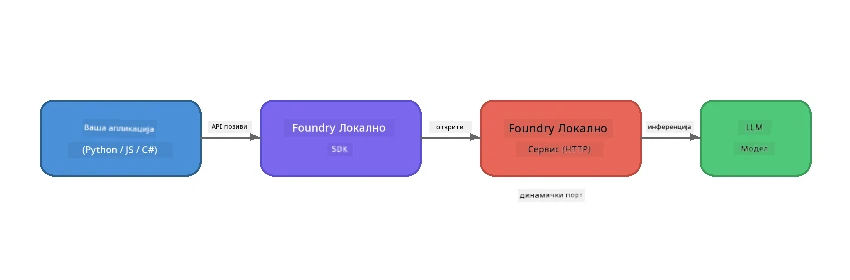

# Deo 1: Početak rada sa Foundry Local


## Шта је Foundry Local?

[Foundry Local](https://foundrylocal.ai) вам омогућава да покрећете отворене AI језичке моделе **директно на свом рачунару** - није потребна интернет веза, нема трошкова за облак, и потпуна приватност података. Он:

- **Преузима и покреће моделе локално** са аутоматском оптимизацијом хардвера (GPU, CPU, или NPU)
- **Обезбеђује API који је компатибилан са OpenAI** тако да можете користити познате SDK и алате
- **Не захтева претплату на Azure** или пријаву - само инсталирајте и почните са радом

Замислите га као вашег приватног AI који ради у потпуности на вашем уређају.

## Циљеви учења

До краја овог лабораторијског рада моћи ћете да:

- Инсталирате Foundry Local CLI на вашем оперативном систему
- Разумете шта су модел алијаси и како функционишу
- Преузмете и покренете свој први локални AI модел
- Поразговарате са локалним моделом преко командне линије
- Разумете разлику између локалних и облачно хостованих AI модела

---

## Захтеви

### Захтеви система

| Захтев | Минимално | Препоручено |
|-------------|---------|-------------|
| **RAM** | 8 GB | 16 GB |
| **Диск простор** | 5 GB (за моделе) | 10 GB |
| **CPU** | 4 језгра | 8+ језгара |
| **GPU** | Опционо | NVIDIA са CUDA 11.8+ |
| **ОС** | Windows 10/11 (x64/ARM), Windows Server 2025, macOS 13+ | - |

> **Напомена:** Foundry Local аутоматски бира најбољу варијанту модела за ваш хардвер. Ако имате NVIDIA GPU, користи CUDA акцелерацију. Ако имате Qualcomm NPU, користи то. У супротном се враћа на оптимизовану CPU варијанту.

### Инсталирање Foundry Local CLI

**Windows** (PowerShell):  
```powershell
winget install Microsoft.FoundryLocal
```
  
**macOS** (Homebrew):  
```bash
brew tap microsoft/foundrylocal
brew install foundrylocal
```
  
> **Напомена:** Foundry Local тренутно подржава само Windows и macOS. Linux тренутно није подржан.

Проверите инсталацију:  
```bash
foundry --version
```
  
---

## Лабораторијске вежбе

### Вежба 1: Истраживање доступних модела

Foundry Local укључује каталог унапред оптимизованих отворених модела. Прикажите их:

```bash
foundry model list
```
  
Видећете моделе као што су:  
- `phi-3.5-mini` - Microsoft-ов модел са 3.8 милијарди параметара (брз, добра квалитет)  
- `phi-4-mini` - Новији, способнији Phi модел  
- `phi-4-mini-reasoning` - Phi модел са резоновањем ланац-размишљања (`<think>` тагови)  
- `phi-4` - Microsoft-ов највећи Phi модел (10.4 GB)  
- `qwen2.5-0.5b` - Врло мали и брз (погодан за уређаје са малим ресурсима)  
- `qwen2.5-7b` - Јак општи модел са подршком за позивање алата  
- `qwen2.5-coder-7b` - Оптимизован за генерисање кода  
- `deepseek-r1-7b` - Јак модел за резоновање  
- `gpt-oss-20b` - Велики open-source модел (MIT лиценца, 12.5 GB)  
- `whisper-base` - Транскрипција говора у текст (383 MB)  
- `whisper-large-v3-turbo` - Транскрипција високе прецизности (9 GB)  

> **Шта је алијас модела?** Алијаси као што је `phi-3.5-mini` су пречице. Када користите алијас, Foundry Local аутоматски преузима најбољу варијанту за ваш хардвер (CUDA за NVIDIA GPU-ове, иначе оптимизовану CPU варијанту). Никада не морате да бринете о одабиру праве варијанте.

### Вежба 2: Покрените свој први модел

Преузмите и почните интерактивни разговор са моделом:

```bash
foundry model run phi-3.5-mini
```
  
Први пут кад покренете ово, Foundry Local ће:  
1. Детектовати ваш хардвер  
2. Преузети оптималну варијанту модела (ово може потрајати неколико минута)  
3. Учитајти модел у меморију  
4. Покренути интерактивну чат сесију  

Покушајте да поставите неколико питања:  
```
You: What is the golden ratio?
You: Can you explain it as if I were 10 years old?
You: Write a haiku about mathematics
```
  
Укуцајте `exit` или притисните `Ctrl+C` да изађете.

### Вежба 3: Преузмите модел унапред

Ако желите да преузмете модел без почеткиње разговора:

```bash
foundry model download phi-3.5-mini
```
  
Проверите који модели су већ преузети на вашем уређају:

```bash
foundry cache list
```
  
### Вежба 4: Разумевање архитектуре

Foundry Local ради као **локална HTTP услуга** која излаже REST API компатибилан са OpenAI. То значи:

1. Услуга се покреће на **динамичком порту** (различит порт сваки пут)  
2. Користите SDK да сазнате стварни URL крајње тачке  
3. Можете користити **било који** OpenAI- компатибилан клијентски библиотеку за комуникацију  



> **Важно:** Foundry Local додељује **динамички порт** сваки пут када се покрене. Никада не користите фиксни број порта као што је `localhost:5272`. Увек користите SDK да сазнате тренутни URL (нпр. `manager.endpoint` у Python-у или `manager.urls[0]` у JavaScript-у).

---

## Кључне појмове

| Пojам | Шта сте научили |
|---------|------------------|
| AI на уређају | Foundry Local покреће моделе у потпуности на вашем уређају без облака, API кључева и трошкова |
| Алијаси модела | Алијаси као `phi-3.5-mini` аутоматски бирају најбољу варијанту за ваш хардвер |
| Динамички портови | Услуга ради на динамичком порту; увек користите SDK да откријете крајњу тачку |
| CLI и SDK | Можете комуницирати са моделима преко CLI (`foundry model run`) или програмирано преко SDK |

---

## Следећи кораци

Наставите на [Део 2: Детаљан преглед Foundry Local SDK](part2-foundry-local-sdk.md) да савладате SDK API за управљање моделима, услугама и кеширањем на програмски начин.