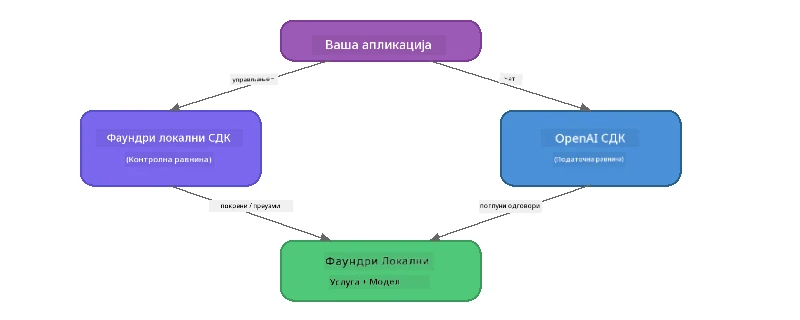

# Deo 3: Korišćenje Foundry Local SDK sa OpenAI

## Pregled

U delu 1 koristili ste Foundry Local CLI za interaktivno pokretanje modela. U delu 2 ste istražili kompletnu SDK API površinu. Sada ćete naučiti kako **integrisati Foundry Local u vaše aplikacije** koristeći SDK i OpenAI-kompatibilan API.

Foundry Local pruža SDK za tri jezika. Izaberite onaj sa kojim ste najudobniji - koncepti su identični za sva tri.

## Ciljevi učenja

Na kraju ovog laboratorijskog rada moći ćete da:

- Instalirate Foundry Local SDK za vaš jezik (Python, JavaScript ili C#)
- Inicijalizujete `FoundryLocalManager` za pokretanje servisa, proveru keša, preuzimanje i učitavanje modela
- Povežete se sa lokalnim modelom koristeći OpenAI SDK
- Šaljete chat završetke i obrađujete strimovane odgovore
- Razumete arhitekturu dinamičkih portova

---

## Preduslovi

Prvo završite [Deo 1: Početak rada sa Foundry Local](part1-getting-started.md) i [Deo 2: Detaljan pregled Foundry Local SDK](part2-foundry-local-sdk.md).

Instalirajte **jedan** od sledećih okruženja za izvršavanje jezika:
- **Python 3.9+** - [python.org/downloads](https://www.python.org/downloads/)
- **Node.js 18+** - [nodejs.org](https://nodejs.org/)
- **.NET 9.0+** - [dot.net/download](https://dotnet.microsoft.com/download)

---

## Koncept: Kako SDK radi

Foundry Local SDK upravlja **kontrolnom ravni** (pokretanje servisa, preuzimanje modela), dok OpenAI SDK upravlja **ravni podataka** (slanje upita, primanje završetaka).



---

## Laboratorijske vežbe

### Vežba 1: Podešavanje okruženja

<details>
<summary><b>🐍 Python</b></summary>

```bash
cd python
python -m venv venv

# Активирајте виртуелно окружење:
# Windows (PowerShell):
venv\Scripts\Activate.ps1
# Windows (Command Prompt):
venv\Scripts\activate.bat
# macOS:
source venv/bin/activate

pip install -r requirements.txt
```

`requirements.txt` instalira:
- `foundry-local-sdk` - Foundry Local SDK (uvozi se kao `foundry_local`)
- `openai` - OpenAI Python SDK
- `agent-framework` - Microsoft Agent Framework (koristi se u kasnijim delovima)

</details>

<details>
<summary><b>📘 JavaScript</b></summary>

```bash
cd javascript
npm install
```

`package.json` instalira:
- `foundry-local-sdk` - Foundry Local SDK
- `openai` - OpenAI Node.js SDK

</details>

<details>
<summary><b>💜 C#</b></summary>

```bash
cd csharp
dotnet restore
dotnet build
```

`csharp.csproj` koristi:
- `Microsoft.AI.Foundry.Local` - Foundry Local SDK (NuGet)
- `OpenAI` - OpenAI C# SDK (NuGet)

> **Struktura projekta:** C# projekat koristi komandni ruter u `Program.cs` koji prosleđuje pozive u odvojene fajlove sa primerima. Pokrenite `dotnet run chat` (ili samo `dotnet run`) za ovaj deo. Ostali delovi koriste `dotnet run rag`, `dotnet run agent`, i `dotnet run multi`.

</details>

---

### Vežba 2: Osnovni chat završetak

Otvorite osnovni chat primer za vaš jezik i proučite kod. Svaki skript sledи isti trostepeni obrazac:

1. **Pokretanje servisa** - `FoundryLocalManager` pokreće Foundry Local runtime
2. **Preuzimanje i učitavanje modela** - proverava keš, preuzima ako je potrebno, zatim učitava u memoriju
3. **Kreiranje OpenAI klijenta** - povezuje se sa lokalnom krajnjom tačkom i šalje streaming chat završetak

<details>
<summary><b>🐍 Python - <code>python/foundry-local.py</code></b></summary>

```python
import sys
import openai
from foundry_local import FoundryLocalManager

alias = "phi-3.5-mini"

# Корак 1: Креирајте FoundryLocalManager и покрените сервис
print("Starting Foundry Local service...")
manager = FoundryLocalManager()
manager.start_service()

# Корак 2: Проверите да ли је модел већ преузет
cached = manager.list_cached_models()
catalog_info = manager.get_model_info(alias)
is_cached = any(m.id == catalog_info.id for m in cached) if catalog_info else False

if is_cached:
    print(f"Model already downloaded: {alias}")
else:
    print(f"Downloading model: {alias} (this may take several minutes)...")
    manager.download_model(alias)
    print(f"Download complete: {alias}")

# Корак 3: Учитајте модел у меморију
print(f"Loading model: {alias}...")
manager.load_model(alias)

# Креирајте OpenAI клијента који показује на ЛОКАЛНИ Foundry сервис
client = openai.OpenAI(
    base_url=manager.endpoint,   # Динамички порт - никада не кодујте у тврдом облику!
    api_key=manager.api_key
)

# Генеришите стриминг чат комплетирање
stream = client.chat.completions.create(
    model=manager.get_model_info(alias).id,
    messages=[{"role": "user", "content": "What is the golden ratio?"}],
    stream=True,
)

for chunk in stream:
    if chunk.choices[0].delta.content is not None:
        print(chunk.choices[0].delta.content, end="", flush=True)
print()
```

**Pokreni:**
```bash
python foundry-local.py
```

</details>

<details>
<summary><b>📘 JavaScript - <code>javascript/foundry-local.mjs</code></b></summary>

```javascript
import { OpenAI } from "openai";
import { FoundryLocalManager } from "foundry-local-sdk";

const alias = "phi-3.5-mini";

// Корак 1: Покрените Foundry Local услугу
console.log("Starting Foundry Local service...");
FoundryLocalManager.create({ appName: "FoundryLocalWorkshop" });
const manager = FoundryLocalManager.instance;
await manager.startWebService();

// Корак 2: Проверите да ли је модел већ преузет
const catalog = manager.catalog;
const model = await catalog.getModel(alias);

if (model.isCached) {
  console.log(`Model already downloaded: ${alias}`);
} else {
  console.log(`Downloading model: ${alias} (this may take several minutes)...`);
  await model.download();
  console.log(`Download complete: ${alias}`);
}

// Корак 3: Учитајте модел у меморију
console.log(`Loading model: ${alias}...`);
await model.load();
console.log(`Model loaded: ${model.id}`);

// Креирајте OpenAI клијента који указује на ЛОКАЛНУ Foundry услугу
const client = new OpenAI({
  baseURL: manager.urls[0] + "/v1",   // Динамички порт - никад не кодујте директно!
  apiKey: "foundry-local",
});

// Генеришите реч у току стримовања ћаскања
const stream = await client.chat.completions.create({
  model: model.id,
  messages: [{ role: "user", content: "What is the golden ratio?" }],
  stream: true,
});

for await (const chunk of stream) {
  if (chunk.choices[0]?.delta?.content) {
    process.stdout.write(chunk.choices[0].delta.content);
  }
}
console.log();
```

**Pokreni:**
```bash
node foundry-local.mjs
```

</details>

<details>
<summary><b>💜 C# - <code>csharp/BasicChat.cs</code></b></summary>

```csharp
using Microsoft.AI.Foundry.Local;
using Microsoft.Extensions.Logging.Abstractions;
using OpenAI;
using OpenAI.Chat;
using System.ClientModel;

var alias = "phi-3.5-mini";

// Step 1: Start the Foundry Local service
Console.WriteLine("Starting Foundry Local service...");
await FoundryLocalManager.CreateAsync(
    new Configuration
    {
        AppName = "FoundryLocalSamples",
        Web = new Configuration.WebService { Urls = "http://127.0.0.1:0" }
    }, NullLogger.Instance, default);
var manager = FoundryLocalManager.Instance;
await manager.StartWebServiceAsync(default);

// Step 2: Get the model from the catalog
var catalog = await manager.GetCatalogAsync(default);
var model = await catalog.GetModelAsync(alias, default);

// Step 3: Check if the model is already downloaded
var isCached = await model.IsCachedAsync(default);

if (isCached)
{
    Console.WriteLine($"Model already downloaded: {alias}");
}
else
{
    Console.WriteLine($"Downloading model: {alias} (this may take several minutes)...");
    await model.DownloadAsync(null, default);
    Console.WriteLine($"Download complete: {alias}");
}

// Step 4: Load the model into memory
Console.WriteLine($"Loading model: {alias}...");
await model.LoadAsync(default);
Console.WriteLine($"Loaded model: {model.Id}");
Console.WriteLine($"Endpoint: {manager.Urls[0]}");

// Create OpenAI client pointing to the LOCAL Foundry service
var key = new ApiKeyCredential("foundry-local");
var client = new OpenAIClient(key, new OpenAIClientOptions
{
    Endpoint = new Uri(manager.Urls[0] + "/v1")  // Dynamic port - never hardcode!
});

var chatClient = client.GetChatClient(model.Id);

// Stream a chat completion
var completionUpdates = chatClient.CompleteChatStreaming("What is the golden ratio?");

foreach (var update in completionUpdates)
{
    if (update.ContentUpdate.Count > 0)
    {
        Console.Write(update.ContentUpdate[0].Text);
    }
}
Console.WriteLine();
```

**Pokreni:**
```bash
dotnet run chat
```

</details>

---

### Vežba 3: Eksperimentisanje sa upitima

Kada osnovni primer radi, pokušajte da modifikujete kod:

1. **Promenite korisničku poruku** - pokušajte različita pitanja
2. **Dodajte sistemski prompt** - dajte modelu personu
3. **Isključite strimovanje** - podesite `stream=False` i ispišite ceo odgovor odjednom
4. **Isprobajte drugi model** - promenite alias sa `phi-3.5-mini` na neki drugi model iz `foundry model list`

<details>
<summary><b>🐍 Python</b></summary>

```python
# Додај системски упит - дај моделу персоналитет:
stream = client.chat.completions.create(
    model=manager.get_model_info(alias).id,
    messages=[
        {"role": "system", "content": "You are a pirate. Answer everything in pirate speak."},
        {"role": "user", "content": "What is the golden ratio?"}
    ],
    stream=True,
)

# Или искључи стримовање:
response = client.chat.completions.create(
    model=manager.get_model_info(alias).id,
    messages=[{"role": "user", "content": "What is the golden ratio?"}],
    stream=False,
)
print(response.choices[0].message.content)
```

</details>

<details>
<summary><b>📘 JavaScript</b></summary>

```javascript
// Додај системски подстицај - дај моделу личност:
const stream = await client.chat.completions.create({
  model: modelInfo.id,
  messages: [
    { role: "system", content: "You are a pirate. Answer everything in pirate speak." },
    { role: "user", content: "What is the golden ratio?" },
  ],
  stream: true,
});

// Или искључи стримовање:
const response = await client.chat.completions.create({
  model: modelInfo.id,
  messages: [{ role: "user", content: "What is the golden ratio?" }],
  stream: false,
});
console.log(response.choices[0].message.content);
```

</details>

<details>
<summary><b>💜 C#</b></summary>

```csharp
// Add a system prompt - give the model a persona:
var completionUpdates = chatClient.CompleteChatStreaming(
    new ChatMessage[]
    {
        new SystemChatMessage("You are a pirate. Answer everything in pirate speak."),
        new UserChatMessage("What is the golden ratio?")
    }
);

// Or turn off streaming:
var response = chatClient.CompleteChat("What is the golden ratio?");
Console.WriteLine(response.Value.Content[0].Text);
```

</details>

---

### Reference metoda SDK

<details>
<summary><b>🐍 Python SDK metode</b></summary>

| Metod | Svrha |
|--------|---------|
| `FoundryLocalManager()` | Kreira instancu menadžera |
| `manager.start_service()` | Pokreće Foundry Local servis |
| `manager.list_cached_models()` | Prikazuje modele preuzete na uređaj |
| `manager.get_model_info(alias)` | Daje ID modela i metapodatke |
| `manager.download_model(alias, progress_callback=fn)` | Preuzima model sa opcionalnim callback-om za napredak |
| `manager.load_model(alias)` | Učitava model u memoriju |
| `manager.endpoint` | Daje URL dinamičke krajnje tačke |
| `manager.api_key` | Daje API ključ (rezervisano za lokalno) |

</details>

<details>
<summary><b>📘 JavaScript SDK metode</b></summary>

| Metod | Svrha |
|--------|---------|
| `FoundryLocalManager.create({ appName })` | Kreira instancu menadžera |
| `FoundryLocalManager.instance` | Pristupa jedinstvenom menadžeru |
| `await manager.startWebService()` | Pokreće Foundry Local servis |
| `await manager.catalog.getModel(alias)` | Dohvata model iz kataloga |
| `model.isCached` | Proverava da li je model već preuzet |
| `await model.download()` | Preuzima model |
| `await model.load()` | Učitava model u memoriju |
| `model.id` | Dobija ID modela za OpenAI API pozive |
| `manager.urls[0] + "/v1"` | Daje URL dinamičke krajnje tačke |
| `"foundry-local"` | API ključ (rezervisano za lokalno) |

</details>

<details>
<summary><b>💜 C# SDK metode</b></summary>

| Metod | Svrha |
|--------|---------|
| `FoundryLocalManager.CreateAsync(config)` | Kreira i inicijalizuje menadžera |
| `manager.StartWebServiceAsync()` | Pokreće Foundry Local web servis |
| `manager.GetCatalogAsync()` | Dobija katalog modela |
| `catalog.ListModelsAsync()` | Prikazuje sve dostupne modele |
| `catalog.GetModelAsync(alias)` | Dohvata specifičan model po aliasu |
| `model.IsCachedAsync()` | Proverava da li je model preuzet |
| `model.DownloadAsync()` | Preuzima model |
| `model.LoadAsync()` | Učitava model u memoriju |
| `manager.Urls[0]` | Daje URL dinamičke krajnje tačke |
| `new ApiKeyCredential("foundry-local")` | Kredencijal za API ključ za lokalno korišćenje |

</details>

---

### Vežba 4: Korišćenje nativnog ChatClient-a (alternativa OpenAI SDK)

U vežbama 2 i 3 koristili ste OpenAI SDK za chat završetke. JavaScript i C# SDK takođe pružaju **nativni ChatClient** koji eliminiše potrebu za OpenAI SDK u potpunosti.

<details>
<summary><b>📘 JavaScript - <code>model.createChatClient()</code></b></summary>

```javascript
import { FoundryLocalManager } from "foundry-local-sdk";

const alias = "phi-3.5-mini";

FoundryLocalManager.create({ appName: "ChatClientDemo" });
const manager = FoundryLocalManager.instance;
await manager.startWebService();

const model = await manager.catalog.getModel(alias);
if (!model.isCached) await model.download();
await model.load();

// Није потребан OpenAI увоз — добијте клијента директно из модела
const chatClient = model.createChatClient();

// Некомплетирање без стримовања
const response = await chatClient.completeChat([
  { role: "system", content: "You are a pirate. Answer everything in pirate speak." },
  { role: "user", content: "What is the golden ratio?" }
]);
console.log(response.choices[0].message.content);

// Комплетирање са стримовањем (користи образац повратног позива)
await chatClient.completeStreamingChat(
  [{ role: "user", content: "What is the golden ratio?" }],
  (chunk) => {
    if (chunk.choices?.[0]?.delta?.content) {
      process.stdout.write(chunk.choices[0].delta.content);
    }
  }
);
console.log();
```

> **Napomena:** ChatClient-ova `completeStreamingChat()` koristi **callback** obrazac, ne asinhroni iterator. Prosledite funkciju kao drugi argument.

</details>

<details>
<summary><b>💜 C# - <code>model.GetChatClientAsync()</code></b></summary>

```csharp
var catalog = await manager.GetCatalogAsync(default);
var model = await catalog.GetModelAsync("phi-3.5-mini", default);
if (!await model.IsCachedAsync(default))
    await model.DownloadAsync(null, default);
await model.LoadAsync(default);

// No OpenAI NuGet needed — get a client directly from the model
var chatClient = await model.GetChatClientAsync(default);

// Use it like a standard OpenAI ChatClient
var response = chatClient.CompleteChat("What is the golden ratio?");
Console.WriteLine(response.Value.Content[0].Text);
```

</details>

> **Kada koristiti koji pristup:**
> | Pristup | Najbolje za |
> |----------|----------|
> | OpenAI SDK | Potpuna kontrola parametara, produkcione aplikacije, postojeći OpenAI kod |
> | Nativni ChatClient | Brza prototipizacija, manje zavisnosti, jednostavnije podešavanje |

---

## Ključne lekcije

| Koncept | Šta ste naučili |
|---------|------------------|
| Kontrolna ravan | Foundry Local SDK upravlja pokretanjem servisa i učitavanjem modela |
| Ravan podataka | OpenAI SDK upravlja chat završecima i strimovanjem |
| Dinamički portovi | Uvek koristite SDK za pronalaženje krajnje tačke; nikad nemojte hardkodirati URL-ove |
| Više jezika | Isti kodni obrasci rade u Pythonu, JavaScript-u i C# |
| Kompatibilnost sa OpenAI | Potpuna OpenAI API kompatibilnost znači da postojeći OpenAI kod radi sa minimalnim izmenama |
| Nativni ChatClient | `createChatClient()` (JS) / `GetChatClientAsync()` (C#) pruža alternativu OpenAI SDK-u |

---

## Sledeći koraci

Nastavite sa [Delom 4: Izgradnja RAG aplikacije](part4-rag-fundamentals.md) da naučite kako da napravite Retrieval-Augmented Generation pipeline koji radi kompletno na vašem uređaju.