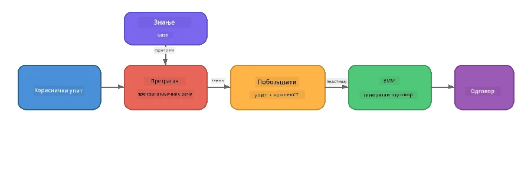

# Deo 4: Kreiranje RAG aplikacije sa Foundry Local

## Pregled

Veliki jezički modeli su moćni, ali poznaju samo ono što je bilo u njihovim podacima za obuku. **Generisanje uz podršku pretraživanja (RAG)** rešava ovaj problem tako što modelu daje relevantan kontekst u trenutku upita – preuzet iz vaših sopstvenih dokumenata, baza podataka ili baza znanja.

U ovoj radionici ćete napraviti kompletan RAG proces koji se izvršava **potpuno na vašem uređaju** koristeći Foundry Local. Nema servisa u oblaku, nema vektorskih baza podataka, nema embedding API-ja – samo lokalno pretraživanje i lokalni model.

## Ciljevi učenja

Na kraju ove radionice bićete u stanju da:

- Objasnite šta je RAG i zašto je važan za AI aplikacije
- Napravite lokalnu bazu znanja od tekstualnih dokumenata
- Implementirate jednostavnu funkciju pretraživanja za pronalaženje relevantnog konteksta
- Sastavite sistemski prompt koji osniva model na pronađenim činjenicama
- Pokrenete ceo lanac Pretraži → Dopuni → Generiši na uređaju
- Razumete kompromis između jednostavnog pretraživanja ključnih reči i vektorskog pretraživanja

---

## Preduslovi

- Završite [Deo 3: Korišćenje Foundry Local SDK sa OpenAI](part3-sdk-and-apis.md)
- Instaliran Foundry Local CLI i preuzet model `phi-3.5-mini`

---

## Koncept: Šta je RAG?

Bez RAG, LLM može odgovarati samo na osnovu podataka za obuku – koji mogu biti zastareli, nepotpuni ili bez vaših privatnih informacija:

```
User: "What is Zava's return policy?"
LLM:  "I do not have information about Zava's return policy."  ← No context!
```

Sa RAG, prvo **pretražujete** relevantne dokumente, zatim **dopunjavate** prompt tim kontekstom pre nego što **generišete** odgovor:



Ključni uvid: **model ne mora „znati“ odgovor; samo treba da pročita odgovarajuće dokumente.**

---

## Vežbe u radionici

### Vežba 1: Razumevanje baze znanja

Otvorite RAG primer za vaš jezik i pregledajte bazu znanja:

<details>
<summary><b>🐍 Python: <code>python/foundry-local-rag.py</code></b></summary>

Baza znanja je jednostavna lista rečnika sa poljima `title` i `content`:

```python
KNOWLEDGE_BASE = [
    {
        "title": "Foundry Local Overview",
        "content": (
            "Foundry Local brings the power of Azure AI Foundry to your local "
            "device without requiring an Azure subscription..."
        ),
    },
    {
        "title": "Supported Hardware",
        "content": (
            "Foundry Local automatically selects the best model variant for "
            "your hardware. If you have an Nvidia CUDA GPU it downloads the "
            "CUDA-optimized model..."
        ),
    },
    # ... још уноса
]
```

Svaki unos predstavlja „deo“ znanja – fokusiran komad informacije o jednoj temi.

</details>

<details>
<summary><b>📘 JavaScript: <code>javascript/foundry-local-rag.mjs</code></b></summary>

Baza znanja koristi istu strukturu kao niz objekata:

```javascript
const KNOWLEDGE_BASE = [
  {
    title: "Foundry Local Overview",
    content:
      "Foundry Local brings the power of Azure AI Foundry to your local " +
      "device without requiring an Azure subscription...",
  },
  {
    title: "Supported Hardware",
    content:
      "Foundry Local automatically selects the best model variant for " +
      "your hardware...",
  },
  // ... још уноса
];
```

</details>

<details>
<summary><b>💜 C#: <code>csharp/RagPipeline.cs</code></b></summary>

Baza znanja koristi listu imenovanih torki:

```csharp
private static readonly List<(string Title, string Content)> KnowledgeBase =
[
    ("Foundry Local Overview",
     "Foundry Local brings the power of Azure AI Foundry to your local " +
     "device without requiring an Azure subscription..."),

    ("Supported Hardware",
     "Foundry Local automatically selects the best model variant for " +
     "your hardware..."),

    // ... more entries
];
```

</details>

> **U stvarnoj aplikaciji**, baza znanja bi dolazila iz fajlova na disku, baze podataka, indeksa pretrage ili API-ja. Za ovu radionicu koristimo listu u memoriji radi jednostavnosti.

---

### Vežba 2: Razumevanje funkcije pretraživanja

Korak pretraživanja pronalazi najrelevantnije delove znanja za korisničko pitanje. Ovaj primer koristi **preklapanje ključnih reči** – broji koliko reči iz upita se pojavljuje u svakom delu:

<details>
<summary><b>🐍 Python</b></summary>

```python
def retrieve(query: str, top_k: int = 2) -> list[dict]:
    """Return the top-k knowledge chunks most relevant to the query."""
    query_words = set(query.lower().split())
    scored = []
    for chunk in KNOWLEDGE_BASE:
        chunk_words = set(chunk["content"].lower().split())
        overlap = len(query_words & chunk_words)
        scored.append((overlap, chunk))
    scored.sort(key=lambda x: x[0], reverse=True)
    return [item[1] for item in scored[:top_k]]
```

</details>

<details>
<summary><b>📘 JavaScript</b></summary>

```javascript
function retrieve(query, topK = 2) {
  const queryWords = new Set(query.toLowerCase().split(/\s+/));
  const scored = KNOWLEDGE_BASE.map((chunk) => {
    const chunkWords = new Set(chunk.content.toLowerCase().split(/\s+/));
    let overlap = 0;
    for (const w of queryWords) {
      if (chunkWords.has(w)) overlap++;
    }
    return { overlap, chunk };
  });
  scored.sort((a, b) => b.overlap - a.overlap);
  return scored.slice(0, topK).map((s) => s.chunk);
}
```

</details>

<details>
<summary><b>💜 C#</b></summary>

```csharp
private static List<(string Title, string Content)> Retrieve(string query, int topK = 2)
{
    var queryWords = new HashSet<string>(
        query.ToLowerInvariant().Split(' ', StringSplitOptions.RemoveEmptyEntries));

    return KnowledgeBase
        .Select(chunk =>
        {
            var chunkWords = new HashSet<string>(
                chunk.Content.ToLowerInvariant().Split(' ', StringSplitOptions.RemoveEmptyEntries));
            var overlap = queryWords.Intersect(chunkWords).Count();
            return (Overlap: overlap, Chunk: chunk);
        })
        .OrderByDescending(x => x.Overlap)
        .Take(topK)
        .Select(x => x.Chunk)
        .ToList();
}
```

</details>

**Kako funkcioniše:**
1. Podelite upit na pojedinačne reči
2. Za svaki deo znanja, prebrojite koliko reči iz upita se pojavljuje u tom delu
3. Sortirajte po rezultatu preklapanja (najveći prvo)
4. Vratite top-k najrelevantnijih delova

> **Kompromis:** Preklapanje ključnih reči je jednostavno ali ograničeno; ne razume sinonime niti značenje. Sistem RAG u produkciji obično koristi **embedding vektore** i **vektorsku bazu podataka** za semantičku pretragu. Ipak, preklapanje ključnih reči je odlična polazna tačka i ne zahteva dodatne zavisnosti.

---

### Vežba 3: Razumevanje dopunjenog prompta

Pronađeni kontekst se ubacuje u **sistemski prompt** pre slanja modelu:

```python
system_prompt = (
    "You are a helpful assistant. Answer the user's question using ONLY "
    "the information provided in the context below. If the context does "
    "not contain enough information, say so.\n\n"
    f"Context:\n{context_text}"
)
```

Ključne dizajnerske odluke:
- **„SAMO informacije iz konteksta“** – sprečava model da halucinira činjenice koje nisu u kontekstu
- **„Ako kontekst nema dovoljno informacija, reci to“** – podstiče iskrene odgovore „Ne znam“
- Kontekst se stavlja u sistemsku poruku kako bi oblikovao sve odgovore

---

### Vežba 4: Pokretanje RAG lanaca

Pokrenite kompletan primer:

**Python:**
```bash
cd python
python foundry-local-rag.py
```

**JavaScript:**
```bash
cd javascript
node foundry-local-rag.mjs
```

**C#:**
```bash
cd csharp
dotnet run rag
```

Treba da vidite tri stvari odštampane:
1. **Pitanje** koje se postavlja
2. **Pronađeni kontekst** – delovi iz baze znanja koji su odabrani
3. **Odgovor** – generisan od strane modela koristeći samo taj kontekst

Primer izlaza:
```
Question: How do I install Foundry Local and what hardware does it support?

--- Retrieved Context ---
### Installation
On Windows install Foundry Local with: winget install Microsoft.FoundryLocal...

### Supported Hardware
Foundry Local automatically selects the best model variant for your hardware...
-------------------------

Answer: To install Foundry Local, you can use the following methods depending
on your operating system: On Windows, run `winget install Microsoft.FoundryLocal`.
On macOS, use `brew install microsoft/foundrylocal/foundrylocal`...
```

Primetite kako je odgovor modela **zasnovan** na pronađenom kontekstu – pominje samo činjenice iz dokumenata baze znanja.

---

### Vežba 5: Eksperimentišite i proširite

Isprobajte ove izmene da biste produbili razumevanje:

1. **Promenite pitanje** – pitajte nešto što JESTE u bazi znanja i nešto što NIJE:
   ```python
   question = "What programming languages does Foundry Local support?"  # ← У контексту
   question = "How much does Foundry Local cost?"                       # ← Није у контексту
   ```
   Da li model pravilno kaže „Ne znam“ kada odgovor nije u kontekstu?

2. **Dodajte novi deo znanja** – dodajte novi unos u `KNOWLEDGE_BASE`:
   ```python
   {
       "title": "Pricing",
       "content": "Foundry Local is completely free and open source under the MIT license.",
   }
   ```
   Sada opet pitajte pitanje o ceni.

3. **Promenite `top_k`** – preuzmite više ili manje delova:
   ```python
   context_chunks = retrieve(question, top_k=3)  # Више контекста
   context_chunks = retrieve(question, top_k=1)  # Мање контекста
   ```
   Kako količina konteksta utiče na kvalitet odgovora?

4. **Uklonite instrukciju osnivanja** – promenite sistemski prompt u „Ti si koristan asistent.“ pa vidite da li model počinje da halucinira činjenice.

---

## Dubinska analiza: Optimizacija RAG za rad na uređaju

Pokretanje RAG na uređaju unosi ograničenja koja nemate u oblaku: ograničen RAM, nema posvećen GPU (CPU/NPU izvršavanje) i mali prozor konteksta modela. Donete odluke slede direktno ta ograničenja i bazirane su na obrascima iz proizvodnih lokalnih RAG aplikacija napravljenih sa Foundry Local.

### Strategija deljenja na delove: Fiksna veličina sa preklapanjem

Deljenje – kako delite dokumente na komade – jedna je od najvažnijih odluka u bilo kom RAG sistemu. Za scenarije na uređaju, preporučuje se **fiksna veličina sa kliznim prozorom i preklapanjem**:

| Parametar | Preporučena vrednost | Zašto |
|-----------|----------------------|-------|
| **Veličina dela** | ~200 tokena | Održava kontekst kompaktnim, ostavljajući mesta u prozoru konteksta Phi-3.5 Mini modela za sistemski prompt, istoriju razgovora i generisani ishod |
| **Preklapanje** | ~25 tokena (12.5%) | Sprečava gubitak informacija na granicama delova – važno za procedure i uputstva korak-po-korak |
| **Tokenizacija** | Razdvajanje po razmacima | Nema zavisnosti, nije potrebna biblioteka za tokenizaciju. Ceo budžet računanja ide modelu |

Preklapanje funkcioniše kao klizni prozor: svaki novi deo počinje 25 tokena pre kraja prethodnog, tako da rečenice koje prelaze granice delova izlaze u oba dela.

> **Zašto ne druge strategije?**
> - **Deljenje po rečenicama** daje nepredvidive veličine delova; neke sigurnosne procedure su duge rečenice koje se teško dele
> - **Deljenje svesno o sekcijama** (na `##` naslove) stvara vrlo različite veličine delova – neki su premali, drugi preveliki za modelov kontekst-prozor
> - **Semantičko deljenje** (otkrivanje tema na osnovu embeddovanja) daje najbolji kvalitet pretraživanja, ali zahteva drugi model u memoriji pored Phi-3.5 Mini – rizično na hardveru sa 8-16 GB zajedničke memorije

### Nadograđivanje pretraživanja: TF-IDF vektori

Pristup sa preklapanjem ključnih reči u ovoj radionici radi, ali ako želite bolje pretraživanje bez dodavanja embedding modela, **TF-IDF (prisutnost termina-inverzna frekvencija u dokumentu)** je odličan srednji put:

```
Keyword Overlap  →  TF-IDF Vectors  →  Embedding Models
    (this lab)     (lightweight upgrade)   (production)
  Simple & fast    Better ranking,         Best quality,
  No dependencies  still no ML model       requires embedding model
  ~Basic matching  ~1ms retrieval          ~100-500ms per query
```

TF-IDF pretvara svaki deo u numerički vektor baziran na važnosti svake reči u tom delu *u odnosu na sve delove*. U trenutku upita, pitanje se pretvara na isti način i poredi koristeći kosinusnu sličnost. Ovo možete implementirati sa SQLite i čistim JavaScript/Python-om – bez vektorske baze i embedding API-ja.

> **Performanse:** TF-IDF kosinusna sličnost preko fiksnih delova obično postiže **~1 ms pretraživanja**, u poređenju sa ~100-500 ms kada embedding model kodira svaki upit. Svi 20+ dokumenata mogu biti isečeni i indeksirani za manje od sekunde.

### Edge/Compact režim za ograničene uređaje

Kada pokrećete na jako ograničenom hardveru (stari laptopovi, tableti, terenski uređaji), možete smanjiti resurse smanjenjem tri parametra:

| Podešavanje | Standardni režim | Edge/Compact režim |
|-------------|------------------|--------------------|
| **Sistemski prompt** | ~300 tokena | ~80 tokena |
| **Maksimalan broj tokena izlaza** | 1024 | 512 |
| **Broj preuzetih delova (top-k)** | 5 | 3 |

Manje preuzetih delova znači manje konteksta za model da procesuira, što smanjuje latenciju i opterećenje memorije. Kraći sistemski prompt oslobađa veći deo prozora za pravi odgovor. Ovaj kompromis je vredan na uređajima gde svaki token prozora konteksta znači.

### Jedan model u memoriji

Jedno od najvažnijih pravila za RAG na uređaju: **držite samo jedan model učitan**. Ako koristite embedding model za pretraživanje *i* jezički model za generisanje, delite ograničene NPU/RAM resurse između dva modela. Lagan pristup pretraživanju (preklapanje ključnih reči, TF-IDF) ovo u potpunosti izbegava:

- Nema embedding modela koji se takmiči sa LLM-om za memoriju
- Brže hladno pokretanje – samo jedan model za učitati
- Predvidivo korišćenje memorije – LLM dobija sve dostupne resurse
- Radi na mašinama sa samo 8 GB RAM-a

### SQLite kao lokalna vektorska skladišta

Za male i srednje kolekcije dokumenata (stotine do nekoliko hiljada delova), **SQLite je dovoljno brz** za brutalno pretraživanje kosinusne sličnosti i ne zahteva infrastrukturu:

- Pojedinačni `.db` fajl na disku – nema server procesa, nema konfiguracije
- Dolazi uz svaki glavni jezički runtime (Python `sqlite3`, Node.js `better-sqlite3`, .NET `Microsoft.Data.Sqlite`)
- Čuva delove dokumenata zajedno sa njihovim TF-IDF vektorima u jednoj tabeli
- Nema potrebe za Pinecone, Qdrant, Chroma ili FAISS na ovom nivou

### Sažetak performansi

Ove dizajnerske odluke kombinuju se da bi pružile responzivan RAG na potrošačkom hardveru:

| Metrička vrednost | Performanse na uređaju |
|-------------------|-----------------------|
| **Latencija pretraživanja** | ~1 ms (TF-IDF) do ~5 ms (preklapanje ključnih reči) |
| **Brzina unošenja podataka** | 20 dokumenata isečeno i indeksirano za manje od 1 sekunde |
| **Modeli u memoriji** | 1 (samo LLM - bez embedding modela) |
| **Zauzeće prostora** | < 1 MB za delove + vektore u SQLite |
| **Hladno pokretanje** | Jedan model se učitava, nema pokretanja embedding runtime-a |
| **Min. hardver** | 8 GB RAM, samo CPU (nije potreban GPU) |

> **Kada nadograditi:** Ako skalirate na stotine dugih dokumenata, mešovite tipove sadržaja (tabele, kod, proza) ili vam treba semantičko razumevanje upita, razmotrite dodavanje embedding modela i prebacivanje na pretraživanje po sličnosti vektora. Za većinu slučajeva korišćenja na uređaju sa fokusiranim skupovima dokumenata, TF-IDF + SQLite daju odlične rezultate sa minimalnom potrošnjom resursa.

---

## Ključni koncepti

| Koncept | Opis |
|---------|-------|
| **Pretraga** | Pronalaženje relevantnih dokumenata iz baze znanja na osnovu korisničkog upita |
| **Dopuna** | Ubacivanje pronađenih dokumenata u prompt kao kontekst |
| **Generisanje** | LLM proizvodi odgovor zasnovan na datom kontekstu |
| **Deljenje na delove** | Razbijanje velikih dokumenata u manje, fokusirane segmente |
| **Osnivanje (Grounding)** | Ograničavanje modela da koristi samo pruženi kontekst (smanjuje halucinacije) |
| **Top-k** | Broj najrelevantnijih delova za preuzimanje |

---

## RAG u produkciji vs. Ova radionica

| Aspekt | Ova radionica | Optimized on-device | Produkcija u oblaku |
|--------|---------------|---------------------|---------------------|
| **Baza znanja** | Lista u memoriji | Fajlovi na disku, SQLite | Baza podataka, indeks pretrage |
| **Pretraga** | Preklapanje ključnih reči | TF-IDF + kosinusna sličnost | Vektorski embedding + pretraga po sličnosti |
| **Embedding** | Nije potreban | Nije potreban – TF-IDF vektori | Embedding model (lokalni ili oblak) |
| **Vektorska skladišta** | Nije potrebno | SQLite (jedan `.db` fajl) | FAISS, Chroma, Azure AI Search, itd. |
| **Deljenje na delove** | Ručno | Fiksna veličina sa kliznim prozorom (~200 tokena, 25 tokena preklapanje) | Semantičko ili rekurzivno deljenje |
| **Modeli u memoriji** | 1 (LLM) | 1 (LLM) | 2+ (embedding + LLM) |
| **Време преузимања** | ~5ms | ~1ms | ~100-500ms |
| **Обим** | 5 докумената | Стотине докумената | Милioni документа |

Обрасци које овде учите (преузимање, допуна, генерисање) су исти на свакој скали. Метода преузимања се побољшава, али укупна архитектура остаје идентична. Средња колона показује шта је постижно на уређају са лаганим техникама, често идеално решење за локалне апликације где тргујете облачном скалом за приватност, офлајн могућност и нулту латенцију према спољним услугама.

---

## Кључне поенте

| Концепт | Шта сте научили |
|---------|------------------|
| РАГ образац | Преузми + Допуни + Генериши: дајте моделу прави контекст и он може одговарати на питања о вашим подацима |
| На уређају | Све ради локално без облачних API-ја или претплата на векторске базе података |
| Упутства за темељење | Ограничења системског упита су критична за спречавање халуцинација |
| Преклапање кључних речи | Једноставна али ефикасна почетна тачка за преузимање |
| TF-IDF + SQLite | Лаган пут за надоградњу који држи преузимање испод 1ms без модела уграђивања |
| Један модел у меморији | Избегавајте учитавање модела уграђивања заједно са LLM-ом на ограниченом хардверу |
| Величина дела | Око 200 токена са преклапањем балансира прецизност преузимања и ефикасност контекстног прозора |
| Edge/компактни режим | Користите мање делова и краће упите за веома ограничене уређаје |
| Универзални образац | Иста РАГ архитектура функционише за сваки извор података: документе, базе података, API-је или викије |

> **Желите да видите пуну РАГ апликацију на уређају?** Погледајте [Gas Field Local RAG](https://github.com/leestott/local-rag), офлајн РАГ агента стилa за производњу изграђен са Foundry Local и Phi-3.5 Mini који демонстрира ове образце оптимизације са стварним сетом докумената.

---

## Следећи кораци

Наставите на [Део 5: Изградња AI агената](part5-single-agents.md) да бисте научили како да правите интелигентне агенте са личностима, упутствима и вишекратним разговорима користећи Microsoft Agent Framework.