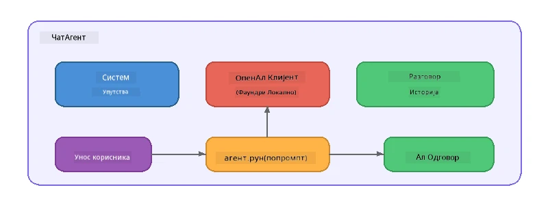

# Deo 5: Izgradnja AI agenata uz Agent Framework

> **Cilj:** Izgradite svog prvog AI agenta sa trajnim instrukcijama i definisanom personom, pokretanog lokalnim modelom putem Foundry Local.

## Šta je AI agent?

AI agent obavija jezički model sa **sistemskim instrukcijama** koje definišu njegovo ponašanje, ličnost i ograničenja. Za razliku od pojedinačnog poziva chat završetka, agent pruža:

- **Persona** - dosledni identitet („Ti si koristan recenzent koda“)
- **Memorija** - istorija konverzacije kroz okrete
- **Specijalizacija** - fokusirano ponašanje vođeno dobro oblikovanim instrukcijama



---

## Microsoft Agent Framework

**Microsoft Agent Framework** (AGF) pruža standardnu apstrakciju agenta koja radi sa različitim model backendima. U ovom radionici ga sparujemo sa Foundry Local tako da sve radi na vašem računaru - bez potrebe za cloud-om.

| Koncept | Opis |
|---------|-------|
| `FoundryLocalClient` | Python: upravlja pokretanjem servisa, preuzimanjem/učitavanjem modela i kreira agente |
| `client.as_agent()` | Python: kreira agenta iz Foundry Local klijenta |
| `AsAIAgent()` | C#: ekstenziona metoda na `ChatClient` - kreira `AIAgent` |
| `instructions` | Sistemski prompt koji oblikuje ponašanje agenta |
| `name` | Ljudski čitljiv label, koristan u scenarijima sa više agenata |
| `agent.run(prompt)` / `RunAsync()` | Šalje korisničku poruku i vraća odgovor agenta |

> **Napomena:** Agent Framework ima Python i .NET SDK. Za JavaScript implementiramo laganu `ChatAgent` klasu koja prati isti obrazac koristeći direktno OpenAI SDK.

---

## Vežbe

### Vežba 1 - Razumevanje Obrasca Agenta

Pre nego što pišete kod, proučite ključne komponente agenta:

1. **Model klijent** - povezuje se sa OpenAI-kompatibilnim API-jem Foundry Local-a
2. **Sistemske instrukcije** - prompt „ličnosti“
3. **Petlja izvršenja** - pošalji korisnički unos, primi izlaz

> **Razmisli o tome:** Kako se sistemske instrukcije razlikuju od obične korisničke poruke? Šta se dešava ako ih promeniš?

---

### Vežba 2 - Pokreni Primer sa Jednim Agentom

<details>
<summary><strong>🐍 Python</strong></summary>

**Zahtevi:**
```bash
cd python
python -m venv venv

# Windows (PowerShell):
venv\Scripts\Activate.ps1
# macOS:
source venv/bin/activate

pip install -r requirements.txt
```

**Pokretanje:**
```bash
python foundry-local-with-agf.py
```

**Pregled koda** (`python/foundry-local-with-agf.py`):

```python
import asyncio
from agent_framework_foundry_local import FoundryLocalClient

async def main():
    alias = "phi-4-mini"

    # FoundryLocalClient управља покретањем сервиса, преузимањем модела и учитавањем
    client = FoundryLocalClient(model_id=alias)
    print(f"Client Model ID: {client.model_id}")

    # Креирај агент са системским упутствима
    agent = client.as_agent(
        name="Joker",
        instructions="You are good at telling jokes.",
    )

    # Без стримовања: добиј комплетан одговор одједном
    result = await agent.run("Tell me a joke about a pirate.")
    print(f"Agent: {result}")

    # Стримовање: добијај резултате док се генеришу
    async for chunk in agent.run("Tell me another joke.", stream=True):
        if chunk.text:
            print(chunk.text, end="", flush=True)

asyncio.run(main())
```

**Ključne tačke:**
- `FoundryLocalClient(model_id=alias)` upravlja pokretanjem servisa, preuzimanjem i učitavanjem modela u jednom koraku
- `client.as_agent()` kreira agenta sa sistemskim instrukcijama i imenom
- `agent.run()` podržava režime bez streaminga i sa streamingom
- Instalirajte preko `pip install agent-framework-foundry-local --pre`

</details>

<details>
<summary><strong>📦 JavaScript</strong></summary>

**Zahtevi:**
```bash
cd javascript
npm install
```

**Pokretanje:**
```bash
node foundry-local-with-agent.mjs
```

**Pregled koda** (`javascript/foundry-local-with-agent.mjs`):

```javascript
import { OpenAI } from "openai";
import { FoundryLocalManager } from "foundry-local-sdk";

class ChatAgent {
  constructor({ client, modelId, instructions, name }) {
    this.client = client;
    this.modelId = modelId;
    this.instructions = instructions;
    this.name = name;
    this.history = [];
  }

  async run(userMessage) {
    const messages = [
      { role: "system", content: this.instructions },
      ...this.history,
      { role: "user", content: userMessage },
    ];
    const response = await this.client.chat.completions.create({
      model: this.modelId,
      messages,
    });
    const assistantMessage = response.choices[0].message.content;

    // Чувај историју разговора за интеракције са више корака
    this.history.push({ role: "user", content: userMessage });
    this.history.push({ role: "assistant", content: assistantMessage });
    return { text: assistantMessage };
  }
}

async function main() {
  FoundryLocalManager.create({ appName: "FoundryLocalWorkshop" });
  const manager = FoundryLocalManager.instance;
  await manager.startWebService();

  const catalog = manager.catalog;
  const model = await catalog.getModel("phi-3.5-mini");
  if (!model.isCached) {
    console.log("Downloading model: phi-3.5-mini...");
    await model.download();
  }
  await model.load();

  const client = new OpenAI({
    baseURL: manager.urls[0] + "/v1",
    apiKey: "foundry-local",
  });

  const agent = new ChatAgent({
    client,
    modelId: model.id,
    instructions: "You are good at telling jokes.",
    name: "Joker",
  });

  const result = await agent.run("Tell me a joke about a pirate.");
  console.log(result.text);
}

main();
```

**Ključne tačke:**
- JavaScript gradi sopstvenu `ChatAgent` klasu koja prati Python AGF obrazac
- `this.history` čuva tokove konverzacije radi podrške višekratnim okretima
- Eksplicitno `startWebService()` → provera keša → `model.download()` → `model.load()` pruža potpun uvid

</details>

<details>
<summary><strong>💜 C#</strong></summary>

**Zahtevi:**
```bash
cd csharp
dotnet restore
```

**Pokretanje:**
```bash
dotnet run agent
```

**Pregled koda** (`csharp/SingleAgent.cs`):

```csharp
using Microsoft.AI.Foundry.Local;
using Microsoft.Extensions.Logging.Abstractions;
using Microsoft.Agents.AI;
using OpenAI;
using System.ClientModel;

// 1. Start Foundry Local and load a model
var alias = "phi-3.5-mini";
await FoundryLocalManager.CreateAsync(
    new Configuration
    {
        AppName = "FoundryLocalSamples",
        Web = new Configuration.WebService { Urls = "http://127.0.0.1:0" }
    }, NullLogger.Instance, default);
var manager = FoundryLocalManager.Instance;
await manager.StartWebServiceAsync(default);

var catalog = await manager.GetCatalogAsync(default);
var model = await catalog.GetModelAsync(alias, default);

var isCached = await model.IsCachedAsync(default);
if (!isCached)
{
    Console.WriteLine($"Downloading model: {alias}...");
    await model.DownloadAsync(null, default);
}
await model.LoadAsync(default);

var key = new ApiKeyCredential("foundry-local");
var client = new OpenAIClient(key, new OpenAIClientOptions
{
    Endpoint = new Uri(manager.Urls[0] + "/v1")
});

// 2. Create an AIAgent using the Agent Framework extension method
AIAgent joker = client
    .GetChatClient(model.Id)
    .AsAIAgent(
        instructions: "You are good at telling jokes. Keep your jokes short and family-friendly.",
        name: "Joker"
    );

// 3. Run the agent (non-streaming)
var response = await joker.RunAsync("Tell me a joke about a pirate.");
Console.WriteLine($"Joker: {response}");

// 4. Run with streaming
await foreach (var update in joker.RunStreamingAsync("Tell me another joke."))
{
    Console.Write(update);
}
```

**Ključne tačke:**
- `AsAIAgent()` je ekstenziona metoda iz `Microsoft.Agents.AI.OpenAI` - nije potrebna prilagođena `ChatAgent` klasa
- `RunAsync()` vraća ceo odgovor; `RunStreamingAsync()` šalje tokene jedan po jedan
- Instalirajte preko `dotnet add package Microsoft.Agents.AI.OpenAI --version 1.0.0-rc3`

</details>

---

### Vežba 3 - Promeni Personu

Izmeni `instructions` agenta da kreiraš drugačiju personu. Probaj svaku i posmatraj kako se izlaz menja:

| Persona | Instrukcije |
|---------|-------------|
| Recenzent koda | `"Ti si ekspert za recenziju koda. Daj konstruktivne povratne informacije fokusirane na čitljivost, performanse i tačnost."` |
| Turistički vodič | `"Ti si prijateljski turistički vodič. Daj personalizovane preporuke za destinacije, aktivnosti i lokalnu kuhinju."` |
| Sokratski tutor | `"Ti si Sokratski tutor. Nikada ne daješ direktne odgovore - umesto toga, vodiš studenta promišljenim pitanjima."` |
| Tehnički pisac | `"Ti si tehnički pisac. Objasni koncepte jasno i sažeto. Koristi primere. Izbegavaj žargon."` |

**Isprobajte:**
1. Izaberi personu iz tabele iznad
2. Zameni `instructions` string u kodu
3. Prilagodi korisnički prompt da se poklapa (npr. traži recenzenta da pregleda funkciju)
4. Ponovo pokreni primer i uporedi izlaz

> **Savet:** Kvalitet agenta u velikoj meri zavisi od instrukcija. Specifične, dobro strukturirane instrukcije daju bolje rezultate od nejasnih.

---

### Vežba 4 - Dodaj Višekratnu Konverzaciju

Proširi primer da podrži višekratnu petlju ćaskanja kako bi mogao da vodiš dijalog sa agentom.

<details>
<summary><strong>🐍 Python - višekratna petlja</strong></summary>

```python
import asyncio
from agent_framework_foundry_local import FoundryLocalClient

async def main():
    client = FoundryLocalClient(model_id="phi-4-mini")

    agent = client.as_agent(
        name="Assistant",
        instructions="You are a helpful assistant.",
    )

    print("Chat with the agent (type 'quit' to exit):\n")
    while True:
        user_input = input("You: ")
        if user_input.strip().lower() in ("quit", "exit"):
            break
        result = await agent.run(user_input)
        print(f"Agent: {result}\n")

asyncio.run(main())
```

</details>

<details>
<summary><strong>📦 JavaScript - višekratna petlja</strong></summary>

```javascript
import { OpenAI } from "openai";
import { FoundryLocalManager } from "foundry-local-sdk";
import * as readline from "node:readline/promises";

// (искористити класу ChatAgent из Вежбе 2)

async function main() {
  FoundryLocalManager.create({ appName: "FoundryLocalWorkshop" });
  const manager = FoundryLocalManager.instance;
  await manager.startWebService();

  const catalog = manager.catalog;
  const model = await catalog.getModel("phi-3.5-mini");
  if (!model.isCached) {
    console.log("Downloading model: phi-3.5-mini...");
    await model.download();
  }
  await model.load();

  const client = new OpenAI({
    baseURL: manager.urls[0] + "/v1",
    apiKey: "foundry-local",
  });

  const agent = new ChatAgent({
    client,
    modelId: model.id,
    instructions: "You are a helpful assistant.",
    name: "Assistant",
  });

  const rl = readline.createInterface({
    input: process.stdin,
    output: process.stdout,
  });

  console.log("Chat with the agent (type 'quit' to exit):\n");
  while (true) {
    const userInput = await rl.question("You: ");
    if (["quit", "exit"].includes(userInput.trim().toLowerCase())) break;
    const result = await agent.run(userInput);
    console.log(`Agent: ${result.text}\n`);
  }
  rl.close();
}

main();
```

</details>

<details>
<summary><strong>💜 C# - višekratna petlja</strong></summary>

```csharp
using Microsoft.AI.Foundry.Local;
using Microsoft.Extensions.Logging.Abstractions;
using Microsoft.Agents.AI;
using OpenAI;
using System.ClientModel;

var alias = "phi-3.5-mini";
var config = new Configuration
{
    AppName = "FoundryLocalSamples",
    Web = new Configuration.WebService { Urls = "http://127.0.0.1:0" }
};
await FoundryLocalManager.CreateAsync(config, NullLogger.Instance, default);
var manager = FoundryLocalManager.Instance;
await manager.StartWebServiceAsync(default);

var catalog = await manager.GetCatalogAsync(default);
var model = await catalog.GetModelAsync(alias, default);

var isCached = await model.IsCachedAsync(default);
if (!isCached)
{
    Console.WriteLine($"Downloading model: {alias}...");
    await model.DownloadAsync(null, default);
}
await model.LoadAsync(default);

var key = new ApiKeyCredential("foundry-local");
var client = new OpenAIClient(key, new OpenAIClientOptions
{
    Endpoint = new Uri(manager.Urls[0] + "/v1")
});

AIAgent agent = client
    .GetChatClient(model.Id)
    .AsAIAgent(
        instructions: "You are a helpful assistant.",
        name: "Assistant"
    );

Console.WriteLine("Chat with the agent (type 'quit' to exit):\n");
while (true)
{
    Console.Write("You: ");
    var userInput = Console.ReadLine();
    if (string.IsNullOrWhiteSpace(userInput) ||
        userInput.Equals("quit", StringComparison.OrdinalIgnoreCase) ||
        userInput.Equals("exit", StringComparison.OrdinalIgnoreCase))
        break;

    var result = await agent.RunAsync(userInput);
    Console.WriteLine($"Agent: {result}\n");
}
```

</details>

Zapazi kako agent pamti prethodne okrete – postavi follow-up pitanje i posmatraj kako se kontekst prenosi.

---

### Vežba 5 - Strukturirani Izlaz

Naloži agentu da uvek odgovara u specifičnom formatu (npr. JSON) i parsiraj rezultat:

<details>
<summary><strong>🐍 Python - JSON izlaz</strong></summary>

```python
import asyncio
import json
from agent_framework_foundry_local import FoundryLocalClient

async def main():
    client = FoundryLocalClient(model_id="phi-4-mini")

    agent = client.as_agent(
        name="SentimentAnalyzer",
        instructions=(
            "You are a sentiment analysis agent. "
            "For every user message, respond ONLY with valid JSON in this format: "
            '{"sentiment": "positive|negative|neutral", "confidence": 0.0-1.0, "summary": "brief reason"}'
        ),
    )

    result = await agent.run("I absolutely loved the new restaurant downtown!")
    print("Raw:", result)

    try:
        parsed = json.loads(str(result))
        print(f"Sentiment: {parsed['sentiment']} (confidence: {parsed['confidence']})")
    except json.JSONDecodeError:
        print("Agent did not return valid JSON - try refining the instructions.")

asyncio.run(main())
```

</details>

<details>
<summary><strong>💜 C# - JSON izlaz</strong></summary>

```csharp
using System.Text.Json;

AIAgent analyzer = chatClient.AsAIAgent(
    name: "SentimentAnalyzer",
    instructions:
        "You are a sentiment analysis agent. " +
        "For every user message, respond ONLY with valid JSON in this format: " +
        "{\"sentiment\": \"positive|negative|neutral\", \"confidence\": 0.0-1.0, \"summary\": \"brief reason\"}"
);

var response = await analyzer.RunAsync("I absolutely loved the new restaurant downtown!");
Console.WriteLine($"Raw: {response}");

try
{
    var parsed = JsonSerializer.Deserialize<JsonElement>(response.ToString());
    Console.WriteLine($"Sentiment: {parsed.GetProperty("sentiment")} " +
                      $"(confidence: {parsed.GetProperty("confidence")})");
}
catch (JsonException)
{
    Console.WriteLine("Agent did not return valid JSON - try refining the instructions.");
}
```

</details>

> **Napomena:** Mali lokalni modeli možda neće uvek proizvesti perfektan JSON. Možete poboljšati pouzdanost tako što ćete uključiti primer u instrukcije i biti vrlo eksplicitni u vezi traženog formata.

---

## Ključni Zaključci

| Koncept | Šta ste naučili |
|---------|-----------------|
| Agent vs. čisti LLM poziv | Agent obavija model instrukcijama i memorijom |
| Sistemske instrukcije | Najvažniji mehanizam za kontrolu ponašanja agenta |
| Višekratna konverzacija | Agenti mogu nositi kontekst kroz više korisničkih interakcija |
| Strukturirani izlaz | Instrukcije mogu nametnuti format izlaza (JSON, markdown, itd.) |
| Lokalno izvršavanje | Sve se izvršava na uređaju putem Foundry Local - bez clouda |

---

## Sledeći koraci

U **[Delu 6: Više-agentni radni tokovi](part6-multi-agent-workflows.md)**, kombinuješ više agenata u koordinisanu pipeline gde svaki agent ima specijalizovanu ulogu.