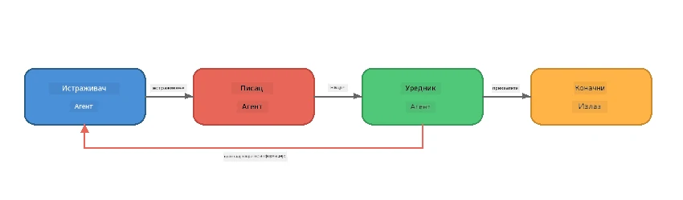
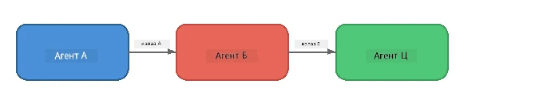
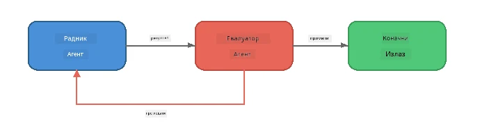
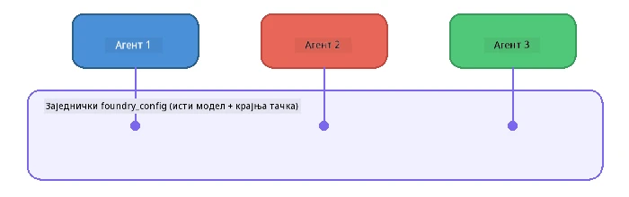

# Deo 6: Višeagentski tokovi rada

> **Cilj:** Kombinovanje više specijalizovanih agenata u koordinisane tokove koji dele složene zadatke među saradničkim agentima - svi rade lokalno sa Foundry Local.

## Zašto više agenata?

Jedan agent može obaviti mnogo zadataka, ali složeni tokovi rada imaju koristi od **Specijalizacije**. Umesto da jedan agent pokušava istovremeno da istražuje, piše i uređuje, rad se deli u fokusirane uloge:



| Šablon | Opis |
|---------|-------------|
| **Sekvencijalni** | Izlaz Agenta A se prosleđuje Agentu B → Agentu C |
| **Povratna sprega** | Evaluator agent može poslati rad nazad na reviziju |
| **Zajednički kontekst** | Svi agenti koriste isti model/krajnju tačku, ali različita uputstva |
| **Tipizirani izlaz** | Agenti proizvode strukturirane rezultate (JSON) za pouzdane predaje |

---

## Vežbe

### Vežba 1 - Pokrenite višestruki agentski tok

Radionica uključuje kompletan tok Istraživač → Pisac → Urednik.

<details>
<summary><strong>🐍 Python</strong></summary>

**Podešavanje:**
```bash
cd python
python -m venv venv

# Windows (PowerShell):
venv\Scripts\Activate.ps1
# macOS:
source venv/bin/activate

pip install -r requirements.txt
```

**Pokretanje:**
```bash
python foundry-local-multi-agent.py
```

**Šta se dešava:**
1. **Istraživač** prima temu i vraća činjenice u nabrajanju
2. **Pisac** uzima istraživanje i sastavlja blog post (3-4 pasusa)
3. **Urednik** pregleda članak za kvalitet i vraća PRIHVATI ili REVIDIRAJ

</details>

<details>
<summary><strong>📦 JavaScript</strong></summary>

**Podešavanje:**
```bash
cd javascript
npm install
```

**Pokretanje:**
```bash
node foundry-local-multi-agent.mjs
```

**Isti trostepeni tok** - Istraživač → Pisac → Urednik.

</details>

<details>
<summary><strong>💜 C#</strong></summary>

**Podešavanje:**
```bash
cd csharp
dotnet restore
```

**Pokretanje:**
```bash
dotnet run multi
```

**Isti trostepeni tok** - Istraživač → Pisac → Urednik.

</details>

---

### Vežba 2 - Anatomija toka

Proučite kako su agenti definisani i povezani:

**1. Zajednički klijent modela**

Svi agenti koriste isti Foundry Local model:

```python
# Python - FoundryLocalClient обрађује све
from agent_framework_foundry_local import FoundryLocalClient

client = FoundryLocalClient(model_id="phi-3.5-mini")
```

```javascript
// JavaScript - OpenAI SDK усмерен на Foundry Local
const client = new OpenAI({
  baseURL: manager.urls[0] + "/v1",
  apiKey: "foundry-local",
});
```

```csharp
// C# - OpenAIClient pointed at Foundry Local
var key = new ApiKeyCredential("foundry-local");
var client = new OpenAIClient(key, new OpenAIClientOptions
{
    Endpoint = new Uri(manager.Urls[0] + "/v1")
});
var chatClient = client.GetChatClient(model.Id);
```

**2. specijalizovana uputstva**

Svaki agent ima jedinstvenu ličnost:

| Agent | Uputstva (sažetak) |
|-------|----------------------|
| Istraživač | "Dajte ključne činjenice, statistike i pozadinu. Organizujte ih kao nabrajanje." |
| Pisac | "Napiši zanimljiv blog post (3-4 pasusa) na osnovu istraživačkih beleški. Ne izmišljaj činjenice." |
| Urednik | "Pregledaj za jasnoću, gramatiku i faktualnu doslednost. Presuda: PRIHVATI ili REVIDIRAJ." |

**3. Tok podataka između agenata**

```python
# Корак 1 - излаз од истраживача постаје улаз за писца
research_result = await researcher.run(f"Research: {topic}")

# Корак 2 - излаз од писца постаје улаз за уредника
writer_result = await writer.run(f"Write using:\n{research_result}")

# Корак 3 - уредник прегледа и истраживање и чланак
editor_result = await editor.run(
    f"Research:\n{research_result}\n\nArticle:\n{writer_result}"
)
```

```csharp
// C# - same pattern, async calls with AIAgent
var researchNotes = await researcher.RunAsync(
    $"Research the following topic and provide key facts:\n{topic}");

var draft = await writer.RunAsync(
    $"Write a blog post based on these research notes:\n\n{researchNotes}");

var verdict = await editor.RunAsync(
    $"Review this article for quality and accuracy.\n\n" +
    $"Research notes:\n{researchNotes}\n\n" +
    $"Article:\n{draft}");
```

> **Ključni uvid:** Svaki agent prima kumulativni kontekst od prethodnih agenata. Urednik vidi i originalno istraživanje i nacrt - što mu omogućava proveru faktualne doslednosti.

---

### Vežba 3 - Dodajte četvrtog agenta

Proširite tok dodavanjem novog agenta. Izaberite jednog:

| Agent | Svrha | Uputstva |
|-------|---------|-------------|
| **Proveravalac činjenica** | Proverava tvrdnje u članku | `"Proveravaš činjenice. Za svaku tvrdnju navedi da li je podržana istraživačkim beleškama. Vrati JSON sa potvrđenim/nepotvrđenim stavkama."` |
| **Pisac naslova** | Kreira zanimljive naslove | `"Generiši 5 opcija naslova za članak. Variraj stil: informativni, klikbejt, pitanje, lista, emotivni."` |
| **Društvene mreže** | Kreira promotivne objave | `"Napravi 3 objave za društvene mreže koje promovišu ovaj članak: jednu za Twitter (280 znakova), jednu za LinkedIn (profesionalan ton), jednu za Instagram (opušteno sa predlozima emotikona)."` |

<details>
<summary><strong>🐍 Python - dodavanje Pisca naslova</strong></summary>

```python
headline_agent = client.as_agent(
    name="HeadlineWriter",
    instructions=(
        "You are a headline specialist. Given an article, generate exactly "
        "5 headline options. Vary the style: informative, question-based, "
        "listicle, emotional, and provocative. Return them as a numbered list."
    ),
)

# Након што уређивач прихвати, генериши наслове
headline_result = await headline_agent.run(
    f"Generate headlines for this article:\n\n{writer_result}"
)
print(f"\n--- Headlines ---\n{headline_result}")
```

</details>

<details>
<summary><strong>📦 JavaScript - dodavanje Pisca naslova</strong></summary>

```javascript
const headlineAgent = new ChatAgent({
  client,
  modelId: modelInfo.id,
  instructions:
    "You are a headline specialist. Given an article, generate exactly " +
    "5 headline options. Vary the style: informative, question-based, " +
    "listicle, emotional, and provocative. Return them as a numbered list.",
  name: "HeadlineWriter",
});

const headlineResult = await headlineAgent.run(
  `Generate headlines for this article:\n\n${writerResult.text}`
);
console.log(`\n--- Headlines ---\n${headlineResult.text}`);
```

</details>

<details>
<summary><strong>💜 C# - dodavanje Pisca naslova</strong></summary>

```csharp
AIAgent headlineAgent = chatClient.AsAIAgent(
    name: "HeadlineWriter",
    instructions:
        "You are a headline specialist. Given an article, generate exactly " +
        "5 headline options. Vary the style: informative, question-based, " +
        "listicle, emotional, and provocative. Return them as a numbered list."
);

// After the editor accepts, generate headlines
var headlines = await headlineAgent.RunAsync(
    $"Generate headlines for this article:\n\n{draft}");
Console.WriteLine($"\n--- Headlines ---\n{headlines}");
```

</details>

---

### Vežba 4 - Dizajnirajte svoj tok rada

Dizajnirajte višestruki agentski tok za drugu oblast. Evo nekih ideja:

| Oblast | Agenti | Tok |
|--------|--------|------|
| **Revizija koda** | Analitičar → Recenzent → Sumator | Analiza strukture koda → pregled radi problema → izrada sažetka |
| **Korisnička podrška** | Klasifikator → Odgovarač → Kontrola kvaliteta | Klasifikuj tiket → nacrta odgovora → proveri kvalitet |
| **Obrazovanje** | Kreator kviza → Simulator učenika → Ocjenjivač | Generiši kviz → simuliraj odgovore → oceni i obrazloži |
| **Analiza podataka** | Tumač → Analitičar → Izveštač | Tumači zahtev za podatke → analiziraj obrasce → napiši izveštaj |

**Koraci:**
1. Definišite 3+ agenata sa različitim `uputstvima`
2. Odredite tok podataka - šta svaki agent prima i proizvodi?
3. Implementirajte tok koristeći obrasce iz Vežbi 1-3
4. Dodajte povratnu spregu ako neki agent treba da proceni rad drugog

---

## Obrasci orkestracije

Evo obrazaca orkestracije koji važe za svaki višeagentski sistem (detaljno obrađeno u [Deo 7](part7-zava-creative-writer.md)):

### Sekvencijalni tok



Svaki agent obrađuje izlaz prethodnog. Jednostavno i predvidljivo.

### Povratna sprega



Evaluator agent može pokrenuti ponovnu obradu ranijih faza. Zava Pisac koristi ovo: urednik može poslati povratnu informaciju nazad istraživaču i piscu.

### Zajednički kontekst



Svi agenti dele isti `foundry_config` pa koriste isti model i krajnju tačku.

---

## Ključni zaključci

| Koncept | Šta ste naučili |
|---------|-----------------|
| Specijalizacija agenata | Svaki agent radi jednu stvar dobro sa fokusiranim uputstvima |
| Predaja podataka | Izlaz jednog agenta postaje ulaz za sledećeg |
| Povratne sprege | Evaluator može pokrenuti ponavljanje radi bolje kvalitete |
| Strukturirani izlaz | JSON formatirani odgovori omogućavaju pouzdanu komunikaciju među agentima |
| Orkestracija | Koordinator upravlja sekvencom toka i obradom grešaka |
| Obrasci za produkciju | Primena u [Delu 7: Zava Creative Writer](part7-zava-creative-writer.md) |

---

## Sledeći koraci

Nastavite na [Deo 7: Zava Creative Writer - Capstone aplikacija](part7-zava-creative-writer.md) da istražite produkcijski stil višeagentske aplikacije sa 4 specijalizovana agenta, strimovanim izlazom, pretragom proizvoda i povratnim spregama - dostupno za Python, JavaScript i C#.