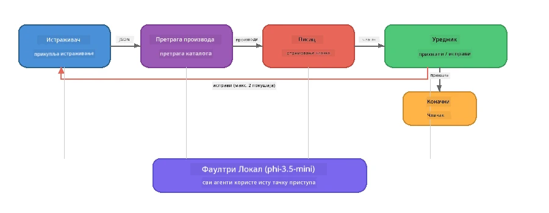

# Deo 7: Zava kreativni pisac - završna aplikacija

> **Cilj:** Istražite produkcijski stil višestruke agentske aplikacije gde četiri specijalizovana agenta sarađuju da proizvedu članke kvaliteta časopisa za Zava Retail DIY - radeći u potpunosti na vašem uređaju sa Foundry Local.

Ovo je **završna laboratorijska vežba** radionice. Objedinjuje sve što ste naučili - SDK integraciju (Deo 3), preuzimanje sa lokalnih podataka (Deo 4), ličnosti agenata (Deo 5) i orkestraciju višestrukih agenata (Deo 6) - u kompletnu aplikaciju dostupnu u **Python-u**, **JavaScript-u** i **C#-u**.

---

## Šta ćete istražiti

| Koncept | Gde u Zava Writer-u |
|---------|---------------------|
| 4-koračno učitavanje modela | Zajednički konfiguracioni modul pokreće Foundry Local |
| Preuzimanje u RAG stilu | Agent za proizvod pretražuje lokalni katalog |
| Specijalizacija agenata | 4 agenta sa različitim sistemskim uputstvima |
| Streaming izlaz | Pisac isporučuje tokene u realnom vremenu |
| Struktuirane predaje | Istraživač → JSON, Urednik → JSON odluka |
| Povratne petlje | Urednik može pokrenuti ponovni pokušaj (maks 2 pokušaja) |

---

## Arhitektura

Zava kreativni pisac koristi **sekvencijalnu liniju sa povratnom spregom pokrenutom od strane evalutora**. Sve tri jezičke implementacije slede istu arhitekturu:



### Četiri agenta

| Agent | Ulaz | Izlaz | Svrha |
|-------|------|-------|-------|
| **Istraživač** | Tema + opcioni feedback | `{"web": [{url, name, description}, ...]}` | Prikuplja osnovna istraživanja putem LLM |
| **Pretraga proizvoda** | Kontekst proizvoda kao string | Lista odgovarajućih proizvoda | Upiti generisani LLM + pretraga ključnih reči u lokalnom katalogu |
| **Pisac** | Istraživanje + proizvodi + zadatak + feedback | Strimovani tekst članka (deljeno na `---`) | Izrađuje nacrt članka kvaliteta časopisa u realnom vremenu |
| **Urednik** | Članak + pisčev samo-feedback | `{"decision": "accept/revise", "editorFeedback": "...", "researchFeedback": "..."}` | Pregled kvaliteta, pokreće ponovni pokušaj po potrebi |

### Tok linije

1. **Istraživač** prima temu i proizvodi strukturisane beleške istraživanja (JSON)
2. **Pretraga proizvoda** pretražuje lokalni katalog proizvoda koristeći LLM generisane termine pretrage
3. **Pisac** kombinuje istraživanje + proizvode + zadatak u tok članka, dodajući samo-feedback nakon separacije `---`
4. **Urednik** pregledava članak i vraća JSON presudu:
   - `"accept"` → linija se završava
   - `"revise"` → feedback se šalje nazad Istraživaču i Piscu (maks 2 pokušaja)

---

## Preduslovi

- Završiti [Deo 6: Višestruki agentski tokovi rada](part6-multi-agent-workflows.md)
- Instaliran Foundry Local CLI i preuzet model `phi-3.5-mini`

---

## Vežbe

### Vežba 1 - Pokrenite Zava kreativni pisac

Izaberite svoj jezik i pokrenite aplikaciju:

<details>
<summary><strong>🐍 Python - FastAPI web servis</strong></summary>

Python verzija radi kao **web servis** sa REST API-jem, demonstrirajući kako se pravi produkcijski backend.

**Podešavanje:**
```bash
cd zava-creative-writer-local/src/api
python -m venv venv

# Виндоус (ПоверШел):
venv\Scripts\Activate.ps1
# макОС:
source venv/bin/activate

pip install -r requirements.txt
```

**Pokretanje:**
```bash
uvicorn main:app --reload
```

**Testiranje:**
```bash
curl -X POST http://localhost:8000/api/article \
  -H "Content-Type: application/json" \
  -d '{
    "research": "DIY home improvement trends",
    "products": "power tools and paints",
    "assignment": "Write an article about weekend renovation projects for DIY enthusiasts"
  }'
```

Odgovor se vraća u vidu strimovanih JSON poruka razdvojenih novim redom koje prikazuju napredak svakog agenta.

</details>

<details>
<summary><strong>📦 JavaScript - Node.js CLI</strong></summary>

JavaScript verzija radi kao **CLI aplikacija**, prikazujući napredak agenata i članak direktno u konzoli.

**Podešavanje:**
```bash
cd zava-creative-writer-local/src/javascript
npm install
```

**Pokretanje:**
```bash
node main.mjs
```

Videćete:
1. Učitavanje Foundry Local modela (sa progres trakom ako se preuzima)
2. Izvršavanje svakog agenta redom sa status porukama
3. Članak se strimuje na konzolu u realnom vremenu
4. Odluka urednika prihvatanja/revizije

</details>

<details>
<summary><strong>💜 C# - .NET konzolna aplikacija</strong></summary>

C# verzija radi kao **.NET konzolna aplikacija** sa istim pipelinom i streaming izlazom.

**Podešavanje:**
```bash
cd zava-creative-writer-local/src/csharp
dotnet restore
```

**Pokretanje:**
```bash
dotnet run
```

Isti obrazac izlaza kao i JavaScript verzija - status poruke agentata, strimovani članak i presuda urednika.

</details>

---

### Vežba 2 - Proučite strukturu koda

Svaka jezička implementacija sadrži iste logičke komponente. Uporedite strukture:

**Python** (`src/api/`):
| Fajl | Svrha |
|-------|-------|
| `foundry_config.py` | Zajednički Foundry Local menadžer, model i klijent (4-koračno inicijalizovanje) |
| `orchestrator.py` | Koordinacija pipeline-a sa povratnom spregom |
| `main.py` | FastAPI krajnje tačke (`POST /api/article`) |
| `agents/researcher/researcher.py` | Istraživanje zasnovano na LLM sa JSON izlazom |
| `agents/product/product.py` | LLM generisani upiti + pretraga ključnih reči |
| `agents/writer/writer.py` | Generisanje članka u realnom vremenu |
| `agents/editor/editor.py` | Odluka o prihvatanju/reviziji u JSON formatu |

**JavaScript** (`src/javascript/`):
| Fajl | Svrha |
|-------|-------|
| `foundryConfig.mjs` | Zajednička Foundry Local konfiguracija (4-koračno inicijalizovanje sa progres trakom) |
| `main.mjs` | Orkestrator + ulazna tačka CLI-a |
| `researcher.mjs` | Agent istraživanja zasnovan na LLM-u |
| `product.mjs` | Generisanje upita LLM + pretraga ključnih reči |
| `writer.mjs` | Generisanje članka u realnom vremenu (async generator) |
| `editor.mjs` | Prihvatanje/revizija u JSON formatu |
| `products.mjs` | Podaci iz kataloga proizvoda |

**C#** (`src/csharp/`):
| Fajl | Svrha |
|-------|-------|
| `Program.cs` | Kompletn pipeline: učitavanje modela, agenti, orkestrator, povratna sprega |
| `ZavaCreativeWriter.csproj` | .NET 9 projekat sa Foundry Local i OpenAI paketima |

> **Dizajnerska napomena:** Python odvaja svakog agenta u sopstveni fajl/direktorijum (dobro za veće timove). JavaScript koristi jedan modul po agentu (dobro za srednje projekte). C# drži sve u jednom fajlu sa lokalnim funkcijama (dobro za samostalne primere). U produkciji izaberite šablon koji odgovara konvencijama vašeg tima.

---

### Vežba 3 - Pratite deljenu konfiguraciju

Svaki agent u pipeline-u deli isti Foundry Local model klijent. Proučite kako je to postavljeno u svakom jeziku:

<details>
<summary><strong>🐍 Python - foundry_config.py</strong></summary>

```python
from foundry_local import FoundryLocalManager

MODEL_ALIAS = "phi-3.5-mini"

# Корак 1: Креирајте менаџера и покрените Foundry Local услугу
manager = FoundryLocalManager()
manager.start_service()

# Корак 2: Проверите да ли је модел већ преузет
cached = manager.list_cached_models()
catalog_info = manager.get_model_info(MODEL_ALIAS)
is_cached = any(m.id == catalog_info.id for m in cached) if catalog_info else False

if not is_cached:
    manager.download_model(MODEL_ALIAS)

# Корак 3: Учитајте модел у меморију
manager.load_model(MODEL_ALIAS)
model_id = manager.get_model_info(MODEL_ALIAS).id

# Заједнички OpenAI клијент
client = openai.OpenAI(base_url=manager.endpoint, api_key=manager.api_key)
```

Svi agenti importuju `from foundry_config import client, model_id`.

</details>

<details>
<summary><strong>📦 JavaScript - foundryConfig.mjs</strong></summary>

```javascript
import { FoundryLocalManager } from "foundry-local-sdk";
import { OpenAI } from "openai";

FoundryLocalManager.create({ appName: "ZavaCreativeWriter" });
const manager = FoundryLocalManager.instance;
await manager.startWebService();

// Проверите кеш → преузмите → учитајте (нова шема SDK-а)
const catalog = manager.catalog;
const model = await catalog.getModel(MODEL_ALIAS);
if (!model.isCached) {
  console.log(`Downloading model: ${MODEL_ALIAS}...`);
  await model.download();
}
await model.load();

const client = new OpenAI({ baseURL: manager.urls[0] + "/v1", apiKey: "foundry-local" });
const modelId = model.id;
export { client, modelId };
```

Svi agenti importuju `{ client, modelId } from "./foundryConfig.mjs"`.

</details>

<details>
<summary><strong>💜 C# - vrh fajla Program.cs</strong></summary>

```csharp
await FoundryLocalManager.CreateAsync(
    new Configuration
    {
        AppName = "ZavaCreativeWriter",
        Web = new Configuration.WebService { Urls = "http://127.0.0.1:0" }
    }, NullLogger.Instance, default);
var manager = FoundryLocalManager.Instance;
await manager.StartWebServiceAsync(default);

var catalog = await manager.GetCatalogAsync(default);
var catalogModel = await catalog.GetModelAsync(alias, default);
var isCached = await catalogModel.IsCachedAsync(default);
if (!isCached)
    await catalogModel.DownloadAsync(null, default);

await catalogModel.LoadAsync(default);
var key = new ApiKeyCredential("foundry-local");
var chatClient = new OpenAIClient(key, new OpenAIClientOptions
{
    Endpoint = new Uri(manager.Urls[0] + "/v1")
}).GetChatClient(catalogModel.Id);
```

`chatClient` se zatim prosleđuje svim agent funkcijama u istom fajlu.

</details>

> **Ključni obrazac:** Šablon učitavanja modela (pokretanje servisa → provera keša → preuzimanje → učitavanje) obezbeđuje korisniku vidljiv napredak i da se model preuzme samo jednom. Ovo je dobra praksa za bilo koju Foundry Local aplikaciju.

---

### Vežba 4 - Razumite povratnu petlju

Povratna petlja je ono što čini ovaj pipeline "pametnim" - Urednik može poslati rad nazad na reviziju. Pratite logiku:

```
Orchestrator:
  1. researcher.research(topic, "No Feedback")    ← first pass
  2. product.findProducts(productContext)
  3. writer.write(research, products, assignment)  ← streams article
  4. Split article at "---" → article + writerFeedback
  5. editor.edit(article, writerFeedback)

  WHILE editor says "revise" AND retryCount < 2:
    6. researcher.research(topic, editor.researchFeedback)  ← refined
    7. writer.write(research, products, editor.editorFeedback)
    8. editor.edit(newArticle, newWriterFeedback)
    9. retryCount++
```

**Pitanja za razmišljanje:**
- Zašto je limit pokušaja postavljen na 2? Šta se dešava ako ga povećate?
- Zašto istraživač dobija `researchFeedback`, a pisac `editorFeedback`?
- Šta bi se desilo ako bi urednik uvek rekao „revizija“?

---

### Vežba 5 - Izmenite ponašanje jednog agenta

Probajte da promenite ponašanje jednog agenta i posmatrajte kako to utiče na pipeline:

| Izmena | Šta treba promeniti |
|--------|---------------------|
| **Stroži urednik** | Izmenite sistemsko uputstvo urednika da uvek zahteva bar jednu reviziju |
| **Duži članci** | Promenite pisčevu instrukciju sa „800-1000 reči“ na „1500-2000 reči“ |
| **Drugačiji proizvodi** | Dodajte ili izmenite proizvode u katalogu proizvoda |
| **Nova tema istraživanja** | Promenite podrazumevani `researchContext` na drugu temu |
| **Istraživač samo JSON** | Neka istraživač vrati 10 stavki umesto 3-5 |

> **Savet:** Pošto sve tri jezicke implementacije slede istu arhitekturu, možete napraviti istu izmenu u jeziku u kojem vam je najudobnije.

---

### Vežba 6 - Dodajte petog agenta

Proširite pipeline novim agentom. Neki predlozi:

| Agent | Gde u pipeline-u | Svrha |
|-------|------------------|--------|
| **Proveravalac činjenica** | Posle Pisca, pre Urednika | Proverava tvrdnje prema istraživačkim podacima |
| **SEO optimizator** | Posle prihvatanja od strane Urednika | Dodaje meta opis, ključne reči, slug |
| **Ilustrator** | Posle prihvatanja od strane Urednika | Generiše slike na osnovu tekstualnih zahteva za članak |
| **Prevodilac** | Posle prihvatanja od strane Urednika | Prevodi članak na drugi jezik |

**Koraci:**
1. Napišite sistemsko uputstvo agenta
2. Kreirajte funkciju agenta (u skladu sa postojećim obrascem u vašem jeziku)
3. Ubacite ga u orkestrator na odgovarajuću poziciju
4. Ažurirajte izlaz/logovanje da pokažete doprinos novog agenta

---

## Kako Foundry Local i Agent Framework rade zajedno

Ova aplikacija demonstrira preporučeni obrazac za izgradnju višestrukih agentskih sistema sa Foundry Local:

| Nivo | Komponenta | Uloga |
|-------|------------|-------|
| **Runtime** | Foundry Local | Preuzima, upravlja i servisira model lokalno |
| **Klijent** | OpenAI SDK | Šalje chat completion zahteve lokalnoj tački pristupa |
| **Agent** | Sistemsko uputstvo + chat poziv | Specijalizovano ponašanje kroz fokusirane instrukcije |
| **Orkestrator** | Koordinator pipeline-a | Upravljanje protokom podataka, redosledom i povratnim petljama |
| **Framework** | Microsoft Agent Framework | Pruža `ChatAgent` apstrakciju i obrasce |

Ključni uvid: **Foundry Local zamenjuje cloud backend, a ne arhitekturu aplikacije.** Isti agentski obrasci, orkestracione strategije i struktuirane predaje koje rade sa cloud modelima rade identično i sa lokalnim modelima — samo klijent usmerite na lokalnu tačku pristupa umesto na Azure krajnju tačku.

---

## Ključni zaključci

| Koncept | Šta ste naučili |
|---------|-----------------|
| Produkcijska arhitektura | Kako strukturirati višestruku agentsku aplikaciju sa deljenom konfiguracijom i odvojenim agentima |
| 4-koračno učitavanje modela | Najbolja praksa za inicijalizaciju Foundry Local sa vidljivim napretkom korisniku |
| Specijalizacija agenata | Svaki od 4 agenta ima fokusirane instrukcije i specifičan format izlaza |
| Streaming generisanje | Pisac isporučuje tokene u realnom vremenu, omogućavajući responzivne UI-e |
| Povratne petlje | Retry koji pokreće urednik poboljšava kvalitet izlaza bez ljudske intervencije |
| Obrasci u više jezika | Ista arhitektura radi u Python-u, JavaScript-u i C#-u |
| Lokalno = produkcijski spremno | Foundry Local servira isti OpenAI kompatibilni API koji se koristi u cloud implementacijama |

---

## Sledeći korak

Nastavite na [Deo 8: Razvoj vođen evaluacijom](part8-evaluation-led-development.md) da izgradite sistematski okvir za evaluaciju vaših agenata, koristeći zlatne skupove podataka, provere bazirane na pravilima i procenu LLM kao sudije.