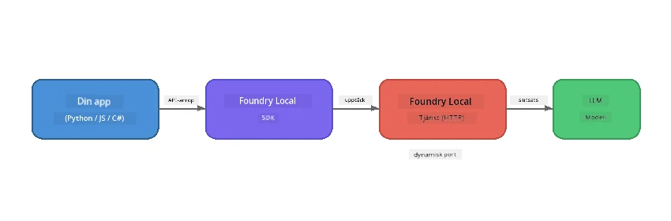

# Del 1: Komma igång med Foundry Local


## Vad är Foundry Local?

[Foundry Local](https://foundrylocal.ai) låter dig köra open-source AI språkmodeller **direkt på din dator** - ingen internetuppkoppling krävs, inga molnkostnader och fullständig datasekretess. Det:

- **Laddar ner och kör modeller lokalt** med automatisk hårdvaruoptimering (GPU, CPU eller NPU)
- **Tillhandahåller ett OpenAI-kompatibelt API** så att du kan använda välbekanta SDK:er och verktyg
- **Kräver ingen Azure-prenumeration** eller registrering - bara installera och börja bygga

Tänk på det som att du har en egen privat AI som körs helt på din maskin.

## Lärandemål

I slutet av denna labb kommer du att kunna:

- Installera Foundry Local CLI på ditt operativsystem
- Förstå vad modaliases och hur de fungerar
- Ladda ner och köra din första lokala AI-modell
- Skicka ett chattmeddelande till en lokal modell från kommandoraden
- Förstå skillnaden mellan lokala och molnhostade AI-modeller

---

## Förutsättningar

### Systemkrav

| Krav | Minimum | Rekommenderat |
|-------------|---------|-------------|
| **RAM** | 8 GB | 16 GB |
| **Diskutrymme** | 5 GB (för modeller) | 10 GB |
| **CPU** | 4 kärnor | 8+ kärnor |
| **GPU** | Valfritt | NVIDIA med CUDA 11.8+ |
| **OS** | Windows 10/11 (x64/ARM), Windows Server 2025, macOS 13+ | - |

> **Notera:** Foundry Local väljer automatiskt den bästa modellvarianten för din hårdvara. Har du en NVIDIA GPU används CUDA-acceleration. Har du en Qualcomm NPU används den. Annars används en optimerad CPU-variant.

### Installera Foundry Local CLI

**Windows** (PowerShell):  
```powershell
winget install Microsoft.FoundryLocal
```
  
**macOS** (Homebrew):  
```bash
brew tap microsoft/foundrylocal
brew install foundrylocal
```
  
> **Notera:** Foundry Local stöder för närvarande endast Windows och macOS. Linux stöds inte just nu.

Verifiera installationen:  
```bash
foundry --version
```
  
---

## Lab-övningar

### Övning 1: Utforska tillgängliga modeller

Foundry Local inkluderar en katalog av föroptimerade open-source modeller. Lista dem:  

```bash
foundry model list
```
  
Du kommer att se modeller som:  
- `phi-3.5-mini` - Microsofts 3.8 miljarder parametersmodell (snabb, bra kvalitet)  
- `phi-4-mini` - Nyare, mer kraftfull Phi-modell  
- `phi-4-mini-reasoning` - Phi-modell med kedjetänkningsresonemang (`<think>`-taggar)  
- `phi-4` - Microsofts största Phi-modell (10,4 GB)  
- `qwen2.5-0.5b` - Mycket liten och snabb (bra för lågresurs-enheter)  
- `qwen2.5-7b` - Stark allmänmodell med stöd för verktyg  
- `qwen2.5-coder-7b` - Optimerad för kodgenerering  
- `deepseek-r1-7b` - Stark resonemangsmodell  
- `gpt-oss-20b` - Stor open-source modell (MIT-licens, 12,5 GB)  
- `whisper-base` - Tal-till-text-transkription (383 MB)  
- `whisper-large-v3-turbo` - Transkription med hög noggrannhet (9 GB)

> **Vad är en modalias?** Alias som `phi-3.5-mini` är genvägar. När du använder ett alias laddar Foundry Local automatiskt ner den bästa varianten för din specifika hårdvara (CUDA för NVIDIA GPU:er, CPU-optimerad annars). Du behöver aldrig oroa dig för att välja rätt variant.

### Övning 2: Kör din första modell

Ladda ner och börja chatta med en modell interaktivt:  

```bash
foundry model run phi-3.5-mini
```
  
Första gången du kör detta kommer Foundry Local att:  
1. Upptäcka din hårdvara  
2. Ladda ner optimal modellvariant (detta kan ta några minuter)  
3. Ladda modellen i minnet  
4. Starta en interaktiv chattsession  

Prova att ställa några frågor:  
```
You: What is the golden ratio?
You: Can you explain it as if I were 10 years old?
You: Write a haiku about mathematics
```
  
Skriv `exit` eller tryck `Ctrl+C` för att avsluta.

### Övning 3: Förladda en modell

Om du vill ladda ner en modell utan att starta en chatt:

```bash
foundry model download phi-3.5-mini
```
  
Kontrollera vilka modeller som redan är nedladdade på din dator:

```bash
foundry cache list
```
  
### Övning 4: Förstå arkitekturen

Foundry Local körs som en **lokal HTTP-tjänst** som exponerar ett OpenAI-kompatibelt REST API. Detta innebär:

1. Tjänsten startar på en **dynamisk port** (en annan port varje gång)  
2. Du använder SDK:t för att hitta den faktiska slutpunktsadressen  
3. Du kan använda **vilket som helst** OpenAI-kompatibelt klientbibliotek för att kommunicera med det



> **Viktigt:** Foundry Local tilldelar en **dynamisk port** varje gång den startas. Hårdkoda aldrig en port som `localhost:5272`. Använd alltid SDK:t för att upptäcka aktuell URL (t.ex. `manager.endpoint` i Python eller `manager.urls[0]` i JavaScript).

---

## Viktiga punkter

| Begrepp | Vad du Lärt Dig |
|---------|------------------|
| AI på enheten | Foundry Local kör modeller helt på din enhet utan moln, API-nycklar och kostnader |
| Modaliases | Alias som `phi-3.5-mini` väljer automatiskt bästa variant för din hårdvara |
| Dynamiska portar | Tjänsten körs på en dynamisk port; använd alltid SDK för att hitta slutpunkten |
| CLI och SDK | Du kan interagera med modeller via CLI (`foundry model run`) eller programmatisk via SDK |

---

## Nästa steg

Fortsätt till [Del 2: Foundry Local SDK Deep Dive](part2-foundry-local-sdk.md) för att bemästra SDK API för att hantera modeller, tjänster och cache programmässigt.

---

<!-- CO-OP TRANSLATOR DISCLAIMER START -->
**Ansvarsfriskrivning**:  
Detta dokument har översatts med hjälp av AI-översättningstjänsten [Co-op Translator](https://github.com/Azure/co-op-translator). Även om vi strävar efter noggrannhet, var god notera att automatiska översättningar kan innehålla fel eller brister. Det ursprungliga dokumentet på dess modersmål ska betraktas som den auktoritativa källan. För kritisk information rekommenderas professionell mänsklig översättning. Vi ansvarar inte för några missförstånd eller feltolkningar som uppstår vid användning av denna översättning.
<!-- CO-OP TRANSLATOR DISCLAIMER END -->