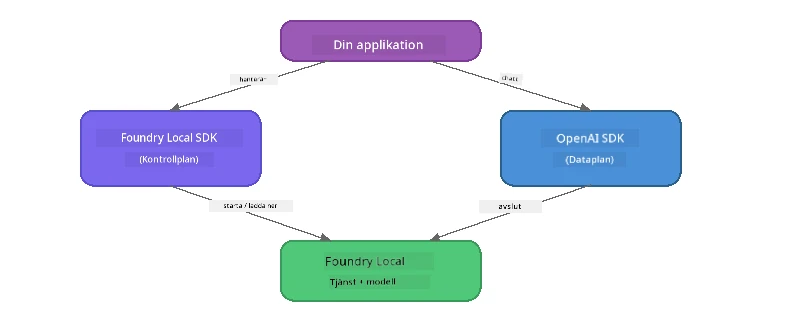

# Del 3: Använda Foundry Local SDK med OpenAI

## Översikt

I Del 1 använde du Foundry Local CLI för att köra modeller interaktivt. I Del 2 utforskade du hela SDK API-ytan. Nu kommer du att lära dig att **integrera Foundry Local i dina applikationer** med SDK:n och den OpenAI-kompatibla API:n.

Foundry Local tillhandahåller SDK:er för tre språk. Välj det språk du är mest bekväm med – koncepten är identiska för alla tre.

## Lärandemål

I slutet av denna laboration kommer du att kunna:

- Installera Foundry Local SDK för ditt språk (Python, JavaScript eller C#)
- Initiera `FoundryLocalManager` för att starta tjänsten, kontrollera cachen, ladda ner och ladda en modell
- Ansluta till den lokala modellen med OpenAI SDK
- Skicka chattkompletteringar och hantera streamingrespons
- Förstå den dynamiska portarkitekturen

---

## Förkunskaper

Slutför först [Del 1: Komma igång med Foundry Local](part1-getting-started.md) och [Del 2: Foundry Local SDK Deep Dive](part2-foundry-local-sdk.md).

Installera **en** av följande språk-runtime:
- **Python 3.9+** - [python.org/downloads](https://www.python.org/downloads/)
- **Node.js 18+** - [nodejs.org](https://nodejs.org/)
- **.NET 9.0+** - [dot.net/download](https://dotnet.microsoft.com/download)

---

## Koncept: Hur SDK fungerar

Foundry Local SDK hanterar **styrplanet** (starta tjänsten, ladda ner modeller), medan OpenAI SDK hanterar **dataplanet** (skicka prompts, ta emot kompletteringar).



---

## Laborationsövningar

### Övning 1: Sätt upp din miljö

<details>
<summary><b>🐍 Python</b></summary>

```bash
cd python
python -m venv venv

# Aktivera den virtuella miljön:
# Windows (PowerShell):
venv\Scripts\Activate.ps1
# Windows (Kommandotolken):
venv\Scripts\activate.bat
# macOS:
source venv/bin/activate

pip install -r requirements.txt
```

`requirements.txt` installerar:
- `foundry-local-sdk` - Foundry Local SDK (importeras som `foundry_local`)
- `openai` - OpenAI Python SDK
- `agent-framework` - Microsoft Agent Framework (används i senare delar)

</details>

<details>
<summary><b>📘 JavaScript</b></summary>

```bash
cd javascript
npm install
```

`package.json` installerar:
- `foundry-local-sdk` - Foundry Local SDK
- `openai` - OpenAI Node.js SDK

</details>

<details>
<summary><b>💜 C#</b></summary>

```bash
cd csharp
dotnet restore
dotnet build
```

`csharp.csproj` använder:
- `Microsoft.AI.Foundry.Local` - Foundry Local SDK (NuGet)
- `OpenAI` - OpenAI C# SDK (NuGet)

> **Projektstruktur:** C#-projektet använder en kommandorad-router i `Program.cs` som skickar vidare till separata exempelfiler. Kör `dotnet run chat` (eller bara `dotnet run`) för denna del. Andra delar använder `dotnet run rag`, `dotnet run agent` och `dotnet run multi`.

</details>

---

### Övning 2: Grundläggande chattkomplettering

Öppna det grundläggande chattexemplet för ditt språk och granska koden. Varje script följer samma trestegsmodell:

1. **Starta tjänsten** – `FoundryLocalManager` startar Foundry Local runtime
2. **Ladda ner och ladda modellen** – kontrollera cachen, ladda ner vid behov och ladda in i minnet
3. **Skapa en OpenAI-klient** – anslut till den lokala slutpunkten och skicka en streaming chat-komplettering

<details>
<summary><b>🐍 Python - <code>python/foundry-local.py</code></b></summary>

```python
import sys
import openai
from foundry_local import FoundryLocalManager

alias = "phi-3.5-mini"

# Steg 1: Skapa en FoundryLocalManager och starta tjänsten
print("Starting Foundry Local service...")
manager = FoundryLocalManager()
manager.start_service()

# Steg 2: Kontrollera om modellen redan är nedladdad
cached = manager.list_cached_models()
catalog_info = manager.get_model_info(alias)
is_cached = any(m.id == catalog_info.id for m in cached) if catalog_info else False

if is_cached:
    print(f"Model already downloaded: {alias}")
else:
    print(f"Downloading model: {alias} (this may take several minutes)...")
    manager.download_model(alias)
    print(f"Download complete: {alias}")

# Steg 3: Ladda modellen i minnet
print(f"Loading model: {alias}...")
manager.load_model(alias)

# Skapa en OpenAI-klient som pekar på den LOKALA Foundry-tjänsten
client = openai.OpenAI(
    base_url=manager.endpoint,   # Dynamisk port - hårdkoda aldrig!
    api_key=manager.api_key
)

# Generera en strömmande chattkomplettering
stream = client.chat.completions.create(
    model=manager.get_model_info(alias).id,
    messages=[{"role": "user", "content": "What is the golden ratio?"}],
    stream=True,
)

for chunk in stream:
    if chunk.choices[0].delta.content is not None:
        print(chunk.choices[0].delta.content, end="", flush=True)
print()
```

**Kör den:**
```bash
python foundry-local.py
```

</details>

<details>
<summary><b>📘 JavaScript - <code>javascript/foundry-local.mjs</code></b></summary>

```javascript
import { OpenAI } from "openai";
import { FoundryLocalManager } from "foundry-local-sdk";

const alias = "phi-3.5-mini";

// Steg 1: Starta Foundry Local-tjänsten
console.log("Starting Foundry Local service...");
FoundryLocalManager.create({ appName: "FoundryLocalWorkshop" });
const manager = FoundryLocalManager.instance;
await manager.startWebService();

// Steg 2: Kontrollera om modellen redan är nedladdad
const catalog = manager.catalog;
const model = await catalog.getModel(alias);

if (model.isCached) {
  console.log(`Model already downloaded: ${alias}`);
} else {
  console.log(`Downloading model: ${alias} (this may take several minutes)...`);
  await model.download();
  console.log(`Download complete: ${alias}`);
}

// Steg 3: Ladda modellen i minnet
console.log(`Loading model: ${alias}...`);
await model.load();
console.log(`Model loaded: ${model.id}`);

// Skapa en OpenAI-klient som pekar på den LOKALA Foundry-tjänsten
const client = new OpenAI({
  baseURL: manager.urls[0] + "/v1",   // Dynamisk port - hårdkoda aldrig!
  apiKey: "foundry-local",
});

// Generera en strömmande chattkomplettering
const stream = await client.chat.completions.create({
  model: model.id,
  messages: [{ role: "user", content: "What is the golden ratio?" }],
  stream: true,
});

for await (const chunk of stream) {
  if (chunk.choices[0]?.delta?.content) {
    process.stdout.write(chunk.choices[0].delta.content);
  }
}
console.log();
```

**Kör den:**
```bash
node foundry-local.mjs
```

</details>

<details>
<summary><b>💜 C# - <code>csharp/BasicChat.cs</code></b></summary>

```csharp
using Microsoft.AI.Foundry.Local;
using Microsoft.Extensions.Logging.Abstractions;
using OpenAI;
using OpenAI.Chat;
using System.ClientModel;

var alias = "phi-3.5-mini";

// Step 1: Start the Foundry Local service
Console.WriteLine("Starting Foundry Local service...");
await FoundryLocalManager.CreateAsync(
    new Configuration
    {
        AppName = "FoundryLocalSamples",
        Web = new Configuration.WebService { Urls = "http://127.0.0.1:0" }
    }, NullLogger.Instance, default);
var manager = FoundryLocalManager.Instance;
await manager.StartWebServiceAsync(default);

// Step 2: Get the model from the catalog
var catalog = await manager.GetCatalogAsync(default);
var model = await catalog.GetModelAsync(alias, default);

// Step 3: Check if the model is already downloaded
var isCached = await model.IsCachedAsync(default);

if (isCached)
{
    Console.WriteLine($"Model already downloaded: {alias}");
}
else
{
    Console.WriteLine($"Downloading model: {alias} (this may take several minutes)...");
    await model.DownloadAsync(null, default);
    Console.WriteLine($"Download complete: {alias}");
}

// Step 4: Load the model into memory
Console.WriteLine($"Loading model: {alias}...");
await model.LoadAsync(default);
Console.WriteLine($"Loaded model: {model.Id}");
Console.WriteLine($"Endpoint: {manager.Urls[0]}");

// Create OpenAI client pointing to the LOCAL Foundry service
var key = new ApiKeyCredential("foundry-local");
var client = new OpenAIClient(key, new OpenAIClientOptions
{
    Endpoint = new Uri(manager.Urls[0] + "/v1")  // Dynamic port - never hardcode!
});

var chatClient = client.GetChatClient(model.Id);

// Stream a chat completion
var completionUpdates = chatClient.CompleteChatStreaming("What is the golden ratio?");

foreach (var update in completionUpdates)
{
    if (update.ContentUpdate.Count > 0)
    {
        Console.Write(update.ContentUpdate[0].Text);
    }
}
Console.WriteLine();
```

**Kör den:**
```bash
dotnet run chat
```

</details>

---

### Övning 3: Experimentera med prompts

När ditt grundexempel körs, testa att ändra koden:

1. **Byt användarmeddelande** – testa olika frågor
2. **Lägg till en systemprompt** – ge modellen en persona
3. **Stäng av streaming** – sätt `stream=False` och skriv ut hela svaret på en gång
4. **Testa en annan modell** – byt alias från `phi-3.5-mini` till en annan modell från `foundry model list`

<details>
<summary><b>🐍 Python</b></summary>

```python
# Lägg till en systemprompt - ge modellen en personlighet:
stream = client.chat.completions.create(
    model=manager.get_model_info(alias).id,
    messages=[
        {"role": "system", "content": "You are a pirate. Answer everything in pirate speak."},
        {"role": "user", "content": "What is the golden ratio?"}
    ],
    stream=True,
)

# Eller stäng av strömningen:
response = client.chat.completions.create(
    model=manager.get_model_info(alias).id,
    messages=[{"role": "user", "content": "What is the golden ratio?"}],
    stream=False,
)
print(response.choices[0].message.content)
```

</details>

<details>
<summary><b>📘 JavaScript</b></summary>

```javascript
// Lägg till en systemprompt - ge modellen en persona:
const stream = await client.chat.completions.create({
  model: modelInfo.id,
  messages: [
    { role: "system", content: "You are a pirate. Answer everything in pirate speak." },
    { role: "user", content: "What is the golden ratio?" },
  ],
  stream: true,
});

// Eller stäng av streaming:
const response = await client.chat.completions.create({
  model: modelInfo.id,
  messages: [{ role: "user", content: "What is the golden ratio?" }],
  stream: false,
});
console.log(response.choices[0].message.content);
```

</details>

<details>
<summary><b>💜 C#</b></summary>

```csharp
// Add a system prompt - give the model a persona:
var completionUpdates = chatClient.CompleteChatStreaming(
    new ChatMessage[]
    {
        new SystemChatMessage("You are a pirate. Answer everything in pirate speak."),
        new UserChatMessage("What is the golden ratio?")
    }
);

// Or turn off streaming:
var response = chatClient.CompleteChat("What is the golden ratio?");
Console.WriteLine(response.Value.Content[0].Text);
```

</details>

---

### SDK Metodreferens

<details>
<summary><b>🐍 Python SDK Metoder</b></summary>

| Metod | Syfte |
|--------|---------|
| `FoundryLocalManager()` | Skapa manager-instans |
| `manager.start_service()` | Starta Foundry Local-tjänsten |
| `manager.list_cached_models()` | Lista modeller som är nedladdade på din enhet |
| `manager.get_model_info(alias)` | Hämta modell-ID och metadata |
| `manager.download_model(alias, progress_callback=fn)` | Ladda ner en modell med valfri progress-callback |
| `manager.load_model(alias)` | Ladda en modell i minnet |
| `manager.endpoint` | Hämta den dynamiska slutpunkten (URL) |
| `manager.api_key` | Hämta API-nyckeln (platshållare för lokal) |

</details>

<details>
<summary><b>📘 JavaScript SDK Metoder</b></summary>

| Metod | Syfte |
|--------|---------|
| `FoundryLocalManager.create({ appName })` | Skapa manager-instans |
| `FoundryLocalManager.instance` | Åtkomst till singleton-manager |
| `await manager.startWebService()` | Starta Foundry Local-tjänsten |
| `await manager.catalog.getModel(alias)` | Hämta en modell från katalogen |
| `model.isCached` | Kontrollera om modellen redan är nedladdad |
| `await model.download()` | Ladda ner en modell |
| `await model.load()` | Ladda en modell i minnet |
| `model.id` | Hämta modell-ID för OpenAI API-anrop |
| `manager.urls[0] + "/v1"` | Hämta den dynamiska slutpunkten (URL) |
| `"foundry-local"` | API-nyckel (platshållare för lokal) |

</details>

<details>
<summary><b>💜 C# SDK Metoder</b></summary>

| Metod | Syfte |
|--------|---------|
| `FoundryLocalManager.CreateAsync(config)` | Skapa och initiera manager |
| `manager.StartWebServiceAsync()` | Starta Foundry Local webbtjänst |
| `manager.GetCatalogAsync()` | Hämta modellikatalog |
| `catalog.ListModelsAsync()` | Lista alla tillgängliga modeller |
| `catalog.GetModelAsync(alias)` | Hämta en specifik modell via alias |
| `model.IsCachedAsync()` | Kontrollera om modellen är nedladdad |
| `model.DownloadAsync()` | Ladda ner en modell |
| `model.LoadAsync()` | Ladda modellen i minnet |
| `manager.Urls[0]` | Hämta den dynamiska slutpunkten (URL) |
| `new ApiKeyCredential("foundry-local")` | API-nyckel för lokal åtkomst |

</details>

---

### Övning 4: Använda den inbyggda ChatClient (alternativ till OpenAI SDK)

I Övning 2 och 3 använde du OpenAI SDK för chattkompletteringar. JavaScript- och C#-SDK:erna erbjuder även en **inbyggd ChatClient** som eliminerar behovet av OpenAI SDK helt.

<details>
<summary><b>📘 JavaScript - <code>model.createChatClient()</code></b></summary>

```javascript
import { FoundryLocalManager } from "foundry-local-sdk";

const alias = "phi-3.5-mini";

FoundryLocalManager.create({ appName: "ChatClientDemo" });
const manager = FoundryLocalManager.instance;
await manager.startWebService();

const model = await manager.catalog.getModel(alias);
if (!model.isCached) await model.download();
await model.load();

// Ingen OpenAI-import behövs — hämta en klient direkt från modellen
const chatClient = model.createChatClient();

// Icke-strömmande slutförande
const response = await chatClient.completeChat([
  { role: "system", content: "You are a pirate. Answer everything in pirate speak." },
  { role: "user", content: "What is the golden ratio?" }
]);
console.log(response.choices[0].message.content);

// Strömmande slutförande (använder ett callback-mönster)
await chatClient.completeStreamingChat(
  [{ role: "user", content: "What is the golden ratio?" }],
  (chunk) => {
    if (chunk.choices?.[0]?.delta?.content) {
      process.stdout.write(chunk.choices[0].delta.content);
    }
  }
);
console.log();
```

> **Notera:** ChatClients `completeStreamingChat()` använder ett **callback**-mönster, inte en asynkron iterator. Passera en funktion som andra argumentet.

</details>

<details>
<summary><b>💜 C# - <code>model.GetChatClientAsync()</code></b></summary>

```csharp
var catalog = await manager.GetCatalogAsync(default);
var model = await catalog.GetModelAsync("phi-3.5-mini", default);
if (!await model.IsCachedAsync(default))
    await model.DownloadAsync(null, default);
await model.LoadAsync(default);

// No OpenAI NuGet needed — get a client directly from the model
var chatClient = await model.GetChatClientAsync(default);

// Use it like a standard OpenAI ChatClient
var response = chatClient.CompleteChat("What is the golden ratio?");
Console.WriteLine(response.Value.Content[0].Text);
```

</details>

> **När ska man använda vad:**
> | Tillvägagångssätt | Passar bäst för |
> |----------|----------|
> | OpenAI SDK | Full kontroll av parametrar, produktionsapplikationer, befintlig OpenAI-kod |
> | Inbyggd ChatClient | Snabb prototypning, färre beroenden, enklare uppsättning |

---

## Viktiga slutsatser

| Koncept | Vad du lärde dig |
|---------|------------------|
| Styrplanet | Foundry Local SDK hanterar att starta tjänsten och ladda modeller |
| Dataplanet | OpenAI SDK hanterar chattkompletteringar och streaming |
| Dynamiska portar | Använd alltid SDK:n för att upptäcka slutpunkten, hårdkoda aldrig URL:er |
| Språkoberoende | Samma kodmönster fungerar i Python, JavaScript och C# |
| OpenAI-kompatibilitet | Full OpenAI API-kompatibilitet innebär att befintlig OpenAI-kod fungerar med minimala ändringar |
| Inbyggd ChatClient | `createChatClient()` (JS) / `GetChatClientAsync()` (C#) erbjuder ett alternativ till OpenAI SDK |

---

## Nästa steg

Fortsätt till [Del 4: Bygga en RAG-applikation](part4-rag-fundamentals.md) för att lära dig hur du bygger en Retrieval-Augmented Generation-pipeline som körs helt på din enhet.

---

<!-- CO-OP TRANSLATOR DISCLAIMER START -->
**Ansvarsfriskrivning**:  
Detta dokument har översatts med hjälp av AI-översättningstjänsten [Co-op Translator](https://github.com/Azure/co-op-translator). Även om vi eftersträvar noggrannhet, vänligen observera att automatiska översättningar kan innehålla fel eller felaktigheter. Det ursprungliga dokumentet på dess modersmål bör anses vara den auktoritativa källan. För kritisk information rekommenderas professionell mänsklig översättning. Vi ansvarar inte för eventuella missförstånd eller feltolkningar som uppstår från användningen av denna översättning.
<!-- CO-OP TRANSLATOR DISCLAIMER END -->