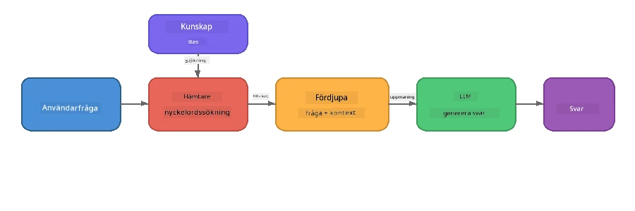

# Del 4: Bygga en RAG-applikation med Foundry Local

## Översikt

Stora språkmodeller är kraftfulla, men de vet bara vad som fanns i deras träningsdata. **Retrieval-Augmented Generation (RAG)** löser detta genom att ge modellen relevant kontext vid frågetillfället – hämtat från dina egna dokument, databaser eller kunskapsbaser.

I denna labb kommer du att bygga en komplett RAG-pipeline som körs **helt på din enhet** med Foundry Local. Inga molntjänster, inga vektor-databaser, ingen embeddings-API – bara lokal hämtning och en lokal modell.

## Lärandemål

I slutet av denna labb ska du kunna:

- Förklara vad RAG är och varför det är viktigt för AI-applikationer
- Bygga en lokal kunskapsbas från textdokument
- Implementera en enkel hämtfunktion för att hitta relevant kontext
- Sätta ihop en systemprompt som förankrar modellen på hämtade fakta
- Köra hela pipeline Retrieve → Augment → Generate på enheten
- Förstå avvägningarna mellan enkel sökordsökning och vektorsökning

---

## Förkunskaper

- Avslutat [Del 3: Använda Foundry Local SDK med OpenAI](part3-sdk-and-apis.md)
- Foundry Local CLI installerad och modellen `phi-3.5-mini` nedladdad

---

## Koncept: Vad är RAG?

Utan RAG kan ett LLM bara svara utifrån sin träningsdata – vilket kan vara inaktuellt, ofullständigt eller sakna din privata information:

```
User: "What is Zava's return policy?"
LLM:  "I do not have information about Zava's return policy."  ← No context!
```
  
Med RAG **hämtar** du först relevanta dokument, sedan **förstärker** du prompten med den kontexten innan du **genererar** ett svar:



Nyckelinsikten: **modellen behöver inte "veta" svaret; den behöver bara läsa rätt dokument.**

---

## Lab-övningar

### Övning 1: Förstå kunskapsbasen

Öppna RAG-exemplet för ditt språk och granska kunskapsbasen:

<details>
<summary><b>🐍 Python: <code>python/foundry-local-rag.py</code></b></summary>

Kunskapsbasen är en enkel lista av ordböcker med fälten `title` och `content`:

```python
KNOWLEDGE_BASE = [
    {
        "title": "Foundry Local Overview",
        "content": (
            "Foundry Local brings the power of Azure AI Foundry to your local "
            "device without requiring an Azure subscription..."
        ),
    },
    {
        "title": "Supported Hardware",
        "content": (
            "Foundry Local automatically selects the best model variant for "
            "your hardware. If you have an Nvidia CUDA GPU it downloads the "
            "CUDA-optimized model..."
        ),
    },
    # ... fler poster
]
```
  
Varje post representerar en "bit" av kunskap – en fokuserad informationsbit om ett ämne.

</details>

<details>
<summary><b>📘 JavaScript: <code>javascript/foundry-local-rag.mjs</code></b></summary>

Kunskapsbasen använder samma struktur som en array av objekt:

```javascript
const KNOWLEDGE_BASE = [
  {
    title: "Foundry Local Overview",
    content:
      "Foundry Local brings the power of Azure AI Foundry to your local " +
      "device without requiring an Azure subscription...",
  },
  {
    title: "Supported Hardware",
    content:
      "Foundry Local automatically selects the best model variant for " +
      "your hardware...",
  },
  // ... fler poster
];
```

</details>

<details>
<summary><b>💜 C#: <code>csharp/RagPipeline.cs</code></b></summary>

Kunskapsbasen använder en lista av namngivna tuples:

```csharp
private static readonly List<(string Title, string Content)> KnowledgeBase =
[
    ("Foundry Local Overview",
     "Foundry Local brings the power of Azure AI Foundry to your local " +
     "device without requiring an Azure subscription..."),

    ("Supported Hardware",
     "Foundry Local automatically selects the best model variant for " +
     "your hardware..."),

    // ... more entries
];
```

</details>

> **I en riktig applikation** skulle kunskapsbasen hämtas från filer på disk, en databas, en sökindex eller ett API. För denna labb använder vi en lista i minnet för enkelhetens skull.

---

### Övning 2: Förstå hämtfunktionen

Hämtsteget finner de mest relevanta bitarna för en användarfråga. Detta exempel använder **sökordsöverensstämmelse** – räknar hur många ord i frågan som också förekommer i varje kunskapsbit:

<details>
<summary><b>🐍 Python</b></summary>

```python
def retrieve(query: str, top_k: int = 2) -> list[dict]:
    """Return the top-k knowledge chunks most relevant to the query."""
    query_words = set(query.lower().split())
    scored = []
    for chunk in KNOWLEDGE_BASE:
        chunk_words = set(chunk["content"].lower().split())
        overlap = len(query_words & chunk_words)
        scored.append((overlap, chunk))
    scored.sort(key=lambda x: x[0], reverse=True)
    return [item[1] for item in scored[:top_k]]
```

</details>

<details>
<summary><b>📘 JavaScript</b></summary>

```javascript
function retrieve(query, topK = 2) {
  const queryWords = new Set(query.toLowerCase().split(/\s+/));
  const scored = KNOWLEDGE_BASE.map((chunk) => {
    const chunkWords = new Set(chunk.content.toLowerCase().split(/\s+/));
    let overlap = 0;
    for (const w of queryWords) {
      if (chunkWords.has(w)) overlap++;
    }
    return { overlap, chunk };
  });
  scored.sort((a, b) => b.overlap - a.overlap);
  return scored.slice(0, topK).map((s) => s.chunk);
}
```

</details>

<details>
<summary><b>💜 C#</b></summary>

```csharp
private static List<(string Title, string Content)> Retrieve(string query, int topK = 2)
{
    var queryWords = new HashSet<string>(
        query.ToLowerInvariant().Split(' ', StringSplitOptions.RemoveEmptyEntries));

    return KnowledgeBase
        .Select(chunk =>
        {
            var chunkWords = new HashSet<string>(
                chunk.Content.ToLowerInvariant().Split(' ', StringSplitOptions.RemoveEmptyEntries));
            var overlap = queryWords.Intersect(chunkWords).Count();
            return (Overlap: overlap, Chunk: chunk);
        })
        .OrderByDescending(x => x.Overlap)
        .Take(topK)
        .Select(x => x.Chunk)
        .ToList();
}
```

</details>

**Så fungerar det:**  
1. Dela upp frågan i enskilda ord  
2. För varje kunskapsbit, räkna hur många frågeord som förekommer där  
3. Sortera efter överlappningspoäng (högst först)  
4. Returnera de top-k mest relevanta bitarna

> **Avvägning:** Sökordsöverensstämmelse är enkel men begränsad; den förstår inte synonymer eller mening. Produktions-RAG-system använder vanligtvis **embedding-vektorer** och en **vektor-databas** för semantisk sökning. Men sökordsöverensstämmelse är en bra startpunkt och kräver inga extra beroenden.

---

### Övning 3: Förstå den förstärkta prompten

Den hämtade kontexten införlivas i **systemprompten** innan den skickas till modellen:

```python
system_prompt = (
    "You are a helpful assistant. Answer the user's question using ONLY "
    "the information provided in the context below. If the context does "
    "not contain enough information, say so.\n\n"
    f"Context:\n{context_text}"
)
```
  
Viktiga designval:  
- **"ENDAST den tillhandahållna informationen"** – förhindrar modellen från att hallucinera fakta som inte finns i kontexten  
- **"Om kontexten inte innehåller tillräckligt med information, säg det"** – uppmuntrar ärliga "jag vet inte"-svar  
- Kontexten placeras i systemmeddelandet så att alla svar påverkas

---

### Övning 4: Kör RAG-pipelinen

Kör hela exemplet:

**Python:**  
```bash
cd python
python foundry-local-rag.py
```
  
**JavaScript:**  
```bash
cd javascript
node foundry-local-rag.mjs
```
  
**C#:**  
```bash
cd csharp
dotnet run rag
```
  
Du bör se tre saker utskrivna:  
1. **Frågan** som ställs  
2. **Den hämtade kontexten** – de valda bitarna från kunskapsbasen  
3. **Svaret** – genererat av modellen med bara den kontexten

Exempelutgång:  
```
Question: How do I install Foundry Local and what hardware does it support?

--- Retrieved Context ---
### Installation
On Windows install Foundry Local with: winget install Microsoft.FoundryLocal...

### Supported Hardware
Foundry Local automatically selects the best model variant for your hardware...
-------------------------

Answer: To install Foundry Local, you can use the following methods depending
on your operating system: On Windows, run `winget install Microsoft.FoundryLocal`.
On macOS, use `brew install microsoft/foundrylocal/foundrylocal`...
```
  
Notera hur modellens svar är **förankrat** i den hämtade kontexten – den nämner bara fakta från kunskapsbasens dokument.

---

### Övning 5: Experimentera och utöka

Testa dessa ändringar för att fördjupa din förståelse:

1. **Byt fråga** – ställ något som FINNS i kunskapsbasen kontra något som INTE FINNS där:  
   ```python
   question = "What programming languages does Foundry Local support?"  # ← I sammanhang
   question = "How much does Foundry Local cost?"                       # ← Inte i sammanhang
   ```
   Säger modellen korrekt "Jag vet inte" när svaret inte finns i kontexten?

2. **Lägg till en ny kunskapsbit** – lägg till en ny post i `KNOWLEDGE_BASE`:  
   ```python
   {
       "title": "Pricing",
       "content": "Foundry Local is completely free and open source under the MIT license.",
   }
   ```
   Ställ nu prisfrågan igen.

3. **Byt `top_k`** – hämta fler eller färre bitar:  
   ```python
   context_chunks = retrieve(question, top_k=3)  # Mer kontext
   context_chunks = retrieve(question, top_k=1)  # Mindre kontext
   ```
   Hur påverkar mängden kontext svarskvaliteten?

4. **Ta bort förankringsinstruktionen** – byt systemprompt till bara "Du är en hjälpsam assistent." och se om modellen börjar hallucinera fakta.

---

## Djupdykning: Optimera RAG för on-device-prestanda

Att köra RAG på enheten innebär begränsningar som du inte har i molnet: begränsat RAM, ingen dedikerad GPU (CPU/NPU-exekvering) och ett litet kontextfönster i modellen. Designbesluten nedan hanterar direkt dessa begränsningar och bygger på mönster från produktionslika lokala RAG-applikationer byggda med Foundry Local.

### Chunking-strategi: Fast storlek med glidande fönster

Chunking – hur du delar upp dokument i bitar – är ett av de mest avgörande besluten i vilket RAG-system som helst. För on-device-scenarion rekommenderas en **glidande fönster med fast storlek och överlappning** som startpunkt:

| Parameter | Rekommenderat värde | Varför |
|-----------|---------------------|--------|
| **Chunk-storlek** | ~200 tokens | Håller den hämtade kontexten kompakt, lämnar utrymme i Phi-3.5 Minis kontextfönster för systemprompt, konversationshistorik och genererat output |
| **Överlappning** | ~25 tokens (12,5%) | Förhindrar informationsförlust vid chunk-gränser – viktigt för procedurer och steg-för-steg-instruktioner |
| **Tokenisering** | Delning på blanksteg | Inga beroenden, ingen tokenizer-bibliotek behövs. Allt beräkningsbudget går till LLM |

Överlappningen fungerar som ett glidande fönster: varje ny chunk startar 25 tokens före den förra slutade, så meningar som sträcker sig över chunk-gränserna finns i båda chunks.

> **Varför inte andra strategier?**  
> - **Meningbaserad uppdelning** ger opålitliga chunk-storlekar; vissa säkerhetsrutiner är långa meningar som inte delar sig bra  
> - **Sektionbaserad uppdelning** (på `##` rubriker) skapar mycket varierande chunk-storlekar – vissa för små, andra för stora för modellens kontextfönster  
> - **Semantisk chunking** (embedding-baserad ämnesdetektion) ger bäst hämtkvalitet, men kräver en andra modell i minnet bredvid Phi-3.5 Mini – riskabelt på hårdvara med 8-16 GB delat minne

### Steg upp hämtning: TF-IDF-vektorer

Sökordsöverensstämmelsen i denna labb fungerar, men om du vill ha bättre hämtning utan att lägga till en embedding-modell är **TF-IDF (Term Frequency-Inverse Document Frequency)** en utmärkt kompromiss:

```
Keyword Overlap  →  TF-IDF Vectors  →  Embedding Models
    (this lab)     (lightweight upgrade)   (production)
  Simple & fast    Better ranking,         Best quality,
  No dependencies  still no ML model       requires embedding model
  ~Basic matching  ~1ms retrieval          ~100-500ms per query
```
  
TF-IDF omvandlar varje chunk till en numerisk vektor baserat på hur viktigt varje ord är inom den chunk *relativt till alla chunks*. Vid frågetillfället vektorisieras frågan på samma sätt och jämförs med cosinuslikhet. Du kan implementera detta med SQLite och ren JavaScript/Python – inga vektor-databaser, ingen embedding-API.

> **Prestanda:** TF-IDF cosinuslikhet på fast-storlekschunks uppnår typiskt **~1 ms hämtning**, jämfört med ~100-500 ms när en embedding-modell kodar varje fråga. Alla 20+ dokument kan chunkas och indexeras på under en sekund.

### Edge/Compact Mode för begränsade enheter

När du kör på mycket begränsad hårdvara (äldre laptops, surfplattor, fältenheter) kan du minska resursanvändningen genom att justera tre reglage:

| Inställning | Standardläge | Edge/Compact-läge |
|-------------|--------------|-------------------|
| **Systemprompt** | ~300 tokens | ~80 tokens |
| **Max output tokens** | 1024 | 512 |
| **Hämtade chunks (top-k)** | 5 | 3 |

Färre hämtade chunks ger mindre kontext för modellen att bearbeta, vilket minskar latens och minnesbelastning. En kortare systemprompt frigör mer av kontextfönstret för själva svaret. Denna avvägning är värd det på enheter där varje token i kontextfönstret räknas.

### En modell i minnet

En av de viktigaste principerna för on-device RAG: **ladda bara en modell**. Om du använder en embedding-modell för hämtning *och* en språkmodell för generering delar du på begränsade NPU-/RAM-resurser mellan två modeller. Lättviktig hämtning (sökordsöverensstämmelse, TF-IDF) undviker detta helt:

- Ingen embedding-modell som konkurrerar med LLM om minnet  
- Snabbare kallstart – bara en modell att ladda  
- Förutsägbar minnesanvändning – LLM får alla tillgängliga resurser  
- Fungerar på maskiner med så lite som 8 GB RAM

### SQLite som lokal vektorbutik

För små till medelstora dokumentuppsättningar (hundratals till låga tusental chunks) är **SQLite tillräckligt snabbt** för brute-force cosinuslikhet-sökning och kräver ingen extra infrastruktur:

- Enskild `.db`-fil på disk – ingen serverprocess, ingen konfiguration  
- Ingår i varje större språk-runtime (Python `sqlite3`, Node.js `better-sqlite3`, .NET `Microsoft.Data.Sqlite`)  
- Sparar dokumentchunks tillsammans med deras TF-IDF-vektorer i en tabell  
- Inget behov av Pinecone, Qdrant, Chroma eller FAISS i denna skala

### Prestandasammanfattning

Dessa designval kombineras för att leverera snabb RAG på konsumenthårdvara:

| Metrik | Prestanda på enhet |
|--------|---------------------|
| **Hämtningslatenstid** | ~1 ms (TF-IDF) till ~5 ms (sökordsöverensstämmelse) |
| **Inmatningshastighet** | 20 dokument chunkade och indexerade på < 1 sekund |
| **Modeller i minnet** | 1 (endast LLM – ingen embedding-modell) |
| **Lagringsöverhead** | < 1 MB för chunks + vektorer i SQLite |
| **Kallstart** | Enkel modellinläsning, ingen embedding runtime-start |
| **Hårdvarugolv** | 8 GB RAM, endast CPU (ingen GPU krävs) |

> **När uppgradera:** Om du skalar till hundratals långa dokument, blandade innehållstyper (tabeller, kod, prosa) eller behöver semantisk förståelse av frågor, överväg att lägga till en embedding-modell och byta till vektorsökning. För de flesta on-device-användningsfall med fokuserade dokumentuppsättningar levererar TF-IDF + SQLite utmärkta resultat med minimal resursanvändning.

---

## Nyckelkoncept

| Koncept | Beskrivning |
|---------|-------------|
| **Retrieval (Hämtning)** | Hitta relevanta dokument från en kunskapsbas baserat på användarens fråga |
| **Augmentation (Förstärkning)** | Infoga hämtade dokument i prompt som kontext |
| **Generation (Generering)** | LLM producerar ett svar förankrat i den tillhandahållna kontexten |
| **Chunking** | Dela upp stora dokument i mindre, fokuserade delar |
| **Grounding (Förankring)** | Begränsa modellen att bara använda tillhandahållen kontext (minskar hallucination) |
| **Top-k** | Antalet mest relevanta bitar som hämtas |

---

## RAG i produktion vs. denna labb

| Aspekt | Denna labb | On-Device optimerad | Molnproduktion |
|--------|------------|---------------------|----------------|
| **Kunskapsbas** | Lista i minnet | Filer på disk, SQLite | Databas, sökindex |
| **Hämtning** | Sökordsöverensstämmelse | TF-IDF + cosinuslikhet | Vektor-embeddings + likhetssökning |
| **Embeddings** | Ej nödvändigt | Ej nödvändigt - TF-IDF-vektorer | Embedding-modell (lokal eller moln) |
| **Vektorbutik** | Inget behov | SQLite (enkel `.db`-fil) | FAISS, Chroma, Azure AI Search, etc. |
| **Chunking** | Manuellt | Fast storlek, glidande fönster (~200 tokens, 25-token överlapp) | Semantisk eller rekursiv chunking |
| **Modeller i minnet** | 1 (LLM) | 1 (LLM) | 2+ (embedding + LLM) |
| **Hämtningstidsfördröjning** | ~5ms | ~1ms | ~100-500ms |
| **Skala** | 5 dokument | Hundratals dokument | Miljoner dokument |

Mönstren du lär dig här (hämta, förstärka, generera) är desamma i alla skalor. Hämtmetoden förbättras, men den övergripande arkitekturen förblir identisk. Mittenkolumnen visar vad som är möjligt på enheten med lätta tekniker, ofta den perfekta balansen för lokala applikationer där du byter molnskala mot integritet, offline-funktionalitet och noll fördröjning till externa tjänster.

---

## Viktiga punkter

| Begrepp | Vad du lärde dig |
|---------|------------------|
| RAG-mönster | Hämta + Förstärka + Generera: ge modellen rätt kontext och den kan svara på frågor om dina data |
| På enheten | Allt körs lokalt utan moln-API:er eller prenumerationer på vektordatabaser |
| Grundläggande instruktioner | Systempromptens begränsningar är avgörande för att förhindra hallucinationer |
| Nyckelordsöverensstämmelse | En enkel men effektiv utgångspunkt för hämtning |
| TF-IDF + SQLite | En lättviktig uppgraderingsväg som håller hämtning under 1 ms utan inbäddningsmodell |
| En modell i minnet | Undvik att ladda en inbäddningsmodell tillsammans med LLM på begränsad hårdvara |
| Delstorlek | Cirka 200 token med överlapp balanserar hämtprecision och kontextfönstereffektivitet |
| Edge/kompakt läge | Använd färre delar och kortare prompts för mycket begränsade enheter |
| Universellt mönster | Samma RAG-arkitektur fungerar för vilken datakälla som helst: dokument, databaser, API:er eller wikier |

> **Vill du se en komplett RAG-applikation på enheten?** Kolla in [Gas Field Local RAG](https://github.com/leestott/local-rag), en produktionsstil offline RAG-agent byggd med Foundry Local och Phi-3.5 Mini som demonstrerar dessa optimeringsmönster med en verklig dokumentuppsättning.

---

## Nästa steg

Fortsätt till [Del 5: Bygga AI-agenter](part5-single-agents.md) för att lära dig hur man bygger intelligenta agenter med personligheter, instruktioner och fleromgångssamtal med hjälp av Microsoft Agent Framework.

---

<!-- CO-OP TRANSLATOR DISCLAIMER START -->
**Ansvarsfriskrivning**:  
Detta dokument har översatts med hjälp av AI-översättningstjänsten [Co-op Translator](https://github.com/Azure/co-op-translator). Även om vi strävar efter noggrannhet, vänligen observera att automatiska översättningar kan innehålla fel eller felaktigheter. Det ursprungliga dokumentet på dess modersmål ska betraktas som den auktoritativa källan. För kritisk information rekommenderas professionell mänsklig översättning. Vi ansvarar inte för några missförstånd eller feltolkningar som uppstår från användningen av denna översättning.
<!-- CO-OP TRANSLATOR DISCLAIMER END -->