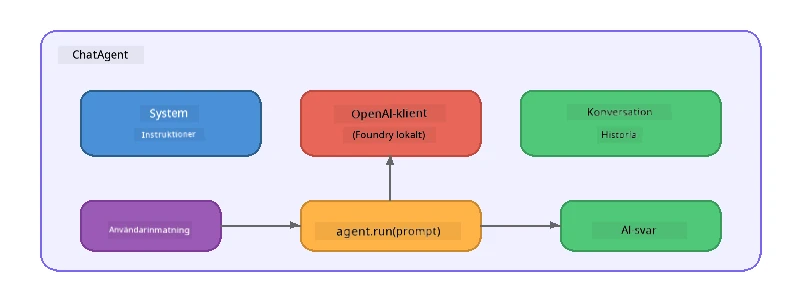

# Del 5: Bygga AI-agenter med Agent Framework

> **Mål:** Bygg din första AI-agent med beständiga instruktioner och en definierad persona, driven av en lokal modell via Foundry Local.

## Vad är en AI-agent?

En AI-agent omsluter en språkmodell med **systeminstruktioner** som definierar dess beteende, personlighet och begränsningar. Till skillnad från ett enda chattfullbordandekall, erbjuder en agent:

- **Persona** - en konsekvent identitet ("Du är en hjälpsam kodgranskare")
- **Minne** - konversationshistorik över flera turer
- **Specialisering** - fokuserat beteende drivet av välformulerade instruktioner



---

## Microsoft Agent Framework

**Microsoft Agent Framework** (AGF) tillhandahåller en standardiserad agentabstraktion som fungerar över olika modell-backend:ar. I denna workshop parar vi ihop det med Foundry Local så allt körs på din maskin - ingen molnanslutning krävs.

| Koncept | Beskrivning |
|---------|-------------|
| `FoundryLocalClient` | Python: hanterar service-start, modellnedladdning/laddning och skapar agenter |
| `client.as_agent()` | Python: skapar en agent från Foundry Local-clienten |
| `AsAIAgent()` | C#: extensionsmetod på `ChatClient` - skapar en `AIAgent` |
| `instructions` | Systemprompt som formar agentens beteende |
| `name` | Mänskligt läsbar etikett, användbar i multi-agent scenarier |
| `agent.run(prompt)` / `RunAsync()` | Skickar användarmeddelande och returnerar agentens svar |

> **Notera:** Agent Framework har både en Python- och .NET-SDK. För JavaScript implementerar vi en lättviktig `ChatAgent`-klass som speglar samma mönster med OpenAI SDK direkt.

---

## Övningar

### Övning 1 - Förstå Agentmönstret

Innan du skriver kod, studera agentens nyckelkomponenter:

1. **Modellklient** - ansluter till Foundry Locals OpenAI-kompatibla API
2. **Systeminstruktioner** - "personlighets"-prompten
3. **Körloop** - skicka användarinmatning, ta emot utdata

> **Fundera på:** Hur skiljer sig systeminstruktionerna från ett vanligt användarmeddelande? Vad händer om du ändrar dem?

---

### Övning 2 - Kör single-agent exempel

<details>
<summary><strong>🐍 Python</strong></summary>

**Förutsättningar:**
```bash
cd python
python -m venv venv

# Windows (PowerShell):
venv\Scripts\Activate.ps1
# macOS:
source venv/bin/activate

pip install -r requirements.txt
```

**Kör:**
```bash
python foundry-local-with-agf.py
```

**Kodgenomgång** (`python/foundry-local-with-agf.py`):

```python
import asyncio
from agent_framework_foundry_local import FoundryLocalClient

async def main():
    alias = "phi-4-mini"

    # FoundryLocalClient hanterar tjänststart, modellnedladdning och inläsning
    client = FoundryLocalClient(model_id=alias)
    print(f"Client Model ID: {client.model_id}")

    # Skapa en agent med systeminstruktioner
    agent = client.as_agent(
        name="Joker",
        instructions="You are good at telling jokes.",
    )

    # Icke-strömmande: få hela svaret på en gång
    result = await agent.run("Tell me a joke about a pirate.")
    print(f"Agent: {result}")

    # Strömmande: få resultat när de genereras
    async for chunk in agent.run("Tell me another joke.", stream=True):
        if chunk.text:
            print(chunk.text, end="", flush=True)

asyncio.run(main())
```

**Viktiga punkter:**
- `FoundryLocalClient(model_id=alias)` hanterar service-start, nedladdning och modellinläsning i ett steg
- `client.as_agent()` skapar en agent med systeminstruktioner och namn
- `agent.run()` stöder både icke-streamande och streamande läge
- Installera via `pip install agent-framework-foundry-local --pre`

</details>

<details>
<summary><strong>📦 JavaScript</strong></summary>

**Förutsättningar:**
```bash
cd javascript
npm install
```

**Kör:**
```bash
node foundry-local-with-agent.mjs
```

**Kodgenomgång** (`javascript/foundry-local-with-agent.mjs`):

```javascript
import { OpenAI } from "openai";
import { FoundryLocalManager } from "foundry-local-sdk";

class ChatAgent {
  constructor({ client, modelId, instructions, name }) {
    this.client = client;
    this.modelId = modelId;
    this.instructions = instructions;
    this.name = name;
    this.history = [];
  }

  async run(userMessage) {
    const messages = [
      { role: "system", content: this.instructions },
      ...this.history,
      { role: "user", content: userMessage },
    ];
    const response = await this.client.chat.completions.create({
      model: this.modelId,
      messages,
    });
    const assistantMessage = response.choices[0].message.content;

    // Behåll konversationshistorik för interaktioner med flera turer
    this.history.push({ role: "user", content: userMessage });
    this.history.push({ role: "assistant", content: assistantMessage });
    return { text: assistantMessage };
  }
}

async function main() {
  FoundryLocalManager.create({ appName: "FoundryLocalWorkshop" });
  const manager = FoundryLocalManager.instance;
  await manager.startWebService();

  const catalog = manager.catalog;
  const model = await catalog.getModel("phi-3.5-mini");
  if (!model.isCached) {
    console.log("Downloading model: phi-3.5-mini...");
    await model.download();
  }
  await model.load();

  const client = new OpenAI({
    baseURL: manager.urls[0] + "/v1",
    apiKey: "foundry-local",
  });

  const agent = new ChatAgent({
    client,
    modelId: model.id,
    instructions: "You are good at telling jokes.",
    name: "Joker",
  });

  const result = await agent.run("Tell me a joke about a pirate.");
  console.log(result.text);
}

main();
```

**Viktiga punkter:**
- JavaScript bygger sin egen `ChatAgent`-klass som speglar Python AGF-mönstret
- `this.history` lagrar konversationshistorik för fleromgångsstöd
- Explicit `startWebService()` → cachekontroll → `model.download()` → `model.load()` ger full insyn

</details>

<details>
<summary><strong>💜 C#</strong></summary>

**Förutsättningar:**
```bash
cd csharp
dotnet restore
```

**Kör:**
```bash
dotnet run agent
```

**Kodgenomgång** (`csharp/SingleAgent.cs`):

```csharp
using Microsoft.AI.Foundry.Local;
using Microsoft.Extensions.Logging.Abstractions;
using Microsoft.Agents.AI;
using OpenAI;
using System.ClientModel;

// 1. Start Foundry Local and load a model
var alias = "phi-3.5-mini";
await FoundryLocalManager.CreateAsync(
    new Configuration
    {
        AppName = "FoundryLocalSamples",
        Web = new Configuration.WebService { Urls = "http://127.0.0.1:0" }
    }, NullLogger.Instance, default);
var manager = FoundryLocalManager.Instance;
await manager.StartWebServiceAsync(default);

var catalog = await manager.GetCatalogAsync(default);
var model = await catalog.GetModelAsync(alias, default);

var isCached = await model.IsCachedAsync(default);
if (!isCached)
{
    Console.WriteLine($"Downloading model: {alias}...");
    await model.DownloadAsync(null, default);
}
await model.LoadAsync(default);

var key = new ApiKeyCredential("foundry-local");
var client = new OpenAIClient(key, new OpenAIClientOptions
{
    Endpoint = new Uri(manager.Urls[0] + "/v1")
});

// 2. Create an AIAgent using the Agent Framework extension method
AIAgent joker = client
    .GetChatClient(model.Id)
    .AsAIAgent(
        instructions: "You are good at telling jokes. Keep your jokes short and family-friendly.",
        name: "Joker"
    );

// 3. Run the agent (non-streaming)
var response = await joker.RunAsync("Tell me a joke about a pirate.");
Console.WriteLine($"Joker: {response}");

// 4. Run with streaming
await foreach (var update in joker.RunStreamingAsync("Tell me another joke."))
{
    Console.Write(update);
}
```

**Viktiga punkter:**
- `AsAIAgent()` är en extensionsmetod från `Microsoft.Agents.AI.OpenAI` - ingen egen `ChatAgent`-klass behövs
- `RunAsync()` returnerar hela svaret; `RunStreamingAsync()` streamar token för token
- Installera via `dotnet add package Microsoft.Agents.AI.OpenAI --version 1.0.0-rc3`

</details>

---

### Övning 3 - Ändra Persona

Ändra agentens `instructions` för att skapa en annan persona. Testa varje och observera hur svaret ändras:

| Persona | Instruktioner |
|---------|-------------|
| Kodgranskare | `"Du är en expert på kodgranskning. Ge konstruktiv feedback med fokus på läsbarhet, prestanda och korrekthet."` |
| Reseguide | `"Du är en vänlig reseguide. Ge personliga rekommendationer för destinationer, aktiviteter och lokal mat."` |
| Sokratisk lärare | `"Du är en sokratisk lärare. Ge aldrig direkta svar - vägled istället studenten med eftertänksamma frågor."` |
| Teknisk skribent | `"Du är en teknisk skribent. Förklara koncept klart och koncist. Använd exempel. Undvik jargong."` |

**Prova:**
1. Välj en persona från tabellen ovan
2. Ersätt `instructions`-strängen i koden
3. Anpassa användarprompten för att passa (t.ex. be kodgranskaren granska en funktion)
4. Kör exemplet igen och jämför svaret

> **Tips:** Kvaliteten hos en agent beror starkt på instruktionerna. Specifika, välstrukturerade instruktioner ger bättre resultat än vaga.

---

### Övning 4 - Lägg till Fleromgångskonversation

Utöka exemplet för att stödja en fleromgångs-chattloop så att du kan ha en fram-och-tillbaka konversation med agenten.

<details>
<summary><strong>🐍 Python - fleromgångsloop</strong></summary>

```python
import asyncio
from agent_framework_foundry_local import FoundryLocalClient

async def main():
    client = FoundryLocalClient(model_id="phi-4-mini")

    agent = client.as_agent(
        name="Assistant",
        instructions="You are a helpful assistant.",
    )

    print("Chat with the agent (type 'quit' to exit):\n")
    while True:
        user_input = input("You: ")
        if user_input.strip().lower() in ("quit", "exit"):
            break
        result = await agent.run(user_input)
        print(f"Agent: {result}\n")

asyncio.run(main())
```

</details>

<details>
<summary><strong>📦 JavaScript - fleromgångsloop</strong></summary>

```javascript
import { OpenAI } from "openai";
import { FoundryLocalManager } from "foundry-local-sdk";
import * as readline from "node:readline/promises";

// (återanvänd ChatAgent-klassen från Övning 2)

async function main() {
  FoundryLocalManager.create({ appName: "FoundryLocalWorkshop" });
  const manager = FoundryLocalManager.instance;
  await manager.startWebService();

  const catalog = manager.catalog;
  const model = await catalog.getModel("phi-3.5-mini");
  if (!model.isCached) {
    console.log("Downloading model: phi-3.5-mini...");
    await model.download();
  }
  await model.load();

  const client = new OpenAI({
    baseURL: manager.urls[0] + "/v1",
    apiKey: "foundry-local",
  });

  const agent = new ChatAgent({
    client,
    modelId: model.id,
    instructions: "You are a helpful assistant.",
    name: "Assistant",
  });

  const rl = readline.createInterface({
    input: process.stdin,
    output: process.stdout,
  });

  console.log("Chat with the agent (type 'quit' to exit):\n");
  while (true) {
    const userInput = await rl.question("You: ");
    if (["quit", "exit"].includes(userInput.trim().toLowerCase())) break;
    const result = await agent.run(userInput);
    console.log(`Agent: ${result.text}\n`);
  }
  rl.close();
}

main();
```

</details>

<details>
<summary><strong>💜 C# - fleromgångsloop</strong></summary>

```csharp
using Microsoft.AI.Foundry.Local;
using Microsoft.Extensions.Logging.Abstractions;
using Microsoft.Agents.AI;
using OpenAI;
using System.ClientModel;

var alias = "phi-3.5-mini";
var config = new Configuration
{
    AppName = "FoundryLocalSamples",
    Web = new Configuration.WebService { Urls = "http://127.0.0.1:0" }
};
await FoundryLocalManager.CreateAsync(config, NullLogger.Instance, default);
var manager = FoundryLocalManager.Instance;
await manager.StartWebServiceAsync(default);

var catalog = await manager.GetCatalogAsync(default);
var model = await catalog.GetModelAsync(alias, default);

var isCached = await model.IsCachedAsync(default);
if (!isCached)
{
    Console.WriteLine($"Downloading model: {alias}...");
    await model.DownloadAsync(null, default);
}
await model.LoadAsync(default);

var key = new ApiKeyCredential("foundry-local");
var client = new OpenAIClient(key, new OpenAIClientOptions
{
    Endpoint = new Uri(manager.Urls[0] + "/v1")
});

AIAgent agent = client
    .GetChatClient(model.Id)
    .AsAIAgent(
        instructions: "You are a helpful assistant.",
        name: "Assistant"
    );

Console.WriteLine("Chat with the agent (type 'quit' to exit):\n");
while (true)
{
    Console.Write("You: ");
    var userInput = Console.ReadLine();
    if (string.IsNullOrWhiteSpace(userInput) ||
        userInput.Equals("quit", StringComparison.OrdinalIgnoreCase) ||
        userInput.Equals("exit", StringComparison.OrdinalIgnoreCase))
        break;

    var result = await agent.RunAsync(userInput);
    Console.WriteLine($"Agent: {result}\n");
}
```

</details>

Lägg märke till hur agenten minns tidigare turer - ställ en följdfråga och se hur kontexten följs med.

---

### Övning 5 - Strukturerad Output

Instruktera agenten att alltid svara i ett specifikt format (t.ex. JSON) och tolka resultatet:

<details>
<summary><strong>🐍 Python - JSON-utdata</strong></summary>

```python
import asyncio
import json
from agent_framework_foundry_local import FoundryLocalClient

async def main():
    client = FoundryLocalClient(model_id="phi-4-mini")

    agent = client.as_agent(
        name="SentimentAnalyzer",
        instructions=(
            "You are a sentiment analysis agent. "
            "For every user message, respond ONLY with valid JSON in this format: "
            '{"sentiment": "positive|negative|neutral", "confidence": 0.0-1.0, "summary": "brief reason"}'
        ),
    )

    result = await agent.run("I absolutely loved the new restaurant downtown!")
    print("Raw:", result)

    try:
        parsed = json.loads(str(result))
        print(f"Sentiment: {parsed['sentiment']} (confidence: {parsed['confidence']})")
    except json.JSONDecodeError:
        print("Agent did not return valid JSON - try refining the instructions.")

asyncio.run(main())
```

</details>

<details>
<summary><strong>💜 C# - JSON-utdata</strong></summary>

```csharp
using System.Text.Json;

AIAgent analyzer = chatClient.AsAIAgent(
    name: "SentimentAnalyzer",
    instructions:
        "You are a sentiment analysis agent. " +
        "For every user message, respond ONLY with valid JSON in this format: " +
        "{\"sentiment\": \"positive|negative|neutral\", \"confidence\": 0.0-1.0, \"summary\": \"brief reason\"}"
);

var response = await analyzer.RunAsync("I absolutely loved the new restaurant downtown!");
Console.WriteLine($"Raw: {response}");

try
{
    var parsed = JsonSerializer.Deserialize<JsonElement>(response.ToString());
    Console.WriteLine($"Sentiment: {parsed.GetProperty("sentiment")} " +
                      $"(confidence: {parsed.GetProperty("confidence")})");
}
catch (JsonException)
{
    Console.WriteLine("Agent did not return valid JSON - try refining the instructions.");
}
```

</details>

> **Notera:** Små lokala modeller producerar inte alltid perfekt giltig JSON. Du kan förbättra tillförlitligheten genom att inkludera ett exempel i instruktionerna och vara mycket explicit med förväntat format.

---

## Viktiga lärdomar

| Koncept | Vad du lärde dig |
|---------|-----------------|
| Agent vs. rå LLM-anrop | En agent omsluter en modell med instruktioner och minne |
| Systeminstruktioner | Den viktigaste hävstången för att styra agentens beteende |
| Fleromgångskonversation | Agenter kan bära kontext över flera användarinteraktioner |
| Strukturerad output | Instruktioner kan tvinga utdataformat (JSON, markdown osv.) |
| Lokal körning | Allt körs på enheten via Foundry Local - inget moln krävs |

---

## Nästa steg

I **[Del 6: Multi-Agent Workflow](part6-multi-agent-workflows.md)** kommer du att kombinera flera agenter till en koordinerad pipeline där varje agent har en specialiserad roll.

---

<!-- CO-OP TRANSLATOR DISCLAIMER START -->
**Ansvarsfriskrivning**:  
Detta dokument har översatts med hjälp av AI-översättningstjänsten [Co-op Translator](https://github.com/Azure/co-op-translator). Även om vi strävar efter noggrannhet, vänligen notera att automatiska översättningar kan innehålla fel eller brister. Det ursprungliga dokumentet på dess ursprungsspråk bör anses vara den auktoritativa källan. För viktig information rekommenderas professionell översättning av människor. Vi ansvarar inte för eventuella missförstånd eller feltolkningar som uppstår genom användning av denna översättning.
<!-- CO-OP TRANSLATOR DISCLAIMER END -->