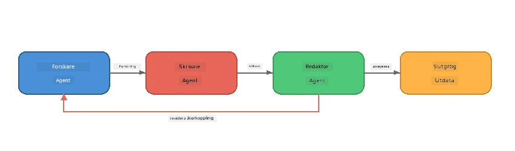
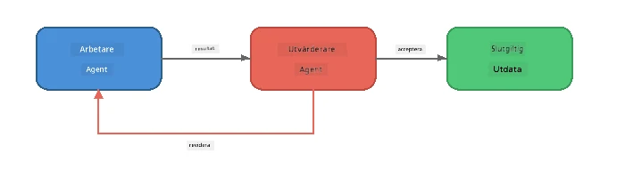
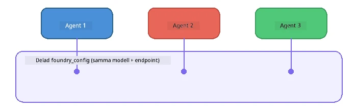

# Del 6: Multi-Agent Arbetsflöden

> **Mål:** Kombinera flera specialiserade agenter till koordinerade pipelines som delar upp komplexa uppgifter mellan samarbetande agenter - alla körs lokalt med Foundry Local.

## Varför Multi-Agent?

En enskild agent kan hantera många uppgifter, men komplexa arbetsflöden gynnas av **Specialisering**. Istället för att en agent försöker forska, skriva och redigera samtidigt, delar du upp arbetet i fokuserade roller:



| Mönster | Beskrivning |
|---------|-------------|
| **Sekventiell** | Utdata från Agent A matas in i Agent B → Agent C |
| **Feedbackloop** | En utvärderingsagent kan skicka arbete tillbaka för revidering |
| **Delad kontext** | Alla agenter använder samma modell/endpoint, men olika instruktioner |
| **Typad output** | Agenter producerar strukturerade resultat (JSON) för pålitliga överlämningar |

---

## Övningar

### Övning 1 - Kör Multi-Agent Pipeline

Workshoppen inkluderar ett komplett Researcher → Writer → Editor arbetsflöde.

<details>
<summary><strong>🐍 Python</strong></summary>

**Setup:**
```bash
cd python
python -m venv venv

# Windows (PowerShell):
venv\Scripts\Activate.ps1
# macOS:
source venv/bin/activate

pip install -r requirements.txt
```

**Kör:**
```bash
python foundry-local-multi-agent.py
```

**Vad som händer:**
1. **Researcher** får ett ämne och returnerar punkter med fakta
2. **Writer** tar forskningen och skriver ett blogginlägg (3-4 stycken)
3. **Editor** granskar artikeln för kvalitet och returnerar ACCEPT eller REVISE

</details>

<details>
<summary><strong>📦 JavaScript</strong></summary>

**Setup:**
```bash
cd javascript
npm install
```

**Kör:**
```bash
node foundry-local-multi-agent.mjs
```

**Samma tredelade pipeline** - Researcher → Writer → Editor.

</details>

<details>
<summary><strong>💜 C#</strong></summary>

**Setup:**
```bash
cd csharp
dotnet restore
```

**Kör:**
```bash
dotnet run multi
```

**Samma tredelade pipeline** - Researcher → Writer → Editor.

</details>

---

### Övning 2 - Pipeline-analys

Studera hur agenter definieras och kopplas ihop:

**1. Delad modelklient**

Alla agenter delar samma Foundry Local-modell:

```python
# Python - FoundryLocalClient hanterar allt
from agent_framework_foundry_local import FoundryLocalClient

client = FoundryLocalClient(model_id="phi-3.5-mini")
```

```javascript
// JavaScript - OpenAI SDK pekad mot Foundry Local
const client = new OpenAI({
  baseURL: manager.urls[0] + "/v1",
  apiKey: "foundry-local",
});
```

```csharp
// C# - OpenAIClient pointed at Foundry Local
var key = new ApiKeyCredential("foundry-local");
var client = new OpenAIClient(key, new OpenAIClientOptions
{
    Endpoint = new Uri(manager.Urls[0] + "/v1")
});
var chatClient = client.GetChatClient(model.Id);
```

**2. specialiserade instruktioner**

Varje agent har en tydlig persona:

| Agent | Instruktioner (sammanfattning) |
|-------|-------------------------------|
| Researcher | "Ge nyckelfakta, statistik och bakgrund. Organisera som punkter." |
| Writer | "Skriv ett engagerande blogginlägg (3-4 stycken) från forskningsanteckningarna. Hitta inte på fakta." |
| Editor | "Granska för tydlighet, grammatik och faktakonsistens. Domen: ACCEPT eller REVISE." |

**3. Dataflöden mellan agenter**

```python
# Steg 1 - forskarens utdata blir ingång till skribenten
research_result = await researcher.run(f"Research: {topic}")

# Steg 2 - skribentens utdata blir ingång till redaktören
writer_result = await writer.run(f"Write using:\n{research_result}")

# Steg 3 - redaktören granskar både forskningen och artikeln
editor_result = await editor.run(
    f"Research:\n{research_result}\n\nArticle:\n{writer_result}"
)
```

```csharp
// C# - same pattern, async calls with AIAgent
var researchNotes = await researcher.RunAsync(
    $"Research the following topic and provide key facts:\n{topic}");

var draft = await writer.RunAsync(
    $"Write a blog post based on these research notes:\n\n{researchNotes}");

var verdict = await editor.RunAsync(
    $"Review this article for quality and accuracy.\n\n" +
    $"Research notes:\n{researchNotes}\n\n" +
    $"Article:\n{draft}");
```

> **Viktig insikt:** Varje agent får det kumulativa sammanhanget från tidigare agenter. Redaktören ser både originalforskningen och utkastet - detta låter den kontrollera faktakonsistens.

---

### Övning 3 - Lägg till en fjärde agent

Utöka pipelinen genom att lägga till en ny agent. Välj en:

| Agent | Syfte | Instruktioner |
|-------|-------|---------------|
| **Faktakontrollant** | Verifiera påståenden i artikeln | `"Du verifierar faktapåståenden. För varje påstående, ange om det stöds av forskningsanteckningarna. Returnera JSON med verifierade/övervakade objekt."` |
| **Rubriksättare** | Skapa catchy rubriker | `"Generera 5 rubrikförslag för artikeln. Variera stil: informativ, lockande, fråga, listartikel, känslosam."` |
| **Social Media** | Skapa kampanjinlägg | `"Skapa 3 kampanjinlägg för sociala medier som marknadsför denna artikel: ett för Twitter (280 tecken), ett för LinkedIn (professionell ton), ett för Instagram (avslappnat med emoji-förslag)."` |

<details>
<summary><strong>🐍 Python - lägger till en Rubriksättare</strong></summary>

```python
headline_agent = client.as_agent(
    name="HeadlineWriter",
    instructions=(
        "You are a headline specialist. Given an article, generate exactly "
        "5 headline options. Vary the style: informative, question-based, "
        "listicle, emotional, and provocative. Return them as a numbered list."
    ),
)

# Efter att redigeraren godkänt, skapa rubriker
headline_result = await headline_agent.run(
    f"Generate headlines for this article:\n\n{writer_result}"
)
print(f"\n--- Headlines ---\n{headline_result}")
```

</details>

<details>
<summary><strong>📦 JavaScript - lägger till en Rubriksättare</strong></summary>

```javascript
const headlineAgent = new ChatAgent({
  client,
  modelId: modelInfo.id,
  instructions:
    "You are a headline specialist. Given an article, generate exactly " +
    "5 headline options. Vary the style: informative, question-based, " +
    "listicle, emotional, and provocative. Return them as a numbered list.",
  name: "HeadlineWriter",
});

const headlineResult = await headlineAgent.run(
  `Generate headlines for this article:\n\n${writerResult.text}`
);
console.log(`\n--- Headlines ---\n${headlineResult.text}`);
```

</details>

<details>
<summary><strong>💜 C# - lägger till en Rubriksättare</strong></summary>

```csharp
AIAgent headlineAgent = chatClient.AsAIAgent(
    name: "HeadlineWriter",
    instructions:
        "You are a headline specialist. Given an article, generate exactly " +
        "5 headline options. Vary the style: informative, question-based, " +
        "listicle, emotional, and provocative. Return them as a numbered list."
);

// After the editor accepts, generate headlines
var headlines = await headlineAgent.RunAsync(
    $"Generate headlines for this article:\n\n{draft}");
Console.WriteLine($"\n--- Headlines ---\n{headlines}");
```

</details>

---

### Övning 4 - Designa ditt eget arbetsflöde

Designa en multi-agent pipeline för ett annat område. Här är några idéer:

| Domän | Agenter | Flöde |
|--------|---------|-------|
| **Kodgranskning** | Analyser → Granskare → Sammanfattare | Analysera kodstruktur → granska efter problem → skapa sammanfattande rapport |
| **Kundsupport** | Klassificerare → Svarare → QA | Klassificera ärende → utforma svar → kontrollera kvalitet |
| **Utbildning** | Quizskapare → Student-simulator → Bedömare | Generera quiz → simulera svar → bedöm och förklara |
| **Dataanalys** | Tolkare → Analytiker → Rapportör | Tolka dataförfrågan → analysera mönster → skriv rapport |

**Steg:**
1. Definiera 3+ agenter med tydliga `instruktioner`
2. Bestäm dataflödet - vad får varje agent och vad producerar den?
3. Implementera pipelinen med mönstren från övningar 1-3
4. Lägg till feedbackloop om en agent ska utvärdera en annan

---

## Orkestreringsmönster

Här är orkestreringsmönster som gäller för alla multi-agent-system (utforskas i detalj i [Del 7](part7-zava-creative-writer.md)):

### Sekventiell pipeline


Varje agent bearbetar utdata från den föregående. Enkelt och förutsägbart.

### Feedbackloop



En utvärderingsagent kan trigga omkörning av tidigare steg. Zava Writer använder detta: redaktören kan skicka feedback tillbaka till researcher och writer.

### Delad kontext



Alla agenter delar en enda `foundry_config` så att de använder samma modell och endpoint.

---

## Viktiga insikter

| Begrepp | Vad du lärde dig |
|---------|------------------|
| Agent-specialisering | Varje agent gör en sak väl med fokuserade instruktioner |
| Dataöverföringar | Utdata från en agent blir indata till nästa |
| Feedbackloopar | En utvärderare kan trigga omförsök för högre kvalitet |
| Strukturerad output | JSON-formaterade svar möjliggör pålitlig agent-till-agent-kommunikation |
| Orkestrering | En koordinator hanterar pipeline-sekvens och felhantering |
| Produktmönster | Används i [Del 7: Zava Creative Writer](part7-zava-creative-writer.md) |

---

## Nästa steg

Fortsätt till [Del 7: Zava Creative Writer - Capstone Application](part7-zava-creative-writer.md) för att utforska en produktionsliknande multi-agent-app med 4 specialiserade agenter, strömmad output, produktsökning och feedbackloopar - tillgänglig i Python, JavaScript och C#.

---

<!-- CO-OP TRANSLATOR DISCLAIMER START -->
**Ansvarsfriskrivning**:  
Detta dokument har översatts med hjälp av AI-översättningstjänsten [Co-op Translator](https://github.com/Azure/co-op-translator). Även om vi strävar efter noggrannhet, var vänlig observera att automatiska översättningar kan innehålla fel eller brister. Det ursprungliga dokumentet på dess modersmål bör betraktas som den auktoritativa källan. För kritisk information rekommenderas professionell mänsklig översättning. Vi ansvarar inte för några missförstånd eller feltolkningar som uppstår till följd av användningen av denna översättning.
<!-- CO-OP TRANSLATOR DISCLAIMER END -->