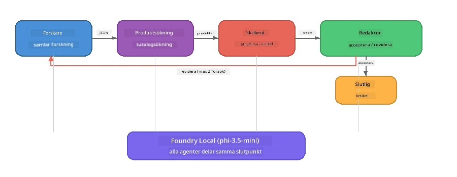

# Del 7: Zava Creative Writer - Capstone-applikation

> **Mål:** Utforska en produktionsstil multi-agent-applikation där fyra specialiserade agenter samarbetar för att producera tidskriftskvalitetsartiklar för Zava Retail DIY - som körs helt på din enhet med Foundry Local.

Detta är **capstone-labbet** i workshoppen. Det sammanför allt du har lärt dig - SDK-integration (Del 3), hämtning från lokal data (Del 4), agentpersonas (Del 5) och multi-agent-orkestrering (Del 6) - till en komplett applikation tillgänglig i **Python**, **JavaScript** och **C#**.

---

## Vad Du Kommer Utforska

| Koncept | Var i Zava Writer |
|---------|----------------------------|
| 4-stegs modellinladdning | Delad konfigurationsmodul startar Foundry Local |
| RAG-stil hämtning | Produktagent söker i en lokal katalog |
| Agent-specialisering | 4 agenter med distinkta systempromptar |
| Strömmande utdata | Skribenten levererar tokens i realtid |
| Strukturerade överlämningar | Researcher → JSON, Editor → JSON-beslut |
| Feedbackloopar | Editorn kan trigga omkörning (max 2 försök) |

---

## Arkitektur

Zava Creative Writer använder en **sekventiell pipeline med evaluatorstyrd feedback**. Alla tre språkversioner följer samma arkitektur:



### De Fyra Agenterna

| Agent | Input | Output | Syfte |
|-------|-------|--------|---------|
| **Researcher** | Ämne + valfri feedback | `{"web": [{url, name, description}, ...]}` | Samlar bakgrundsforskning via LLM |
| **Product Search** | Produktkontextsträng | Lista med matchande produkter | LLM-genererade sökfrågor + nyckelordssökning i lokal katalog |
| **Writer** | Forskning + produkter + uppdrag + feedback | Strömmad artikelttext (uppdelad vid `---`) | Skapar ett tidskriftskvalitetsutkast i realtid |
| **Editor** | Artikel + skribentens egenfeedback | `{"decision": "accept/revise", "editorFeedback": "...", "researchFeedback": "..."}` | Granskar kvalitet, triggar omförfattning vid behov |

### Pipeline-flöde

1. **Researcher** mottar ämnet och producerar strukturerade forskningsanteckningar (JSON)
2. **Product Search** söker i den lokala produktkatalogen med LLM-genererade söktermer
3. **Writer** kombinerar forskning + produkter + uppdrag till en strömmande artikel, lägger till egenfeedback efter en `---`-separator
4. **Editor** granskar artikeln och returnerar ett JSON-besked:
   - `"accept"` → pipeline slutförs
   - `"revise"` → feedback skickas tillbaka till Researcher och Writer (max 2 försök)

---

## Förutsättningar

- Slutför [Del 6: Multi-Agent Workflows](part6-multi-agent-workflows.md)
- Foundry Local CLI installerat och `phi-3.5-mini` modell nedladdad

---

## Övningar

### Övning 1 - Kör Zava Creative Writer

Välj ditt språk och kör applikationen:

<details>
<summary><strong>🐍 Python - FastAPI Webbtjänst</strong></summary>

Python-versionen körs som en **webbtjänst** med ett REST API, och visar hur man bygger en produktionsbackend.

**Setup:**
```bash
cd zava-creative-writer-local/src/api
python -m venv venv

# Windows (PowerShell):
venv\Scripts\Activate.ps1
# macOS:
source venv/bin/activate

pip install -r requirements.txt
```

**Kör:**
```bash
uvicorn main:app --reload
```

**Testa den:**
```bash
curl -X POST http://localhost:8000/api/article \
  -H "Content-Type: application/json" \
  -d '{
    "research": "DIY home improvement trends",
    "products": "power tools and paints",
    "assignment": "Write an article about weekend renovation projects for DIY enthusiasts"
  }'
```

Svaret strömmar tillbaka som radavgränsade JSON-meddelanden som visar varje agents framsteg.

</details>

<details>
<summary><strong>📦 JavaScript - Node.js CLI</strong></summary>

JavaScript-versionen körs som en **CLI-applikation**, som skriver ut agenternas framsteg och artikeln direkt i konsolen.

**Setup:**
```bash
cd zava-creative-writer-local/src/javascript
npm install
```

**Kör:**
```bash
node main.mjs
```

Du ser:
1. Foundry Local-modellinladdning (med förloppsindikator vid nedladdning)
2. Varje agent körs i sekvens med statusmeddelanden
3. Artikeln strömmas i realtid till konsolen
4. Editorns acceptans-/revisionsbeslut

</details>

<details>
<summary><strong>💜 C# - .NET Konsolapp</strong></summary>

C#-versionen körs som en **.NET konsolapplikation** med samma pipeline och strömmande output.

**Setup:**
```bash
cd zava-creative-writer-local/src/csharp
dotnet restore
```

**Kör:**
```bash
dotnet run
```

Samma utdata som JavaScript-versionen - agentstatusmeddelanden, strömmad artikel och editorbeslut.

</details>

---

### Övning 2 - Studera Kodstrukturen

Varje språkversion har samma logiska komponenter. Jämför strukturerna:

**Python** (`src/api/`):
| Fil | Syfte |
|------|---------|
| `foundry_config.py` | Delad Foundry Local-manager, modell och klient (4-stegs initiering) |
| `orchestrator.py` | Pipeline-koordinering med feedbackloop |
| `main.py` | FastAPI-endpoints (`POST /api/article`) |
| `agents/researcher/researcher.py` | LLM-baserad research med JSON-output |
| `agents/product/product.py` | LLM-genererade queries + nyckelordssökning |
| `agents/writer/writer.py` | Strömmande artikelgenerering |
| `agents/editor/editor.py` | JSON-baserat accept/revise beslut |

**JavaScript** (`src/javascript/`):
| Fil | Syfte |
|------|---------|
| `foundryConfig.mjs` | Delad Foundry Local-konfig (4-stegs init med förlopp) |
| `main.mjs` | Orkestrator + CLI-entrypoint |
| `researcher.mjs` | LLM-baserad researchagent |
| `product.mjs` | LLM-querygenerering + nyckelordssökning |
| `writer.mjs` | Strömmande artikelgenerering (async generator) |
| `editor.mjs` | JSON accept/revise beslut |
| `products.mjs` | Produktkatalogdata |

**C#** (`src/csharp/`):
| Fil | Syfte |
|------|---------|
| `Program.cs` | Komplett pipeline: modellinladdning, agenter, orkestrator, feedbackloop |
| `ZavaCreativeWriter.csproj` | .NET 9-projekt med Foundry Local + OpenAI-paket |

> **Designnotis:** Python delar upp varje agent i egen fil/mapp (bra för större team). JavaScript använder en modul per agent (bra för medelstora projekt). C# håller allt i en fil med lokala funktioner (bra för självständiga exempel). I produktion, välj mönstret som passar ditt teams konventioner.

---

### Övning 3 - Följ Den Delade Konfigurationen

Varje agent i pipelinen delar en enda Foundry Local modellklient. Studera hur detta sätts upp i varje språk:

<details>
<summary><strong>🐍 Python - foundry_config.py</strong></summary>

```python
from foundry_local import FoundryLocalManager

MODEL_ALIAS = "phi-3.5-mini"

# Steg 1: Skapa manager och starta Foundry Local-tjänsten
manager = FoundryLocalManager()
manager.start_service()

# Steg 2: Kontrollera om modellen redan är nedladdad
cached = manager.list_cached_models()
catalog_info = manager.get_model_info(MODEL_ALIAS)
is_cached = any(m.id == catalog_info.id for m in cached) if catalog_info else False

if not is_cached:
    manager.download_model(MODEL_ALIAS)

# Steg 3: Ladda modellen i minnet
manager.load_model(MODEL_ALIAS)
model_id = manager.get_model_info(MODEL_ALIAS).id

# Delad OpenAI-klient
client = openai.OpenAI(base_url=manager.endpoint, api_key=manager.api_key)
```

Alla agenter importerar `from foundry_config import client, model_id`.

</details>

<details>
<summary><strong>📦 JavaScript - foundryConfig.mjs</strong></summary>

```javascript
import { FoundryLocalManager } from "foundry-local-sdk";
import { OpenAI } from "openai";

FoundryLocalManager.create({ appName: "ZavaCreativeWriter" });
const manager = FoundryLocalManager.instance;
await manager.startWebService();

// Kontrollera cache → ladda ner → ladda (nytt SDK-mönster)
const catalog = manager.catalog;
const model = await catalog.getModel(MODEL_ALIAS);
if (!model.isCached) {
  console.log(`Downloading model: ${MODEL_ALIAS}...`);
  await model.download();
}
await model.load();

const client = new OpenAI({ baseURL: manager.urls[0] + "/v1", apiKey: "foundry-local" });
const modelId = model.id;
export { client, modelId };
```

Alla agenter importerar `{ client, modelId } from "./foundryConfig.mjs"`.

</details>

<details>
<summary><strong>💜 C# - toppen på Program.cs</strong></summary>

```csharp
await FoundryLocalManager.CreateAsync(
    new Configuration
    {
        AppName = "ZavaCreativeWriter",
        Web = new Configuration.WebService { Urls = "http://127.0.0.1:0" }
    }, NullLogger.Instance, default);
var manager = FoundryLocalManager.Instance;
await manager.StartWebServiceAsync(default);

var catalog = await manager.GetCatalogAsync(default);
var catalogModel = await catalog.GetModelAsync(alias, default);
var isCached = await catalogModel.IsCachedAsync(default);
if (!isCached)
    await catalogModel.DownloadAsync(null, default);

await catalogModel.LoadAsync(default);
var key = new ApiKeyCredential("foundry-local");
var chatClient = new OpenAIClient(key, new OpenAIClientOptions
{
    Endpoint = new Uri(manager.Urls[0] + "/v1")
}).GetChatClient(catalogModel.Id);
```

`chatClient` skickas sedan till alla agentfunktioner i samma fil.

</details>

> **Nyckelmönster:** Modellinladdningsmönstret (starta tjänst → kontrollera cache → ladda ner → ladda) säkerställer att användaren ser tydlig förlopp och att modellen bara laddas ner en gång. Detta är en bästa praxis för alla Foundry Local-applikationer.

---

### Övning 4 - Förstå Feedback-loopen

Feedback-loopen är vad som gör denna pipeline "smart" - editorn kan skicka tillbaka arbete för omarbetning. Följ logiken:

```
Orchestrator:
  1. researcher.research(topic, "No Feedback")    ← first pass
  2. product.findProducts(productContext)
  3. writer.write(research, products, assignment)  ← streams article
  4. Split article at "---" → article + writerFeedback
  5. editor.edit(article, writerFeedback)

  WHILE editor says "revise" AND retryCount < 2:
    6. researcher.research(topic, editor.researchFeedback)  ← refined
    7. writer.write(research, products, editor.editorFeedback)
    8. editor.edit(newArticle, newWriterFeedback)
    9. retryCount++
```

**Frågor att överväga:**
- Varför är retry-gränsen satt till 2? Vad händer om du ökar den?
- Varför får researchern `researchFeedback`, men författaren får `editorFeedback`?
- Vad händer om editorn alltid säger "revise"?

---

### Övning 5 - Modifiera en Agent

Prova att ändra en agents beteende och observera hur det påverkar pipelinen:

| Modifiering | Vad att ändra |
|-------------|----------------|
| **Striktare editor** | Ändra editorns systemprompt så att den alltid kräver minst en revision |
| **Längre artiklar** | Ändra författarens prompt från "800-1000 ord" till "1500-2000 ord" |
| **Andra produkter** | Lägg till eller ändra produkter i produktkatalogen |
| **Nytt forskningstema** | Ändra standardvärdet för `researchContext` till ett annat ämne |
| **Endast JSON researcher** | Gör så att researchern returnerar 10 objekt istället för 3-5 |

> **Tips:** Eftersom alla tre språk implementerar samma arkitektur kan du göra samma ändring i det språk du är mest bekväm med.

---

### Övning 6 - Lägg till en Femte Agent

Utöka pipelinen med en ny agent. Några idéer:

| Agent | Var i pipelinen | Syfte |
|-------|-----------------|--------|
| **Fact-Checker** | Efter Writer, före Editor | Verifiera påståenden mot forskningsdata |
| **SEO Optimiser** | Efter att Editor accepterar | Lägg till meta-beskrivning, nyckelord, slug |
| **Illustrator** | Efter att Editor accepterar | Generera bildpromptar för artikeln |
| **Translator** | Efter att Editor accepterar | Översätt artikeln till ett annat språk |

**Steg:**
1. Skriv agentens systemprompt
2. Skapa agentfunktionen (matcha befintligt mönster i ditt språk)
3. Infoga den i orkestratorn på rätt ställe
4. Uppdatera output/logg för att visa den nya agentens bidrag

---

## Hur Foundry Local och Agent-ramverket Samarbetar

Denna applikation demonstrerar det rekommenderade mönstret för att bygga multi-agent-system med Foundry Local:

| Lager | Komponent | Roll |
|-------|-----------|------|
| **Körning** | Foundry Local | Laddar ner, hanterar och tillhandahåller modellen lokalt |
| **Klient** | OpenAI SDK | Skickar chat-completions till den lokala endpointen |
| **Agent** | Systemprompt + chatt-anrop | specialiserat beteende via fokuserade instruktioner |
| **Orkestrator** | Pipeline-koordinator | Hanterar dataflöde, sekvenser och feedbackloopar |
| **Ramverk** | Microsoft Agent Framework | Tillhandahåller `ChatAgent`-abstraktion och mönster |

Huvudinsikten: **Foundry Local ersätter molnbakend, inte applikationsarkitekturen.** Samma agentmönster, orkestreringsstrategier och strukturerade överlämningar som fungerar med molnhostade modeller fungerar identiskt med lokala modeller — du pekar bara klienten på den lokala endpointen istället för en Azure-endpoint.

---

## Viktiga Slutsatser

| Koncept | Vad Du Lärt Dig |
|---------|-----------------|
| Produktionsarkitektur | Hur man strukturerar en multi-agent-app med delad config och separata agenter |
| 4-stegs modellinladdning | Bästa praxis för att initiera Foundry Local med för användaren synligt förlopp |
| Agent-specialisering | Varje av 4 agenter har fokuserade instruktioner och ett specifikt outputformat |
| Strömmande generering | Författaren levererar tokens i realtid, möjliggör responsiva UI:er |
| Feedbackloopar | Editorstyrd omkörning förbättrar outputkvalitet utan mänsklig inblandning |
| Korsspråkliga mönster | Samma arkitektur fungerar i Python, JavaScript och C# |
| Lokal = produktionsklar | Foundry Local tillhandahåller samma OpenAI-kompatibla API som molndistributioner |

---

## Nästa Steg

Fortsätt till [Del 8: Evaluation-Led Development](part8-evaluation-led-development.md) för att bygga ett systematiskt utvärderingsramverk för dina agenter, med guld-dataset, regelbaserade kontroller och LLM-som-domare-poängsättning.

---

<!-- CO-OP TRANSLATOR DISCLAIMER START -->
**Friskrivning**:  
Detta dokument har översatts med hjälp av AI-översättningstjänsten [Co-op Translator](https://github.com/Azure/co-op-translator). Även om vi eftersträvar noggrannhet, var god notera att automatiska översättningar kan innehålla fel eller brister. Det ursprungliga dokumentet på dess modersmål bör anses vara den auktoritativa källan. För kritisk information rekommenderas professionell mänsklig översättning. Vi ansvarar inte för några missförstånd eller feltolkningar som uppstår vid användning av denna översättning.
<!-- CO-OP TRANSLATOR DISCLAIMER END -->