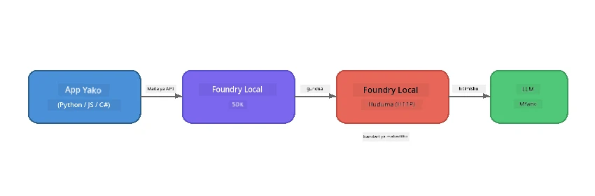

# Sehemu ya 1: Kuanzia na Foundry Local


## Foundry Local ni Nini?

[Foundry Local](https://foundrylocal.ai) inakuwezesha kuendesha mifano ya lugha ya AI yenye chanzo wazi **moja kwa moja kwenye kompyuta yako** - hakuna internet inayohitajika, hakuna gharama za wingu, na usalama wa data kwa ukamilifu. Inafanya:

- **Kupakua na kuendesha mifano lokal kwenye mashine yako** kwa usanifu wa vifaa kiotomatiki (GPU, CPU, au NPU)
- **Kutoa API inayolingana na OpenAI** ili uweze kutumia SDK na zana unazozifahamu
- **Haihitaji usajili wa Azure** au kujiandikisha - ingiza tu na anza kujenga

Fikiria kama unavyokuwa na AI wa kibinafsi anayekimbia kabisa kwenye mashine yako.

## Malengo ya Kujifunza

Mwisho wa mafunzo haya utaweza:

- Kufunga Foundry Local CLI kwenye mfumo wako wa uendeshaji
- Kuelewa nini ni majina mbadala ya modeli na jinsi wanavyofanya kazi
- Kupakua na kuendesha modeli yako ya kwanza ya AI ya lokale
- Kutuma ujumbe wa mazungumzo kwa modeli ya lokale kutoka kwa mstari wa amri
- Kuelewa tofauti kati ya mifano ya AI inayopatikana lokal na ile inayoshikiliwa kwenye wingu

---

## Masharti

### Mahitaji ya Mfumo

| Hitaji | Chinchi | Inayopendekezwa |
|-------------|---------|-------------|
| **RAM** | 8 GB | 16 GB |
| **Eneo la Diski** | 5 GB (kwa mifano) | 10 GB |
| **CPU** | Core 4 | Core 8+ |
| **GPU** | Si lazima | NVIDIA yenye CUDA 11.8+ |
| **OS** | Windows 10/11 (x64/ARM), Windows Server 2025, macOS 13+ | - |

> **Kumbuka:** Foundry Local huchagua toleo bora kabisa la modeli kulingana na vifaa vyako kiotomatiki. Ikiwa una GPU ya NVIDIA, inatumia kasi ya CUDA. Ikiwa una Qualcomm NPU, hutumia hiyo. Vinginevyo inatumia toleo lililoboreshwa la CPU.

### Fungua Foundry Local CLI

**Windows** (PowerShell):
```powershell
winget install Microsoft.FoundryLocal
```

**macOS** (Homebrew):
```bash
brew tap microsoft/foundrylocal
brew install foundrylocal
```

> **Kumbuka:** Foundry Local kwa sasa inasaidia Windows na macOS tu. Linux haijaidhinishwa kwa sasa.

Thibitisha usakinishaji:
```bash
foundry --version
```

---

## Mazoezi ya Maabara

### Zozi 1: Chunguza Mifano Inayopatikana

Foundry Local ina katalogi ya mifano ya chanzo wazi iliyoboreshwa tayari. Orodhesha:

```bash
foundry model list
```

Utaona mifano kama:
- `phi-3.5-mini` - Mfano wa parameta 3.8B wa Microsoft (haraka, ubora mzuri)
- `phi-4-mini` - Mfano mpya zaidi na wenye uwezo mkubwa wa Phi
- `phi-4-mini-reasoning` - Mfano wa Phi wenye sababu za mnyororo wa mawazo (`<think>` tags)
- `phi-4` - Mfano mkubwa zaidi wa Phi wa Microsoft (10.4 GB)
- `qwen2.5-0.5b` - Ndogo sana na haraka (mzuri kwa vifaa vyenye rasilimali ndogo)
- `qwen2.5-7b` - Mfano thabiti wa matumizi ya jumla yenye msaada wa kuitwa kwa zana
- `qwen2.5-coder-7b` - Imeboresha kwa ajili ya uzalishaji wa msimbo
- `deepseek-r1-7b` - Mfano thabiti wa ajili ya kufikiri kwa kina
- `gpt-oss-20b` - Mfano mkubwa wa chanzo wazi (leseni ya MIT, 12.5 GB)
- `whisper-base` - Ubadilishaji wa sauti kuwa maandishi (383 MB)
- `whisper-large-v3-turbo` - Ubadilishaji sahihi sana (9 GB)

> **Je, ni nini jina la modeli?** Majina mbadala kama `phi-3.5-mini` ni njia fupi. Unapotumia jina mbadala, Foundry Local hujipakulia kiotomatiki toleo bora la modeli kwa vifaa vyako maalum (CUDA kwa GPU za NVIDIA, toleo lililoboreshwa la CPU vinginevyo). Huhitaji kuwaza juu ya kuchagua toleo sahihi.

### Zozi 2: Endesha Mfano Wako wa Kwanza

Pakua na anzisha mazungumzo na mfano kwa njia ya mwingiliano:

```bash
foundry model run phi-3.5-mini
```

Mara ya kwanza unapoendesha hii, Foundry Local itafanya:
1. Kuchunguza vifaa vyako
2. Kupakua toleo bora la modeli (hii inaweza kuchukua dakika chache)
3. Kupakia modeli kwenye kumbukumbu
4. Kuanza kipindi cha mazungumzo ya mwingiliano

Jaribu kuuliza maswali:
```
You: What is the golden ratio?
You: Can you explain it as if I were 10 years old?
You: Write a haiku about mathematics
```

Andika `exit` au bonyeza `Ctrl+C` kuacha.

### Zozi 3: Pakua Mfano Kabla

Ikiwa unataka kupakua mfano bila kuanza mazungumzo:

```bash
foundry model download phi-3.5-mini
```

Angalia mifano ambayo tayari imeshapakuliwa kwenye mashine yako:

```bash
foundry cache list
```

### Zozi 4: Elewa Miundo

Foundry Local inaendesha kama **huduma ya HTTP lokal** inayofungua API inayolingana na OpenAI. Hii ina maana:

1. Huduma huanzishwa kwenye **bandari inayobadilika** (bandari tofauti kila wakati)
2. Unatumia SDK kugundua URL halisi ya mwisho
3. Unaweza kutumia maktaba yoyote ya mteja inayolingana na OpenAI kuzungumza nayo



> **Muhimu:** Foundry Local hupewa nambari ya **bandari inayobadilika** kila mara inaanza. Usifanye hardcode nambari ya bandari kama `localhost:5272`. Daima tumia SDK kugundua URL ya sasa (mfano `manager.endpoint` kwenye Python au `manager.urls[0]` kwenye JavaScript).

---

## Muhimu wa Kukumbuka

| Dhana | Uliyojifunza |
|---------|------------------|
| AI kwenye kifaa | Foundry Local inaendesha mifano yote kabisa kwenye kifaa chako bila wingu, bila funguo za API, na bila gharama|
| Majina mbadala ya modeli | Majina mbadala kama `phi-3.5-mini` huchagua toleo bora kiotomatiki kwa vifaa vyako |
| Bandari zinazobadilika | Huduma inaendesha kwenye bandari inayobadilika; daima tumia SDK kugundua mwisho wa huduma |
| CLI na SDK | Unaweza kuingiliana na mifano kupitia CLI (`foundry model run`) au programmatically kupitia SDK |

---

## Hatua Zifuatazo

Endelea kwenye [Sehemu ya 2: Foundry Local SDK Ufaulu wa Kina](part2-foundry-local-sdk.md) ili utafsiri API ya SDK kwa kusimamia mifano, huduma, na uhifadhi kwa njia ya programu.

---

<!-- CO-OP TRANSLATOR DISCLAIMER START -->
**Kionyesha Majuto**:  
Hati hii imetafsiriwa kwa kutumia huduma ya tafsiri ya AI [Co-op Translator](https://github.com/Azure/co-op-translator). Ingawa tunajitahidi kwa usahihi, tafadhali fahamu kuwa tafsiri za mashine zinaweza kuwa na makosa au kutokukamilika. Hati ya awali katika lugha yake ya asili inapaswa kuchukuliwa kama chanzo chenye mamlaka. Kwa taarifa muhimu, tafsiri ya mtaalamu wa binadamu inashauriwa. Hatuna dhamana kwa kutoelewana au tafsiri zisizo sahihi zinazotokana na matumizi ya tafsiri hii.
<!-- CO-OP TRANSLATOR DISCLAIMER END -->