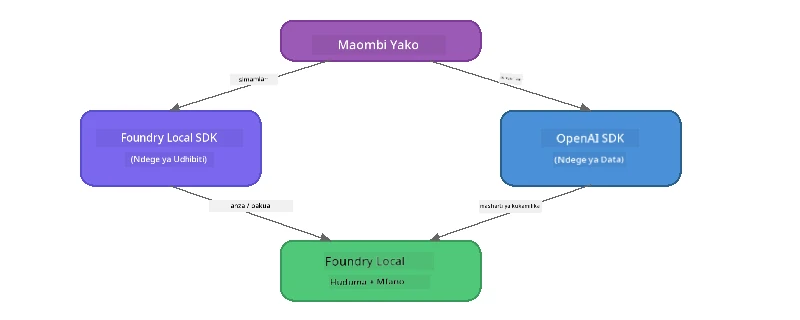

# Sehemu ya 3: Kutumia Foundry Local SDK na OpenAI

## Muhtasari

Katika Sehemu ya 1 ulitumia Foundry Local CLI kuendesha mifano kwa mwingiliano. Katika Sehemu ya 2 ulichunguza uso wa API kamili wa SDK. Sasa utajifunza jinsi ya **kuunganisha Foundry Local katika programu zako** ukitumia SDK na API inayolingana na OpenAI.

Foundry Local hutoa SDK kwa lugha tatu. Chagua ile unayojua zaidi - dhana zote ni sawa katika zote tatu.

## Malengo ya Kujifunza

Mwisho wa maabara hii utaweza:

- Kusakinisha Foundry Local SDK kwa lugha yako (Python, JavaScript, au C#)
- Kuanzisha `FoundryLocalManager` kuanzisha huduma, kuangalia cache, kupakua, na kupakia mfano
- Kuungana na mfano wa ndani ukitumia OpenAI SDK
- Kutuma mazungumzo ya kukamilishwa na kushughulikia majibu ya kuendelea
- Kuelewa usanifu wa bandari za mabadiliko

---

## Mahitaji ya Awali

Kamilisha [Sehemu ya 1: Kuanzisha na Foundry Local](part1-getting-started.md) na [Sehemu ya 2: Uchunguzi wa Kina wa SDK ya Foundry Local](part2-foundry-local-sdk.md) kwanza.

Sakinisha **moja** kati ya runtime hizi za lugha:
- **Python 3.9+** - [python.org/downloads](https://www.python.org/downloads/)
- **Node.js 18+** - [nodejs.org](https://nodejs.org/)
- **.NET 9.0+** - [dot.net/download](https://dotnet.microsoft.com/download)

---

## Dhana: SDK Inavyofanya Kazi

Foundry Local SDK inasimamia **kifugo cha udhibiti** (kuanzisha huduma, kupakua mifano), wakati OpenAI SDK inashughulikia **kifugo cha data** (kutuma maelekezo, kupokea kukamilishwa).



---

## Mazoezi ya Maabara

### Zoezi 1: Andaa Mazingira Yako

<details>
<summary><b>🐍 Python</b></summary>

```bash
cd python
python -m venv venv

# Washa mazingira ya kidijitali:
# Windows (PowerShell):
venv\Scripts\Activate.ps1
# Windows (Command Prompt):
venv\Scripts\activate.bat
# macOS:
source venv/bin/activate

pip install -r requirements.txt
```

`requirements.txt` inasakinisha:
- `foundry-local-sdk` - Foundry Local SDK (inayoingizwa kama `foundry_local`)
- `openai` - OpenAI Python SDK
- `agent-framework` - Microsoft Agent Framework (inayotumika katika sehemu za baadaye)

</details>

<details>
<summary><b>📘 JavaScript</b></summary>

```bash
cd javascript
npm install
```

`package.json` inasakinisha:
- `foundry-local-sdk` - Foundry Local SDK
- `openai` - OpenAI Node.js SDK

</details>

<details>
<summary><b>💜 C#</b></summary>

```bash
cd csharp
dotnet restore
dotnet build
```

`csharp.csproj` inatumia:
- `Microsoft.AI.Foundry.Local` - Foundry Local SDK (NuGet)
- `OpenAI` - OpenAI C# SDK (NuGet)

> **Muundo wa Mradi:** Mradi wa C# unatumia router ya mstari wa amri katika `Program.cs` ambayo hupeleka kwa faili tofauti za mifano. Endesha `dotnet run chat` (au tu `dotnet run`) kwa sehemu hii. Sehemu zingine hutumia `dotnet run rag`, `dotnet run agent`, na `dotnet run multi`.

</details>

---

### Zoezi 2: Kukamilisha Mazungumzo ya Msingi

Fungua mfano wa mazungumzo wa msingi kwa lugha yako na chunguza msimbo. Kila script hufuata mtindo wa hatua tatu hizi:

1. **Anzisha huduma** - `FoundryLocalManager` huanza runtime ya Foundry Local
2. **Pakua na pakia mfano** - angalia cache, pakua ikiwa inahitajika, kisha paka kwenye kumbukumbu
3. **Tengeneza mteja wa OpenAI** - ungana na kiungo cha ndani na tuma mazungumzo ya kukamilisha kwa ajili ya kuendelea

<details>
<summary><b>🐍 Python - <code>python/foundry-local.py</code></b></summary>

```python
import sys
import openai
from foundry_local import FoundryLocalManager

alias = "phi-3.5-mini"

# Hatua ya 1: Unda FoundryLocalManager na anzisha huduma
print("Starting Foundry Local service...")
manager = FoundryLocalManager()
manager.start_service()

# Hatua ya 2: Angalia kama mfano tayari umepakuliwa
cached = manager.list_cached_models()
catalog_info = manager.get_model_info(alias)
is_cached = any(m.id == catalog_info.id for m in cached) if catalog_info else False

if is_cached:
    print(f"Model already downloaded: {alias}")
else:
    print(f"Downloading model: {alias} (this may take several minutes)...")
    manager.download_model(alias)
    print(f"Download complete: {alias}")

# Hatua ya 3: Pakia mfano kwenye kumbukumbu
print(f"Loading model: {alias}...")
manager.load_model(alias)

# Unda mteja wa OpenAI unaoelekeza kwenye huduma ya LOCAL Foundry
client = openai.OpenAI(
    base_url=manager.endpoint,   # Bandari ya mabadiliko - kamwe usiwe na msimbo mgumu!
    api_key=manager.api_key
)

# Tengeneza ukamilisho wa mazungumzo wa mtiririko
stream = client.chat.completions.create(
    model=manager.get_model_info(alias).id,
    messages=[{"role": "user", "content": "What is the golden ratio?"}],
    stream=True,
)

for chunk in stream:
    if chunk.choices[0].delta.content is not None:
        print(chunk.choices[0].delta.content, end="", flush=True)
print()
```

**Endesha:**
```bash
python foundry-local.py
```

</details>

<details>
<summary><b>📘 JavaScript - <code>javascript/foundry-local.mjs</code></b></summary>

```javascript
import { OpenAI } from "openai";
import { FoundryLocalManager } from "foundry-local-sdk";

const alias = "phi-3.5-mini";

// Hatua ya 1: Anzisha huduma ya Foundry Local
console.log("Starting Foundry Local service...");
FoundryLocalManager.create({ appName: "FoundryLocalWorkshop" });
const manager = FoundryLocalManager.instance;
await manager.startWebService();

// Hatua ya 2: Angalia kama modeli tayari imeshapakuliwa
const catalog = manager.catalog;
const model = await catalog.getModel(alias);

if (model.isCached) {
  console.log(`Model already downloaded: ${alias}`);
} else {
  console.log(`Downloading model: ${alias} (this may take several minutes)...`);
  await model.download();
  console.log(`Download complete: ${alias}`);
}

// Hatua ya 3: Pakia modeli kwenye kumbukumbu
console.log(`Loading model: ${alias}...`);
await model.load();
console.log(`Model loaded: ${model.id}`);

// Unda mteja wa OpenAI unaoelekeza kwa huduma ya FOUNDARY ya LOCAL
const client = new OpenAI({
  baseURL: manager.urls[0] + "/v1",   // Porti inayobadilika - usiweka thamani ngumu kamwe!
  apiKey: "foundry-local",
});

// Tengeneza mazungumzo ya mdundo wa kuishi
const stream = await client.chat.completions.create({
  model: model.id,
  messages: [{ role: "user", content: "What is the golden ratio?" }],
  stream: true,
});

for await (const chunk of stream) {
  if (chunk.choices[0]?.delta?.content) {
    process.stdout.write(chunk.choices[0].delta.content);
  }
}
console.log();
```

**Endesha:**
```bash
node foundry-local.mjs
```

</details>

<details>
<summary><b>💜 C# - <code>csharp/BasicChat.cs</code></b></summary>

```csharp
using Microsoft.AI.Foundry.Local;
using Microsoft.Extensions.Logging.Abstractions;
using OpenAI;
using OpenAI.Chat;
using System.ClientModel;

var alias = "phi-3.5-mini";

// Step 1: Start the Foundry Local service
Console.WriteLine("Starting Foundry Local service...");
await FoundryLocalManager.CreateAsync(
    new Configuration
    {
        AppName = "FoundryLocalSamples",
        Web = new Configuration.WebService { Urls = "http://127.0.0.1:0" }
    }, NullLogger.Instance, default);
var manager = FoundryLocalManager.Instance;
await manager.StartWebServiceAsync(default);

// Step 2: Get the model from the catalog
var catalog = await manager.GetCatalogAsync(default);
var model = await catalog.GetModelAsync(alias, default);

// Step 3: Check if the model is already downloaded
var isCached = await model.IsCachedAsync(default);

if (isCached)
{
    Console.WriteLine($"Model already downloaded: {alias}");
}
else
{
    Console.WriteLine($"Downloading model: {alias} (this may take several minutes)...");
    await model.DownloadAsync(null, default);
    Console.WriteLine($"Download complete: {alias}");
}

// Step 4: Load the model into memory
Console.WriteLine($"Loading model: {alias}...");
await model.LoadAsync(default);
Console.WriteLine($"Loaded model: {model.Id}");
Console.WriteLine($"Endpoint: {manager.Urls[0]}");

// Create OpenAI client pointing to the LOCAL Foundry service
var key = new ApiKeyCredential("foundry-local");
var client = new OpenAIClient(key, new OpenAIClientOptions
{
    Endpoint = new Uri(manager.Urls[0] + "/v1")  // Dynamic port - never hardcode!
});

var chatClient = client.GetChatClient(model.Id);

// Stream a chat completion
var completionUpdates = chatClient.CompleteChatStreaming("What is the golden ratio?");

foreach (var update in completionUpdates)
{
    if (update.ContentUpdate.Count > 0)
    {
        Console.Write(update.ContentUpdate[0].Text);
    }
}
Console.WriteLine();
```

**Endesha:**
```bash
dotnet run chat
```

</details>

---

### Zoezi 3: Jaribu na Maelekezo

Mara mfano wako wa msingi ukaendesha, jaribu kubadilisha msimbo:

1. **Badilisha ujumbe wa mtumiaji** - jaribu maswali tofauti
2. **Ongeza maelekezo ya mfumo** - mpe mfano tabia fulani
3. **Zima kuendelea kwa mtiririko** - weka `stream=False` na chapisha jibu kamili mara moja
4. **Jaribu mfano mwingine** - badilisha jina la utani kutoka `phi-3.5-mini` kwenda mfano mwingine kutoka `foundry model list`

<details>
<summary><b>🐍 Python</b></summary>

```python
# Ongeza maelekezo ya mfumo - mpe modeli utu:
stream = client.chat.completions.create(
    model=manager.get_model_info(alias).id,
    messages=[
        {"role": "system", "content": "You are a pirate. Answer everything in pirate speak."},
        {"role": "user", "content": "What is the golden ratio?"}
    ],
    stream=True,
)

# Au zima uondoaji wa data kwa wakati halisi:
response = client.chat.completions.create(
    model=manager.get_model_info(alias).id,
    messages=[{"role": "user", "content": "What is the golden ratio?"}],
    stream=False,
)
print(response.choices[0].message.content)
```

</details>

<details>
<summary><b>📘 JavaScript</b></summary>

```javascript
// Ongeza agizo la mfumo - mpe mfano hadhira yaji:
const stream = await client.chat.completions.create({
  model: modelInfo.id,
  messages: [
    { role: "system", content: "You are a pirate. Answer everything in pirate speak." },
    { role: "user", content: "What is the golden ratio?" },
  ],
  stream: true,
});

// Au zima utiririshaji:
const response = await client.chat.completions.create({
  model: modelInfo.id,
  messages: [{ role: "user", content: "What is the golden ratio?" }],
  stream: false,
});
console.log(response.choices[0].message.content);
```

</details>

<details>
<summary><b>💜 C#</b></summary>

```csharp
// Add a system prompt - give the model a persona:
var completionUpdates = chatClient.CompleteChatStreaming(
    new ChatMessage[]
    {
        new SystemChatMessage("You are a pirate. Answer everything in pirate speak."),
        new UserChatMessage("What is the golden ratio?")
    }
);

// Or turn off streaming:
var response = chatClient.CompleteChat("What is the golden ratio?");
Console.WriteLine(response.Value.Content[0].Text);
```

</details>

---

### Marejeleo ya Mbinu za SDK

<details>
<summary><b>🐍 Mbinu za Python SDK</b></summary>

| Mbinu | Kusudi |
|--------|---------|
| `FoundryLocalManager()` | Tengeneza mfano wa meneja |
| `manager.start_service()` | Anzisha huduma ya Foundry Local |
| `manager.list_cached_models()` | Orodhesha mifano iliyopakuliwa kwenye kifaa chako |
| `manager.get_model_info(alias)` | Pata kitambulisho cha mfano na metadata |
| `manager.download_model(alias, progress_callback=fn)` | Pakua mfano kwa hiari ya callback ya maendeleo |
| `manager.load_model(alias)` | Paka mfano kwenye kumbukumbu |
| `manager.endpoint` | Pata URL ya kiungo cha mabadiliko |
| `manager.api_key` | Pata API key (nafasi ya kuingiza kwa lokal) |

</details>

<details>
<summary><b>📘 Mbinu za JavaScript SDK</b></summary>

| Mbinu | Kusudi |
|--------|---------|
| `FoundryLocalManager.create({ appName })` | Tengeneza mfano wa meneja |
| `FoundryLocalManager.instance` | Pata meneja singleton |
| `await manager.startWebService()` | Anzisha huduma ya Foundry Local |
| `await manager.catalog.getModel(alias)` | Pata mfano kutoka katalo |
| `model.isCached` | Angalia ikiwa mfano tayari umepakuliwa |
| `await model.download()` | Pakua mfano |
| `await model.load()` | Paka mfano kwenye kumbukumbu |
| `model.id` | Pata kitambulisho cha mfano kwa API ya OpenAI |
| `manager.urls[0] + "/v1"` | Pata URL ya kiungo cha mabadiliko |
| `"foundry-local"` | API key (nafasi ya kuingiza kwa lokal) |

</details>

<details>
<summary><b>💜 Mbinu za C# SDK</b></summary>

| Mbinu | Kusudi |
|--------|---------|
| `FoundryLocalManager.CreateAsync(config)` | Tengeneza na anzisha meneja |
| `manager.StartWebServiceAsync()` | Anzisha huduma ya wavuti ya Foundry Local |
| `manager.GetCatalogAsync()` | Pata katalo ya mifano |
| `catalog.ListModelsAsync()` | Orodhesha mifano yote inayopatikana |
| `catalog.GetModelAsync(alias)` | Pata mfano fulani kwa jina la utani |
| `model.IsCachedAsync()` | Angalia ikiwa mfano ume pakuliwa |
| `model.DownloadAsync()` | Pakua mfano |
| `model.LoadAsync()` | Paka mfano kwenye kumbukumbu |
| `manager.Urls[0]` | Pata URL ya kiungo cha mabadiliko |
| `new ApiKeyCredential("foundry-local")` | Leseni ya API key kwa lokal |

</details>

---

### Zoezi 4: Kutumia ChatClient Asilia (Mbali na OpenAI SDK)

Katika Mazoezi 2 na 3 ulitumia OpenAI SDK kwa kukamilisha mazungumzo. SDK za JavaScript na C# pia hutoa **ChatClient asilia** inayotenganisha haja ya OpenAI SDK kabisa.

<details>
<summary><b>📘 JavaScript - <code>model.createChatClient()</code></b></summary>

```javascript
import { FoundryLocalManager } from "foundry-local-sdk";

const alias = "phi-3.5-mini";

FoundryLocalManager.create({ appName: "ChatClientDemo" });
const manager = FoundryLocalManager.instance;
await manager.startWebService();

const model = await manager.catalog.getModel(alias);
if (!model.isCached) await model.download();
await model.load();

// Hakuna haja ya kuingiza OpenAI — pata mteja moja kwa moja kutoka kwa mfano
const chatClient = model.createChatClient();

// Ukamilishaji usiopitia mtiririko
const response = await chatClient.completeChat([
  { role: "system", content: "You are a pirate. Answer everything in pirate speak." },
  { role: "user", content: "What is the golden ratio?" }
]);
console.log(response.choices[0].message.content);

// Ukamilishaji wa mtiririko (inatumia mtindo wa kupitisha taarifa)
await chatClient.completeStreamingChat(
  [{ role: "user", content: "What is the golden ratio?" }],
  (chunk) => {
    if (chunk.choices?.[0]?.delta?.content) {
      process.stdout.write(chunk.choices[0].delta.content);
    }
  }
);
console.log();
```

> **Kumbuka:** `completeStreamingChat()` ya ChatClient hutumia muundo wa **callback**, si iterator async. Pita kazi kama hoja ya pili.

</details>

<details>
<summary><b>💜 C# - <code>model.GetChatClientAsync()</code></b></summary>

```csharp
var catalog = await manager.GetCatalogAsync(default);
var model = await catalog.GetModelAsync("phi-3.5-mini", default);
if (!await model.IsCachedAsync(default))
    await model.DownloadAsync(null, default);
await model.LoadAsync(default);

// No OpenAI NuGet needed — get a client directly from the model
var chatClient = await model.GetChatClientAsync(default);

// Use it like a standard OpenAI ChatClient
var response = chatClient.CompleteChat("What is the golden ratio?");
Console.WriteLine(response.Value.Content[0].Text);
```

</details>

> **Lakati wa matumizi:**
> | Njia | Inafaa kwa |
> |----------|----------|
> | OpenAI SDK | Udhibiti kamili wa vigezo, programu za uzalishaji, msimbo uliopo wa OpenAI |
> | ChatClient Asilia | Maandalizi ya haraka, utegemezi mdogo, usanidi rahisi |

---

## Muhimu Kwa Kumbuka

| Dhana | Uliyojifunza |
|---------|------------------|
| Kifugo cha udhibiti | Foundry Local SDK hushughulikia kuanzisha huduma na kupakia mifano |
| Kifugo cha data | OpenAI SDK hushughulikia kukamilisha mazungumzo na mtiririko |
| Bandari za mabadiliko | Tumia SDK kila mara kugundua kiungo; usiweka URL ngumu |
| Lugha tofauti | Msimbo sawa unafanya kazi kwenye Python, JavaScript, na C# |
| Ulinganifu wa OpenAI | Ulinganifu kamili wa API ya OpenAI unamaanisha msimbo uliopo wa OpenAI unafanya kazi kwa mabadiliko madogo |
| ChatClient Asilia | `createChatClient()` (JS) / `GetChatClientAsync()` (C#) hutoa mbadala kwa OpenAI SDK |

---

## Hatua Zifuatazo

Endelea na [Sehemu ya 4: Kujenga Programu ya RAG](part4-rag-fundamentals.md) kujifunza jinsi ya kujenga njia ya Uzalishaji ulioboreshwa na Utafutaji ukifanya kazi kabisa kwenye kifaa chako.

---

<!-- CO-OP TRANSLATOR DISCLAIMER START -->
**Hati ya kukataa**:  
Hati hii imetafsiriwa kwa kutumia huduma ya utafsiri wa AI [Co-op Translator](https://github.com/Azure/co-op-translator). Ingawa tunajitahidi kwa usahihi, tafadhali fahamu kuwa utafsiri wa kiotomatiki unaweza kuwa na makosa au kutokukamilika. Hati asili katika lugha yake ya asili inapaswa kuchukuliwa kama chanzo cha mamlaka. Kwa taarifa muhimu, tafsiri ya mtaalamu wa binadamu inashauriwa. Hatuna dhamana kwa kutoelewana au tafsiri potofu zinazotokana na matumizi ya utafsiri huu.
<!-- CO-OP TRANSLATOR DISCLAIMER END -->