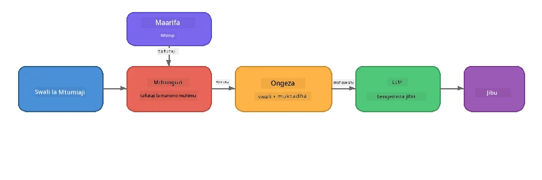

# Sehemu ya 4: Kujenga Programu ya RAG na Foundry Local

## Muhtasari

Modeli Kubwa za Lugha ni zenye nguvu, lakini zinafahamu tu kile kilicho kwenye data zao za mafunzo. **Uzalishaji Ulioboreshwa kwa Upataji (RAG)** unatatua hili kwa kumuweka mfano muktadha unaofaa wakati wa kuuliza - unaovutwa kutoka kwa hati zako mwenyewe, hifadhidata, au misingi ya maarifa.

Katika mazoezi haya uta jenga mnyororo kamili wa RAG unaoendeshwa **kabisa kwenye kifaa chako** ukitumia Foundry Local. Hakuna huduma za wingu, hakuna hifadhidata za vekta, hakuna API za embeddings - ni upataji wa ndani tu na mfano wa ndani.

## Malengo ya Kujifunza

Mwisho wa mazoezi haya utaweza:

- Kueleza RAG ni nini na kwa nini ni muhimu kwa programu za AI
- Kujenga msingi wa maarifa wa ndani kutoka kwa hati za maandishi
- Kutekeleza kazi rahisi ya upataji ili kupata muktadha unaofaa
- Kuunda agizo la mfumo linalowezesha mfano kufundishwa kwenye ukweli uliopatikana
- Kuendesha mnyororo kamili wa Retrieve → Augment → Generate kwenye kifaa
- Kuelewa mapungufu kati ya upataji wa neno kuu rahisi na utafutaji wa vektari

---

## Mahitaji ya Awali

- Kumaliza [Sehemu ya 3: Kutumia Foundry Local SDK na OpenAI](part3-sdk-and-apis.md)
- Kuwekeza CLI ya Foundry Local na mfano wa `phi-3.5-mini` kupakuliwa

---

## Dhana: RAG ni Nini?

Bila RAG, LLM inaweza kujibu tu kutoka kwa data zake za mafunzo - ambazo zinaweza kuwa za zamani, hazikamiliki, au hazina habari zako za faragha:

```
User: "What is Zava's return policy?"
LLM:  "I do not have information about Zava's return policy."  ← No context!
```

Kwa RAG, unaanza kwa **kupata** hati zinazofaa, kisha **kuwaongeza** agizo kwa muktadha huo kabla ya **kutengeneza** jibu:



Kumbukumbu muhimu: **mfano hauhitaji "kujua" jibu; unahitaji tu kusoma hati sahihi.**

---

## Mazoezi ya Maabara

### Zoekzoezi la 1: Elewa Msingi wa Maarifa

Fungua mfano wa RAG kwa lugha yako na angalia msingi wa maarifa:

<details>
<summary><b>🐍 Python: <code>python/foundry-local-rag.py</code></b></summary>

Msingi wa maarifa ni orodha rahisi ya kamusi zilizo na viwanja vya `title` na `content`:

```python
KNOWLEDGE_BASE = [
    {
        "title": "Foundry Local Overview",
        "content": (
            "Foundry Local brings the power of Azure AI Foundry to your local "
            "device without requiring an Azure subscription..."
        ),
    },
    {
        "title": "Supported Hardware",
        "content": (
            "Foundry Local automatically selects the best model variant for "
            "your hardware. If you have an Nvidia CUDA GPU it downloads the "
            "CUDA-optimized model..."
        ),
    },
    # ... maingizo zaidi
]
```

Kila ingizo linawakilisha "kipande" cha maarifa - kipande kilicholenga cha taarifa juu ya mada moja.

</details>

<details>
<summary><b>📘 JavaScript: <code>javascript/foundry-local-rag.mjs</code></b></summary>

Msingi wa maarifa unatumia muundo sawa kama safu ya vitu:

```javascript
const KNOWLEDGE_BASE = [
  {
    title: "Foundry Local Overview",
    content:
      "Foundry Local brings the power of Azure AI Foundry to your local " +
      "device without requiring an Azure subscription...",
  },
  {
    title: "Supported Hardware",
    content:
      "Foundry Local automatically selects the best model variant for " +
      "your hardware...",
  },
  // ... ingizo zaidi
];
```

</details>

<details>
<summary><b>💜 C#: <code>csharp/RagPipeline.cs</code></b></summary>

Msingi wa maarifa unatumia orodha ya tuples zilizobainishwa:

```csharp
private static readonly List<(string Title, string Content)> KnowledgeBase =
[
    ("Foundry Local Overview",
     "Foundry Local brings the power of Azure AI Foundry to your local " +
     "device without requiring an Azure subscription..."),

    ("Supported Hardware",
     "Foundry Local automatically selects the best model variant for " +
     "your hardware..."),

    // ... more entries
];
```

</details>

> **Katika programu halisi**, msingi wa maarifa utatokana na faili kwenye diski, hifadhidata, faharasa ya utafutaji au API. Kwa maabara hii, tunatumia orodha ya kumbukumbu kuweka mambo rahisi.

---

### Zoekzoezi la 2: Elewa Kazi ya Upataji

Hatua ya upataji hupata vipande vinavyofaa vya maarifa kwa swali la mtumiaji. Mfano huu unatumia **ushindani wa maneno muhimu** - kuhesabu maneno mangapi kwenye swali pia yanaonekana katika kila kipande:

<details>
<summary><b>🐍 Python</b></summary>

```python
def retrieve(query: str, top_k: int = 2) -> list[dict]:
    """Return the top-k knowledge chunks most relevant to the query."""
    query_words = set(query.lower().split())
    scored = []
    for chunk in KNOWLEDGE_BASE:
        chunk_words = set(chunk["content"].lower().split())
        overlap = len(query_words & chunk_words)
        scored.append((overlap, chunk))
    scored.sort(key=lambda x: x[0], reverse=True)
    return [item[1] for item in scored[:top_k]]
```

</details>

<details>
<summary><b>📘 JavaScript</b></summary>

```javascript
function retrieve(query, topK = 2) {
  const queryWords = new Set(query.toLowerCase().split(/\s+/));
  const scored = KNOWLEDGE_BASE.map((chunk) => {
    const chunkWords = new Set(chunk.content.toLowerCase().split(/\s+/));
    let overlap = 0;
    for (const w of queryWords) {
      if (chunkWords.has(w)) overlap++;
    }
    return { overlap, chunk };
  });
  scored.sort((a, b) => b.overlap - a.overlap);
  return scored.slice(0, topK).map((s) => s.chunk);
}
```

</details>

<details>
<summary><b>💜 C#</b></summary>

```csharp
private static List<(string Title, string Content)> Retrieve(string query, int topK = 2)
{
    var queryWords = new HashSet<string>(
        query.ToLowerInvariant().Split(' ', StringSplitOptions.RemoveEmptyEntries));

    return KnowledgeBase
        .Select(chunk =>
        {
            var chunkWords = new HashSet<string>(
                chunk.Content.ToLowerInvariant().Split(' ', StringSplitOptions.RemoveEmptyEntries));
            var overlap = queryWords.Intersect(chunkWords).Count();
            return (Overlap: overlap, Chunk: chunk);
        })
        .OrderByDescending(x => x.Overlap)
        .Take(topK)
        .Select(x => x.Chunk)
        .ToList();
}
```

</details>

**Jinsi inavyofanya kazi:**
1. Gawanya swali katika maneno binafsi
2. Kwa kila kipande cha maarifa, hesabu maneno ya swali yanayojitokeza
3. Panga kwa alama ya ushindani (juu kwanza)
4. Rudisha vipande vyenye umuhimu zaidi k

> **Uchaguzi:** Ushindani wa neno kuu ni rahisi lakini una kikomo; hauelewi maneno sawa au maana. Mfumo wa RAG wa uzalishaji kawaida hutumia **vektari za embeddings** na **hifadhidata ya vekta** kwa utafutaji wa maana. Hata hivyo, ushindani wa maneno kuu ni msingi mzuri na hauhitaji utegemezi wa ziada.

---

### Zoekzoezi la 3: Elewa Agizo lililoboreshwa

Muktadha uliopatikana huingizwa katika **agizo la mfumo** kabla ya kutumwa kwa mfano:

```python
system_prompt = (
    "You are a helpful assistant. Answer the user's question using ONLY "
    "the information provided in the context below. If the context does "
    "not contain enough information, say so.\n\n"
    f"Context:\n{context_text}"
)
```

Maamuzi muhimu ya muundo:
- **"TU taarifa zilizotolewa"** - kuzuiya mfano kupeana ukweli wa uongo usiopo muktadha
- **"Iwapo muktadha hautoshi, sema hivyo"** - kuhamasisha majibu ya uaminifu "Sijui"
- Muktadha umewekwa katika ujumbe wa mfumo ili kuunda majibu yote

---

### Zoekzoezi la 4: Endesha Mnyororo wa RAG

Endesha mfano kamili:

**Python:**
```bash
cd python
python foundry-local-rag.py
```

**JavaScript:**
```bash
cd javascript
node foundry-local-rag.mjs
```

**C#:**
```bash
cd csharp
dotnet run rag
```

Unapaswa kuona vitu vitatu vikiwa vimechapishwa:
1. **Swali** linaloulizwa
2. **Muktadha uliopatikana** - vipande vilivyotolewa kutoka kwa msingi wa maarifa
3. **Jibu** - lililotengenezwa na mfano kwa kutumia muktadha huo tu

Mfano wa matokeo:
```
Question: How do I install Foundry Local and what hardware does it support?

--- Retrieved Context ---
### Installation
On Windows install Foundry Local with: winget install Microsoft.FoundryLocal...

### Supported Hardware
Foundry Local automatically selects the best model variant for your hardware...
-------------------------

Answer: To install Foundry Local, you can use the following methods depending
on your operating system: On Windows, run `winget install Microsoft.FoundryLocal`.
On macOS, use `brew install microsoft/foundrylocal/foundrylocal`...
```

Angalia jinsi jibu la mfano linavyo **kuwa katika muktadha** uliopatikana - linataja ukweli tu kutoka kwa hati za msingi wa maarifa.

---

### Zoekzoezi la 5: Jaribu na Panua

Jaribu mabadiliko haya ili kuongeza uelewa wako:

1. **Badilisha swali** - uliza kitu kilicho katika msingi wa maarifa dhidi ya kile kisicho ndani:
   ```python
   question = "What programming languages does Foundry Local support?"  # ← Katika muktadha
   question = "How much does Foundry Local cost?"                       # ← Sio katika muktadha
   ```
   Je, mfano unasema "Sijui" kwa usahihi wakati jibu halipo muktadha?

2. **Ongeza kipande kipya cha maarifa** - ongeza ingizo jipya kwenye `KNOWLEDGE_BASE`:
   ```python
   {
       "title": "Pricing",
       "content": "Foundry Local is completely free and open source under the MIT license.",
   }
   ```
   Baada yake uliza swali la bei tena.

3. **Badilisha `top_k`** - pata vipande vingi au vichache:
   ```python
   context_chunks = retrieve(question, top_k=3)  # Muktadha zaidi
   context_chunks = retrieve(question, top_k=1)  # Muktadha mdogo
   ```
   Je, kiasi cha muktadha kinaathirije ubora wa jibu?

4. **Toa maelekezo ya kuweka msingi** - badilisha agizo la mfumo kwa kuwa "Wewe ni msaidizi msaidizi." na angalia kama mfano huanza kutoa ukweli wa uongo.

---

## Uchunguzi wa Kina: Kuboresha RAG kwa Utendaji wa Kifaa

Kuendesha RAG kwenye kifaa huleta vikwazo usivyokutana navyo wingu: RAM ndogo, hakuna GPU maalum (utekelezaji CPU/NPU), na dirisha dogo la muktadha wa mfano. Maamuzi ya muundo hapa chini yanakabiliana moja kwa moja na vikwazo hivi na yamejengwa kwa mifano ya maombi ya RAG ya ndani yenye mtindo wa uzalishaji iliyojengwa na Foundry Local.

### Mkakati wa Kugawanya: Dirisha la Ukubwa Thabiti linalokunja

Kugawanya - jinsi unavyogawanya hati katika vipande - ni moja ya maamuzi yenye athari kubwa katika mfumo wa RAG wowote. Kwa matukio ya kifaa, **dirisha la ukubwa thabiti linalokunja na ushindani** ndilo chanzo kinachopendekezwa:

| Kigezo | Thamani Inayopendekezwa | Kwa Nini |
|--------|-------------------------|----------|
| **Ukubwa wa kipande** | ~200 tokens | Huhifadhi muktadha uliopatikana kuwa mdogo, ukiacha nafasi katika dirisha la muktadha la Phi-3.5 Mini kwa agizo la mfumo, historia ya mazungumzo, na matokeo yaliyotolewa |
| **Kushindwa kwa ushindani** | ~25 tokens (12.5%) | Huzuia kupoteza taarifa katika mipaka ya vipande - muhimu kwa taratibu na maagizo ya hatua kwa hatua |
| **Tokenization** | Kugawanya kwa mapumziko ya nafasi | Hakuna utegemezi wowote, hakuna maktaba ya tokenizer inahitajika. Bajeti yote ya kompyuta hutunzwa na LLM |

Ushindani hufanya kazi kama dirisha linalosogea: kila kipande kipya huanza tokens 25 kabla ya kipande kilichopita kuisha, hivyo sentensi zinazoanzishwa mipakani huonekana katika vipande vyote viwili.

> **Kwa nini si mikakati mingine?**
> - **Kugawanya kwa sentensi** hutengeneza ukubwa usiotabirika wa vipande; baadhi ya taratibu za usalama ni sentensi ndefu moja ambazo hazitengani vizuri
> - **Kugawanya kwa muda wa sehemu** (kwa vichwa `##`) huleta ukubwa tofauti sana wa kipande - baadhi ndogo mno, wengine kubwa mno kwa dirisha la muktadha la mfano
> - **Kugawanya kimaana** (kutambua mada kwa embeddings) hutoa ubora bora wa upataji, lakini inahitaji mfano mwingine katikati pamoja na Phi-3.5 Mini - hatari kwenye vifaa vya kumbukumbu ya pamoja 8-16 GB

### Kuongeza Upataji: Vektari za TF-IDF

Mbinu ya ushindani wa maneno kuu katika maabara hii hufanya kazi, lakini kama unataka upataji bora bila kuongeza mfano wa embedding, **TF-IDF (Term Frequency-Inverse Document Frequency)** ni njia nzuri ya kati:

```
Keyword Overlap  →  TF-IDF Vectors  →  Embedding Models
    (this lab)     (lightweight upgrade)   (production)
  Simple & fast    Better ranking,         Best quality,
  No dependencies  still no ML model       requires embedding model
  ~Basic matching  ~1ms retrieval          ~100-500ms per query
```

TF-IDF hubadilisha kila kipande kuwa vekta za nambari kulingana na umuhimu wa kila neno ndani yake *ukilinganisha vipande vyote*. Wakati wa kuuliza, swali pia hugeuzwa kuwa vekta na kulinganishwa kwa kutumia ujirani wa cosini. Unaweza kutekeleza hii kwa SQLite na JavaScript/Python safi - hakuna hifadhidata ya vekta, hakuna API ya embedding.

> **Utendaji:** Ujirani wa cosini wa TF-IDF juu ya vipande vya ukubwa thabiti kawaida hufanikisha **upataji wa ~1ms**, ukilinganisha na ~100-500ms wakati mfano wa embedding unarekodi kila swali. Hati zaidi ya 20 zinaweza kugawanywa na kufanyiwa faharasa chini ya sekunde moja.

### Hali ya Edge/Compact kwa Vifaa Vilivyo na Mipaka

Unapoendesha kwenye vifaa vyenye mipaka mikubwa (kompyuta za zamani, vidonge, vifaa vya uwanja), unaweza kupunguza matumizi ya rasilimali kwa kupunguza vigezo vitatu:

| Mipangilio | Hali ya Kawaida | Hali ya Edge/Compact |
|------------|-----------------|---------------------|
| **Agizo la Mfumo** | ~300 tokens | ~80 tokens |
| **Max tokens matokeo** | 1024 | 512 |
| **Vipande vilivyopatikana (top-k)** | 5 | 3 |

Kupata vipande vichache kunamaanisha muktadha mdogo kwa mfano kuchakata, ambacho hupunguza ucheleweshaji na shinikizo la kumbukumbu. Agizo la mfumo fupi hutoa zaidi ya dirisha la muktadha kwa jibu halisi. Mabadiliko haya ni yenye thamani kwa vifaa ambavyo kila token ya dirisha la muktadha ni muhimu.

### Mfano Mmoja Kati ya Kumbukumbu

Mojawapo ya kanuni muhimu kwa RAG kwenye kifaa: **hifadhi mfano mmoja tu ukiwa umepakwa**. Ikiwa unatumia mfano wa embedding kwa upataji *na* mfano wa lugha kwa uzalishaji, unapiga mgawanyiko wa rasilimali ndogo za NPU/RAM kati ya mifano miwili. Upataji mwepesi (ushindani wa neno kuu, TF-IDF) huondoa hili kabisa:

- Hakuna mfano wa embedding unaoshindana na LLM kwa kumbukumbu
- Kuanza haraka - mfano mmoja tu kupakua
- Matumizi ya kumbukumbu yanayotarajiwa - LLM hupata rasilimali zote zinazopatikana
- Hufanya kazi kwa mashine zenye RAM 8 GB tu

### SQLite kama Hifadhi Ndogo ya Vektari

Kwa makusanyo madogo hadi ya kati ya hati (mamia hadi maelfu machache ya vipande), **SQLite ni rahisi vya kutosha** kwa utafutaji wa ujirani wa cosini kwa nguvu zote na haingizi usanifu wowote:

- Faili moja `.db` kwenye diski - hakuna mchakato wa server, hakuna usanidi
- Hutengenezwa na kila mzawadi mkubwa wa lugha (Python `sqlite3`, Node.js `better-sqlite3`, .NET `Microsoft.Data.Sqlite`)
- Huhifadhi vipande vya hati pamoja na vektari za TF-IDF katika jedwali moja
- Hakuna haja ya Pinecone, Qdrant, Chroma, au FAISS kwa kiwango hiki

### Muhtasari wa Utendaji

Maamuzi haya ya muundo huleta RAG yenye majibu ya haraka kwenye vifaa vya watumiaji:

| Kipimo | Utendaji kwenye Kifaa |
|--------|----------------------|
| **Muda wa upataji** | ~1ms (TF-IDF) hadi ~5ms (ushindani wa maneno kuu) |
| **Mwendo wa kuingiza data** | Hati 20 kugawanywa na kufanyiwa faharasa chini ya sekunde 1 |
| **Mifano kwenye kumbukumbu** | 1 (LLM pekee - hakuna mfano wa embedding) |
| **Mzigo wa kuhifadhi** | < 1 MB kwa vipande + vektari SQLite |
| **Kuanza baridi** | Mfano mmoja tu kupakua, hakuna kuanzisha runtime ya embedding |
| **Mahitaji ya vifaa** | RAM 8 GB, CPU pekee (hakuna GPU inahitajika) |

> **Wakati wa kuboresha:** Ikiwa unaboresha hadi mamia ya hati ndefu, aina mchanganyiko za maudhui (meza, nambari, maandishi), au unahitaji kuelewa maana ya maswali, fikiria kuongeza mfano wa embedding na kubadili utafutaji kuwa utafutaji wa ujirani wa vekta. Kwa matumizi mengi kwenye kifaa yenye seti za hati zilizolengwa, TF-IDF + SQLite hutoa matokeo mazuri kwa matumizi madogo ya rasilimali.

---

## Dhana Muhimu

| Dhana | Maelezo |
|--------|---------|
| **Upataji** | Kupata hati zinazofaa kutoka kwa msingi wa maarifa kulingana na swali la mtumiaji |
| **Uboreshaji** | Kuingiza hati zilizopatikana katika agizo kama muktadha |
| **Uzalishaji** | LLM hutengeneza jibu lililoongezwa kwa muktadha uliotolewa |
| **Kugawanya kipande** | Kugawanya hati kubwa kuwa vipande vidogo, vilivyolengwa |
| **Kuweka msingi** | Kuzuia mfano kutumia muktadha tu uliotolewa (kupunguza ubuni wa habari) |
| **Top-k** | Idadi ya vipande vinavyopatikana vyenye umuhimu zaidi |

---

## RAG Katika Uzalishaji vs. Maabara Hii

| Sehemu | Maabara Hii | Iliyoboreshwa Kwa Kifaa | Uzalishaji wa Wingu |
|--------|-------------|-------------------------|---------------------|
| **Msingi wa maarifa** | Orodha ya kumbukumbu | Faili kwenye diski, SQLite | Hifadhidata, faharasa ya utafutaji |
| **Upataji** | Ushindani wa maneno kuu | TF-IDF + ujirani wa cosini | Vektari za embedding + utafutaji wa ujirani |
| **Embeddings** | Hakuna | Hakuna - vektari za TF-IDF | Mfano wa embedding (ndani au wingu) |
| **Hifadhi ya vektari** | Hakuna | SQLite (faili moja `.db`) | FAISS, Chroma, Azure AI Search, n.k. |
| **Kugawanya vipande** | Mikono | Dirisha la ukubwa thabiti (~200 tokens, ushindani 25 token) | Kugawanya kwa maana au rekursivu |
| **Mifano kwenye kumbukumbu** | 1 (LLM) | 1 (LLM) | 2+ (embedding + LLM) |
| **Muda wa kupatikana** | ~5ms | ~1ms | ~100-500ms |
| **Kipimo** | Nyaraka 5 | Mamia ya nyaraka | Mamilioni ya nyaraka |

Mifumo unayojifunza hapa (kupata, kuongeza, kutengeneza) ni ile ile kwa kipimo chochote. Njia ya kupata inaimarika, lakini usanifu mzima unabaki ule ule. Sura ya katikati inaonyesha kinachoweza kufanikishwa ndani ya kifaa kwa mbinu nyepesi, mara nyingi ni chaguo bora kwa matumizi ya eneo yenye ambapo unabadili kiwango cha wingu kwa faragha, uwezo wa kufanya kazi bila mtandao, na ukomo wa muda wa kusubiri kwa huduma za nje.

---

## Mambo Muhimu Kusahau

| Dhana | Uliyojifunza |
|---------|------------------|
| Mfumo wa RAG | Pata + Ongeza + Tengeneza: paeni mfano muktadha sahihi na unaweza kujibu maswali kuhusu data yako |
| Ndani ya kifaa | Kila kitu kinaendeshwa kwa ndani bila API za wingu au usajili wa hifadhidata ya vekta |
| Maagizo ya kuzungusha | Vizuizi vya maelekezo ya mfumo ni muhimu kuzuia dhana potofu |
| Mshikamano wa maneno muhimu | Mwanzo rahisi lakini wenye ufanisi kwa upataji |
| TF-IDF + SQLite | Njia nyepesi ya kuboresha inayohakikisha upataji chini ya 1ms bila kutumia mfano wa kuweka alama |
| Mfano mmoja katika kumbukumbu | Epuka kupakia mfano wa kuweka alama pamoja na LLM kwenye vifaa vyenye mipaka |
| Ukubwa wa vipande | Takriban maneno 200 yenye mshikamano huoanisha usahihi wa upataji na ufanisi wa dirisha la muktadha |
| Mode ya Edge/Compact | Tumia vipande vichache na maelekezo mafupi kwa vifaa vyenye mipaka sana |
| Mfumo wa Kitaalamu | Usanifu ule ule wa RAG unafaa kwa chanzo chochote cha data: nyaraka, hifadhidata, API, au wikis |

> **Unataka kuona programu kamili ya RAG ndani ya kifaa?** Angalia [Gas Field Local RAG](https://github.com/leestott/local-rag), wakala wa RAG wa mtindo wa utengenezaji bila mtandao uliundwa na Foundry Local na Phi-3.5 Mini unaoonyesha mifumo hii ya ufanisi kwa seti halisi ya nyaraka.

---

## Hatua Zinazo Fuata

Endelea na [Sehemu ya 5: Kujenga Wakala wa AI](part5-single-agents.md) kujifunza jinsi ya kujenga mawakala wenye akili wenye personas, maagizo, na mazungumzo ya mizunguko mingi kwa kutumia Microsoft Agent Framework.

---

<!-- CO-OP TRANSLATOR DISCLAIMER START -->
**Tangazo la Msamaha**:  
Hati hii imetafsiriwa kwa kutumia huduma ya tafsiri ya AI [Co-op Translator](https://github.com/Azure/co-op-translator). Ingawa tunajitahidi kwa usahihi, tafadhali fahamu kwamba tafsiri za kiotomatiki zinaweza kuwa na makosa au upotoshaji. Hati ya asili katika lugha yake ya asili inapaswa kuchukuliwa kama chanzo cha mamlaka. Kwa taarifa muhimu, tafsiri ya kitaalamu ya binadamu inapendekezwa. Hatuwajibiki kwa uelewa mbaya au tafsiri potofu zinazotokana na matumizi ya tafsiri hii.
<!-- CO-OP TRANSLATOR DISCLAIMER END -->