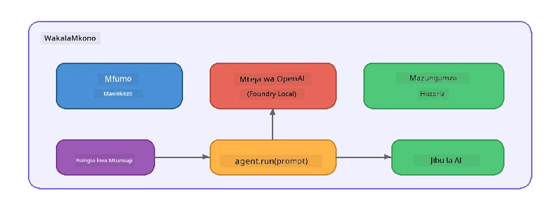

# Sehemu ya 5: Kujenga Wakala wa AI kwa Mfumo wa Wakala

> **Lengo:** Jenga wakala wako wa kwanza wa AI kwa maagizo ya kudumu na utu uliofafanuliwa, unaongozwa na mfano wa kienyeji kupitia Foundry Local.

## Wakala wa AI ni Nini?

Wakala wa AI huzuia mfano wa lugha na **maagizo ya mfumo** yanayobainisha tabia yake, utu, na vizingiti. Tofauti na wito wa mazungumzo wa ukamilifu mmoja, wakala hutoa:

- **Utu** - utambulisho thabiti ("Wewe ni mtaalamu wa ukaguzi wa msimbo")
- **Kumbukumbu** - historia ya mazungumzo katika mizunguko mbalimbali
- **Utaalam** - tabia inayolenga inayosukumwa na maagizo yaliyoandaliwa vizuri



---

## Mfumo wa Microsoft Agent

**Microsoft Agent Framework** (AGF) hutoa muhtasari wa wakala unaofanya kazi kwa njia tofauti za mifumo ya nyuma. Katika worika hii tunauunganisha na Foundry Local ili kila kitu kifanye kazi kwenye mashine yako - hakuna wingu linalohitajika.

| Dhana | Maelezo |
|---------|-------------|
| `FoundryLocalClient` | Python: hushughulikia kuanzisha huduma, kupakua/kupakia mfano, na kuunda wakaaji |
| `client.as_agent()` | Python: huunda wakala kutoka kwa mteja wa Foundry Local |
| `AsAIAgent()` | C#: njia ya upanuzi kwenye `ChatClient` - huunda `AIAgent` |
| `instructions` | Onyesho la mfumo linaloelekeza tabia ya wakala |
| `name` | Lebo inayoweza kusomwa na binadamu, yenye manufaa katika mazingira ya wakaaji wengi |
| `agent.run(prompt)` / `RunAsync()` | Hutuma ujumbe wa mtumiaji na kurudisha jibu la wakala |

> **Kumbuka:** Mfumo wa Wakala una SDK za Python na .NET. Kwa JavaScript, tunatekeleza darasa la `ChatAgent` la uzito mdogo linaloiga mtindo huo tukitumia SDK ya OpenAI moja kwa moja.

---

## Mazoezi

### Zoeezi 1 - Fahamu Muundo wa Wakala

Kabla ya kuandika msimbo, soma vipengele vikuu vya wakala:

1. **Mteja wa mfano** - unganisha na API ya OpenAI ya Foundry Local inayolingana
2. **Maagizo ya mfumo** - onyesho la "utu"
3. **Mzunguko wa uendeshaji** - tuma ingizo la mtumiaji, pokea matokeo

> **Fikiria:** Maagizo ya mfumo yanatofautianaje na ujumbe wa kawaida wa mtumiaji? Nini hutokea ukibadilisha maagizo hayo?

---

### Zoeezi 2 - Endesha Mfano wa Wakala Mmoja

<details>
<summary><strong>🐍 Python</strong></summary>

**Masharti ya awali:**
```bash
cd python
python -m venv venv

# Windows (PowerShell):
venv\Scripts\Activate.ps1
# macOS:
source venv/bin/activate

pip install -r requirements.txt
```

**Endesha:**
```bash
python foundry-local-with-agf.py
```

**Maelezo ya msimbo** (`python/foundry-local-with-agf.py`):

```python
import asyncio
from agent_framework_foundry_local import FoundryLocalClient

async def main():
    alias = "phi-4-mini"

    # FoundryLocalClient hushughulikia kuanzishwa kwa huduma, upakuaji wa mfano, na upakiaji
    client = FoundryLocalClient(model_id=alias)
    print(f"Client Model ID: {client.model_id}")

    # Unda wakala na maelekezo ya mfumo
    agent = client.as_agent(
        name="Joker",
        instructions="You are good at telling jokes.",
    )

    # Isiyo ya mtiririko: pata majibu kamili mara moja
    result = await agent.run("Tell me a joke about a pirate.")
    print(f"Agent: {result}")

    # Mtiririko: pata matokeo wakati yanapotengenezwa
    async for chunk in agent.run("Tell me another joke.", stream=True):
        if chunk.text:
            print(chunk.text, end="", flush=True)

asyncio.run(main())
```

**Mambo muhimu:**
- `FoundryLocalClient(model_id=alias)` hushughulikia kuanzisha huduma, kupakua, na kupakia mfano katika hatua moja
- `client.as_agent()` huunda wakala mwenye maagizo ya mfumo na jina
- `agent.run()` inasaidia hali ya kutiririsha na isiyotiririsha
- Sakinisha kwa `pip install agent-framework-foundry-local --pre`

</details>

<details>
<summary><strong>📦 JavaScript</strong></summary>

**Masharti ya awali:**
```bash
cd javascript
npm install
```

**Endesha:**
```bash
node foundry-local-with-agent.mjs
```

**Maelezo ya msimbo** (`javascript/foundry-local-with-agent.mjs`):

```javascript
import { OpenAI } from "openai";
import { FoundryLocalManager } from "foundry-local-sdk";

class ChatAgent {
  constructor({ client, modelId, instructions, name }) {
    this.client = client;
    this.modelId = modelId;
    this.instructions = instructions;
    this.name = name;
    this.history = [];
  }

  async run(userMessage) {
    const messages = [
      { role: "system", content: this.instructions },
      ...this.history,
      { role: "user", content: userMessage },
    ];
    const response = await this.client.chat.completions.create({
      model: this.modelId,
      messages,
    });
    const assistantMessage = response.choices[0].message.content;

    // Hifadhi historia ya mazungumzo kwa mwingiliano wa hatua nyingi
    this.history.push({ role: "user", content: userMessage });
    this.history.push({ role: "assistant", content: assistantMessage });
    return { text: assistantMessage };
  }
}

async function main() {
  FoundryLocalManager.create({ appName: "FoundryLocalWorkshop" });
  const manager = FoundryLocalManager.instance;
  await manager.startWebService();

  const catalog = manager.catalog;
  const model = await catalog.getModel("phi-3.5-mini");
  if (!model.isCached) {
    console.log("Downloading model: phi-3.5-mini...");
    await model.download();
  }
  await model.load();

  const client = new OpenAI({
    baseURL: manager.urls[0] + "/v1",
    apiKey: "foundry-local",
  });

  const agent = new ChatAgent({
    client,
    modelId: model.id,
    instructions: "You are good at telling jokes.",
    name: "Joker",
  });

  const result = await agent.run("Tell me a joke about a pirate.");
  console.log(result.text);
}

main();
```

**Mambo muhimu:**
- JavaScript huunda darasa lake la `ChatAgent` linaloiga mtindo wa AGF wa Python
- `this.history` huhifadhi mizunguko ya mazungumzo kwa msaada wa mizunguko mingi
- `startWebService()` wazi → ukaguzi wa cache → `model.download()` → `model.load()` huonyesha utambuzi kamili

</details>

<details>
<summary><strong>💜 C#</strong></summary>

**Masharti ya awali:**
```bash
cd csharp
dotnet restore
```

**Endesha:**
```bash
dotnet run agent
```

**Maelezo ya msimbo** (`csharp/SingleAgent.cs`):

```csharp
using Microsoft.AI.Foundry.Local;
using Microsoft.Extensions.Logging.Abstractions;
using Microsoft.Agents.AI;
using OpenAI;
using System.ClientModel;

// 1. Start Foundry Local and load a model
var alias = "phi-3.5-mini";
await FoundryLocalManager.CreateAsync(
    new Configuration
    {
        AppName = "FoundryLocalSamples",
        Web = new Configuration.WebService { Urls = "http://127.0.0.1:0" }
    }, NullLogger.Instance, default);
var manager = FoundryLocalManager.Instance;
await manager.StartWebServiceAsync(default);

var catalog = await manager.GetCatalogAsync(default);
var model = await catalog.GetModelAsync(alias, default);

var isCached = await model.IsCachedAsync(default);
if (!isCached)
{
    Console.WriteLine($"Downloading model: {alias}...");
    await model.DownloadAsync(null, default);
}
await model.LoadAsync(default);

var key = new ApiKeyCredential("foundry-local");
var client = new OpenAIClient(key, new OpenAIClientOptions
{
    Endpoint = new Uri(manager.Urls[0] + "/v1")
});

// 2. Create an AIAgent using the Agent Framework extension method
AIAgent joker = client
    .GetChatClient(model.Id)
    .AsAIAgent(
        instructions: "You are good at telling jokes. Keep your jokes short and family-friendly.",
        name: "Joker"
    );

// 3. Run the agent (non-streaming)
var response = await joker.RunAsync("Tell me a joke about a pirate.");
Console.WriteLine($"Joker: {response}");

// 4. Run with streaming
await foreach (var update in joker.RunStreamingAsync("Tell me another joke."))
{
    Console.Write(update);
}
```

**Mambo muhimu:**
- `AsAIAgent()` ni njia ya upanuzi kutoka `Microsoft.Agents.AI.OpenAI` - haina haja ya darasa la `ChatAgent` maalum
- `RunAsync()` hurudisha jibu kamili; `RunStreamingAsync()` hutiririsha tokeni moja baada ya nyingine
- Sakinisha kwa `dotnet add package Microsoft.Agents.AI.OpenAI --version 1.0.0-rc3`

</details>

---

### Zoeezi 3 - Badilisha Utu

Badilisha `instructions` za wakala kuunda utu tofauti. Jaribu kila moja na angalia jinsi pato linavyobadilika:

| Utu | Maagizo |
|---------|-------------|
| Mkaguzi wa Msimbo | `"Wewe ni mtaalamu mtaalamu wa ukaguzi wa msimbo. Toa maoni ya kujenga ikilenga usomaji, utendaji, na usahihi."` |
| Mwongozo wa Usafiri | `"Wewe ni mwongozo wa kirafiki wa usafiri. Toa mapendekezo yaliyobinafsishwa kwa maeneo, shughuli, na vyakula vya kienyeji."` |
| Mwalimu Socratic | `"Wewe ni mwalimu Socratic. Usitoe majibu moja kwa moja - badala yake, mwongoze mwanafunzi kwa maswali yenye maana."` |
| Mwandishi Tekiniki | `"Wewe ni mwandishi wa tekiniki. Eleza dhana kwa uwazi na ufupi. Tumia mifano. Epuka msamiati mgumu."` |

**Jaribu:**
1. Chagua utu kutoka jedwali hapo juu
2. Badilisha mfuatiliaji wa `instructions` kwenye msimbo
3. Rekebisha ombi la mtumiaji kulingana na haya (kwa mfano muulize mkaguzi wa msimbo akague kazi)
4. Endesha tena mfano na linganisha matokeo

> **Kidokezo:** Ubora wa wakala hutegemea sana maagizo. Maagizo maalum, yaliyoandaliwa vizuri hutoa matokeo bora kuliko yale yasiyoeleweka.

---

### Zoeezi 4 - Ongeza Mazungumzo ya Mizunguko Mingi

Panua mfano ili kuunga mkono mzunguko wa mazungumzo wa mizunguko mingi ili uweze kuwa na mazungumzo ya majibu na maswali na wakala.

<details>
<summary><strong>🐍 Python - mzunguko wa mizunguko mingi</strong></summary>

```python
import asyncio
from agent_framework_foundry_local import FoundryLocalClient

async def main():
    client = FoundryLocalClient(model_id="phi-4-mini")

    agent = client.as_agent(
        name="Assistant",
        instructions="You are a helpful assistant.",
    )

    print("Chat with the agent (type 'quit' to exit):\n")
    while True:
        user_input = input("You: ")
        if user_input.strip().lower() in ("quit", "exit"):
            break
        result = await agent.run(user_input)
        print(f"Agent: {result}\n")

asyncio.run(main())
```

</details>

<details>
<summary><strong>📦 JavaScript - mzunguko wa mizunguko mingi</strong></summary>

```javascript
import { OpenAI } from "openai";
import { FoundryLocalManager } from "foundry-local-sdk";
import * as readline from "node:readline/promises";

// (tumia tena darasa la ChatAgent kutoka Zoefu 2)

async function main() {
  FoundryLocalManager.create({ appName: "FoundryLocalWorkshop" });
  const manager = FoundryLocalManager.instance;
  await manager.startWebService();

  const catalog = manager.catalog;
  const model = await catalog.getModel("phi-3.5-mini");
  if (!model.isCached) {
    console.log("Downloading model: phi-3.5-mini...");
    await model.download();
  }
  await model.load();

  const client = new OpenAI({
    baseURL: manager.urls[0] + "/v1",
    apiKey: "foundry-local",
  });

  const agent = new ChatAgent({
    client,
    modelId: model.id,
    instructions: "You are a helpful assistant.",
    name: "Assistant",
  });

  const rl = readline.createInterface({
    input: process.stdin,
    output: process.stdout,
  });

  console.log("Chat with the agent (type 'quit' to exit):\n");
  while (true) {
    const userInput = await rl.question("You: ");
    if (["quit", "exit"].includes(userInput.trim().toLowerCase())) break;
    const result = await agent.run(userInput);
    console.log(`Agent: ${result.text}\n`);
  }
  rl.close();
}

main();
```

</details>

<details>
<summary><strong>💜 C# - mzunguko wa mizunguko mingi</strong></summary>

```csharp
using Microsoft.AI.Foundry.Local;
using Microsoft.Extensions.Logging.Abstractions;
using Microsoft.Agents.AI;
using OpenAI;
using System.ClientModel;

var alias = "phi-3.5-mini";
var config = new Configuration
{
    AppName = "FoundryLocalSamples",
    Web = new Configuration.WebService { Urls = "http://127.0.0.1:0" }
};
await FoundryLocalManager.CreateAsync(config, NullLogger.Instance, default);
var manager = FoundryLocalManager.Instance;
await manager.StartWebServiceAsync(default);

var catalog = await manager.GetCatalogAsync(default);
var model = await catalog.GetModelAsync(alias, default);

var isCached = await model.IsCachedAsync(default);
if (!isCached)
{
    Console.WriteLine($"Downloading model: {alias}...");
    await model.DownloadAsync(null, default);
}
await model.LoadAsync(default);

var key = new ApiKeyCredential("foundry-local");
var client = new OpenAIClient(key, new OpenAIClientOptions
{
    Endpoint = new Uri(manager.Urls[0] + "/v1")
});

AIAgent agent = client
    .GetChatClient(model.Id)
    .AsAIAgent(
        instructions: "You are a helpful assistant.",
        name: "Assistant"
    );

Console.WriteLine("Chat with the agent (type 'quit' to exit):\n");
while (true)
{
    Console.Write("You: ");
    var userInput = Console.ReadLine();
    if (string.IsNullOrWhiteSpace(userInput) ||
        userInput.Equals("quit", StringComparison.OrdinalIgnoreCase) ||
        userInput.Equals("exit", StringComparison.OrdinalIgnoreCase))
        break;

    var result = await agent.RunAsync(userInput);
    Console.WriteLine($"Agent: {result}\n");
}
```

</details>

Angalia jinsi wakala anavyo kumbuka mizunguko iliyopita - uliza swali la nyongeza na ona muktadha unaoendelea.

---

### Zoeezi 5 - Pato Lililoandaliwa

Waambie wakala kujibu kila mara kwa muundo maalum (kwa mfano JSON) na uchambue matokeo:

<details>
<summary><strong>🐍 Python - Pato la JSON</strong></summary>

```python
import asyncio
import json
from agent_framework_foundry_local import FoundryLocalClient

async def main():
    client = FoundryLocalClient(model_id="phi-4-mini")

    agent = client.as_agent(
        name="SentimentAnalyzer",
        instructions=(
            "You are a sentiment analysis agent. "
            "For every user message, respond ONLY with valid JSON in this format: "
            '{"sentiment": "positive|negative|neutral", "confidence": 0.0-1.0, "summary": "brief reason"}'
        ),
    )

    result = await agent.run("I absolutely loved the new restaurant downtown!")
    print("Raw:", result)

    try:
        parsed = json.loads(str(result))
        print(f"Sentiment: {parsed['sentiment']} (confidence: {parsed['confidence']})")
    except json.JSONDecodeError:
        print("Agent did not return valid JSON - try refining the instructions.")

asyncio.run(main())
```

</details>

<details>
<summary><strong>💜 C# - Pato la JSON</strong></summary>

```csharp
using System.Text.Json;

AIAgent analyzer = chatClient.AsAIAgent(
    name: "SentimentAnalyzer",
    instructions:
        "You are a sentiment analysis agent. " +
        "For every user message, respond ONLY with valid JSON in this format: " +
        "{\"sentiment\": \"positive|negative|neutral\", \"confidence\": 0.0-1.0, \"summary\": \"brief reason\"}"
);

var response = await analyzer.RunAsync("I absolutely loved the new restaurant downtown!");
Console.WriteLine($"Raw: {response}");

try
{
    var parsed = JsonSerializer.Deserialize<JsonElement>(response.ToString());
    Console.WriteLine($"Sentiment: {parsed.GetProperty("sentiment")} " +
                      $"(confidence: {parsed.GetProperty("confidence")})");
}
catch (JsonException)
{
    Console.WriteLine("Agent did not return valid JSON - try refining the instructions.");
}
```

</details>

> **Kumbuka:** Mifano midogo ya kienyeji mara nyingine haizalishi JSON halali kikamilifu. Unaweza kuboresha ufanisi kwa kujumuisha mfano katika maagizo na kuwa wazi sana kuhusu muundo unaotegemea.

---

## Muhimu Kuzingatia

| Dhana | Ulikuja kujifunza |
|---------|-----------------|
| Wakala dhidi ya wito wa LLM ghafi | Wakala huzunguka mfano kwa maagizo na kumbukumbu |
| Maagizo ya mfumo | Kifaa muhimu zaidi cha kudhibiti tabia ya wakala |
| Mazungumzo ya mizunguko mingi | Wakaaji wanaweza kubeba muktadha katika mwingiliano wa mtumiaji wa mizunguko mingi |
| Pato lililoandaliwa | Maagizo yanaweza kulazimisha muundo wa pato (JSON, markdown, nk.) |
| Uendeshaji wa kienyeji | Kila kitu kinaendeshwa kwenye kifaa kupitia Foundry Local - hakuna wingu linalohitajika |

---

## Hatua Zifuatazo

Katika **[Sehemu ya 6: Mipango ya Wakaaji Wengi](part6-multi-agent-workflows.md)**, utachanganya wakaaji wengi kuunda mchakato uliorongwa ambapo kila wakala ana jukumu maalum.

---

<!-- CO-OP TRANSLATOR DISCLAIMER START -->
**King'amuzi**:  
Hati hii imetafsiriwa kwa kutumia huduma ya tafsiri ya AI [Co-op Translator](https://github.com/Azure/co-op-translator). Ingawa tunajitahidi kwa usahihi, tafadhali fahamu kwamba tafsiri za kiotomatiki zinaweza kuwa na makosa au upungufu wa usahihi. Hati asilia katika lugha yake ya asili inapaswa kuchukuliwa kama chanzo cha mamlaka. Kwa taarifa muhimu, tafsiri ya kitaalamu ya binadamu inapendekezwa. Hatuna wajibu kwa malalamiko yoyote au ukosefu wa ufafanuzi unaotokana na matumizi ya tafsiri hii.
<!-- CO-OP TRANSLATOR DISCLAIMER END -->