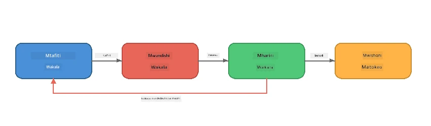
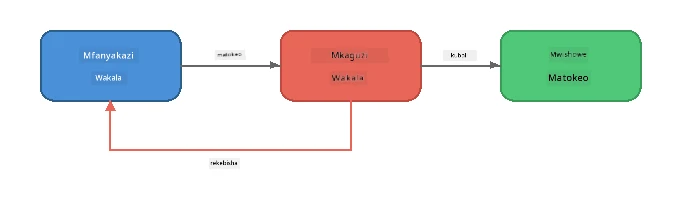
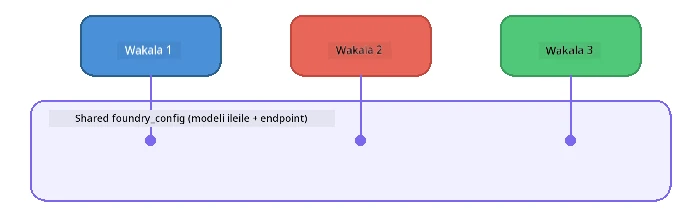

# Sehemu ya 6: Mitiririko ya Kazi ya Wakala Wengi

> **Lengo:** Kuunganisha mawakala maalum wengi katika mistari ya ushirikiano inayogawanya kazi ngumu kati ya mawakala wanaoshirikiana - wote wakifanya kazi kwa mtaa kwa kutumia Foundry Local.

## Kwa Nini Wakala Wengi?

Wakala mmoja anaweza kushughulikia kazi nyingi, lakini mitiririko ya kazi yenye ugumu inafaidika na **Utaalamu**. Badala ya wakala mmoja kujaribu kufanya utafiti, kuandika, na kuhariri kwa wakati mmoja, unagawa kazi katika majukumu yaliozingatia:



| Mifumo | Maelezo |
|---------|----------|
| **Mfululizo** | Matokeo ya Wakala A huingizwa kwa Wakala B → Wakala C |
| **Mzunguko wa maoni** | Wakilishi wa tathmini wanaweza kurudisha kazi kwa marekebisho |
| **Muktadha wa pamoja** | Wakala wote hutumia mfano/mwisho uleule, lakini kwa maagizo tofauti |
| **Matokeo ya aina** | Wakala huunda matokeo yamepangwa (JSON) kwa mikataba inayotegemewa |

---

## Mazoezi

### Zoeezi 1 - Endesha Mitiririko ya Kazi ya Wakala Wengi

Warsha inajumuisha mchakato kamili wa Mtafiti → Mwandishi → Mhariri.

<details>
<summary><strong>🐍 Python</strong></summary>

**Mazingira:**
```bash
cd python
python -m venv venv

# Windows (PowerShell):
venv\Scripts\Activate.ps1
# macOS:
source venv/bin/activate

pip install -r requirements.txt
```

**Endesha:**
```bash
python foundry-local-multi-agent.py
```

**Kinachotokea:**
1. **Mtafiti** anapokea mada na kurudisha ukweli kwa vidokezo
2. **Mwandishi** huchukua utafiti na kuandaa chapisho la blogu (mistari 3-4)
3. **Mhariri** anapitia makala kwa ubora na kurudisha KUBALI au REKEBISHA

</details>

<details>
<summary><strong>📦 JavaScript</strong></summary>

**Mazingira:**
```bash
cd javascript
npm install
```

**Endesha:**
```bash
node foundry-local-multi-agent.mjs
```

**Mistari mitatu sawa ya mchakato** - Mtafiti → Mwandishi → Mhariri.

</details>

<details>
<summary><strong>💜 C#</strong></summary>

**Mazingira:**
```bash
cd csharp
dotnet restore
```

**Endesha:**
```bash
dotnet run multi
```

**Mistari mitatu sawa ya mchakato** - Mtafiti → Mwandishi → Mhariri.

</details>

---

### Zoeezi 2 - Muundo wa Mtiririko wa Kazi

Soma jinsi mawakala wanavyoainishwa na kuunganishwa:

**1. Mteja wa mfano wa pamoja**

Wakala wote wanashiriki mfano uleule wa Foundry Local:

```python
# Python - FoundryLocalClient hushughulikia kila kitu
from agent_framework_foundry_local import FoundryLocalClient

client = FoundryLocalClient(model_id="phi-3.5-mini")
```

```javascript
// JavaScript - OpenAI SDK ikilenga Foundry Local
const client = new OpenAI({
  baseURL: manager.urls[0] + "/v1",
  apiKey: "foundry-local",
});
```

```csharp
// C# - OpenAIClient pointed at Foundry Local
var key = new ApiKeyCredential("foundry-local");
var client = new OpenAIClient(key, new OpenAIClientOptions
{
    Endpoint = new Uri(manager.Urls[0] + "/v1")
});
var chatClient = client.GetChatClient(model.Id);
```

**2. Maagizo maalum**

Kila wakala ana persona tofauti:

| Wakili | Maagizo (muhtasari) |
|-------|----------------------|
| Mtafiti | "Toa ukweli muhimu, takwimu, na historia. Pangilia kama vidokezo." |
| Mwandishi | "Andika chapisho la blogu lenye mvuto (mistari 3-4) kutoka kwa noti za utafiti. Usikufanye ukweli." |
| Mhariri | "Pitia kwa uwazi, sarufi, na uthabiti wa ukweli. Uamuzi: KUBALI au REKEBISHA." |

**3. Mtiririko wa data kati ya mawakala**

```python
# Hatua 1 - matokeo kutoka kwa mtafiti yanakuwa pembejeo kwa mwandishi
research_result = await researcher.run(f"Research: {topic}")

# Hatua 2 - matokeo kutoka kwa mwandishi yanakuwa pembejeo kwa mhariri
writer_result = await writer.run(f"Write using:\n{research_result}")

# Hatua 3 - mhariri anapitia utafiti na makala zote mbili
editor_result = await editor.run(
    f"Research:\n{research_result}\n\nArticle:\n{writer_result}"
)
```

```csharp
// C# - same pattern, async calls with AIAgent
var researchNotes = await researcher.RunAsync(
    $"Research the following topic and provide key facts:\n{topic}");

var draft = await writer.RunAsync(
    $"Write a blog post based on these research notes:\n\n{researchNotes}");

var verdict = await editor.RunAsync(
    $"Review this article for quality and accuracy.\n\n" +
    $"Research notes:\n{researchNotes}\n\n" +
    $"Article:\n{draft}");
```

> **Maarifa muhimu:** Kila wakala anapokea muktadha wa jumla kutoka kwa mawakala waliotangulia. Mhariri anaona utafiti wa awali na rasimu - hii humruhusu kukagua uthabiti wa ukweli.

---

### Zoeezi 3 - Ongeza Wakili wa Nne

Panua mtiririko kwa kuongeza wakala mpya. Chagua moja:

| Wakili | Kusudi | Maagizo |
|-------|---------|-------------|
| **Mthibitishaji wa Ukweli** | Thibitisha madai katika makala | `"Unathibitisha madai ya ukweli. Kwa kila dai, taja kama linaungwa mkono na noti za utafiti. Rudisha JSON yenye vitu vilivyothibitishwa/visivyo."` |
| **Mwandishi wa Kichwa** | Tengeneza vichwa vinavyovutia | `"Toa chaguzi 5 za kichwa cha makala. Badilisha mtindo: waelimisha, unaovutia, swali, orodha, wa kihisia."` |
| **Mitandao ya Kijamii** | Tengeneza machapisho ya utangazaji | `"Tengeneza machapisho 3 ya mitandao ya kijamii yanayouza makala hii: moja kwa Twitter (herufi 280), moja kwa LinkedIn (mtindo wa kitaalamu), moja kwa Instagram (mtindo wa kawaida na mapendekezo ya emoji)."` |

<details>
<summary><strong>🐍 Python - kuongeza Mwandishi wa Kichwa</strong></summary>

```python
headline_agent = client.as_agent(
    name="HeadlineWriter",
    instructions=(
        "You are a headline specialist. Given an article, generate exactly "
        "5 headline options. Vary the style: informative, question-based, "
        "listicle, emotional, and provocative. Return them as a numbered list."
    ),
)

# Baada ya mhariri kukubali, tengeneza vichwa vya habari
headline_result = await headline_agent.run(
    f"Generate headlines for this article:\n\n{writer_result}"
)
print(f"\n--- Headlines ---\n{headline_result}")
```

</details>

<details>
<summary><strong>📦 JavaScript - kuongeza Mwandishi wa Kichwa</strong></summary>

```javascript
const headlineAgent = new ChatAgent({
  client,
  modelId: modelInfo.id,
  instructions:
    "You are a headline specialist. Given an article, generate exactly " +
    "5 headline options. Vary the style: informative, question-based, " +
    "listicle, emotional, and provocative. Return them as a numbered list.",
  name: "HeadlineWriter",
});

const headlineResult = await headlineAgent.run(
  `Generate headlines for this article:\n\n${writerResult.text}`
);
console.log(`\n--- Headlines ---\n${headlineResult.text}`);
```

</details>

<details>
<summary><strong>💜 C# - kuongeza Mwandishi wa Kichwa</strong></summary>

```csharp
AIAgent headlineAgent = chatClient.AsAIAgent(
    name: "HeadlineWriter",
    instructions:
        "You are a headline specialist. Given an article, generate exactly " +
        "5 headline options. Vary the style: informative, question-based, " +
        "listicle, emotional, and provocative. Return them as a numbered list."
);

// After the editor accepts, generate headlines
var headlines = await headlineAgent.RunAsync(
    $"Generate headlines for this article:\n\n{draft}");
Console.WriteLine($"\n--- Headlines ---\n{headlines}");
```

</details>

---

### Zoeezi 4 - Tandaza Mtiririko Wako wa Kazi

Tengeneza mtiririko wa kazi wa wakala wengi kwa uwanja tofauti. Hapa kuna mawazo:

| Uwanja | Wakala | Mtiririko |
|--------|--------|-----------|
| **Ukaguzi wa Msimbo** | Mchambuzi → Mkaguzi → Mhuishaji Muhtasari | Changanua muundo wa msimbo → hakiki kwa matatizo → tengeneza ripoti ya muhtasari |
| **Huduma kwa Wateja** | Mtafsiri → Mtayarishaji wa majibu → Mhakiki | Tafsiri tiketi → andaa jibu → hakiki ubora |
| **Elimu** | Mtengenezaji wa Maswali → Mhusika wa Mwanafunzi → Mhukumu | Tengeneza jaribio → taja majibu → toa alama na eleza |
| **Uchanganuzi wa Takwimu** | Mfasiri → Mchambuzi → Mtoaji Ripoti | Tafsiri ombi la takwimu → chambuzi mifumo → andika ripoti |

**Hatua:**
1. Tafsiri mawakala 3+ wenye `maagizo` tofauti
2. Amua mtiririko wa data - kila wakala hupokea na kutoa nini?
3. Tekeleza mtiririko kwa kutumia mifumo kutoka Mazoezi 1-3
4. Ongeza mzunguko wa maoni ikiwa wakala mmoja anapaswa kutathmini kazi ya mwingine

---

## Mifumo ya Usimamizi

Hapa kuna mifumo ya usimamizi inayotumika kwa mfumo wowote wa mawakala wengi (imechambuliwa kwa kina katika [Sehemu ya 7](part7-zava-creative-writer.md)):

### Mistari ya Mfululizo


Kila wakala anachakata matokeo ya yule aliyekwisha. Rahisi na inayoweza kutegemewa.

### Mzunguko wa Maoni



Mwakala wa tathmini anaweza kusababisha upya wa hatua za awali. Mwandishi wa Zava hutumia hii: mhariri anaweza kutuma maoni kwa mtafiti na mwandishi.

### Muktadha wa Pamoja



Mawakala wote wanashiriki `foundry_config` moja ili kutumia mfano na mwisho uleule.

---

## Muhimu wa Kujifunza

| Dhana | Uliyojifunza |
|---------|--------------|
| Utaalamu wa Wakala | Kila wakala hufanya jambo moja vizuri kwa maagizo maalum |
| Uhamishaji wa Data | Matokeo kutoka kwa wakala mmoja yanakuwa ingizo kwa mwingine |
| Mizunguko ya Maoni | Mwakala wa tathmini anaweza kusababisha jaribio upya kwa ubora zaidi |
| Matokeo Yaliyo Pangiliwa | Majibu yenye muundo wa JSON huwezesha mawasiliano ya kuaminika kati ya mawakala |
| Usimamizi | Mratibu hudu ni mfululizo wa mtiririko na kushughulikia makosa |
| Mifumo ya uzalishaji | Imepata matumizi katika [Sehemu ya 7: Mwandishi wa Ubunifu wa Zava](part7-zava-creative-writer.md) |

---

## Hatua Zifuatazo

Endelea kwa [Sehemu ya 7: Mwandishi wa Ubunifu wa Zava - Programu ya Capstone](part7-zava-creative-writer.md) kugundua programu ya wakala wengi yenye mawakala 4 maalum, matokeo ya kuangaza, utafutaji bidhaa, na mizunguko ya maoni - inapatikana kwa Python, JavaScript, na C#.

---

<!-- CO-OP TRANSLATOR DISCLAIMER START -->
**Kengele**:  
Hati hii imetafsiriwa kwa kutumia huduma ya tafsiri ya AI [Co-op Translator](https://github.com/Azure/co-op-translator). Wakati tunajitahidi kwa usahihi, tafadhali fahamu kwamba tafsiri za moja kwa moja zinaweza kuwa na makosa au kutokamilika. Hati asilia katika lugha yake ya asili inapaswa kuzingatiwa kama chanzo cha mamlaka. Kwa taarifa muhimu, tafsiri ya mtaalamu wa binadamu inapendekezwa. Hatubebei dhamana kwa kutoelewana au tafsiri zisizo sahihi zinazotokana na matumizi ya tafsiri hii.
<!-- CO-OP TRANSLATOR DISCLAIMER END -->