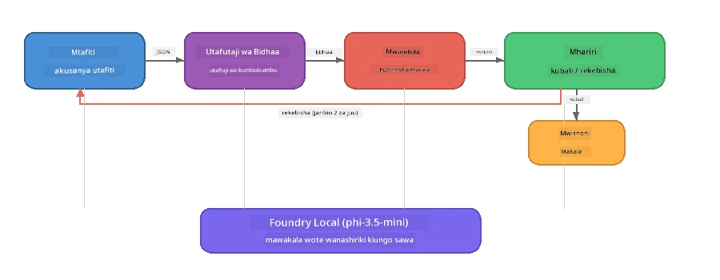

# Sehemu ya 7: Mwandishi wa Ubunifu wa Zava - Ombi la Capstone

> **Lengo:** Chunguza programu ya mtindo wa uzalishaji yenye mawakala wengi ambapo mawakala wanne maalum wanashirikiana kuzalisha makala za ubora wa jarida kwa Zava Retail DIY - ikiwa inafanya kazi kabisa kwenye kifaa chako kwa kutumia Foundry Local.

Hii ni **labu ya capstone** ya warsha. Inakutanisha yote uliyojifunza - muingiliano wa SDK (Sehemu ya 3), upatikanaji kutoka kwa data ya ndani (Sehemu ya 4), sifa za mawakala (Sehemu ya 5), na upangaji wa mawakala wengi (Sehemu ya 6) - kuwa programu kamili inapatikana kwa **Python**, **JavaScript**, na **C#**.

---

## Utachunguza Nini

| Dhana | Mahali katika Mwandishi wa Zava |
|---------|----------------------------|
| Upakiaji wa mfano kwa hatua 4 | Moduli ya usanidi wa pamoja huanzisha Foundry Local |
| Upatikanaji wa mtindo wa RAG | Wakala wa bidhaa anatafuta katika katalogi ya ndani |
| Utaalamu wa wakala | Wakala 4 wenye maagizo tofauti ya mfumo |
| Utoaji wa mtiririko | Mwandishi hutolewa tokeni kwa wakati halisi |
| Mikabidhiano iliyopangwa | Mtafiti → JSON, Mhariri → uamuzi wa JSON |
| Mzunguko wa maoni | Mhariri anaweza kuzindua utekelezaji tena (jaribu tena mara 2 kwa maksimumi) |

---

## Mabadiliko ya Msingi

Mwandishi wa Ubunifu wa Zava hutumia **mfululizo wa mistari wenye maoni yanayoongozwa na mthibiti**. Matumizi yote ya lugha tatu huifuata usanifu sawa:



### Mawakala Wanne

| Wakala | Ingizo | Utokaji | Kusudi |
|-------|-------|--------|---------|
| **Mtafiti** | Mada + maoni ya hiari | `{"web": [{url, name, description}, ...]}` | Hukusanya utafiti wa msingi kupitia LLM |
| **Utafutaji Bidhaa** | Muktadha wa bidhaa | Orodha ya bidhaa zinazolingana | Maswali yaliyoandaliwa na LLM + utafutaji wa maneno muhimu dhidi ya katalogi ya ndani |
| **Mwandishi** | Utafiti + bidhaa + kazi + maoni | Nakala inayotiririka (katika sehemu za `---`) | Hutoa makala ya ubora wa jarida kwa wakati halisi |
| **Mhariri** | Makala + maoni ya mwandishi | `{"decision": "accept/revise", "editorFeedback": "...", "researchFeedback": "..."}` | Hukagua ubora, huanzisha jaribio tena ikiwa inahitajika |

### Mtiririko wa Mfululizo

1. **Mtafiti** anapokea mada na kutengeneza noti za utafiti zilizosimbwa (JSON)
2. **Utafutaji Bidhaa** hufanya maswali kwa katalogi ya bidhaa ya ndani kwa kutumia maneno ya utafutaji yaliyozalishwa na LLM
3. **Mwandishi** huunganisha utafiti + bidhaa + kazi kuwa nakala inayotiririka, akiweka maoni ya mwandishi baada ya kiganjani `---`
4. **Mhariri** hukagua makala na kurudisha hukumu ya JSON:
   - `"accept"` → mfululizo unakamilika
   - `"revise"` → maoni hurudishwa kwa Mtafiti na Mwandishi (jaribu tena mara 2 kwa maksimumi)

---

## Mahitaji

- Maliza [Sehemu ya 6: Mifumo ya Kazi ya Mawakala Wengi](part6-multi-agent-workflows.md)
- Saa ya amri ya Foundry Local CLI imewekwa na mfano `phi-3.5-mini` umepakuliwa

---

## Mazoezi

### Zoezi 1 - Endesha Mwandishi wa Ubunifu wa Zava

Chagua lugha yako na endesha programu:

<details>
<summary><strong>🐍 Python - Huduma ya Mtandao ya FastAPI</strong></summary>

Toleo la Python linaendesha kama **huduma ya mtandao** kwa API ya REST, ikionyesha jinsi ya kujenga huduma ya nyuma ya uzalishaji.

**Andaa:**
```bash
cd zava-creative-writer-local/src/api
python -m venv venv

# Windows (PowerShell):
venv\Scripts\Activate.ps1
# macOS:
source venv/bin/activate

pip install -r requirements.txt
```

**Endesha:**
```bash
uvicorn main:app --reload
```

**Jaribu:**
```bash
curl -X POST http://localhost:8000/api/article \
  -H "Content-Type: application/json" \
  -d '{
    "research": "DIY home improvement trends",
    "products": "power tools and paints",
    "assignment": "Write an article about weekend renovation projects for DIY enthusiasts"
  }'
```

Jibu linatiririka kama ujumbe za JSON zenye alama mpya kuonyesha maendeleo ya kila wakala.

</details>

<details>
<summary><strong>📦 JavaScript - CLI ya Node.js</strong></summary>

Toleo la JavaScript linaendesha kama **programu ya CLI**, likichapisha maendeleo ya wakala na makala moja kwa moja kwa console.

**Andaa:**
```bash
cd zava-creative-writer-local/src/javascript
npm install
```

**Endesha:**
```bash
node main.mjs
```

Utaona:
1. Upakiaji wa mfano wa Foundry Local (na baa ya maendeleo ikiwa inapakua)
2. Kila wakala anatekelezwa kwa mpangilio na ujumbe wa hali
3. Nakala hutiririka kwa console kwa wakati halisi
4. Uamuzi wa mhariri wa kukubali/kurekebisha

</details>

<details>
<summary><strong>💜 C# - Programu ya Console ya .NET</strong></summary>

Toleo la C# linaendesha kama **programu ya console ya .NET** yenye mfululizo sawa na utoaji wa mtiririko.

**Andaa:**
```bash
cd zava-creative-writer-local/src/csharp
dotnet restore
```

**Endesha:**
```bash
dotnet run
```

Muundo wa matokeo ni sawa na toleo la JavaScript - ujumbe za hali za wakala, nakala inayotiririka, na hukumu ya mhariri.

</details>

---

### Zoezi 2 - Chunguza Muundo wa Kificho

Kila utekelezaji wa lugha una vipengele vya mantiki sawa. Linganisha miundo:

**Python** (`src/api/`):
| Faili | Kusudi |
|------|---------|
| `foundry_config.py` | Meneja wa pamoja wa Foundry Local, mfano, na mteja (uanzishaji wa hatua 4) |
| `orchestrator.py` | Uratibu wa mfululizo na mzunguko wa maoni |
| `main.py` | Mifumo ya FastAPI (`POST /api/article`) |
| `agents/researcher/researcher.py` | Utafiti wa LLM na utokaji wa JSON |
| `agents/product/product.py` | Maswali yaliyozalishwa na LLM + utafutaji wa maneno |
| `agents/writer/writer.py` | Uzalishaji wa nakala kwa mtiririko |
| `agents/editor/editor.py` | Uamuzi wa kukubali/kurekebisha kwa JSON |

**JavaScript** (`src/javascript/`):
| Faili | Kusudi |
|------|---------|
| `foundryConfig.mjs` | Usaidizi wa usanidi wa Foundry Local (uanzishaji wa hatua 4 na baa ya maendeleo) |
| `main.mjs` | Orchestrator + hatua ya kuingia ya CLI |
| `researcher.mjs` | Wakala wa utafiti wa LLM |
| `product.mjs` | Uzalishaji wa maswali ya LLM + utafutaji wa maneno |
| `writer.mjs` | Uzalishaji wa nakala kwa mtiririko (mzalishaji async) |
| `editor.mjs` | Uamuzi wa JSON wa kukubali/kurekebisha |
| `products.mjs` | Data ya katalogi ya bidhaa |

**C#** (`src/csharp/`):
| Faili | Kusudi |
|------|---------|
| `Program.cs` | Mfululizo kamili: upakiaji wa mfano, mawakala, orchestrator, mzunguko wa maoni |
| `ZavaCreativeWriter.csproj` | Mradi wa .NET 9 na Foundry Local + vifurushi vya OpenAI |

> **Kumbuka ya muundo:** Python huunganisha kila wakala kwenye faili/jalada lake mwenyewe (zuri kwa timu kubwa). JavaScript hutumia moduli moja kwa kila wakala (zuri kwa miradi ya kati). C# huhifadhi kila kitu kwenye faili moja na kazi za ndani (zuri kwa mifano iliyojaa). Katika uzalishaji, chagua mtindo unaofaa tamaduni za timu yako.

---

### Zoezi 3 - Fuata Usaidizi wa Usaidizi wa Pamoja

Kila wakala katika mfululizo hutumia mteja mmoja wa mfano wa Foundry Local. Chunguza jinsi hii yetu kwa kila lugha:

<details>
<summary><strong>🐍 Python - foundry_config.py</strong></summary>

```python
from foundry_local import FoundryLocalManager

MODEL_ALIAS = "phi-3.5-mini"

# Hatua ya 1: Unda meneja na anzisha huduma ya Foundry Local
manager = FoundryLocalManager()
manager.start_service()

# Hatua ya 2: Angalia ikiwa mfano tayari umepakuliwa
cached = manager.list_cached_models()
catalog_info = manager.get_model_info(MODEL_ALIAS)
is_cached = any(m.id == catalog_info.id for m in cached) if catalog_info else False

if not is_cached:
    manager.download_model(MODEL_ALIAS)

# Hatua ya 3: Pakia mfano kwenye kumbukumbu
manager.load_model(MODEL_ALIAS)
model_id = manager.get_model_info(MODEL_ALIAS).id

# Mteja wa OpenAI anayeshirikiwa
client = openai.OpenAI(base_url=manager.endpoint, api_key=manager.api_key)
```

Mawakala wote huleta `from foundry_config import client, model_id`.

</details>

<details>
<summary><strong>📦 JavaScript - foundryConfig.mjs</strong></summary>

```javascript
import { FoundryLocalManager } from "foundry-local-sdk";
import { OpenAI } from "openai";

FoundryLocalManager.create({ appName: "ZavaCreativeWriter" });
const manager = FoundryLocalManager.instance;
await manager.startWebService();

// Angalia cache → pakua → pakia (mfumo mpya wa SDK)
const catalog = manager.catalog;
const model = await catalog.getModel(MODEL_ALIAS);
if (!model.isCached) {
  console.log(`Downloading model: ${MODEL_ALIAS}...`);
  await model.download();
}
await model.load();

const client = new OpenAI({ baseURL: manager.urls[0] + "/v1", apiKey: "foundry-local" });
const modelId = model.id;
export { client, modelId };
```

Mawakala wote huleta `{ client, modelId } from "./foundryConfig.mjs"`.

</details>

<details>
<summary><strong>💜 C# - juu ya Program.cs</strong></summary>

```csharp
await FoundryLocalManager.CreateAsync(
    new Configuration
    {
        AppName = "ZavaCreativeWriter",
        Web = new Configuration.WebService { Urls = "http://127.0.0.1:0" }
    }, NullLogger.Instance, default);
var manager = FoundryLocalManager.Instance;
await manager.StartWebServiceAsync(default);

var catalog = await manager.GetCatalogAsync(default);
var catalogModel = await catalog.GetModelAsync(alias, default);
var isCached = await catalogModel.IsCachedAsync(default);
if (!isCached)
    await catalogModel.DownloadAsync(null, default);

await catalogModel.LoadAsync(default);
var key = new ApiKeyCredential("foundry-local");
var chatClient = new OpenAIClient(key, new OpenAIClientOptions
{
    Endpoint = new Uri(manager.Urls[0] + "/v1")
}).GetChatClient(catalogModel.Id);
```

`chatClient` hupitishwa kwa kazi zote za wakala katika faili hiyo hiyo.

</details>

> **Mfumo muhimu:** Muundo wa upakiaji mfano (anzisha huduma → angalia cache → pakua → pakua) huhakikisha mtumiaji anaona maendeleo wazi na mfano unapakuliwa mara moja tu. Hii ni mbinu bora kwa programu yoyote ya Foundry Local.

---

### Zoezi 4 - Elewa Mzunguko wa Maoni

Mzunguko wa maoni ndio unaofanya mfululizo huu kuwa "mwerevu" - Mhariri anaweza kurudisha kazi kwa marekebisho. Fuata mantiki:

```
Orchestrator:
  1. researcher.research(topic, "No Feedback")    ← first pass
  2. product.findProducts(productContext)
  3. writer.write(research, products, assignment)  ← streams article
  4. Split article at "---" → article + writerFeedback
  5. editor.edit(article, writerFeedback)

  WHILE editor says "revise" AND retryCount < 2:
    6. researcher.research(topic, editor.researchFeedback)  ← refined
    7. writer.write(research, products, editor.editorFeedback)
    8. editor.edit(newArticle, newWriterFeedback)
    9. retryCount++
```

**Maswali ya kuzingatia:**
- Kwa nini kiwango cha jaribio tena kimewekwa kuwa 2? Nini kinatokea ikiwa utaongeza?
- Kwa nini mtafiti anapata `researchFeedback` lakini mwandishi anapata `editorFeedback`?
- Nini kitakachotokea ikiwa mhariri hata kurudi pendekeza "rekebisha"?

---

### Zoezi 5 - Badilisha Wakala Mmoja

Jaribu kubadilisha tabia ya wakala mmoja na uchunguzi jinsi inavyoathiri mfululizo:

| Marekebisho | Halli ya kubadilisha |
|-------------|----------------|
| **Mhariri mkali zaidi** | Badilisha maagizo ya mfumo ya mhariri kusisitiza kutaka angalau marekebisho moja kila wakati |
| **Makala ndefu zaidi** | Badilisha maagizo ya mwandishi kutoka "maneno 800-1000" kuwa "maneno 1500-2000" |
| **Bidhaa tofauti** | Ongeza au badilisha bidhaa katika katalogi ya bidhaa |
| **Mada mpya ya utafiti** | Badilisha `researchContext` ya default hadi somo tofauti |
| **Mtafiti wa JSON tu** | Fanya mtafiti arudishe vitu 10 badala ya 3-5 |

> **Ushauri:** Kwa kuwa lugha zote tatu zina usanifu sawa, unaweza kufanya marekebisho sawa kwa lugha yoyote unayojisikia vizuri zaidi.

---

### Zoezi 6 - Ongeza Wakala wa Tano

Ungeweza kupanua mfululizo na wakala mpya. Mifano:

| Wakala | Mahali katika mfululizo | Kusudi |
|-------|-------------------|---------|
| **Msheria wa Tathmini ya Ukweli** | Baada ya Mwandishi, kabla ya Mhariri | Thibitisha madai dhidi ya data ya utafiti |
| **Mboreshaji wa SEO** | Baada ya Mhariri kukubali | Ongeza maelezo ya meta, maneno muhimu, slug |
| **Mchoraji** | Baada ya Mhariri kukubali | Tengenezwa maelezo ya picha kwa makala |
| **Mtafsiri** | Baada ya Mhariri kukubali | Tafsiri makala kwa lugha nyingine |

**Hatua:**
1. Andika maagizo ya mfumo kwa wakala huyo
2. Tengeneza kazi ya wakala (sawa na muundo uliopo kwenye lugha yako)
3. Iweke kwenye orchestrator mahali sahihi
4. Sasisha matokeo/kumbukumbu kuonyesha mchango wa wakala mpya

---

## Jinsi Foundry Local na Mfumo wa Wakala Hufanya Kazi Pamoja

Programu hii inaonyesha mtindo uliopendekezwa wa kujenga mifumo ya mawakala wengi kwa kutumia Foundry Local:

| Tabaka | Kipengele | Nafasi |
|-------|-----------|-------|
| **Runtime** | Foundry Local | Hupakua, kudhibiti, na kuhudumia mfano ndani ya kifaa |
| **Mteja** | OpenAI SDK | Hutatua mazungumzo ya chat kwa sehemu ya ndani |
| **Wakala** | Amri ya mfumo + simu ya chat | tabia maalum kupitia maagizo maalum |
| **Mratibu** | Mratibu wa mfululizo | Hudhibiti mtiririko wa data, mpangilio, na mizunguko ya maoni |
| **Mfumo** | Microsoft Agent Framework | Hutoa abstraction ya `ChatAgent` na mifumo |

Nafasi muhimu: **Foundry Local hubadilisha backend ya wingu, si usanifu wa programu.** Mifumo sawa ya mawakala, mbinu za upangaji, na mikabidhiano iliyopangwa inayofanya kazi na mifano inayohudumiwa na wingu hufanya kazi sawa na mifano ya ndani — unalazimika tu kuishia mteja kwenye huduma ya ndani badala ya huduma ya Azure.

---

## Vidokezo Muhimu

| Dhana | Uliyofahamu |
|---------|-----------------|
| Muundo wa uzalishaji | Jinsi ya kuunda programu ya wakala wengi na usanidi wa pamoja na mawakala tofauti |
| Upakiaji wa mfano kwa hatua 4 | Mbinu bora ya kuanzisha Foundry Local na mwelekeo wa maendeleo unaoonekana |
| Utaalamu wa wakala | Kila wakala kati ya 4 ana maagizo maalum na muundo wa utokaji wa kipekee |
| Uzalishaji wa mtiririko | Mwandishi huzalisha tokeni kwa wakati halisi, kuruhusu UI zenye majibu ya haraka |
| Mizunguko ya maoni | Jaribio tena linaloendeshwa na mhariri huboresha ubora bila ushawishi wa mtu |
| Mifumo ya lugha mbalimbali | Usanifu sawa hufanya kazi katika Python, JavaScript, na C# |
| Moja kwa moja = tayarisha kwa uzalishaji | Foundry Local hudumisha API inayolingana na OpenAI inayotumika katika mazingira ya wingu |

---

## Hatua Inayofuata

Endelea kwa [Sehemu ya 8: Maendeleo Yanayoongozwa na Tathmini](part8-evaluation-led-development.md) kujenga mfumo wa tathmini uliosimamiwa kwa wakala wako, ukitumia seti za dhahabu, ukaguzi wa msingi wa sheria, na alama za hakimu wa LLM.

---

<!-- CO-OP TRANSLATOR DISCLAIMER START -->
**Kiasi cha Majukumu**:  
Hati hii imetafsiriwa kwa kutumia huduma ya utafsiri wa AI [Co-op Translator](https://github.com/Azure/co-op-translator). Wakati tunajitahidi kwa usahihi, tafadhali fahamu kuwa tafsiri za moja kwa moja zinaweza kuwa na makosa au ukosefu wa usahihi. Hati ya asili katika lugha yake halisi inapaswa kuzingatiwa kama chanzo cha mamlaka. Kwa taarifa muhimu, tafsiri ya kitaalamu yenye ubinadamu inashauriwa. Hatuwajibiki kwa kutoelewana au tafsiri potofu zinazotokana na matumizi ya tafsiri hii.
<!-- CO-OP TRANSLATOR DISCLAIMER END -->