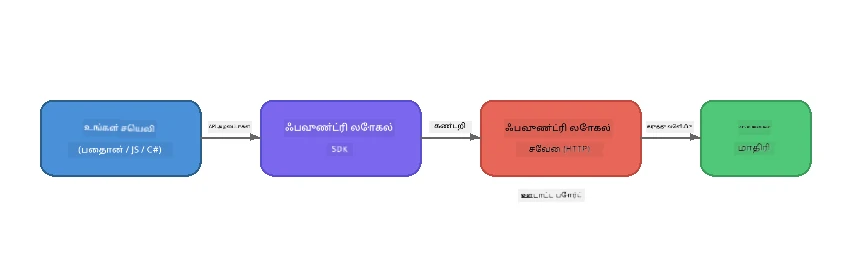

# பகுதி 1: Foundry Local உடன் தொடங்குதல்


## Foundry Local என்பது என்ன?

[Foundry Local](https://foundrylocal.ai) உங்களுக்கு திறந்தமூல AI மொழி மாதிரிகளை **உங்கள் கணினியில் நேரடியாக இயக்க** உதவுகிறது - இணையதளம் தேவையில்லை, மின்னணு சேவைக் கட்டணங்கள் இல்லை, மற்றும் முழுமையான தரவு தனியுரிமை உள்ளது. இது:

- **மாதிரிகளை உள்ளூராக பதிவிறக்கம் செய்து இயக்குகிறது** கம்ப்யூட்டர் உத்தரவாதத்துடன் (GPU, CPU, அல்லது NPU)
- **OpenAI-க்கு ஒத்த API-யை வழங்குகிறது** எனவே நீங்கள் பரிச்சயமான SDKக்கள் மற்றும் கருவிகள் பயன்படுத்தலாம்
- **Azure சந்தா அல்லது பதிவு தேவையில்லை** - நிறுவி துவங்கி செயல்படலாம்

இதை உங்கள் தனிப்பட்ட AI என்று நினைக்கலாம், இது முழுமையாக உங்கள் இயந்திரத்தில் இயங்குகிறது.

## கற்றல் இலக்குகள்

இந்த வகுப்பின் இறுதிக்குச் சென்றவுடன் நீங்கள் முடித்து இருக்கலாம்:

- உங்கள் இயங்கு அமைப்பில் Foundry Local CLI ஐ நிறுவுதல்
- மாதிரி பொருத்திகள் (alias) என்ன மற்றும் அவை எப்படி செயல்படுகின்றன என்பதை புரிந்துகொள்ளுதல்
- உங்கள் முதல் உள்ளூர் AI மாதிரியை பதிவிறக்கம் செய்து இயக்குதல்
- கட்டளை வரிசையிலிருந்து உள்ளூர் மாதிரிக்கு ஒரு உரையாடல் செய்தி அனுப்புதல்
- உள்ளூர் மற்றும் மேகத்தில் நடத்தப்படும் AI மாதிரிகளின் வித்தியாசத்தை விளக்குதல்

---

## முன்னிலை தேவைகள்

### கணினி கோரிக்கை

| கோரிக்கை | குறைந்தது | பரிந்துரைக்கப்பட்டது |
|-------------|---------|-------------|
| **RAM** | 8 GB | 16 GB |
| **டைஸ் அவ cleared: ஒற்றை கட்டத்தில் எழுத்துருக்களின் செயல்திறன்** | 5 GB (மாதிரிகளுக்கென) | 10 GB |
| **CPU** | 4 கோர்கள் | 8+ கோர்கள் |
| **GPU** | விருப்பப்பட்டதாக | NVIDIA CUDA 11.8+ கொண்ட GPU |
| **இயங்கு அமைப்பு** | Windows 10/11 (x64/ARM), Windows Server 2025, macOS 13+ | - |

> **குறிப்பு:** Foundry Local உங்கள் ஹார்ட்வேர் வாயிலாக சிறந்த மாதிரி வேறுபாட்டை தானாகத் தேர்வு செய்கிறது. NVIDIA GPU இருந்தால், CUDA விரைவு உதவிக்காக பயன்படுத்தப்படுகிறது. Qualcomm NPU இருந்தால் அதைக் பயன்படுத்தும். இல்லையெனில் CPU உத்தரவாதம் பெற்றுள்ள வேறுபாட்டுக்கு மாறும்.

### Foundry Local CLI ஐ நிறுவுதல்

**Windows** (PowerShell):  
```powershell
winget install Microsoft.FoundryLocal
```
  
**macOS** (Homebrew):  
```bash
brew tap microsoft/foundrylocal
brew install foundrylocal
```
  
> **குறிப்பு:** Foundry Local தற்போது Windows மற்றும் macOS-ஐ மட்டுமே ஆதரிக்கிறது. இப்போது Linux ஆதரிக்கப்பட்டுள்ளது இல்லை.

நிறுவலை சரிபார்க்க:  
```bash
foundry --version
```
  
---

## பயிற்சி செயல்கள்

### பயிற்சி 1: கிடைக்கும் மாதிரிகளைக் காண்க

Foundry Local முன்நிறுவப்பட்ட திறந்தமூல மாதிரிகளின் பட்டியலை வழங்குகிறது. அவற்றை பட்டியலிடுக:

```bash
foundry model list
```
  
நீங்கள் பின்வருவன போன்ற மாதிரிகளை பார்க்கலாம்:  
- `phi-3.5-mini` - Microsoft இன் 3.8 பில்லியன் அளவு மாதிரி (மீண்டும் வேகம், நல்ல தரம்)  
- `phi-4-mini` - புதிய மற்றும் திறமையான Phi மாதிரி  
- `phi-4-mini-reasoning` - சிந்தனைச் சங்கிலி நிரூபணத்துடன் Phi மாதிரி (`<think>` குறிச்சொற்கள்)  
- `phi-4` - Microsoft இன் பெரிய Phi மாதிரி (10.4 GB)  
- `qwen2.5-0.5b` - மிகவும் சிறிய மற்றும் வேகமான (குறைந்த வளங்களுக்கான)  
- `qwen2.5-7b` - பல்நிலை பொதுவான மாதிரி, கருவி அழைப்பை ஆதரிக்கிறது  
- `qwen2.5-coder-7b` - குறியீடு உருவாக்கத்திற்கு சிறப்பு செய்யப்பட்டு உள்ளது  
- `deepseek-r1-7b` - திறமையான சிந்தனை மாதிரி  
- `gpt-oss-20b` - பெரிய திறந்தமூல மாதிரி (MIT அனுமதி, 12.5 GB)  
- `whisper-base` - உரைபதிவு உருவாக்கம் (383 MB)  
- `whisper-large-v3-turbo` - உயர் துல்லிய உரைபதிவு (9 GB)

> **மாதிரி பொருத்தி என்றால் என்ன?** `phi-3.5-mini` போன்ற பொருத்திகள் ஒரு shortcuts ஆகும். நீங்கள் ஒரு பொருத்தியை பயன்படுத்தும் போது, Foundry Local உங்கள் ஹார்ட்வேர் (NVIDIA GPUகளுக்கு CUDA, அல்லது இல்லையெனில் CPU வுக்கு சிறந்த பதிப்பைப் பொறுத்து) சிறந்த மாதிரி வேறுபாட்டை தானாக பதிவிறக்கம் செய்கிறது. சரியான பதிப்பைப் பழகிக்கொள்ள நீங்கள் கவலைப்பட தேவையில்லை.

### பயிற்சி 2: உங்கள் முதல் மாதிரியை இயக்குக

ஒரு மாதிரியை பதிவிறக்கம் செய்து நேரடி உரையாடல் தொடங்குக:

```bash
foundry model run phi-3.5-mini
```
  
முதன்முறையாக நீங்கள் இதைப் பயன்படுத்தும் போது, Foundry Local:  
1. உங்கள் ஹார்ட்வேரை கண்டறியும்  
2. சிறந்த மாதிரி வேறுபாட்டை பதிவிறக்கம் செய்யும் (சில நிமிடங்கள் ஆகலாம்)  
3. மாதிரியை மெமரியில் ஏற்றும்  
4. ஒரு நேரடி உரையாடல் அமர்வை துவக்கும்

அவரை சில கேள்விகளை கேளுங்கள்:  
```
You: What is the golden ratio?
You: Can you explain it as if I were 10 years old?
You: Write a haiku about mathematics
```
  
வெளியே çık "exit" அல்லது `Ctrl+C` அழுத்தி நிறுத்தவும்.

### பயிற்சி 3: ஒரு மாதிரியை முன்பே பதிவிறக்குக

உரையாடலைத் துவங்காமல் மாதிரியை பதிவிறக்க விரும்பினால்:

```bash
foundry model download phi-3.5-mini
```
  
உங்கள் இயந்திரத்தில் ஏற்கனவே பதிவிறக்கப்பட்ட மாதிரிகளை சரிபார்க்க:  

```bash
foundry cache list
```
  
### பயிற்சி 4: கட்டமைப்பைப் புரிந்துகொள்ளுக

Foundry Local என்பது **உள்ளூர் HTTP சேவை** ஆக இயங்கி, OpenAI-க்கு ஒத்த REST API-யை வெளிப்படுத்துகிறது. இதன் பொருள்:

1. சேவை ஒரு **dynamic port**-இல் துவங்கும் (ஒவ்வொரு முறையும் வேறுபடும்)
2. நீங்கள் SDK பயன்படுத்தி உண்மையான endpoint URL-ஐ கண்டறியலாம்
3. நீங்கள் எந்த ஒரு OpenAI-க்கு ஒத்த client நூலகத்தையும் பயன்படுத்தி பேசலாம்



> **முக்கியம்:** Foundry Local ஒவ்வொரு முறையும் துவங்கும்போது **dynamic port** உபயோகிக்கிறது. `localhost:5272` போன்ற ஒரு port எண்ணை கடைசியில் இடக் கூடாது. தற்போதைய URL ஐ கண்டுபிடிக்க SDK-யைப் பயன்படுத்த வேண்டும் (பொதுவாக Python இல் `manager.endpoint` அல்லது JavaScript இல் `manager.urls[0]`).

---

## முக்கியப் புள்ளிகள்

| கருத்து | நீங்கள் கண்டறிந்தது |
|---------|------------------|
| சாதனத்தில் AI | Foundry Local மாதிரிகளை முழுமையாக உங்கள் சாதனத்தில் இயக்குகிறது, மேகம், API விசைகள் மற்றும் கட்டணமின்றி |
| மாதிரி பொருத்திகள் | `phi-3.5-mini` போன்ற பொருத்திகள் உங்கள் சாதனத்திற்கு சிறந்த பதிப்பை தானாகத் தேர்வு செய்கின்றன |
| மாற்றும் போர்ட்டுகள் | சேவை ஒரு dynamic port இல் இயங்கும்; எப்போதும் SDK பயன்படுத்தி endpoint-ஐ கண்டறியவும் |
| CLI மற்றும் SDK | நீங்கள் CLI (`foundry model run`) அல்லது SDK மூலம் நிரலாக மாதிரிகளுடன் தொடர்பு கொள்ளலாம் |

---

## அடுத்த படிகள்

[பகுதி 2: Foundry Local SDK ஆழமான ஆய்வு](part2-foundry-local-sdk.md)க்கு தொடரவும், மாதிரிகள், சேவைகள் மற்றும் காசிங் நிரல் வழியாக மேலாண்மை செய்யும் SDK API-யை திறம்பட கற்றுக்கொள்ள.

---

<!-- CO-OP TRANSLATOR DISCLAIMER START -->
**அறிக்கை**:
இந்த ஆவணம் AI மொழி பெயர்ப்பு சேவையான [Co-op Translator](https://github.com/Azure/co-op-translator) பயன்படுத்தி மொழிமாற்றம் செய்யப்பட்டது. நாங்கள் துல்லியத்திற்காக முயன்றாலும், தானியங்கி மொழிபெயர்ப்புகளில் பிழைகள் அல்லது தவறுகள் இருக்கக்கூடும் என்பதை தயவுசெய்து கவனியுங்கள். தாய்நாட்டு மொழியில் உள்ள ஆரம்ப ஆவணம் அதிகாரப்பூர்வமான மூலமாக கருதப்பட வேண்டும். முக்கியமான தகவல்களுக்கு, தொழில் நுட்பமான மனித மொழி பெயர்ப்பு பரிந்துரைக்கப்படுகிறது. இந்த மொழிபெயர்ப்பின் பயன்பாட்டினால் ஏற்பட்ட எந்த தவறான புரிதல்களுக்கு நாங்கள் பொறுப்பேற்கமாட்டோம்.
<!-- CO-OP TRANSLATOR DISCLAIMER END -->